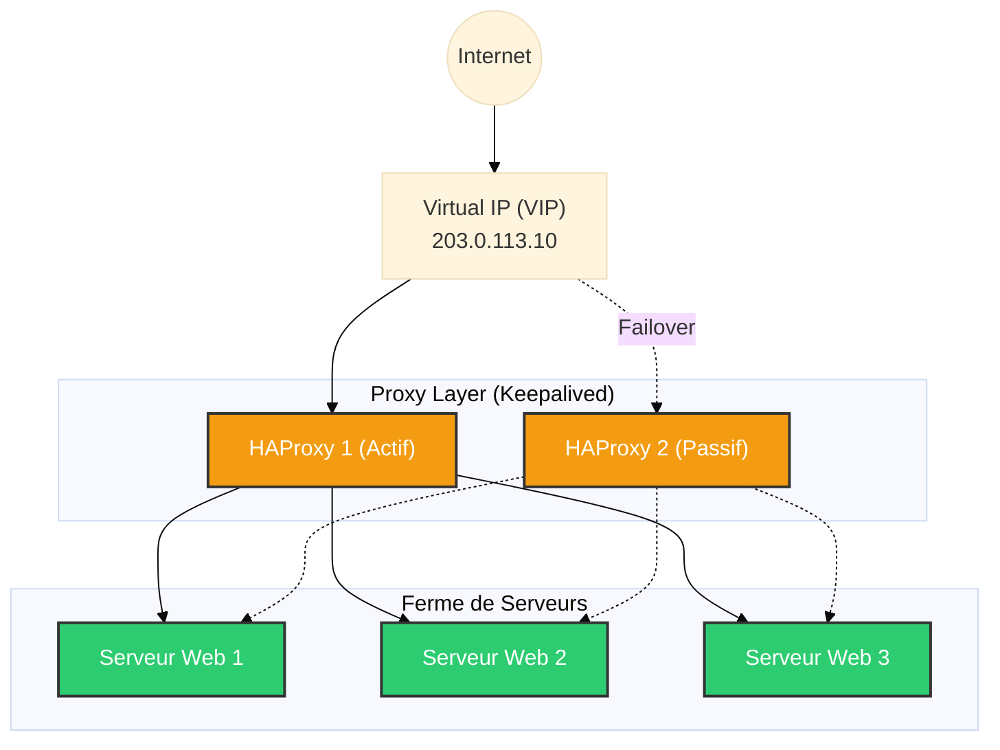

# HAProxy — Le Chef d'Orchestre du Trafic

<div
  class="omny-meta"
  data-level="🔴 Avancé"
  data-version="2.8+"
  data-time="~1 heure">
</div>

<div style="text-align: center; margin: 0 auto;">
    
</div>

## Introduction

!!! quote "Analogie pédagogique — Le Maître d'Hôtel"
    Imaginez un grand restaurant avec 10 cuisiniers. Si tous les clients entraient directement en cuisine pour passer commande, ce serait le chaos. **HAProxy** est le Maître d'Hôtel à l'entrée. Il accueille chaque client, vérifie s'il est habillé correctement (chiffrement **SSL/TLS**), et l'oriente vers le cuisinier qui a le moins de travail (**Load Balancing**). Si un cuisinier tombe malade, le Maître d'Hôtel arrête de lui envoyer des commandes jusqu'à sa guérison (**Health Checks**).

**HAProxy** (High Availability Proxy) est une solution open-source de répartition de charge et de proxy inverse pour les applications TCP et HTTP. Connu pour sa stabilité, sa fiabilité et ses performances extrêmes (capables de gérer des millions de connexions concurrentes), il équipe des infrastructures majeures (GitHub, Reddit, Twitter).

<br>

---

## 🛠️ Concepts Fondamentaux et Configuration

Pour maîtriser HAProxy, il faut comprendre ses quatre blocs de configuration principaux (`haproxy.cfg`) :
- **`global` & `defaults`** : Paramètres OS, timeouts, sécurité de base.
- **`frontend`** : Le point d'entrée. Définit comment les requêtes des clients sont reçues (IP de bind, port, certificats SSL) et comment elles sont routées via des ACLs.
- **`backend`** : Les fermes de serveurs. Définit les serveurs réels, les algorithmes de répartition et les Health Checks.
- **`listen`** : Bloc hybride combinant frontend et backend (souvent utilisé pour configurer la page de statistiques).

### Configuration Standard : Load Balancer HTTP/HTTPS

```haproxy title="/etc/haproxy/haproxy.cfg - Configuration Type"
global
    log /dev/log local0
    user haproxy
    group haproxy
    daemon
    maxconn 4000

defaults
    log     global
    mode    http
    option  httplog
    timeout connect 5000ms
    timeout client  50000ms
    timeout server  50000ms

# Point d'entrée HTTPS (Terminaison SSL)
frontend https_front
    bind *:443 ssl crt /etc/haproxy/certs/site.pem
    
    # ACL pour router selon le domaine
    acl is_api hdr(host) -i api.monentreprise.com
    use_backend api_servers if is_api
    
    # Route par défaut
    default_backend web_servers

# Ferme de serveurs Web
backend web_servers
    balance roundrobin      # Répartition alternée
    cookie SERVERID insert indirect nocache # Persistance de session
    server web1 10.0.0.10:80 check cookie web1
    server web2 10.0.0.11:80 check cookie web2

# Ferme de serveurs API
backend api_servers
    balance leastconn       # Répartition vers le moins occupé
    server api1 10.0.0.20:8080 check
    server api2 10.0.0.21:8080 check
```

<br>

---

## 🏗️ Architecture Haute Disponibilité

Un Load Balancer seul représente un SPOF (Single Point Of Failure). S'il tombe, le site tombe, même si les serveurs backend vont bien. On couple donc souvent HAProxy avec **Keepalived** (VRRP) pour créer une paire Active/Passive.



<br>

---

## 💀 Red Team & Evasion : Le Redirecteur C2

Dans une opération Red Team, exposer directement l'IP du serveur Command & Control (ex: Cobalt Strike, Sliver) est une erreur fatale. Dès que l'IP est identifiée (Blue Team / Threat Intel), elle est bloquée et l'infrastructure est morte.

La parade est d'utiliser des **Redirecteurs** : des VPS jetables exécutant HAProxy (ou Nginx/Socat) qui font proxy vers le véritable C2 caché (Domain Fronting / Proxying).

### Filtrage Anti-Blue Team (Dumb Proxy vs Smart Proxy)

Un redirecteur "Dumb" renvoie tout au C2. Un redirecteur "Smart" analyse la requête HTTP. Si la requête ne correspond pas exactement au profil du malware, HAProxy redirige silencieusement vers un site légitime (ex: Microsoft, Google) ou renvoie une erreur 404, déjouant ainsi les analyses des scanners ou de la Blue Team.

```haproxy title="HAProxy Smart Redirector pour C2 (HTTP)"
frontend c2_redirector
    bind *:80
    mode http
    
    # 1. Vérifie si le User-Agent correspond à notre Payload
    acl is_valid_ua hdr_sub(user-agent) -i "Mozilla/5.0 (Windows NT 10.0; Win64; x64)"
    
    # 2. Vérifie si l'URL appelée correspond à notre profil Malleable C2
    acl is_valid_uri path -i /jquery-3.3.1.min.js
    
    # Si les conditions sont remplies -> Envoi au C2 caché
    use_backend teamserver if is_valid_ua is_valid_uri
    
    # Sinon -> Redirection silencieuse vers un site légitime (Deception)
    default_backend legit_site

backend teamserver
    mode http
    server c2_backend 10.99.0.50:80

backend legit_site
    mode http
    # Redirige les analystes vers Google
    http-request redirect location https://www.google.com/
```

### Protection par ACLs et GeoIP

HAProxy permet également de bloquer le trafic provenant d'ASN connus pour être des Sandbox de sécurité ou des Scanners (Shodan, Censys).

```haproxy title="Exemple de blocage par IP"
frontend defense
    bind *:443
    # Fichier contenant une liste d'IPs de scanners connus
    acl blocked_ips src -f /etc/haproxy/blacklist.lst
    http-request deny if blocked_ips
```

