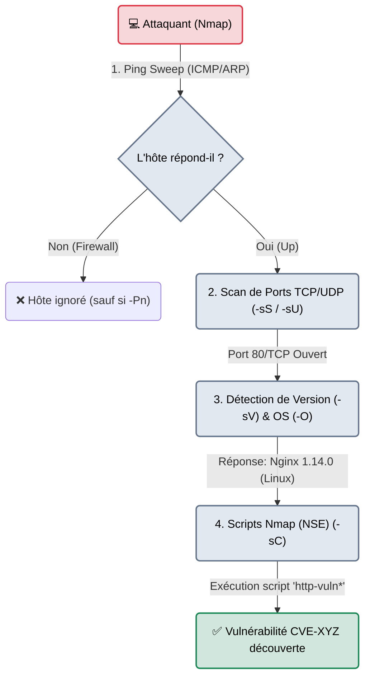

# Nmap — Le Frappeur aux Portes

<div
  class="omny-meta"
  data-level="🟢 Débutant → 🔴 Avancé"
  data-version="7.94+"
  data-time="~45 minutes">
</div>

<div style="text-align: center; margin: 0 auto;">
    
</div>

## Introduction

!!! quote "Analogie pédagogique — L'Inspecteur Immobilier"
    Un réseau informatique, c'est comme une grande rue avec des dizaines d'immeubles (les Adresses IP). **Nmap** est l'inspecteur immobilier.
    Il remonte la rue, frappe à la porte d'un immeuble et regarde si quelqu'un répond (Ping). S'il y a quelqu'un, il va toquer à chacune des 65 535 portes d'appartements à l'intérieur (Scan de Ports). S'il trouve une porte ouverte (ex: le port 80), il crie : *"Qui est là ?"*. Quelqu'un à l'intérieur répond : *"Je suis le serveur Web Apache 2.4 !"* (Détection de Service/OS). Nmap note soigneusement tout cela sur son carnet et passe à l'immeuble suivant.

Développé en 1997 par Gordon Lyon (Fyodor), **Nmap (Network Mapper)** est probablement l'outil de cybersécurité le plus célèbre au monde. Il sert à découvrir les hôtes actifs sur un réseau, les ports ouverts sur ces hôtes, et à identifier les services (et leurs versions exactes) qui écoutent derrière ces ports.

La maîtrise de Nmap marque la différence entre un "script kiddie" (qui lance un scan générique bruyant) et un ingénieur offensif (qui profile discrètement le réseau sans déclencher la moindre alerte SOC).

<br>

---

## 🏗️ Fonctionnement & Architecture (Les 4 Phases de Scan)

Un scan Nmap complet n'est pas une simple requête, c'est une chorégraphie réseau millimétrée.



### Explication des phases
1. **Host Discovery** : Avant de scanner 65 000 ports, Nmap s'assure que la machine est allumée. En réseau local, il utilise des requêtes ARP. Sur Internet, il utilise un Ping ICMP (souvent bloqué par les pare-feux).
2. **Port Scanning** : Le cœur de l'outil. Nmap forge des paquets TCP personnalisés (SYN, ACK, FIN) et analyse les bits de retour pour déduire l'état du port (Ouvert, Fermé, Filtré).
3. **Service & OS Detection** : Un port TCP ouvert ne dit pas quel logiciel tourne derrière. Nmap envoie des requêtes complexes et compare les réponses avec sa base de données `nmap-service-probes`. Il analyse aussi la façon dont la pile TCP/IP réagit (ex: la taille de la fenêtre TCP) pour deviner si c'est du Linux ou du Windows.
4. **NSE (Nmap Scripting Engine)** : Le moteur Lua permettant d'exécuter des scripts de vulnérabilité directement sur les services détectés.

<br>

---

## 🛠️ Les Options Vitales du Pentester

Nmap possède plus de 100 options. Voici les seules que vous utiliserez à 99% du temps.

### Techniques de Découverte
| Option | Fonction | Explication métier |
| :--- | :--- | :--- |
| `-sn` | **Ping Sweep** | Désactive le scan de ports. Sert uniquement à lister quelles IPs sont "Up" sur un réseau (ex: `nmap -sn 192.168.1.0/24`). Extrêmement rapide. |
| `-Pn` | **Disable Ping** | Demande à Nmap de considérer l'hôte comme "Up" même s'il ne répond pas au Ping. **Obligatoire** face aux serveurs Windows (qui bloquent le Ping par défaut). |

### Techniques de Scan TCP/UDP
| Option | Fonction | Explication métier |
| :--- | :--- | :--- |
| `-sS` | **Stealth SYN Scan** | Le scan par défaut en root (sudo). Envoie un SYN, reçoit un SYN/ACK, mais **ne termine jamais la connexion** (envoie un RST). Beaucoup plus furtif qu'un scan complet. |
| `-sT` | **TCP Connect Scan** | Le scan par défaut sans `sudo`. Termine la poignée de main TCP (SYN -> SYN/ACK -> ACK). Très bruyant, l'application journalisera une connexion vide. |
| `-sU` | **UDP Scan** | Scanne les ports UDP (DNS, SNMP). Souvent très lent car l'UDP est un protocole "sans connexion" et ne renvoie pas d'accusé de réception. |
| `-p-` | **All Ports** | Scanne les 65 535 ports au lieu du Top 1000 par défaut. **Obligatoire en audit professionnel**. |

### Profilage & Scripts
| Option | Fonction | Explication métier |
| :--- | :--- | :--- |
| `-sV` | **Service Version** | Interagit avec le port pour récupérer la bannière exacte du logiciel (ex: "OpenSSH 8.2p1"). |
| `-O` | **OS Detection** | Tente de deviner le système d'exploitation en analysant l'empreinte de la pile TCP/IP. |
| `-sC` | **Default Scripts** | Exécute les scripts NSE par défaut (sûrs et non-intrusifs) sur les ports découverts. |
| `-A` | **Agressive Scan** | Raccourci équivalent à `-sV -O -sC --traceroute`. Bruyant et agressif. |

### Export & Performance
| Option | Fonction | Explication métier |
| :--- | :--- | :--- |
| `-oA [nom]` | **Output All** | Exporte les résultats en 3 formats : txt, xml et greppable. **Règle d'or : tout scan professionnel doit être exporté avec -oA.** |
| `-T4` | **Timing Template** | Règle la vitesse de 0 (Paranoïaque, très lent) à 5 (Insensé, très rapide). `-T4` est le standard agressif mais fiable. |
| `--min-rate` | **Vitesse forcée** | Oblige Nmap à envoyer un nombre minimum de paquets par seconde (ex: `--min-rate 5000`). Accélère drastiquement les scans (au risque de rater des ports si le réseau sature). |

<br>

---

## 🎯 Le Workflow Parfait de l'Attaquant

L'erreur du débutant : taper `nmap -p- -A 10.10.10.5` et attendre 45 minutes que ça se termine. 
Un professionnel procède **toujours en deux temps** : le balayage puis la perforation.

### Phase 1 : Le "Fast Scan" (Balayage)
L'objectif est d'obtenir la liste des ports ouverts en moins de 30 secondes. On désactive la résolution DNS (`-n`) et le Ping (`-Pn`), on met la vitesse au maximum, et on sauvegarde.

```bash title="Phase 1 : Découverte ultra-rapide"
sudo nmap -sS -p- --min-rate 5000 -n -Pn 10.10.10.5 -oA nmap_initial
```
*(Résultat obtenu : ports 22, 80, et 443 ouverts).*

### Phase 2 : Le "Deep Scan" (Perforation)
Maintenant que l'on a isolé les portes ouvertes, on concentre l'artillerie lourde (Scripts, Versions, OS) **uniquement** sur ces 3 ports.

```bash title="Phase 2 : Profilage chirurgical"
# Remarquez l'injection des ports découverts via l'option -p
sudo nmap -sC -sV -O -p 22,80,443 10.10.10.5 -oA nmap_detaillé
```
Le résultat est chirurgical, détaillé, et obtenu en 2 minutes au lieu de 45.

<br>

---

## 👻 Évasion de Pare-Feu & Furtivité Avancée

Face à un équipement de sécurité moderne (Palo Alto, Fortinet) ou un SOC vigilant, un Nmap `-T4` classique déclenchera une alerte instantanée. Comment tromper l'ennemi ?

### 1. Fragmentation de Paquets (`-f`)
Divise l'en-tête TCP en minuscules morceaux (fragments de 8 bytes). Beaucoup d'anciens IDS ou de pare-feux "Stateless" ne réassemblent pas les paquets pour gagner en performance. Le scan passe au travers.
```bash
sudo nmap -f -sS -p 80 10.10.10.5
```

### 2. Leurre IP (Decoy Scan) (`-D`)
Nmap va forger des paquets avec de fausses adresses IP sources (les "Decoys") mélangées à la vôtre. L'administrateur système verra 10 IP différentes scanner son serveur en même temps, et ne saura pas laquelle est la vraie menace.
```bash
# RND:5 génère 5 fausses IP aléatoires en plus de la vôtre
sudo nmap -D RND:5 -p 80 10.10.10.5
```

### 3. Source Port Manipulation (`-g`)
Beaucoup de pare-feux d'entreprise mal configurés autorisent aveuglément tout trafic entrant provenant des ports DNS (53) ou HTTP (80). Nmap permet de forger ses paquets pour faire croire qu'ils proviennent du port 53.
```bash
sudo nmap -g 53 -sS -p- 10.10.10.5
```

### 4. Scan très lent (`-T2` ou `-T1`)
La méthode ultime face à un SIEM corrélant les requêtes. Un scan `-T1` (Sneaky) mettra 15 secondes entre chaque paquet envoyé. Les règles de détection (ex: "Plus de 20 paquets SYN en 5 secondes") ne se déclencheront jamais. (Attention : un scan de 65535 ports en T1 prendra des mois).

<br>

---

## 📜 La puissance du Nmap Scripting Engine (NSE)

NSE propulse Nmap d'un simple scanner de ports au statut d'outil d'exploitation. Les scripts se trouvent dans `/usr/share/nmap/scripts/`.

### Auditer les failles connues (Vuln)
Exécute tous les scripts de la catégorie `vuln` contre le service. Nmap vérifiera si le serveur est sensible à MS17-010 (EternalBlue), Heartbleed, etc.
```bash
nmap -p 443 --script vuln 10.10.10.5
```

### Bruteforce et Découverte (SMB)
Le script `smb-enum-shares` permet d'interroger directement un serveur Windows pour lister les dossiers partagés cachés.
```bash
nmap -p 139,445 --script smb-enum-shares --script-args smbuser=admin,smbpass=password 10.10.10.5
```

### Créer son propre script (Lua)
Si une nouvelle CVE vient de sortir, vous pouvez créer un script `.nse` personnalisé pour la détecter. Le langage utilisé est Lua (léger et extrêmement rapide).

<br>

---

## 🚨 Approche Purple Team : Comment détecter Nmap ? (Blue Team)

!!! warning "Vue Défensive (Blue Team / SOC)"
    Nmap n'est pas invisible, même avec `-sS`. Un Blue Teamer aguerri ou une règle SIEM bien calibrée reconnaîtra sa signature.

### 1. La Signature du "Stealth" Scan (-sS)
Un scan SYN laisse une trace asymétrique très reconnaissable dans un analyseur de paquets (Wireshark) ou un NDR (Zeek) :
- L'attaquant envoie **SYN**.
- La cible répond **SYN/ACK**.
- L'attaquant répond instantanément **RST** (Reset) au lieu d'un ACK.
*Cette séquence répétée des centaines de fois par seconde est la signature absolue d'un scanneur.*

### 2. Règle de Détection Sigma (SIEM)
Un SOC moderne détecte Nmap via la journalisation du pare-feu (FortiGate, pfSense). Voici une logique de règle de détection Sigma pour un scan agressif :

```yaml title="Règle Sigma - Détection de Scan Horizontal"
title: Détection de balayage de ports massifs (Nmap)
logsource:
    category: firewall
detection:
    selection:
        action: 'blocked'
    timeframe: 10s
    condition: selection | count(dst_port) by src_ip > 50
description: |
    Détecte une IP source unique tentant d'accéder à plus de 50 ports
    différents bloqués en moins de 10 secondes.
```

### 3. La réponse défensive (Ban IP)
En cas de détection par le SIEM, un SOAR déclenchera un playbook d'orchestration :
1. Extraction de l'IP source (`src_ip`).
2. Requête via API à pfSense/Fortigate.
3. Ajout de l'IP dans un *Blackhole* / *Null Route* pendant 24h.

<br>

---

## 🧪 Laboratoire Pratique (Playground Inter-Outils)

**Objectif :** De la découverte réseau à la cartographie d'attaque.

1. **Scan et Export XML**
   Générez un rapport XML complet d'un sous-réseau cible.
   ```bash
   nmap -sS -p- 192.168.1.0/24 -oX sub_network.xml
   ```

2. **Integration avec Metasploit**
   Lancez **[Metasploit](./metasploit.md)** (`msfconsole`), importez la base de données et populez vos cibles.
   ```ruby
   # Dans MSF
   db_import sub_network.xml
   hosts
   services -p 445
   ```

3. **Passage au Web**
   Si Nmap détecte un port 80/443, passez la main à un fuzzer web comme **[ffuf](../web/ffuf.md)** pour découvrir les dossiers cachés du site.

