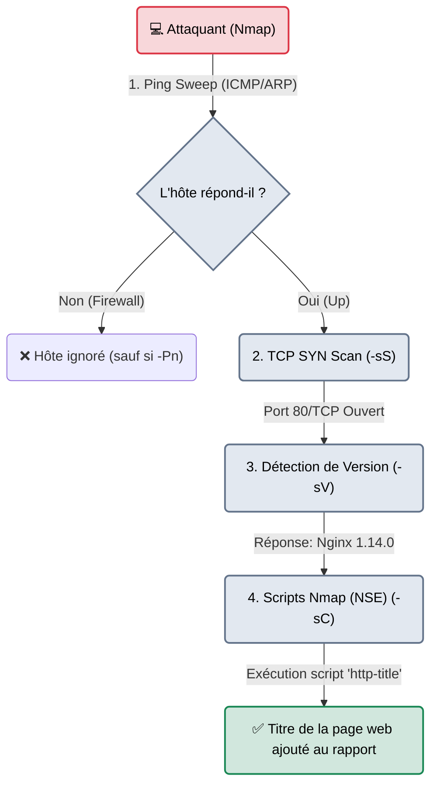

# Nmap — Le Frappeur aux Portes

<div
  class="omny-meta"
  data-level="🟢 Débutant"
  data-version="7.90+"
  data-time="~30 minutes">
</div>

<div style="text-align: center; margin: 0 auto;">
    
</div>

## Introduction

!!! quote "Analogie pédagogique — L'Inspecteur Immobilier"
    Un réseau informatique, c'est comme une grande rue avec des dizaines d'immeubles (les Adresses IP). **Nmap** est l'inspecteur immobilier.
    Il remonte la rue, frappe à la porte d'un immeuble et regarde si quelqu'un répond (Ping). S'il y a quelqu'un, il va toquer à chacune des 65 535 portes d'appartements à l'intérieur (Scan de Ports). S'il trouve une porte ouverte (ex: le port 80), il crie : *"Qui est là ?"*. Quelqu'un à l'intérieur répond : *"Je suis le serveur Web Apache 2.4 !"* (Détection de Service/OS). Nmap note soigneusement tout cela sur son carnet et passe à l'immeuble suivant.

Développé en 1997 par Gordon Lyon (Fyodor), **Nmap (Network Mapper)** est probablement l'outil de cybersécurité le plus célèbre au monde. Il sert à découvrir les hôtes actifs sur un réseau, les ports ouverts sur ces hôtes, et à identifier les services (et leurs versions exactes) qui écoutent derrière ces ports.

<br>

---

## Fonctionnement & Architecture (Les Phases de Scan)

Un scan Nmap complet n'est pas une simple requête, c'est une chorégraphie réseau en plusieurs étapes (Host Discovery ➔ Port Scanning ➔ Service Detection ➔ NSE).



<br>

---

## Cas d'usage & Complémentarité

Nmap est la **première étape obligatoire** de toute phase d'énumération réseau (Étape 4). Sans une cartographie exacte des ports ouverts, le pentester est aveugle.

1. **Moteur NSE (Nmap Scripting Engine)** : Nmap n'est pas qu'un scanner. Il embarque des centaines de scripts (en langage Lua) capables de détecter des vulnérabilités connues (CVE) directement, ou de bruteforcer des mots de passe FTP/SMB.
2. **Couplage avec RustScan** : Sur de très grands réseaux, Nmap peut être lent. On utilise souvent *RustScan* en amont pour trouver les ports ouverts en 3 secondes, puis on passe ces ports à Nmap pour faire l'analyse profonde (version, scripts).

<br>

---

## Les Options Principales

Nmap possède plus de 100 options. Voici les vitales :

| Option | Fonction | Description approfondie |
| :--- | :--- | :--- |
| `-sS` | **Stealth SYN Scan** | Le scan par défaut en root. Envoie un paquet SYN, reçoit un SYN/ACK, mais **ne termine jamais** la connexion (envoie un RST). Furtif et rapide. |
| `-p-` | **All Ports** | Scanne les 65 535 ports TCP au lieu des 1000 ports par défaut. (Indispensable en audit professionnel). |
| `-sV` | **Service Version** | N'affiche pas juste "Port 80", mais interagit avec le port pour récupérer la version exacte du logiciel ("Apache 2.4.41"). |
| `-sC` | **Default Scripts** | Exécute les scripts NSE par défaut (non-intrusifs) sur les ports découverts. |
| `-Pn` | **No Ping** | Considère que l'hôte est en vie même s'il ne répond pas au Ping. Obligatoire face à un pare-feu Windows. |
| `-oA [nom]` | **Output All** | Exporte les résultats en 3 formats : txt, xml et greppable. **Toujours l'utiliser.** |

<br>

---

## Installation & Configuration

```bash title="Installation universelle"
# Kali Linux, Ubuntu, Debian
sudo apt update && sudo apt install nmap
```

<br>

---

## Le Workflow Idéal (L'Énumération Parfaite)

Dans un contexte de certification (OSCP) ou de Pentest professionnel, on ne tape pas juste `nmap <ip>`. On procède en deux temps.

### 1. Le Scan Initial Rapide
L'objectif est d'obtenir très vite la liste des ports ouverts.
```bash title="Fast Scan"
# -p- : Tous les ports
# -T4 : Vitesse agressive (Timing 4)
# -n  : Pas de résolution DNS (Gain de temps)
sudo nmap -sS -p- --min-rate 5000 -n 10.10.10.5 -oA nmap_initial
```

### 2. Le Scan Détaillé Ciblée
Maintenant qu'on sait que seuls les ports 22 et 80 sont ouverts, on concentre toute la puissance de Nmap (Versions + Scripts) uniquement sur ces ports.
```bash title="Deep Scan"
# -sC : Scripts par défaut
# -sV : Détection des versions logicielles
# -p 22,80 : Uniquement les ports découverts à l'étape 1
sudo nmap -sC -sV -p 22,80 10.10.10.5 -oA nmap_detaillé
```
*L'attaquant ouvre le fichier `nmap_detaillé.nmap` et planifie ses attaques web (sur le 80) ou de bruteforce (sur le 22).*

<br>

---

## Bonnes & Mauvaises Pratiques (Do's & Don'ts)

| Action | Recommandation | Explication métier |
|---|---|---|
| ✅ **À FAIRE** | **Toujours utiliser `-oA`** | En pentest, "Si ce n'est pas dans les logs, ce n'est pas arrivé". Le format XML généré par `-oA` peut être importé en 1 clic dans Metasploit ou BloodHound. |
| ✅ **À FAIRE** | **Utiliser `sudo`** | Si vous lancez Nmap sans privilèges administrateur (sans sudo), il fera un *TCP Connect Scan* (`-sT`) au lieu d'un *SYN Scan* (`-sS`). Le scan sera deux fois plus lent et beaucoup plus visible dans les logs de la cible. |
| ❌ **À NE PAS FAIRE** | **Faire `-p- -A` sur tout un sous-réseau** | L'option `-A` (Agressive) regroupe OS detection, Version et Scripts. La lancer sur 65535 ports pour 254 machines (`10.0.0.0/24`) prendra littéralement des jours. Scannez large, puis scannez profond. |

<br>

---

## Avertissement Légal & Éthique

!!! danger "Le Scan de Ports : Zone Grise et Intention"
    Le scan de ports sur Internet est techniquement légal dans la plupart des pays occidentaux, tant qu'il n'impacte pas la disponibilité du système. Le port de la cible est "ouvert" sur l'espace public numérique, venir y toquer n'est pas une intrusion.
    
    **Cependant** :
    1. Si le scan de ports est massif et agressif (Déni de Service accidentel), l'Art. 323-2 s'applique.
    2. Si le scan de ports (Reconnaissance) est suivi d'une tentative d'exploitation, le juge considérera le Nmap comme l'**acte préparatoire qualifiant l'intention malveillante**.
    3. Exécuter certains scripts intrusifs de Nmap (ex: `nmap --script exploit`) est considéré comme une tentative d'intrusion illégale sans autorisation.

<br>

---

## Conclusion

!!! quote "Ce qu'il faut retenir"
    Nmap n'est pas un outil que l'on "apprend une fois". C'est un langage réseau en soi. Une parfaite maîtrise des *flags* Nmap permet d'adapter son scan pour passer sous le nez des IDS (Intrusion Detection Systems) ou pour cartographier un réseau interne de 10 000 machines en quelques minutes.

> Mais que faire quand la vitesse de Nmap n'est pas suffisante et que vous avez des dizaines de milliers d'IPs à scanner ? Confiez la découverte de ports au drone ultra-rapide **[RustScan →](./rustscan.md)**.


