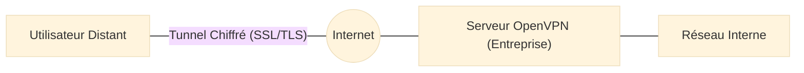

# OpenVPN — Le Tunnel de Confiance

<div
  class="omny-meta"
  data-level="🟡 Intermédiaire"
  data-version="2.6+"
  data-time="~45 minutes">
</div>

<div style="text-align: center; margin: 0 auto;">
    
</div>

## Introduction

!!! quote "Analogie pédagogique — Le Tube Pneumatique Scellé"
    Imaginez que vous êtes dans un café public et que vous voulez envoyer un document secret à votre bureau. Si vous le donnez au serveur, n'importe qui peut le lire. **OpenVPN** est un tube pneumatique blindé et scellé que vous installez entre votre ordinateur et votre bureau. Tout ce que vous envoyez passe par ce tube. Pour les gens dans le café, ils voient juste un tube passer, mais ils ne peuvent ni voir ce qu'il y a dedans, ni savoir d'où ça vient, ni où ça va.

**OpenVPN** est une solution VPN (Virtual Private Network) open-source robuste et polyvalente. Elle utilise le protocole SSL/TLS pour créer des tunnels sécurisés point-à-point ou site-à-site. Contrairement aux anciens protocoles comme PPTP ou L2TP, OpenVPN est très difficile à bloquer car il peut fonctionner sur n'importe quel port et via UDP ou TCP.

<br>

---

## Les Avantages d'OpenVPN

- **Flexibilité portuaire** : Peut être configuré sur le port 443 (HTTPS) pour contourner les pare-feux restrictifs.
- **Chiffrement fort** : Utilise la bibliothèque OpenSSL pour supporter des algorithmes comme AES-256.
- **Compatibilité** : Fonctionne sur presque tous les OS (Linux, Windows, macOS, Android, iOS).
- **Stabilité** : Très résistant aux changements d'adresse IP et aux instabilités réseau.

<br>

---

## Usage Opérationnel

### 1. Connexion via un fichier de configuration (.ovpn)
La méthode standard pour se connecter à un réseau distant (ex: TryHackMe, HTB ou VPN d'entreprise).

```bash title="Démarrage d'un client OpenVPN en ligne de commande"
# --config : Spécifie le chemin vers le fichier .ovpn
sudo openvpn --config client.ovpn
```
_L'exécution nécessite des privilèges `root` (ou `sudo`) pour créer l'interface réseau virtuelle (tun0/tap0) et modifier les tables de routage._

### 2. Lancement en tant que service (Background)
Pour maintenir la connexion active sans occuper un terminal.

```bash title="Exécution du client en arrière-plan avec redirection des logs"
# --daemon : Lance le processus en mode démon
# --log : Enregistre les messages dans un fichier spécifié
sudo openvpn --config client.ovpn --daemon --log /var/log/openvpn.log
```
_Le mode démon est idéal pour les serveurs ou les machines de rebond qui doivent rester connectées en permanence au réseau de gestion._

### 3. Vérification de l'interface réseau
S'assurer que le tunnel est bien établi et que l'adresse IP interne est attribuée.

```bash title="Vérification de l'interface virtuelle 'tun'"
# ip addr show : Affiche les adresses de toutes les interfaces
ip addr show tun0
```
_Si l'interface `tun0` apparaît avec une adresse IP (souvent en 10.x.x.x), le tunnel est fonctionnel et vous êtes virtuellement dans le réseau distant._

<br>

---

## Architecture de Connexion

- **Le Serveur** : Hébergé sur le réseau de l'entreprise (souvent sur un pare-feu comme **[pfSense](./pfsense.md)**).
- **Le Client** : L'utilisateur distant qui possède un fichier de configuration (`.ovpn`) et ses certificats.



---

## Usage Opérationnel pour le Red Teamer

Lors d'un audit, vous utiliserez souvent OpenVPN pour :
- **Accéder au lab d'attaque** : Se connecter à l'infrastructure de test du client.
- **Exfiltration** : Créer un tunnel sécurisé pour sortir des données sans qu'elles soient inspectées par le pare-feu du client.
- **Anonymisation** : Faire passer tout votre trafic via un serveur VPN tiers pour masquer votre véritable adresse IP.

---

## Conclusion

!!! quote "Ce qu'il faut retenir"
    OpenVPN est le pilier de la mobilité sécurisée. Dans un monde où le télétravail est devenu la norme, comprendre comment déployer et sécuriser un tunnel OpenVPN est une compétence vitale. C'est l'outil qui permet d'étendre le périmètre de sécurité de l'entreprise au-delà de ses murs physiques.

!!! tip "Wireguard"
    Bien qu'OpenVPN soit le standard historique, le protocole **Wireguard** gagne du terrain car il est beaucoup plus rapide et simple à configurer. Gardez un œil dessus !

---


