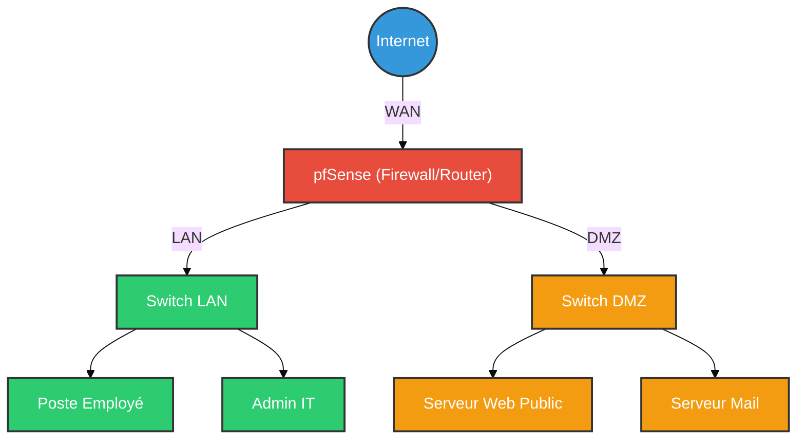

# pfSense — Le Rempart du Réseau

<div
  class="omny-meta"
  data-level="🟡 Intermédiaire"
  data-version="2.7+"
  data-time="~1 heure">
</div>

<div style="text-align: center; margin: 0 auto;">
    
</div>

## Introduction

!!! quote "Analogie pédagogique — Le Poste de Douane"
    Imaginez une ville (votre réseau) entourée d'une muraille. Il n'y a qu'une seule porte pour entrer et sortir. **pfSense** est le chef de la douane à cette porte. Il vérifie les papiers de chaque personne (chaque paquet de données), décide qui a le droit d'entrer, qui doit rester dehors, et il peut même fouiller les sacs pour chercher des objets interdits (**IDS/IPS**). C'est lui qui s'assure que personne ne rentre sans invitation.

**pfSense** est une distribution FreeBSD spécialisée en tant que pare-feu (firewall) et routeur. C'est l'un des piliers de la sécurité réseau open-source. Grâce à son moteur de filtrage de paquets `pf` (Packet Filter), ses capacités de VPN, de Load Balancing et d'intégration d'IDS/IPS, il est massivement déployé dans les PME et les Data Centers.

<br>

---

## 🛠️ Concepts Fondamentaux et Règles (Rules)

La sécurité d'un pare-feu repose sur sa politique de filtrage.

1. **Deny All by Default** : Tout trafic entrant sur l'interface WAN qui n'est pas explicitement autorisé est automatiquement bloqué.
2. **Stateful Inspection** : pfSense maintient l'état des connexions. Si une machine interne (LAN) initie une connexion vers Internet (WAN), pfSense autorise automatiquement le trafic de retour pour cette connexion spécifique.
3. **Ordre des Règles** : Les règles sont évaluées de **haut en bas**. La première règle qui correspond au trafic s'applique (First Match Wins).

### Configuration des Règles (GUI)

L'interface web permet de configurer les règles facilement :
- **Action** : `Pass` (Autoriser), `Block` (Bloquer silencieusement), `Reject` (Bloquer avec réponse ICMP/RST).
- **Interface** : `WAN`, `LAN`, `OPT1` (DMZ).
- **Protocole** : `TCP`, `UDP`, `ICMP`, `Any`.
- **Source / Destination** : IPs, réseaux (Subnets), Alias.

<br>

---

## 🛠️ Usage Opérationnel en Ligne de Commande (pfctl)

Bien que l'administration se fasse majoritairement via l'interface Web (WebGUI), l'outil en ligne de commande sous-jacent est `pfctl`.

```bash title="Commandes basiques pfctl (FreeBSD CLI)"
# Activer le filtrage de paquets
pfctl -e

# Désactiver le filtrage de paquets (DANGER : Désactive le pare-feu !)
pfctl -d

# Recharger les règles de filtrage depuis le fichier de configuration
pfctl -f /etc/pf.conf

# Afficher les règles de filtrage actuellement appliquées
pfctl -sr

# Afficher l'état des connexions actives (State table)
pfctl -ss
```

<br>

---

## 🛡️ Défense Avancée : IDS / IPS

Un pare-feu classique vérifie l'enveloppe du paquet (IP, Port). Un IDS/IPS inspecte le **contenu** (Payload) du paquet.

pfSense intègre des packages pour cela :
- **Snort** : Le standard historique. Basé sur des règles de détection d'intrusions (VRT/Emerging Threats).
- **Suricata** : L'alternative moderne. Multi-threadé par défaut, offrant de meilleures performances réseau.

### Déploiement Typique

1. **Mode IDS (Intrusion Detection System)** : Inspecte et génère des alertes, mais **ne bloque pas** le trafic. Idéal pour une phase d'apprentissage ou d'audit.
2. **Mode IPS (Intrusion Prevention System)** : Inspecte, alerte ET **bloque** le trafic (Drop).

!!! tip "Inline Mode vs Legacy Mode"
    Sur pfSense, Suricata peut utiliser le mode **Inline (Netmap)**, qui insère le moteur d'inspection directement dans le chemin réseau, permettant de jeter les paquets malveillants de manière très efficace sans perturber le reste du flux légitime.

<br>

---

## 🏗️ Architecture Réseau avec pfSense

Voici un schéma classique d'une architecture sécurisée par pfSense, séparant les zones de confiance.



- **LAN** : Réseau interne, accès vers Internet et (limité) vers DMZ.
- **DMZ (Zone Démilitarisée)** : Services exposés à Internet. Isolée du LAN. Si un serveur Web est compromis, l'attaquant ne peut pas pivoter facilement vers le LAN.

<br>

---

## 💀 Red Team & Evasion

En tant qu'attaquant, un pare-feu configuré en mode "Deny All" avec un IDS en mode "Drop" est un obstacle majeur.

### 1. Contournement (Egress Filtering)
Les administrateurs bloquent souvent les ports sortants inutilisés. Pour sortir d'un LAN protégé (exfiltrer des données ou établir un C2), les attaquants utilisent des ports légitimes :
- **TCP 80 / 443** (HTTP/HTTPS) : Souvent ouverts. Utiliser un C2 avec un profil HTTPS (Malleable C2).
- **UDP 53** (DNS) : Très rarement bloqué. Utilisation de **DNS Tunneling** (`Iodine`).

### 2. Attaques sur l'interface Web (WebGUI)
Si l'interface d'administration (port 443/80 par défaut) est exposée au LAN (ou pire, au WAN) :
- **Bruteforce** : Tenter les identifiants par défaut (`admin:pfsense`).
- **Exploits (CVEs)** : Des vulnérabilités de Command Injection (ex: CVE-2022-31814) ont affecté des packages pfSense.

### 3. Désactivation des logs / Effacement des traces
Si un attaquant obtient un shell root sur le pfSense (via SSH ou un exploit) :
```bash title="Manipulation pfctl par un attaquant root"
# Désactive purement et simplement le firewall pour permettre un pivot réseau
pfctl -d

# Nettoyer les logs de l'interface graphique
rm -f /var/log/filter.log
```

<br>

---

## Conclusion

!!! quote "Ce qu'il faut retenir"
    pfSense est le cerveau de la défense réseau. Sa polyvalence en fait un outil indispensable pour quiconque souhaite construire une infrastructure sécurisée et résiliente. En tant qu'expert en cybersécurité, savoir configurer et auditer un pfSense est une compétence fondamentale pour protéger les actifs numériques.

> Pour sécuriser les accès distants à travers votre pfSense, configurez un serveur **[OpenVPN](./openvpn.md)**.
