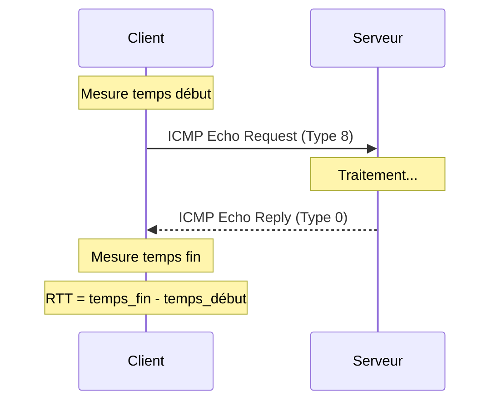

# ping & hping3

## Introduction

<div
  class="omny-meta"
  data-level="🟢 Débutant & 🟡 Intermédiaire & 🔴 Avancé"
  data-version="0"
  data-time="25-30 minutes">
</div>

!!! quote "Analogie pédagogique"
    _Imaginez **ping** comme un **appel téléphonique de test** : vous appelez quelqu'un et attendez qu'il réponde "allô" pour confirmer que la ligne fonctionne et mesurer combien de temps ça prend. **hping3**, lui, est comme un téléphone professionnel qui peut appeler sur n'importe quelle ligne (TCP, UDP, ICMP) et tester des scénarios complexes._

> **ping** est l'**outil de diagnostic réseau le plus basique et le plus utilisé**. Il envoie des paquets ICMP Echo Request et attend des réponses pour vérifier la **connectivité**, mesurer la **latence** (temps de réponse) et détecter la **perte de paquets**. C'est le premier réflexe pour diagnostiquer un problème réseau.

**hping3** est la **version avancée** permettant de :

- Envoyer des paquets **TCP/UDP/ICMP** personnalisés
- Tester des **ports spécifiques**
- Contourner les **pare-feu ICMP**
- Effectuer des **scans de sécurité**
- Réaliser des **tests de charge réseau**

!!! info "Pourquoi utiliser ping/hping3 ?"
    **ping** est universel, simple et préinstallé partout. **hping3** offre des capacités avancées pour les tests de sécurité, le diagnostic réseau approfondi et le contournement des restrictions ICMP.

## ping (ICMP Echo Request/Reply)

### Installation

**ping** est **préinstallé** sur tous les systèmes d'exploitation modernes :

- ✅ Windows (toutes versions)
- ✅ Linux (toutes distributions)
- ✅ macOS
- ✅ BSD, Solaris, etc.

### Protocole ICMP

**ICMP (Internet Control Message Protocol)** est un protocole de la couche réseau utilisé pour :

- **Tester la connectivité** (ping)
- **Diagnostiquer les routes** (traceroute)
- **Signaler les erreurs** réseau
- **Mesurer la latence**



**Types ICMP principaux :**

| Type | Code | Description |
|------|------|-------------|
| 0 | 0 | Echo Reply (réponse au ping) |
| 3 | 0-15 | Destination Unreachable |
| 8 | 0 | Echo Request (ping) |
| 11 | 0 | Time Exceeded (TTL expiré) |

### Syntaxe de base

=== ":fontawesome-brands-linux: Linux / macOS"

    ```bash
    ping [options] destination
    ```

=== ":fontawesome-brands-windows: Windows"

    ```powershell
    ping [options] destination
    ```

### Utilisation basique

=== ":fontawesome-brands-linux: Linux"

    ```bash
    # Ping continu (Ctrl+C pour arrêter)
    ping example.com
    
    # Limiter à 4 paquets
    ping -c 4 example.com
    
    # Définir l'intervalle entre paquets (0.2s)
    ping -i 0.2 example.com
    
    # Définir la taille du paquet (en octets)
    ping -s 1000 example.com
    
    # Ping flood (root requis) - test de charge
    sudo ping -f example.com
    
    # Définir le TTL (Time To Live)
    ping -t 10 example.com
    
    # Ping sans résolution DNS (plus rapide)
    ping -n example.com
    
    # Ping avec timestamp
    ping -D example.com
    ```

=== ":fontawesome-brands-windows: Windows"

    ```powershell
    # Ping continu
    ping -t example.com
    
    # Nombre de paquets (4 par défaut)
    ping -n 10 example.com
    
    # Taille du paquet
    ping -l 1000 example.com
    
    # Définir le TTL
    ping -i 10 example.com
    
    # Timeout (en millisecondes)
    ping -w 5000 example.com
    
    # Ne pas fragmenter les paquets
    ping -f example.com
    ```

=== ":fontawesome-brands-apple: macOS"

    ```bash
    # Identique à Linux
    ping -c 4 example.com
    
    # Options spécifiques macOS
    ping -A example.com  # Mode adaptatif
    ping -Q example.com  # Quiet output (moins verbeux)
    ```

### Interpréter les résultats

```bash
$ ping -c 4 example.com
PING example.com (93.184.216.34) 56(84) bytes of data.
64 bytes from 93.184.216.34: icmp_seq=1 ttl=56 time=15.2 ms
64 bytes from 93.184.216.34: icmp_seq=2 ttl=56 time=14.8 ms
64 bytes from 93.184.216.34: icmp_seq=3 ttl=56 time=15.0 ms
64 bytes from 93.184.216.34: icmp_seq=4 ttl=56 time=15.1 ms

--- example.com ping statistics ---
4 packets transmitted, 4 received, 0% packet loss, time 3005ms
rtt min/avg/max/mdev = 14.823/15.025/15.204/0.145 ms
```

**Analyse ligne par ligne :**

```plaintext
PING example.com (93.184.216.34) 56(84) bytes of data.
                  └─ Adresse IP  └─ Taille données (total avec headers)

64 bytes from 93.184.216.34: icmp_seq=1 ttl=56 time=15.2 ms
└─ Taille reçue               └─ Séquence └─ TTL └─ Latence

--- example.com ping statistics ---
4 packets transmitted, 4 received, 0% packet loss, time 3005ms
└─ Envoyés           └─ Reçus   └─ Perte  └─ Temps total

rtt min/avg/max/mdev = 14.823/15.025/15.204/0.145 ms
    └─ Min  └─ Moy └─ Max  └─ Écart-type
```

**Éléments clés :**

- **icmp_seq** : Numéro de séquence (détecte les paquets perdus/dupliqués)
- **ttl** : Time To Live (nombre de sauts restants, ~64 pour Linux, ~128 pour Windows)
- **time** : Round-Trip Time (latence aller-retour)
- **packet loss** : Pourcentage de paquets perdus
- **rtt min/avg/max/mdev** : Statistiques de latence (min/moyenne/max/écart-type)

### Valeurs de latence typiques

| Destination | Latence attendue | Commentaire |
|-------------|------------------|-------------|
| **Réseau local (LAN)** | < 1 ms | Même switch/router |
| **Même ville** | 1-10 ms | Infrastructure locale |
| **Même pays** | 10-50 ms | Routage national |
| **Autre continent** | 100-300 ms | Câbles sous-marins |
| **Connexion satellite** | 500-700 ms | Géostationnaire |
| **Mobile 4G/5G** | 20-50 ms | Variable selon signal |
| **VPN** | +20-100 ms | Overhead du chiffrement |

### Diagnostic TTL

Le **TTL (Time To Live)** indique le système d'exploitation distant :

| TTL initial | TTL observé | OS probable |
|-------------|-------------|-------------|
| 64 | 50-64 | Linux, macOS, Unix |
| 128 | 100-128 | Windows (récent) |
| 255 | 200-255 | Anciens Unix, équipements réseau |
| 32 | < 32 | Windows (ancien) |

**Exemple :**

```bash
$ ping -c 1 example.com
64 bytes from 93.184.216.34: icmp_seq=1 ttl=56 time=15.2 ms
                                            ^^^
                                            TTL = 56
                                            Probablement Linux (64 - 8 sauts)
```

### Cas d'usage pratiques

#### 1. Vérifier la connectivité Internet

```bash
# Étape 1 : Tester la gateway locale
ping -c 4 192.168.1.1

# Étape 2 : Tester un DNS public
ping -c 4 8.8.8.8

# Étape 3 : Tester la résolution DNS + Internet
ping -c 4 google.com

# Si Étape 1 échoue → Problème réseau local
# Si Étape 2 échoue → Problème FAI/routeur
# Si Étape 3 échoue → Problème DNS
```

#### 2. Mesurer la qualité de connexion

```bash
# Test de stabilité (100 paquets)
ping -c 100 example.com

# Analyser les résultats
# Perte < 1% : Excellent
# Perte 1-5% : Acceptable
# Perte 5-10% : Médiocre
# Perte > 10% : Problématique
```

#### 3. Détecter la perte de paquets intermittente

```bash
# Ping continu avec timestamp
ping -D example.com | tee ping.log

# Analyser le log plus tard
grep "no answer" ping.log
grep "Request timeout" ping.log
```

#### 4. Tester la MTU (Maximum Transmission Unit)

```bash
# Linux : Tester avec paquets de 1472 octets (1500 - 28)
ping -c 4 -s 1472 -M do example.com

# Si échec, réduire progressivement
ping -c 4 -s 1400 -M do example.com
ping -c 4 -s 1300 -M do example.com

# Windows : Ne pas fragmenter
ping -f -l 1472 example.com
```

**Interprétation :**

- **Succès avec 1472** : MTU standard (1500)
- **Échec avec 1472** : MTU réduit (PPPoE, VPN, tunnels)
- **Succès avec 1400** : MTU probable = 1428

#### 5. Monitoring continu

=== ":fontawesome-brands-linux: Bash :lucide-terminal:"

    ```bash
    #!/bin/bash
    # Monitoring ping avec alertes
    
    TARGET="8.8.8.8"
    THRESHOLD_LATENCY=100  # ms
    THRESHOLD_LOSS=5       # %
    CHECK_INTERVAL=60      # secondes
    
    echo "Monitoring de $TARGET"
    echo "Seuils : Latence=${THRESHOLD_LATENCY}ms, Perte=${THRESHOLD_LOSS}%"
    echo ""
    
    while true; do
        TIMESTAMP=$(date "+%Y-%m-%d %H:%M:%S")
        
        # Ping 10 fois
        RESULT=$(ping -c 10 -W 2 $TARGET 2>/dev/null)
        
        # Extraire latence moyenne
        AVG_LATENCY=$(echo "$RESULT" | grep "rtt min/avg/max" | awk -F'/' '{print $5}' | cut -d'.' -f1)
        
        # Extraire perte de paquets
        PACKET_LOSS=$(echo "$RESULT" | grep "packet loss" | awk '{print $6}' | cut -d'%' -f1)
        
        # Vérifier les seuils
        if [ -z "$AVG_LATENCY" ]; then
            echo "[$TIMESTAMP] ❌ ALERTE : Pas de réponse de $TARGET"
        elif [ "$AVG_LATENCY" -gt "$THRESHOLD_LATENCY" ]; then
            echo "[$TIMESTAMP] ⚠️  ALERTE : Latence élevée ${AVG_LATENCY}ms (seuil: ${THRESHOLD_LATENCY}ms)"
        elif [ "$PACKET_LOSS" -gt "$THRESHOLD_LOSS" ]; then
            echo "[$TIMESTAMP] ⚠️  ALERTE : Perte de paquets ${PACKET_LOSS}% (seuil: ${THRESHOLD_LOSS}%)"
        else
            echo "[$TIMESTAMP] ✅ OK : Latence=${AVG_LATENCY}ms, Perte=${PACKET_LOSS}%"
        fi
        
        sleep $CHECK_INTERVAL
    done
    ```

=== ":fontawesome-brands-windows: PowerShell"

    ```powershell
    # Monitoring ping PowerShell
    
    param(
        [string]$Target = "8.8.8.8",
        [int]$ThresholdLatency = 100,
        [int]$ThresholdLoss = 5,
        [int]$Interval = 60
    )
    
    Write-Host "Monitoring de $Target" -ForegroundColor Green
    Write-Host "Seuils : Latence=${ThresholdLatency}ms, Perte=${ThresholdLoss}%`n"
    
    while ($true) {
        $Timestamp = Get-Date -Format "yyyy-MM-dd HH:mm:ss"
        
        # Test ping
        $Result = Test-Connection -ComputerName $Target -Count 10 -ErrorAction SilentlyContinue
        
        if ($Result) {
            $AvgLatency = ($Result | Measure-Object -Property ResponseTime -Average).Average
            $PacketLoss = ((10 - $Result.Count) / 10) * 100
            
            if ($AvgLatency -gt $ThresholdLatency) {
                Write-Host "[$Timestamp] ALERTE : Latence élevée ${AvgLatency}ms" -ForegroundColor Yellow
            } elseif ($PacketLoss -gt $ThresholdLoss) {
                Write-Host "[$Timestamp] ALERTE : Perte ${PacketLoss}%" -ForegroundColor Yellow
            } else {
                Write-Host "[$Timestamp] OK : Latence=${AvgLatency}ms, Perte=${PacketLoss}%"
            }
        } else {
            Write-Host "[$Timestamp] ALERTE : Pas de réponse" -ForegroundColor Red
        }
        
        Start-Sleep -Seconds $Interval
    }
    ```

### Limitations du ping

!!! warning "Limitations importantes"
    ❌ **ICMP souvent bloqué** : Beaucoup de serveurs et pare-feu bloquent ICMP pour des raisons de sécurité
    
    ❌ **Ne teste pas les services** : Un ping réussi ne garantit pas que HTTP, SSH ou autres services fonctionnent
    
    ❌ **Priorité basse** : Les réponses ICMP ont souvent une priorité plus basse que le trafic applicatif
    
    ❌ **Rate limiting** : Certains serveurs limitent le nombre de réponses ICMP par seconde
    
    ⚠️ **Ne détecte pas les problèmes applicatifs** : Latence réseau ≠ latence applicative

**Exemple de faux négatif :**

```bash
$ ping google.com
# Pas de réponse → On pourrait penser que Google est down

$ curl -I https://google.com
# HTTP 200 OK → Google fonctionne, ICMP est juste bloqué
```

## hping3 (Advanced Network Tool)

### Installation

=== ":fontawesome-brands-linux: Debian/Ubuntu"

    ```bash
    sudo apt update
    sudo apt install hping3
    
    # Vérifier l'installation
    hping3 --version
    ```

=== ":fontawesome-brands-linux: RHEL/CentOS/Fedora"

    ```bash
    sudo dnf install hping3
    
    # Ou compiler depuis les sources
    sudo dnf install git gcc make libpcap-devel
    git clone https://github.com/antirez/hping
    cd hping
    ./configure
    make
    sudo make install
    ```

=== ":fontawesome-brands-linux: Arch Linux"

    ```bash
    sudo pacman -S hping
    ```

=== ":fontawesome-brands-apple: macOS"

    ```bash
    # Via Homebrew
    brew install hping
    ```

=== ":fontawesome-brands-windows: Windows"

    ```powershell
    # hping3 n'est pas disponible nativement sur Windows
    # Utiliser WSL :
    wsl --install
    sudo apt install hping3
    ```

### Caractéristiques de hping3

**hping3** permet de :

- Envoyer des paquets **TCP, UDP, ICMP, RAW-IP**
- Personnaliser tous les **champs des headers**
- Effectuer des **scans de ports**
- Tester des **pare-feu et règles de filtrage**
- Simuler des **attaques DDoS** (à des fins de test uniquement)
- Mesurer la **latence applicative** (TCP handshake)
- Effectuer du **OS fingerprinting**

!!! danger "Usage éthique uniquement"
    **hping3** est un outil puissant qui peut être utilisé de manière malveillante.
    
    ⚠️ **N'utilisez JAMAIS ces commandes contre des systèmes sans autorisation explicite**
    
    ⚠️ L'utilisation abusive constitue une **infraction pénale** (RGPD, LCEN, Code pénal)
    
    ✅ **Usages légitimes** : Tests sur vos propres systèmes, audits autorisés, environnements de lab

### Syntaxe de base

```bash
hping3 [mode] [options] destination
```

**Modes principaux :**

- **-0** : RAW IP mode
- **-1** : ICMP mode (comme ping)
- **-2** : UDP mode
- **-8** : Scan mode
- **-9** : Listen mode
- **Par défaut** : TCP mode

### Utilisation basique

#### Ping ICMP avec hping3

```bash
# Ping ICMP classique
sudo hping3 -1 example.com

# Équivalent de : ping example.com
# Mais avec plus de contrôle
```

#### Ping TCP (contourner blocage ICMP)

```bash
# Tester le port 80 (HTTP)
sudo hping3 -S -p 80 -c 4 example.com

# Tester le port 443 (HTTPS)
sudo hping3 -S -p 443 -c 4 example.com

# Tester le port 22 (SSH)
sudo hping3 -S -p 22 -c 4 example.com
```

**Flags TCP :**

- **-S** : SYN (demande de connexion)
- **-A** : ACK (accusé de réception)
- **-F** : FIN (fermeture de connexion)
- **-R** : RST (reset de connexion)
- **-P** : PUSH (données à envoyer immédiatement)
- **-U** : URG (urgent)

**Options communes :**

- **-c <count>** : Nombre de paquets à envoyer
- **-p <port>** : Port de destination
- **-i <interval>** : Intervalle entre paquets (défaut: 1s)
- **-V** : Mode verbeux

### Cas d'usage avancés

#### 1. Tester la disponibilité d'un service

```bash
# Tester si le serveur web répond (port 80)
sudo hping3 -S -p 80 -c 4 example.com

# Interpréter la réponse :
# flags=SA → SYN-ACK → Port ouvert, service actif
# flags=RA → RST-ACK → Port fermé
# Pas de réponse → Port filtré par firewall
```

??? example "Sortie hping3"

    ```plaintext
    HPING example.com (eth0 93.184.216.34): S set, 40 headers + 0 data bytes
    len=46 ip=93.184.216.34 ttl=56 DF id=0 sport=80 flags=SA seq=0 win=65535 rtt=15.2 ms
    len=46 ip=93.184.216.34 ttl=56 DF id=0 sport=80 flags=SA seq=1 win=65535 rtt=14.8 ms
    len=46 ip=93.184.216.34 ttl=56 DF id=0 sport=80 flags=SA seq=2 win=65535 rtt=15.0 ms
    len=46 ip=93.184.216.34 ttl=56 DF id=0 sport=80 flags=SA seq=3 win=65535 rtt=15.1 ms

    --- example.com hping statistic ---
    4 packets transmitted, 4 packets received, 0% packet loss
    round-trip min/avg/max = 14.8/15.0/15.2 ms
    ```

#### 2. Scan de ports

```bash
# Scanner les ports 1-1000
sudo hping3 -S --scan 1-1000 example.com

# Scanner les ports courants
sudo hping3 -S --scan known example.com

# Scanner des ports spécifiques
sudo hping3 -S --scan 80,443,22,21,25 example.com
```

**Interprétation des résultats :**

- **Port ouvert** : flags=SA (SYN-ACK)
- **Port fermé** : flags=RA (RST-ACK)
- **Port filtré** : Pas de réponse

#### 3. Test de firewall

```bash
# Tester si un pare-feu filtre les SYN
sudo hping3 -S -p 80 -c 4 example.com

# Tester avec différents flags
sudo hping3 -F -p 80 -c 4 example.com  # FIN scan
sudo hping3 -A -p 80 -c 4 example.com  # ACK scan
sudo hping3 -FPU -p 80 -c 4 example.com  # Xmas scan
```

**Types de scans :**

| Scan | Flags | Usage | Détection |
|------|-------|-------|-----------|
| **SYN** | -S | Port ouvert/fermé | Facile |
| **FIN** | -F | Contournement firewall | Difficile |
| **ACK** | -A | Test règles firewall | Difficile |
| **Xmas** | -FPU | Fingerprinting OS | Moyenne |
| **NULL** | Aucun | Contournement firewall | Difficile |

#### 4. Mesurer la latence applicative

```bash
# Latence TCP (handshake complet)
sudo hping3 -S -p 443 -c 10 example.com

# Comparer avec ping ICMP
ping -c 10 example.com

# La différence montre l'overhead applicatif
```

#### 5. Test de bande passante

```bash
# Flood TCP (test de charge)
sudo hping3 -S -p 80 --flood example.com

# ⚠️ ATTENTION : Ceci génère un trafic massif
# Uniquement sur vos propres systèmes !
```

#### 6. Spoof d'adresse IP

```bash
# Envoyer des paquets avec une IP source falsifiée
sudo hping3 -a 10.0.0.1 -S -p 80 example.com

# -a : Spoof l'adresse IP source
# ⚠️ Usage éducatif uniquement, illégal sans autorisation
```

#### 7. Fragmentation de paquets

```bash
# Envoyer des paquets fragmentés
sudo hping3 -S -p 80 -f example.com

# -f : Définir le flag "More Fragments"
# -x : Fragmentation manuelle
```

#### 8. Traceroute TCP

```bash
# Traceroute via TCP (port 80)
sudo hping3 -S -p 80 --traceroute example.com

# Plus fiable que traceroute ICMP si ICMP est bloqué
```

### Scripts de test réseau

#### Script de test multi-ports

```bash
#!/bin/bash
# Test de disponibilité multi-ports avec hping3

TARGET=$1
PORTS=(80 443 22 21 25 3306 5432 6379)

if [ -z "$TARGET" ]; then
    echo "Usage: $0 <cible>"
    exit 1
fi

echo "=== Test de disponibilité pour $TARGET ==="
echo ""

for port in "${PORTS[@]}"; do
    echo -n "Port $port : "
    
    # Test SYN sur le port
    RESULT=$(sudo hping3 -S -p $port -c 1 $TARGET 2>/dev/null)
    
    if echo "$RESULT" | grep -q "flags=SA"; then
        echo "✅ Ouvert"
    elif echo "$RESULT" | grep -q "flags=RA"; then
        echo "❌ Fermé"
    else
        echo "⚠️  Filtré (pas de réponse)"
    fi
done
```

#### Benchmark de latence TCP vs ICMP

```bash
#!/bin/bash
# Comparer latence ICMP vs TCP

TARGET="example.com"
PORT=443
COUNT=10

echo "=== Benchmark latence pour $TARGET ==="
echo ""

# Test ICMP
echo "[ICMP Ping]"
ping -c $COUNT $TARGET | grep "rtt min/avg/max"

echo ""

# Test TCP
echo "[TCP Port $PORT]"
sudo hping3 -S -p $PORT -c $COUNT $TARGET 2>/dev/null | grep "round-trip"
```

### Détection et prévention

#### Détecter les scans hping3

Les scans hping3 laissent des signatures caractéristiques :

```bash
# Avec tcpdump
sudo tcpdump -i any 'tcp[tcpflags] & (tcp-syn) != 0 and tcp[tcpflags] & (tcp-ack) = 0'

# Avec iptables (Linux)
sudo iptables -A INPUT -p tcp --tcp-flags ALL SYN -m limit --limit 1/s -j ACCEPT
sudo iptables -A INPUT -p tcp --tcp-flags ALL SYN -j DROP
```

#### Protection contre les scans

```bash
# Limiter les SYN par seconde (Linux)
sudo iptables -A INPUT -p tcp --syn -m limit --limit 10/s -j ACCEPT
sudo iptables -A INPUT -p tcp --syn -j DROP

# Bloquer les scans Xmas et NULL
sudo iptables -A INPUT -p tcp --tcp-flags ALL FIN,PSH,URG -j DROP
sudo iptables -A INPUT -p tcp --tcp-flags ALL NONE -j DROP
```

## Comparaison ping vs hping3

| Critère | ping | hping3 |
|---------|------|--------|
| **Protocole** | ICMP uniquement | TCP/UDP/ICMP/RAW |
| **Ports** | ❌ Non | ✅ Oui |
| **Personnalisation** | ❌ Limitée | ✅ Complète |
| **Droits requis** | Utilisateur | Root (sudo) |
| **Complexité** | ⭐ Simple | ⭐⭐⭐ Avancée |
| **Disponibilité** | ✅ Partout | ⚠️ Installation requise |
| **Scripting** | ✅ Facile | ✅ Puissant |
| **Usage** | Diagnostic basique | Tests avancés, pentest |
| **Détection** | Faible | Élevée (IDS/IPS) |

## Bonnes pratiques

!!! tip "Utilisation responsable"
    ✅ **Toujours tester plusieurs niveaux** : gateway locale → DNS public → site distant
    
    ✅ **Combiner avec traceroute** pour identifier où se situe le problème
    
    ✅ **Ne pas se fier uniquement à ping** : Beaucoup de serveurs bloquent ICMP
    
    ✅ **Utiliser hping3 pour tester des ports spécifiques** quand ICMP est bloqué
    
    ✅ **Documenter vos tests** : Logs, timestamps, contexte
    
    ✅ **Obtenir une autorisation écrite** avant tout test de sécurité

!!! danger "Limites légales"
    ❌ **Ne jamais scanner/tester sans autorisation** : C'est illégal
    
    ❌ **Ne jamais faire de DoS/DDoS** : Même "pour tester"
    
    ❌ **Ne jamais usurper une identité** (IP spoofing) sans autorisation
    
    ✅ **Usage légitime** : Vos propres systèmes, labs, audits autorisés par contrat

## Pour aller plus loin

!!! info "Ressources complémentaires"
    **Documentation :**
    
    - `man ping`
    - `man hping3`
    - [RFC 792 - ICMP](https://tools.ietf.org/html/rfc792)
    
    **Outils complémentaires :**
    
    - **traceroute** / **mtr** : Tracer le chemin réseau
    - **nmap** : Scanner de ports professionnel
    - **fping** : Ping multiple en parallèle
    - **arping** : Ping au niveau ARP (couche 2)
    
    **Alternatives modernes :**
    
    - **gping** : Ping avec graphique (Rust)
    - **prettyping** : Ping avec couleurs
    - **httping** : Ping HTTP/HTTPS
