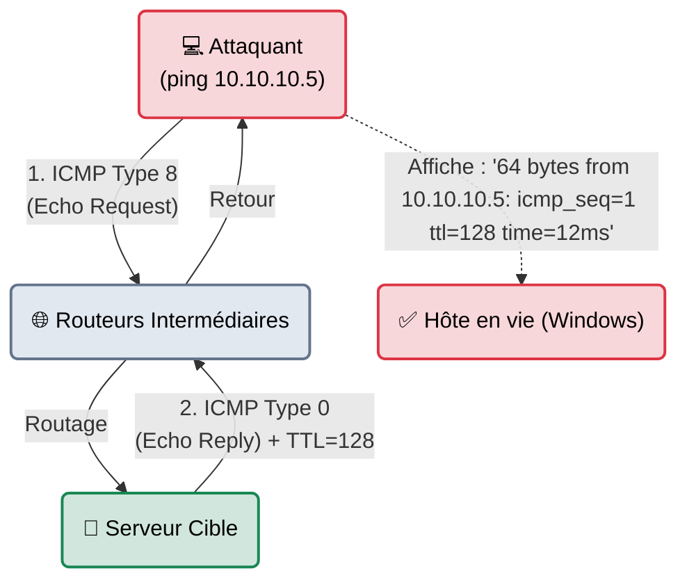

---
description: "Ping — L'outil fondamental de diagnostic réseau basé sur ICMP. Indispensable pour vérifier la connectivité et déduire l'OS cible via le TTL."
icon: lucide/book-open-check
tags: ["RED TEAM", "RESEAU", "PING", "ICMP", "DIAGNOSTIC"]
---

# Ping — Le Sonar Réseau

<div
  class="omny-meta"
  data-level="🟢 Débutant"
  data-version="Standard UNIX"
  data-time="~10 minutes">
</div>


## Introduction

!!! quote "Analogie pédagogique — Le Cri dans la Grotte"
    Savoir si un ordinateur est allumé à l'autre bout du monde sans essayer d'ouvrir une de ses portes (ports), c'est comme crier dans une grotte noire : *"Il y a quelqu'un ?"*. Si vous entendez un écho revenir, la réponse est oui.
    La commande **Ping** est exactement ça. Elle envoie un paquet de données spécial (une "Echo Request" du protocole ICMP) à une adresse IP. Si l'ordinateur cible est allumé et ne se cache pas, il a l'obligation protocolaire de renvoyer l'exact même paquet (une "Echo Reply"). C'est le battement de cœur du réseau.

Présent sur absolument tous les systèmes d'exploitation du monde, **Ping** est la commande de diagnostic réseau absolue. Bien qu'elle ne soit pas un outil de "hacking" à proprement parler, elle est la première commande tapée par un ingénieur réseau ou un pentester pour vérifier l'état des routes.

<br>

---

## Fonctionnement & Architecture (Le Protocole ICMP)

Contrairement aux navigateurs web (qui utilisent TCP) ou aux jeux vidéo (UDP), Ping utilise **ICMP** (Internet Control Message Protocol), un protocole conçu uniquement pour l'échange de messages de contrôle et d'erreur.


```mermaid
flowchart TB
    %% Couleurs à fort contraste
    classDef attacker fill:#f8d7da,stroke:#dc3545,stroke-width:2px,color:#000
    classDef router fill:#e2e8f0,stroke:#64748b,stroke-width:2px,color:#000
    classDef target fill:#d1e7dd,stroke:#198754,stroke-width:2px,color:#000

    A("💻 Attaquant<br>(ping 10.10.10.5)") -->|"1. ICMP Type 8<br>(Echo Request)"| B("🌐 Routeurs Intermédiaires")
    
    B -->|"Routage"| C("🏢 Serveur Cible")
    
    C -->|"2. ICMP Type 0<br>(Echo Reply) + TTL=128"| B
    
    B -->|"Retour"| A
    
    A -.->|"Affiche : '64 bytes from 10.10.10.5: icmp_seq=1 ttl=128 time=12ms'"| D("✅ Hôte en vie (Windows)")

    class A,D attacker
    class B router
    class C target
```

<br>

---

## Cas d'usage & Complémentarité

En Red Team, Ping n'est pas seulement utilisé pour dire "C'est allumé". Il donne deux informations critiques avant même de lancer Nmap :

1. **Fingerprinting Passif (OS Detection via TTL)** : La valeur du TTL (Time To Live) dans la réponse renseigne souvent sur le système d'exploitation de la cible.
2. **Exfiltration (ICMP Tunneling)** : Dans des environnements ultra-sécurisés où tout accès Internet (TCP/UDP) est bloqué, le protocole ICMP est parfois oublié. Des attaquants utilisent des requêtes Ping modifiées pour extraire des fichiers (chaque Ping transporte un petit bout du fichier caché dans sa structure).

<br>

---

## Les Options Principales

Les options diffèrent légèrement entre Windows et Linux. Celles-ci concernent la version GNU/Linux.

| Option | Fonction | Description approfondie |
| :--- | :--- | :--- |
| `-c [nb]` | **Count** | Sous Linux, le ping est infini par défaut. Utilisez `-c 4` pour n'envoyer que 4 paquets (comme le fait Windows par défaut). |
| `-i [sec]` | **Intervalle** | Attend *X* secondes entre chaque envoi (pour être plus discret). |
| `-s [taille]` | **Taille** | Spécifie la taille en octets du paquet de données envoyé. (Utile pour tester la fragmentation des pare-feux). |

<br>

---

## Le Workflow Idéal (L'Analyse du TTL)

Quand vous obtenez une réponse au Ping, ne regardez pas que le temps (`time=12ms`), regardez la valeur **`ttl=`**. 

Le TTL (Time To Live) est un chiffre qui diminue de 1 à chaque routeur traversé. Les différents systèmes d'exploitation (OS) n'ont pas la même valeur TTL de départ (quand le paquet quitte leur carte réseau).

### La Règle d'or du Pentester (Valeurs initiales) :
- **TTL ~ 64** ➔ Le serveur est probablement un système **Linux / Unix**.
- **TTL ~ 128** ➔ Le serveur est probablement un système **Windows**.
- **TTL ~ 255** ➔ C'est souvent un équipement réseau (Routeur Cisco, Switch).

```bash title="Exemple d'analyse de cible"
ping -c 1 10.10.10.5
# Résultat : 64 bytes from 10.10.10.5: icmp_seq=1 ttl=127 time=20 ms
```
*Le TTL reçu est de `127`. Cela signifie qu'il est parti de `128` (Windows) et qu'il a traversé un seul routeur (-1) pour arriver jusqu'à nous. On sait immédiatement que la cible est sous Windows, sans avoir lancé Nmap.*

<br>

---

## Bonnes & Mauvaises Pratiques (Do's & Don'ts)

| Action | Recommandation | Explication métier |
|---|---|---|
| ✅ **À FAIRE** | **Combiner avec Nmap (`-Pn`)** | Utilisez les informations du TTL pour pré-configurer vos attaques ou votre état d'esprit face à la machine cible. |
| ❌ **À NE PAS FAIRE** | **Croire qu'un "Request Timeout" signifie "Éteint"** | **C'EST L'ERREUR DÉBUTANTE N°1**. Par défaut, le Pare-feu de Windows 10 et Windows Server (Windows Defender Firewall) **bloque** silencieusement les requêtes ICMP. La machine est allumée et ses ports Web sont ouverts, mais elle ne répondra jamais au Ping. Ne concluez jamais qu'une cible est "Down" juste parce que le Ping échoue. |

<br>

---

## Avertissement Légal & Éthique

!!! note "Une Pratique Normale"
    L'envoi de quelques paquets ICMP (Ping) vers une adresse IP publique est un comportement normal d'Internet. Cela ne constitue en aucun cas une intrusion, un piratage ou une infraction.
    
    Cependant, "Ping" a donné naissance historiquement à la pire attaque basique d'Internet : Le **Ping of Death** (Envoi d'un paquet ICMP illégalement grand pour faire crasher les vieux OS) et le **Ping Flood** (Attaque par Déni de Service en saturant la bande passante de la cible de pings). Ces deux utilisations déviées, si elles causent une indisponibilité, tombent sous l'Article 323-2 du Code Pénal.

<br>

---

## Conclusion

!!! quote "Ce qu'il faut retenir"
    Aussi basique soit-il, le Ping reste votre premier interlocuteur sur un réseau inconnu. S'il répond, l'analyse de son TTL vous donne déjà une longueur d'avance sur l'identification de l'infrastructure. S'il ne répond pas, n'oubliez jamais que c'est sûrement juste son garde du corps (le Pare-Feu) qui vous ignore.

> Que se passe-t-il lorsque vous devez envoyer un paquet réseau qui ne correspond à aucun standard (ni un vrai ping, ni une vraie requête web) pour tester les réactions étranges d'un pare-feu ? Vous devez le construire à la main, bit par bit. Bienvenue dans la forge avec **[Scapy →](./scapy.md)**.


