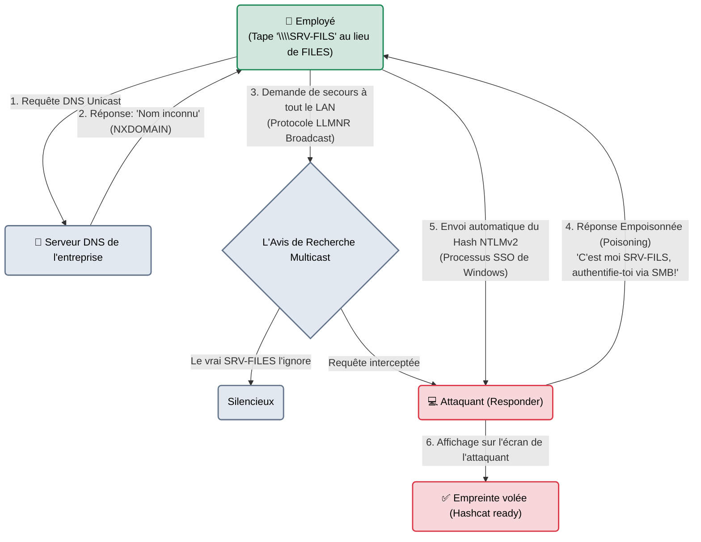

# Responder — Le Voisin Trop Serviable

<div
  class="omny-meta"
  data-level="🟡 Intermédiaire → 🔴 Avancé"
  data-version="3.1+"
  data-time="~45 minutes">
</div>

<div style="text-align: center; margin: 0 auto;">
    
</div>

## Introduction

!!! quote "Analogie pédagogique — Le Menteur de l'Open Space"
    Imaginez un très grand bureau ouvert. Quelqu'un se lève et crie : *"Est-ce que quelqu'un sait où est l'imprimante réseau 'IMP-404' ?"* (Une requête de diffusion - Broadcast).
    Normalement, c'est le vrai serveur DNS qui répond. Mais si le DNS ne connaît pas "IMP-404" (faute de frappe), Windows demande à tout le monde. **Responder** est ce collègue malveillant assis au fond de la pièce qui lève immédiatement la main et crie : *"C'est moi ! Je suis l'imprimante IMP-404 ! Donne-moi ton badge et ton mot de passe et je t'imprime ton document"*. L'ordinateur de la victime, confiant, envoie son mot de passe haché (NTLMv2).

Créé par Laurent Gaffié, **Responder** est un empoisonneur de résolutions de noms (Poisoner) pour les réseaux locaux. C'est invariablement le premier outil lancé par une équipe Red Team dès qu'elle connecte un câble réseau dans un bâtiment. Il exploite la candeur des vieux protocoles Microsoft (LLMNR, NBT-NS) qui, lorsqu'ils ne trouvent pas un serveur, demandent à la cantonade si quelqu'un le connaît.

<br>

---

## 🏗️ Fonctionnement & Architecture (L'Empoisonnement LLMNR)

L'attaque repose sur une faille logique des réseaux Windows : la résolution de noms de secours. Si un ordinateur Windows ne trouve pas un nom via le serveur DNS classique, il n'abandonne pas. Il utilise des protocoles de secours (LLMNR - UDP 5355, et NBT-NS - UDP 137) pour demander de l'aide à ses "voisins" locaux.



<br>

---

## 🎯 Cas d'usage & Complémentarité Stratégique

L'objectif de Responder n'est pas d'exécuter du code, mais d'**obtenir des Credentials (identifiants)**. Dans une matrice MITRE ATT&CK, il correspond à la tactique *Credential Access* (T1557.001 - Adversary-in-the-Middle).

Il sert deux objectifs diamétralement opposés selon la configuration du réseau :

1. **La Pêche au Hash (NTLMv2 Cracking)** :
   C'est son rôle natif. On lance Responder, on attend qu'une victime fasse une faute de frappe, et on récupère son empreinte (Hash). Le hash NTLMv2 ne peut pas être "Passé" (Contrairement au NTLMv1), il doit obligatoirement être cassé par force brute hors ligne (via Hashcat/John) pour récupérer le mot de passe en clair.

2. **Le Relais NTLM (NTLM Relaying)** :
   Si le réseau cible **n'impose pas la signature SMB** (SMB Signing), le hash n'a même pas besoin d'être cassé. L'attaquant désactive les serveurs SMB/HTTP natifs de Responder et lance un second outil (`ntlmrelayx.py` d'Impacket). Dès que l'employé envoie son hash à l'attaquant, l'attaquant le relaie instantanément au vrai Contrôleur de Domaine pour usurper l'identité de l'employé en temps réel.

<br>

---

## 🛠️ Configuration & Workflow Opérationnel

Responder est incroyablement automatisé. Sa configuration fine se fait dans le fichier `Responder.conf` (généralement situé dans `/etc/responder/` ou `/usr/share/responder/`), mais la ligne de commande permet de s'adapter à la volée.

### 1. La Reconnaissance (L'Écoute Passive)
Lancer directement Responder en mode attaque dans un environnement industriel (OT) ou bancaire peut créer des instabilités (conflits d'IPs). Un professionnel commence **toujours** par écouter le bruit de fond.

```bash title="Mode Analyse Passive"
# Le flag -A (Analyze) empêche Responder de répondre. Il se contente d'afficher les requêtes.
sudo responder -I eth0 -A
```
*Si vous voyez des dizaines de requêtes LLMNR s'afficher (ex: des machines cherchant `WPAD` ou d'anciens serveurs déclassés), vous savez que le réseau est vulnérable. Il est temps de passer à l'attaque.*

### 2. L'Embuscade Active
On relance l'outil sans le flag `-A` pour activer l'empoisonnement.

| Option | Fonction | Description approfondie |
| :--- | :--- | :--- |
| `-I [eth0]` | **Interface** | La carte réseau branchée sur le LAN cible. C'est l'option fondamentale. |
| `-rdw` | **Analyse Discrète** | Répond aux requêtes mais limite certaines attaques agressives de NetBIOS (`-r`), DNS (`-d`) et désactive le faux proxy WPAD (`-w`). Mode "Safe" pour ne rien crasher. |

```bash title="Mode Empoisonnement Classique"
sudo responder -I eth0 -r -d -w
```
Le terminal affiche les serveurs fictifs (SMB, SQL, FTP, HTTP) qu'il vient de créer sur votre machine.

### 3. La Capture et le Cassage
C'est le moment d'attendre. Lorsqu'une victime mord à l'hameçon, le terminal Responder s'illumine en **jaune vif** :
```text
[SMB] NTLMv2-SSP Client   : 192.168.1.50
[SMB] NTLMv2-SSP Username : CORP\j.dupont
[SMB] NTLMv2-SSP Hash     : j.dupont::CORP:1122334455667788:1A2B3C...
```
*(Le Hash est sauvegardé automatiquement dans `/usr/share/responder/logs/`)*

On utilise ensuite Hashcat pour le casser en utilisant les puissants GPUs de notre machine de cracking.
```bash title="Cassage NTLMv2 (Mode 5600)"
hashcat -m 5600 /usr/share/responder/logs/SMB-NTLMv2-SSP-192.168.1.50.txt /usr/share/wordlists/rockyou.txt
```

<br>

---

## 🥷 Techniques Avancées : WPAD et DHCP Poisoning

1. **WPAD (Web Proxy Auto-Discovery) Poisoning**
   Dans une entreprise, les navigateurs (Chrome/Edge) cherchent souvent automatiquement un serveur nommé "WPAD" pour savoir quel serveur Proxy utiliser pour aller sur Internet. Responder peut prétendre être ce serveur (`WPAD = On` dans `Responder.conf`). Il fournira un faux fichier de configuration `.pac` demandant au navigateur de s'authentifier auprès de l'attaquant pour TOUTES les requêtes HTTP. C'est dévastateur, mais ça peut couper Internet à la victime.
2. **DHCP Poisoning**
   Si DHCP n'est pas sécurisé (DHCP Snooping désactivé sur les switchs), Responder peut injecter de faux paramètres DNS directement lors de l'attribution des adresses IP aux machines, redirigeant ainsi le trafic global.

<br>

---

## 🚨 Approche Purple Team : Comment détecter Responder ? (Blue Team)

!!! warning "Vue Défensive (Blue Team / SOC)"
    Détecter Responder n'est pas une question d'Antivirus, puisque Responder s'exécute sur le PC de l'attaquant (ex: son propre Kali Linux), qui est hors de contrôle de l'entreprise (Bring Your Own Device). La détection doit se faire **sur le réseau** ou **sur les terminaux cibles**.

### 1. La Remédiation Absolue (Désactivation par GPO)
Avant même de chercher à détecter l'attaque, il faut la rendre impossible. LLMNR et NBT-NS sont des reliques de Windows 2000. Ils **doivent** être désactivés.
- **LLMNR** : GPO > Modèles d'administration > Réseau > Client DNS > *Désactiver la résolution de noms de multidiffusion (LLMNR)*.
- **NBT-NS** : Scripts PowerShell pour le désactiver sur chaque carte réseau (DHCP Option 43).

### 2. Règle Sigma (Détection via Event Logs)
Même si le PC attaquant échappe au contrôle, le PC de la victime (qui se fait empoisonner) génère un journal d'audit Windows (Event ID `4624` - Logon) lorsqu'il tente de se connecter au faux serveur SMB de Responder.

```yaml title="Règle Sigma - Détection d'authentification NTLM downgrade"
title: Détection potentielle de Responder (NTLMv2 Downgrade / Relay)
logsource:
    product: windows
    service: security
detection:
    selection:
        EventID: 4624                     # Succès de connexion (ou tentative)
        LogonType: 3                      # Network Logon
        AuthenticationPackageName: 'NTLM' # Le protocole forcé par Responder
    filter:
        # On exclut les anciens serveurs légitimes qui utilisent encore NTLM
        SourceNetworkAddress: '192.168.10.5' 
    condition: selection and not filter
description: |
    Une entreprise moderne utilise Kerberos. Une authentification réseau (LogonType 3) 
    qui rétrograde en NTLM depuis un poste de travail vers une IP inconnue
    est la signature classique d'un empoisonnement LLMNR par Responder.
```

### 3. Honeypots (Le piège inversé)
Une technique Red/Blue très élégante consiste à créer un script qui tente volontairement, toutes les 10 minutes, de contacter un serveur qui n'existe pas (ex: `\\SERVEUR-FANTOME-99`). Si la requête LLMNR obtient une réponse, cela signifie qu'un Responder est branché sur le LAN. Le SOC lance alors une alerte P1.

<br>

---

## Conclusion & Légalité

!!! danger "Altération du Routage Local"
    Bien que Responder ne détruise pas de données (comme un ransomware), il modifie le comportement normal du routage local (Man-in-the-Middle).
    
    1. Fournir de fausses résolutions de nom aux ordinateurs d'une entreprise est une **entrave au fonctionnement d'un STAD** (Article 323-2 du Code pénal).
    2. La capture de hachages NTLMv2 (secrets d'authentification) pour les casser sans autorisation explicite est un délit grave. Brancher un Kali avec Responder sur une prise RJ45 publique d'une bibliothèque ou d'un coworking est pénalement condamnable.

!!! quote "Ce qu'il faut retenir"
    Si vous n'aviez le droit de garder qu'un seul outil pour compromettre une infrastructure Windows (Active Directory) de l'intérieur, ce serait Responder. Il profite de la philosophie de Windows qui privilégie la "facilité d'utilisation" à la sécurité stricte. S'il ne trouve pas un nom de serveur via la voie officielle, il fera confiance au premier inconnu qui lui dira "Suis-moi, c'est par là".

> Vous avez récupéré le mot de passe de l'utilisateur `j.dupont` grâce à Responder et Hashcat. Mais ce compte est-il administrateur de sa machine ? De 10 autres machines ? De tout le domaine ? Pour tester ce mot de passe sur tout le réseau d'un coup, on utilise le "Passe-Partout" de l'Active Directory : **[CrackMapExec →](./cme.md)**.

<br>

---

## Conclusion

!!! quote "Ce qu'il faut retenir"
    L'infrastructure réseau reste le cœur de l'entreprise. La découverte minutieuse des services, des ports ouverts et des vulnérabilités associées est le point de départ de toute compromission interne.

> [Retourner à l'index des outils →](../../index.md)
