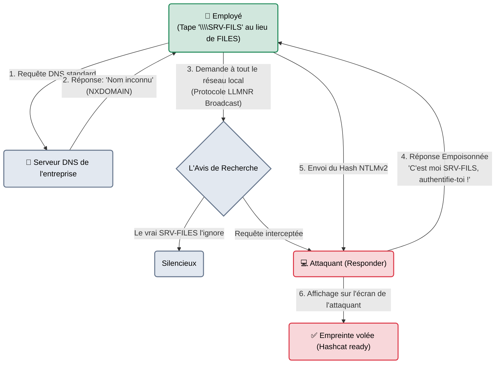

---
description: "Responder — L'outil de compromission initiale ultime en réseau local Windows. Empoisonne les protocoles LLMNR, NBT-NS et MDNS pour capturer les empreintes NTLMv2."
icon: lucide/book-open-check
tags: ["RED TEAM", "ACTIVE DIRECTORY", "RESPONDER", "POISONING", "NTLM"]
---

# Responder — Le Voisin Trop Serviable

<div
  class="omny-meta"
  data-level="🟡 Intermédiaire"
  data-version="3.1+"
  data-time="~15 minutes">
</div>


## Introduction

!!! quote "Analogie pédagogique — Le Menteur de l'Open Space"
    Imaginez un très grand bureau ouvert. Quelqu'un se lève et crie : *"Est-ce que quelqu'un sait où est l'imprimante réseau 'IMP-404' ?"* (Une requête de diffusion - Broadcast).
    Normalement, c'est le vrai serveur DNS qui répond. Mais si le DNS ne connaît pas "IMP-404" (faute de frappe), Windows demande à tout le monde. **Responder** est ce collègue malveillant assis au fond de la pièce qui lève immédiatement la main et crie : *"C'est moi ! Je suis l'imprimante IMP-404 ! Donne-moi ton badge et ton mot de passe et je t'imprime ton document"*. L'ordinateur de la victime, confiant, envoie son mot de passe haché (NTLMv2).

Créé par Laurent Gaffié, **Responder** est un empoisonneur de résolutions de noms (Poisoner) pour les réseaux locaux. C'est invariablement le premier outil lancé par une équipe Red Team dès qu'elle connecte un câble réseau dans un bâtiment. Il exploite la candeur des vieux protocoles Microsoft (LLMNR, NBT-NS) qui, lorsqu'ils ne trouvent pas un serveur, demandent à la cantonade si quelqu'un le connaît.

<br>

---

## Fonctionnement & Architecture (L'Empoisonnement LLMNR)

L'attaque repose sur une faille logique des réseaux Windows : la résolution de noms de secours.



<br>

---

## Cas d'usage & Complémentarité

L'objectif de Responder n'est pas d'exécuter du code, mais de **voler des identifiants (Credentials)**.

1. **La Pêche au Hash (NTLMv2)** : C'est son rôle principal. On le lance, on attend quelques heures (que les gens fassent des fautes de frappe ou redémarrent leur PC), et on récolte les hash NTLMv2 pour les casser sur un GPU à la maison (Hashcat).
2. **Le Relais NTLM (NTLM Relay)** : Si le réseau le permet (Pas de signature SMB), au lieu de garder le hash pour le casser, l'attaquant s'associe à l'outil `ntlmrelayx` (d'Impacket) pour relayer instantanément l'authentification vers un vrai serveur, entrant ainsi dans l'AD sans même avoir à connaître le mot de passe.

<br>

---

## Les Options Principales

Responder est incroyablement automatisé. Sa configuration fine se fait dans le fichier `Responder.conf`, mais la ligne de commande permet de l'adapter au réseau.

| Option | Fonction | Description approfondie |
| :--- | :--- | :--- |
| `-I [eth0]` | **Interface** | La carte réseau branchée sur le LAN cible. C'est souvent la seule option obligatoire. |
| `-rdw` | **Analyse Discrète** | Répond aux requêtes (NetBIOS/LLMNR) mais limite certaines attaques agressives pour rester sous le radar (Souvent utilisé : `-I eth0 -r -d -w`). |
| `-A` | **Mode Analyse (Passif)** | Mode très utile. Responder ne répondra à aucune requête (pas d'empoisonnement), mais il écoutera et affichera toutes les requêtes LLMNR du réseau. Parfait pour vérifier si le réseau est vulnérable sans rien pirater. |

<br>

---

## Installation & Configuration

Installé par défaut sur Kali Linux. 

```bash title="Installation"
sudo apt update && sudo apt install responder
```
*Note : Si vous utilisez Responder pour faire du relais NTLM avec d'autres outils (Impacket), vous devrez ouvrir `/etc/responder/Responder.conf` et mettre `SMB = Off` et `HTTP = Off` pour ne pas bloquer les ports.*

<br>

---

## Le Workflow Idéal (L'Embuscade sur Réseau Local)

L'attaque avec Responder demande de la patience. C'est une technique d'opportunité.

### 1. L'Activation
On branche son ordinateur sur une prise murale de l'entreprise (ou sur le WiFi Interne). On identifie sa carte (`eth0` ou `wlan0`) et on lance l'outil.
```bash title="Lancer l'empoisonneur"
sudo responder -I eth0 -v
```
Le terminal affichera un grand panneau "Responder" et la liste des serveurs fictifs qu'il vient de créer sur votre machine (un faux serveur SMB, un faux serveur SQL, un faux serveur LDAP...).

### 2. L'Attente et la Capture
C'est le moment d'attendre.
*   À 10h15, la secrétaire fait une faute de frappe : elle tape `\\serveur-docm` au lieu de `\\serveur-docs`.
*   À 10h16, son PC diffuse l'erreur sur le réseau en LLMNR. Responder lui répond qu'il est ce serveur.
*   À 10h16 et 1 milliseconde, le terminal Responder s'illumine en **jaune vif** :
```text
[+] NTLMv2-SSP Hash   : j.dupont::CORP:1122334455667788:1A2B3C...
```
*Vous venez de capturer l'empreinte NTLMv2 de l'employée.*

### 3. Le Cassage (Hashcat)
On sauvegarde cette empreinte dans un fichier `hash.txt` et on utilise la puissance des cartes graphiques.
```bash title="Cassage NTLMv2 (Mode 5600)"
hashcat -m 5600 hash.txt /usr/share/wordlists/rockyou.txt
```

<br>

---

## Bonnes & Mauvaises Pratiques (Do's & Don'ts)

| Action | Recommandation | Explication métier |
|---|---|---|
| ✅ **À FAIRE** | **Analyser avant de frapper (`-A`)** | Lancez toujours Responder avec le flag `-A` pendant 5 minutes. Regardez s'il y a des requêtes bizarres (des scripts automatisés qui cherchent des serveurs morts). Si oui, vous savez que l'empoisonnement sera un succès total. |
| ✅ **À FAIRE** | **Expliquer la remédiation au client** | La présence de Responder dans un rapport d'audit est systématique. La solution pour l'entreprise est simple (et gratuite) : **Désactiver LLMNR et NBT-NS via une GPO (Stratégie de groupe)**. |
| ❌ **À NE PAS FAIRE** | **Activer le WPAD par défaut si vous n'êtes pas sûr** | Le fichier de configuration permet d'activer le faux serveur proxy (WPAD). C'est dévastateur pour récupérer des mots de passe, mais cela peut couper l'accès internet de toute l'entreprise si c'est mal géré. Attention aux dénis de service réseau. |

<br>

---

## Avertissement Légal & Éthique

!!! danger "Altération du Routage Local"
    Bien que Responder ne crée pas de dommage visible (comme un ransomware), il modifie le comportement normal des communications des ordinateurs de la cible (Man-in-the-Middle).
    
    1. Fournir de fausses résolutions de nom aux ordinateurs de l'entreprise est une **entrave au fonctionnement du système** (Article 323-2 du Code pénal).
    2. La capture et le vol des hachages NTLMv2 (des secrets d'authentification) pour les casser est le prérequis à l'intrusion frauduleuse. Sans accord d'audit de l'infrastructure Interne, brancher Responder sur une prise réseau (même d'un espace de coworking) est pénalement condamnable.

<br>

---

## Conclusion

!!! quote "Ce qu'il faut retenir"
    Si vous n'aviez le droit de garder qu'un seul outil pour compromettre une PME Windows de l'intérieur, ce serait Responder. Il profite du fait que Windows privilégie la "facilité d'utilisation" à la sécurité. S'il ne trouve pas un nom de serveur proprement, il fera confiance au premier inconnu (Responder) qui lui dira "Suis-moi, c'est par là".

> Vous avez récupéré le mot de passe de `j.dupont` grâce à Responder. Mais ce compte est-il administrateur de sa machine ? De 10 autres machines ? De tout le domaine ? Pour tester ce mot de passe sur tout le réseau d'un coup, on utilise le fameux "Passe-Partout" de la Red Team : **[CrackMapExec →](./cme.md)**.


