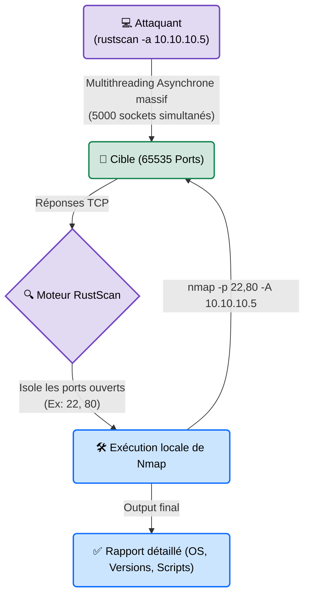

# RustScan — Le Drone de Reconnaissance

<div
  class="omny-meta"
  data-level="🟢 Débutant"
  data-version="2.0+"
  data-time="~15 minutes">
</div>

<div style="text-align: center; margin: 0 auto;">
    
</div>

## Introduction

!!! quote "Analogie pédagogique — Le Drone au-dessus du Quartier"
    Si *Nmap* est l'inspecteur méticuleux qui marche de porte en porte en notant tous les détails, **RustScan** est un drone équipé d'une caméra thermique qui survole tout le quartier à 200 km/h. En 3 secondes, le drone dit : *"Les portes 22, 80 et 443 sont chaudes"*. Immédiatement, le drone envoie les coordonnées de ces 3 portes à l'inspecteur *Nmap*, qui se téléporte directement devant elles sans perdre de temps à vérifier les 65 000 autres portes froides.

**RustScan** est l'outil ultime de la phase d'énumération moderne. Il a été créé pour résoudre un seul problème : Nmap est lent lorsqu'il doit scanner les 65 535 ports d'une machine (parfois 15 minutes). Écrit en **Rust** (connu pour sa gestion de la mémoire et son multithreading asynchrone), RustScan accomplit ce même scan complet en moins de **3 secondes**. 
Sa magie ? Dès qu'il a trouvé les ports ouverts, il lance lui-même Nmap (qui est installé sur votre système) uniquement sur ces ports précis.

<br>

---

## Fonctionnement & Architecture (Le Pipeline Rust/Nmap)

RustScan ne remplace pas Nmap. Il agit comme un "entonnoir" à haute vitesse pour filtrer le bruit avant de passer le relais.



<br>

---

## Cas d'usage & Complémentarité

RustScan est devenu le standard par défaut dans les compétitions de piratage (CTF, HackTheBox) et les audits professionnels où le temps est compté (Bug Bounty).

1. **Le "Time-Saver"** : En Bug Bounty, quand l'attaquant reçoit un "scope" de 5000 Adresses IP à auditer, Nmap prendrait des jours. RustScan balaie le bloc entier en quelques minutes.
2. **Pipelines d'automatisation CI/CD** : Sa sortie très propre permet d'intégrer RustScan dans des scripts Bash automatisés.

<br>

---

## Les Options Principales

RustScan est conçu pour être "Smart". Sans arguments complexes, il fait déjà le travail parfait.

| Option | Fonction | Description approfondie |
| :--- | :--- | :--- |
| `-a [ip]` | **Addresses** | L'IP cible, la liste d'IPs, le domaine, ou le réseau (ex: `192.168.1.0/24`). |
| `-b [taille]` | **Batch Size** | Le nombre de requêtes simultanées. Par défaut à `4500`. (Si la cible crashe, baissez cette valeur). |
| `-t [ms]` | **Timeout** | Temps d'attente maximum pour une réponse TCP. |
| `-- [args nmap]` | **Nmap Arguments** | Tout ce qui se trouve après les deux tirets `--` sera directement passé à la commande Nmap finale. |

<br>

---

## Installation & Configuration

L'outil n'est souvent pas installé par défaut sous Kali Linux, mais son installation via `.deb` est enfantine.

```bash title="Installation sous Kali/Debian"
# 1. Télécharger la dernière version
wget https://github.com/RustScan/RustScan/releases/download/2.0.1/rustscan_2.0.1_amd64.deb

# 2. L'installer
sudo dpkg -i rustscan_2.0.1_amd64.deb
```
*(Alternative recommandée : Vous pouvez aussi l'utiliser via Docker pour ne pas salir votre système).*

<br>

---

## Le Workflow Idéal (L'Énumération Éclair)

Plutôt que de faire les deux étapes de Nmap (voir fichier précédent), RustScan fait tout en une seule ligne de commande.

### 1. Le Scan Combiné
```bash title="La commande Red Team standard"
# -a : Cible
# -- : Séparateur. Ce qui suit (-sC -sV) est donné à Nmap.
rustscan -a 10.10.10.5 -- -sC -sV -oA extraction_cible
```
**Que se passe-t-il sous le capot ?**
1. En 2 secondes, RustScan teste les 65 535 ports et trouve que le `22` et le `80` sont ouverts.
2. En une fraction de seconde, il construit cette commande en arrière-plan et la lance pour vous : `nmap -p 22,80 -sC -sV -oA extraction_cible 10.10.10.5`
3. Vous obtenez votre résultat détaillé en un temps record.

### 2. Adaptation de la Vitesse (Réseaux fragiles)
```bash title="Scan plus respectueux"
# On abaisse le nombre de sockets parallèles de 4500 (défaut) à 500
rustscan -a 10.10.10.5 -b 500
```

<br>

---

## Bonnes & Mauvaises Pratiques (Do's & Don'ts)

| Action | Recommandation | Explication métier |
|---|---|---|
| ✅ **À FAIRE** | **Augmenter la limite de fichiers ouverts (ulimit)** | RustScan ouvre des milliers de connexions TCP simultanées (sockets). Si Linux bloque (erreur "Too many open files"), lancez `ulimit -n 10000` avant le scan. |
| ❌ **À NE PAS FAIRE** | **Utiliser RustScan pour un audit "Furtif" (Stealth)** | RustScan est l'outil le plus bruyant qui existe. Il hurle à pleins poumons sur le réseau. Tous les pare-feux d'entreprise (IDS/IPS/EDR) vont immédiatement déclencher une alerte rouge ("Massive Port Scan Detected") et banniront votre IP. En Red Team pure (simulation d'adversaire), gardez Nmap classique avec de l'évasion de pare-feu. |

<br>

---

## Avertissement Légal & Éthique

!!! danger "Déni de Service (DoS) par inondation"
    RustScan est si rapide qu'il agit, d'un point de vue réseau, comme une inondation de requêtes TCP (TCP Flood).
    
    1. Si vous scannez un vieil équipement IoT (ex: caméra de surveillance, routeur SCADA industriel), la quantité massive de connexions de RustScan fera crasher l'équipement par saturation de sa mémoire vive.
    2. C'est l'infraction caractérisée de l'**Article 323-2 du Code pénal** (Entrave au fonctionnement d'un STAD).
    
    Sur des infrastructures critiques (Hôpitaux, Usines), l'usage d'outils ultra-agressifs comme RustScan est **formellement proscrit** par les bonnes pratiques d'audit.

