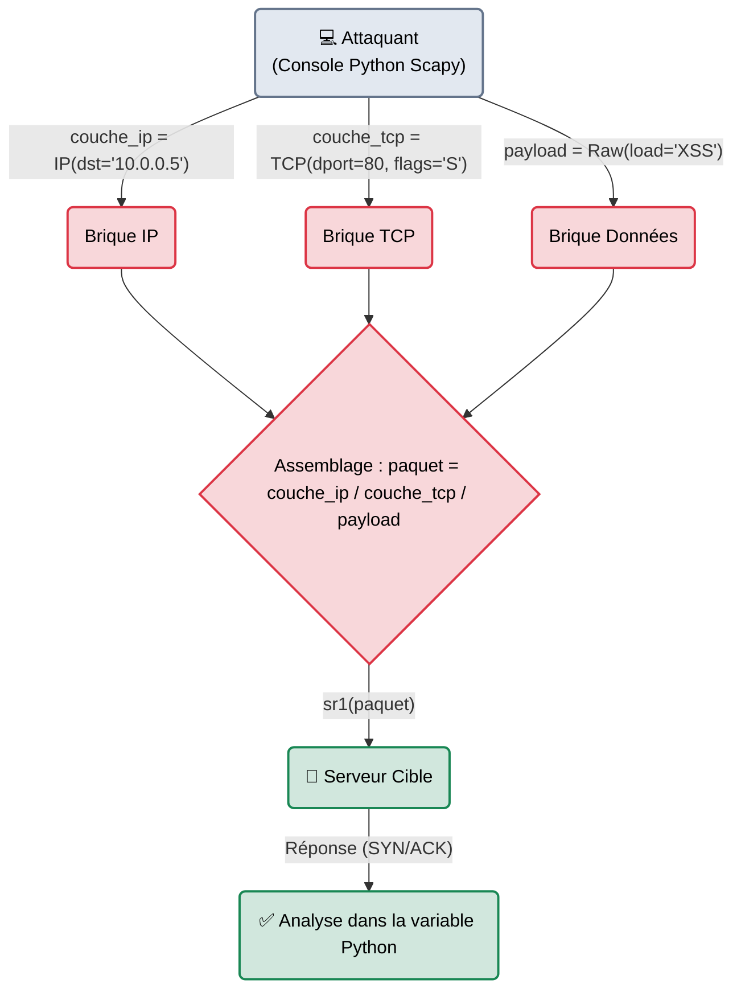

---
description: "Scapy — Le couteau suisse ultime de la manipulation de paquets en Python. Permet de forger, envoyer, renifler et disséquer des paquets réseau personnalisés."
icon: lucide/book-open-check
tags: ["RED TEAM", "RESEAU", "PYTHON", "SCAPY", "FORGE"]
---

# Scapy — Le Forgeron de Paquets

<div
  class="omny-meta"
  data-level="🔴 Expert"
  data-version="2.5+"
  data-time="~45 minutes">
</div>


## Introduction

!!! quote "Analogie pédagogique — Le Souffleur de Verre"
    La plupart des hackers utilisent des outils "prêts à l'emploi" : Nmap est un verre industriel, on appuie sur un bouton et il sort de l'usine, parfait et toujours identique. Mais que faire si le système de sécurité de la cible (Pare-feu) reconnaît le "verre Nmap" et le bloque ? 
    Il vous faut alors fabriquer votre propre verre artisanal. **Scapy** est l'atelier du souffleur de verre. Il ne fait rien automatiquement. C'est à vous, en Python, de décider de la forme exacte de votre paquet (Couche IP, puis Couche TCP, puis les Drapeaux exacts). Vous forgez la requête bit par bit pour qu'elle passe sous les radars, puis vous l'envoyez vous-même sur le réseau.

Créé par Philippe Biondi, **Scapy** est un programme interactif et une bibliothèque Python puissante. Il permet aux chercheurs en sécurité et aux Pentesters de créer n'importe quel paquet réseau imaginable (même s'il viole les règles de l'Internet), de l'envoyer sur le réseau, de capturer la réponse et de l'analyser. Il sert au développement d'exploits réseau (0-day), à la recherche de contournement de pare-feu et au fuzzing de protocoles.

<br>

---

## Fonctionnement & Architecture (L'Empilement OSI)

Scapy utilise l'opérateur de surcharge `/` (le slash) en Python pour empiler littéralement les couches réseaux (OSI) comme des briques de Lego, de la couche matérielle (Ethernet) à la couche applicative (Raw Payload).



<br>

---

## Cas d'usage & Complémentarité

Scapy est rarement utilisé pour scanner tout un réseau (il est écrit en Python et serait beaucoup trop lent comparé à du C ou du Rust). Il brille dans des cas d'usage chirurgicaux :

1. **Firewall Evasion** : Créer des paquets TCP fragmentés ou envoyer des paquets avec des drapeaux (Flags) "impossibles" (Xmas Tree) pour voir si le pare-feu laisse passer l'anomalie.
2. **Développement d'Outils** : De nombreux outils de hacking (comme certains scripts d'empoisonnement ARP ou de découverte de topologie réseau) sont codés entièrement avec la bibliothèque Scapy importée dans le script Python.

<br>

---

## Les Fonctions Principales (Console Scapy)

Dans la console interactive de Scapy (basée sur IPython), la magie opère via des fonctions courtes de manipulation.

| Fonction | Utilité | Description approfondie |
| :--- | :--- | :--- |
| `ls()` | **List** | Affiche tous les protocoles supportés ou l'aide sur un protocole. (ex: `ls(TCP)` montre tous les champs TCP modifiables). |
| `send()` | **Envoi simple (Couche 3)** | Envoie le paquet forgé (Couche IP) mais n'attend aucune réponse. (Mode Fire and Forget). |
| `sr1()` | **Send and Receive 1** | Envoie un paquet et attend **1** paquet en réponse. La fonction retourne la réponse dans une variable pour pouvoir l'analyser. |
| `sniff()` | **Capture (Wireshark-like)** | Capture le trafic réseau entrant. Ex: `sniff(count=10)` capture 10 paquets. |
| `p.show()` | **Affichage** | Affiche la structure complète et disséquée du paquet `p` de manière claire à l'écran. |

<br>

---

## Installation & Configuration

```bash title="Installation Python"
# Installation globale sous Linux
sudo apt update && sudo apt install python3-scapy

# Ou via le gestionnaire de paquets Python
pip install scapy
```
*Pour lancer l'environnement interactif, tapez simplement `sudo scapy` dans votre terminal.*

<br>

---

## Le Workflow Idéal (Le Faux Scan SYN)

Voici comment un expert recrée un scan Nmap (Port 80) à la main pour maîtriser chaque paramètre de l'attaque.

### 1. Forger le Paquet (La Requête)
Dans la console Scapy, on empile les blocs avec le signe `/`.
```python
# On définit la cible
couche_ip = IP(dst="10.10.10.5")

# On définit le port de destination (80) et le flag TCP 'S' (SYN - Demande de connexion)
couche_tcp = TCP(dport=80, flags="S")

# On assemble le tout
mon_paquet = couche_ip / couche_tcp
```

### 2. Envoyer et Capturer la Réponse
On utilise `sr1` pour envoyer notre création et capturer la réponse de la cible.
```python
# L'envoi (nécessite d'être root). Scapy envoie le paquet et attend la réponse.
reponse = sr1(mon_paquet)
```

### 3. Analyser le Résultat
Le serveur a répondu. Est-ce un SYN/ACK (Port ouvert) ou un RST (Port fermé) ?
```python
# On inspecte les flags TCP de la réponse reçue
reponse.show()

# Si on veut extraire juste l'information logiciellement :
if reponse[TCP].flags == "SA":
    print("Le port 80 est OUVERT !")
else:
    print("Le port 80 est FERMÉ.")
```

<br>

---

## Bonnes & Mauvaises Pratiques (Do's & Don'ts)

| Action | Recommandation | Explication métier |
|---|---|---|
| ✅ **À FAIRE** | **Scripter l'automatisation** | Plutôt que d'utiliser la console à chaque fois, créez des scripts complets `.py`. Ajoutez `from scapy.all import *` au début de votre script pour créer vos propres outils d'audit d'infrastructure automatisés. |
| ❌ **À NE PAS FAIRE** | **Faire un scanner de port global en Scapy** | Python est un langage interprété. Traiter et forger un paquet avec Scapy prend plusieurs millisecondes. Faire un scan sur 65535 ports prendra un temps absurde par rapport à *Nmap* ou *RustScan* qui sont écrits dans des langages compilés hautement optimisés. Utilisez Scapy pour la chirurgie (un port, une machine précise). |

<br>

---

## Avertissement Légal & Éthique

!!! danger "L'Usurpation d'Adresse (Spoofing) et l'Intrusion"
    Scapy permet de modifier n'importe quel champ de votre paquet réseau, **y compris l'adresse IP source** (`src=`).
    
    1. **IP Spoofing** : Forger un paquet en faisant croire qu'il vient de l'adresse IP de votre patron au lieu de la vôtre est de l'usurpation d'identité numérique. Si ce paquet interagit avec un pare-feu ou un serveur pour contourner une sécurité (ex: *"Laisse-moi passer, je viens de l'IP du patron"*), il s'agit d'une tentative d'accès frauduleux dans un STAD (Article 323-1 du Code pénal).
    2. Les outils "bas niveau" comme Scapy sont l'équivalent cyber de porter une cagoule et de changer ses empreintes digitales. Toute utilisation hors du laboratoire ou hors mandat écrit strict est considérée comme ayant une intention résolument hostile par les autorités compétentes.

<br>

---

## Conclusion

!!! quote "Ce qu'il faut retenir"
    Scapy est à l'ingénieur réseau ce que le bistouri est au chirurgien. Ce n'est pas un outil de force brute, c'est l'outil de l'intelligence réseau. Il requiert une excellente compréhension théorique du modèle OSI (Savoir ce qu'est un flag PSH/ACK, savoir comment marche l'ICMP), mais il permet, en retour, de réaliser des tests de sécurité qu'absolument aucun autre outil grand public ne peut accomplir de manière aussi personnalisée.

> Maintenant que nous avons validé la base du réseau (Scans, Ports, Paquets), il faut identifier logiquement les machines (Leurs Noms de Domaines) pour les attaquer. C'est le rôle de la **[Suite de diagnostic DNS →](./dns/index.md)**.


