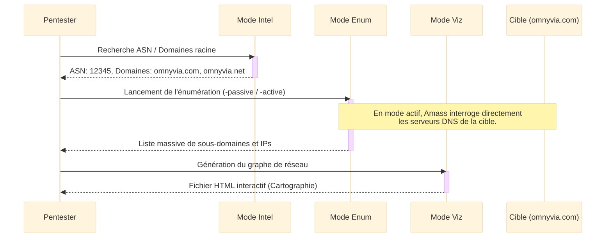
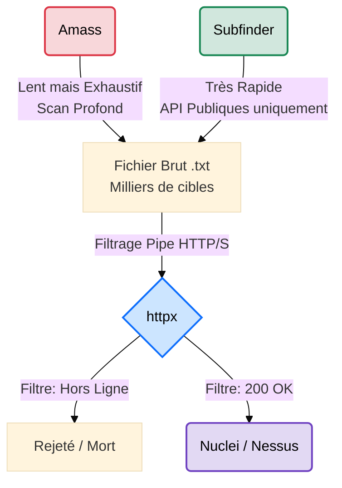

# OWASP Amass — Cartographie de Surface d'Attaque

<div
  class="omny-meta"
  data-level="🟡 Intermédiaire → 🔴 Avancé"
  data-version="4.x"
  data-time="~1 heure">
</div>

<div style="text-align: center; margin: 0 auto;">
    
</div>

## Introduction

!!! quote "Analogie pédagogique — Le Radar à Longue Portée"
    Si theHarvester est un détective qui pose des questions ciblées, **Amass** est un **système radar militaire automatisé**. Il balaie l'horizon numérique pour détecter chaque petit îlot (sous-domaine) appartenant à l'archipel d'une entreprise. Il ne se contente pas de chercher des noms : il analyse les routes (DNS), les certificats de sécurité (TLS) et les registres de propriété (Whois, ASN) pour dessiner une carte exhaustive, corrélée et précise de l'infrastructure ennemie.

Développé par l'OWASP, **Amass** est le standard industriel incontesté pour la reconnaissance d'infrastructure externe. Sa puissance exceptionnelle repose sur son moteur de graphe, capable de corréler des données issues de centaines de sources passives et d'exécuter des énumérations actives (DNS brute-force) complexes.

<br>

---

## Fonctionnement & Architecture

Amass structure sa collecte autour de modules complémentaires, permettant de passer de la découverte de l'organisation à la visualisation de son réseau.



<br>

---

## Cas d'usage & Complémentarité

Amass est le moteur lourd de l'énumération de sous-domaines. Ses résultats bruts (souvent très vastes) nécessitent d'être validés, généralement par **httpx**. Il est crucial de comprendre la différence stratégique entre Amass et d'autres outils comme **Subfinder** :



*   **Subfinder vs Amass** ➔ **Subfinder** est un "sprinteur" : il interroge rapidement des API et sort des résultats en quelques secondes. Idéal pour du Bug Bounty rapide. **Amass** est un "marathonien" : il est lent, gourmand, mais croise les données (certificats, ASN, reverse DNS) pour trouver les sous-domaines les plus obscurs (Shadow IT).
*   **Filtrage obligatoire** ➔ Le fichier de sortie d'Amass contenant souvent des "faux positifs" ou des vieux serveurs morts, on l'injecte presque toujours dans **httpx** pour s'assurer que les serveurs web derrière répondent encore, avant d'attaquer.

<br>

---

## Les Options Principales

Amass fonctionne via des sous-commandes majeures (`intel`, `enum`, `viz`, `track`). Voici les flags critiques :

| Option | Fonction | Description approfondie |
| :--- | :--- | :--- |
| `-passive` | **Collecte Passive** | Interroge uniquement des sources tierces (sans contact direct avec la cible). Indispensable pour l'OpSec. |
| `-active` | **Collecte Active** | Contacte l'infrastructure cible (transferts de zone, interrogations DNS directes). Très complet, mais détectable. |
| `-brute` | **Brute-Force DNS** | Tente de deviner les sous-domaines en utilisant un dictionnaire interne de mots courants. |
| `-src` | **Source** | Affiche le nom de la source d'où provient chaque découverte (pratique pour évaluer la fiabilité). |
| `-ip` | **Adresse IP** | Résout automatiquement chaque sous-domaine trouvé en son adresse IP correspondante. |
| `-asn` | **Autonomous System** | Affiche le numéro ASN de l'hôte, révélant chez quel fournisseur cloud/FAI il est hébergé. |

<br>

---

## Installation & Configuration

!!! quote "Le Fichier de Configuration : Le cerveau d'Amass"
    Une erreur classique est d'utiliser Amass sans le configurer. Sans vos propres clés API et sans serveurs DNS robustes, Amass est à 10% de sa puissance et ratera la majorité de la surface d'attaque.

### 1. Installation

L'installation recommandée sur les environnements d'audit est l'utilisation des binaires pré-compilés ou de Docker.

```bash title="Installation de OWASP Amass"
# Méthode via Snap (Recommandé sur Kali Linux)
sudo snap install amass

# Méthode via Docker (Isolation parfaite)
docker pull caffix/amass
```

### 2. Configuration (`config.yaml`)

Créez le fichier de configuration dans `~/.config/amass/config.yaml`. C'est ici que vous définissez vos résolveurs (pour éviter le bannissement de votre IP) et vos clés API.

```yaml title="Exemple complet : ~/.config/amass/config.yaml"
# 1. Utiliser des résolveurs DNS performants (Évite de se faire bloquer par son FAI)
resolvers:
  - 1.1.1.1 # Cloudflare
  - 8.8.8.8 # Google
  - 9.9.9.9 # Quad9

# 2. Paramètres globaux (Limitation pour ne pas saturer la bande passante)
maximum_dns_queries: 1000

# 3. Activer les sources nécessitant des API Keys (Essentiel !)
sources:
  - Shodan:
      apikey: "VOTRE_CLE_SHODAN_ICI"
  - Censys:
      apikey: "VOTRE_CLE_CENSYS_ICI"
      secret: "VOTRE_SECRET_CENSYS_ICI"
  - SecurityTrails:
      apikey: "VOTRE_CLE_SECTRAILS_ICI"
  - GitHub:
      apikey: "VOTRE_TOKEN_GITHUB"
```

<br>

---

## Le Workflow Idéal (Le Standard Red Team)

Voici le pipeline professionnel standard lorsqu'on utilise Amass dans un engagement de bout en bout :

1. **Recherche de l'Empreinte (Mode Intel)** : On cherche les ASN (blocs IP) et les noms de domaine appartenant légalement à la cible.
2. **Énumération (Mode Enum)** : On lance Amass le vendredi soir en mode actif/exhaustif sur un VPS, en utilisant le fichier de configuration complet (`-config`). On laisse tourner (parfois pendant 8 à 12 heures).
3. **Suivi des Changements (Mode Track)** : On relance l'énumération une semaine plus tard pour voir si l'entreprise a mis en ligne de *nouveaux* serveurs.
4. **Nettoyage (Httpx)** : On récupère le fichier de résultats massif, et on le passe dans `httpx` pour éliminer le bruit et les serveurs morts.

<br>

---

## Usage Opérationnel

### 1. Mode Intel : Trouver l'entreprise sur Internet

Avant de chercher les sous-domaines, il faut trouver les domaines racines et les blocs IP (ASN) possédés par la cible.

```bash title="Commande Amass - Découverte Globale"
# intel : Mode renseignement.
# -org  : Spécifie le nom légal de l'entreprise.
amass intel -org "Omnyvia"
```
_Résultat attendu : Une liste de domaines racines (`omnyvia.com`, `omnyvia.net`) et d'ASN (ex: `AS12345`)._

### 2. Mode Enum : Collecte Passive Rapide

L'approche silencieuse, sans bruit réseau direct.

```bash title="Commande Amass - Énumération Passive"
# enum     : Mode de découverte de sous-domaines.
# -passive : Ne contacte QUE des API tierces (OpSec).
# -d       : Domaine cible.
# -config  : Utilise notre fichier avec les clés API !
amass enum -passive -d omnyvia.com -config ~/.config/amass/config.yaml
```

### 3. Mode Enum : La "Golden Command" (Actif)

La commande de production, longue, brutale, mais exhaustive.

```bash title="Commande Amass - Scan Actif Complet"
# -active : Autorise les requêtes DNS directes vers la cible (Transfert de zone, etc.).
# -brute  : Force brute les sous-domaines avec le dictionnaire par défaut.
# -src    : Affiche d'où provient la donnée (ex: [Censys] dev.cible.com).
# -ip     : Affiche l'adresse IP résolue.
amass enum -active -brute -d microsoft.com -config ~/.config/amass/config.yaml -src -ip -o resultats_microsoft.txt
```

### 4. Mode Track : Suivi des modifications

Le rêve des chasseurs de primes (Bug Bounty) : savoir quand la cible déploie un nouveau serveur.

```bash title="Commande Amass - Tracking"
# track : Compare la base de données actuelle avec les scans précédents.
# -d    : Domaine cible.
amass track -d omnyvia.com
```
_L'outil affichera "Found" pour les nouveaux sous-domaines apparus depuis hier, et "Removed" pour ceux qui ont été supprimés._

<br>

---

## Bonnes & Mauvaises Pratiques (Do's & Don'ts)

| Action | Recommandation | Explication opérationnelle |
|---|---|---|
| ✅ **À FAIRE** | **Utiliser le fichier `-config`** | Sans clés API, Amass perd 60% de sa puissance de collecte. Configurez au moins Shodan, Censys et SecurityTrails. |
| ✅ **À FAIRE** | **Lancer l'outil depuis un VPS (tmux/screen)** | Amass en mode `-active` va inonder votre connexion de milliers de requêtes DNS pendant des heures. Lancez-le sur une machine distante. |
| ✅ **À FAIRE** | **Traquer les "Shadow IT"** | Si Amass trouve un sous-domaine (`dev.cible.com`) qui pointe vers une IP Amazon AWS alors que tout le reste est sur Azure, c'est probablement un vieux serveur de test oublié (vulnérable). |
| ❌ **À NE PAS FAIRE** | **Lancer `-active -brute` sans autorisation** | Ces requêtes DNS massives déclencheront des alertes SOC (Blue Team) chez la cible et s'apparentent à une tentative d'intrusion. |
| ❌ **À NE PAS FAIRE** | **Scanner le fichier brut direct avec Nessus** | Amass trouve de vieux DNS qui pointent vers des IP réassignées à d'autres clients. Vous pourriez scanner une entreprise tierce. Validez d'abord avec `httpx`. |

<br>

---

## Avertissement Légal & Éthique

!!! danger "Cadre Pénal — Le Système de Traitement Automatisé de Données (STAD[^1])"
    Si le mode `-passive` d'Amass relève de l'OSINT[^2] légal, l'utilisation du mode `-active` (et particulièrement `-brute`) constitue un sondage direct de l'infrastructure de la cible. Si ces requêtes agressives perturbent le fonctionnement du serveur DNS de la cible (déni de service involontaire lié à une surcharge), vous tombez sous le coup de la loi française.

    L'**Article 323-1 du Code pénal** réprime l'accès ou le maintien frauduleux dans un **STAD** :

    - **Peine de base** : 3 ans d'emprisonnement et 100 000 € d'amende.
    - **Circonstances aggravantes** (altération du fonctionnement du système, même involontaire suite à un bruteforce DNS massif) : 5 ans d'emprisonnement et 150 000 € d'amende.
    - **Cible étatique** (STAD d'État) : 7 ans d'emprisonnement et 300 000 € d'amende.

    *Ne lancez jamais un Amass en mode actif sans autorisation écrite formelle (Mandat/Ordre de mission).*

