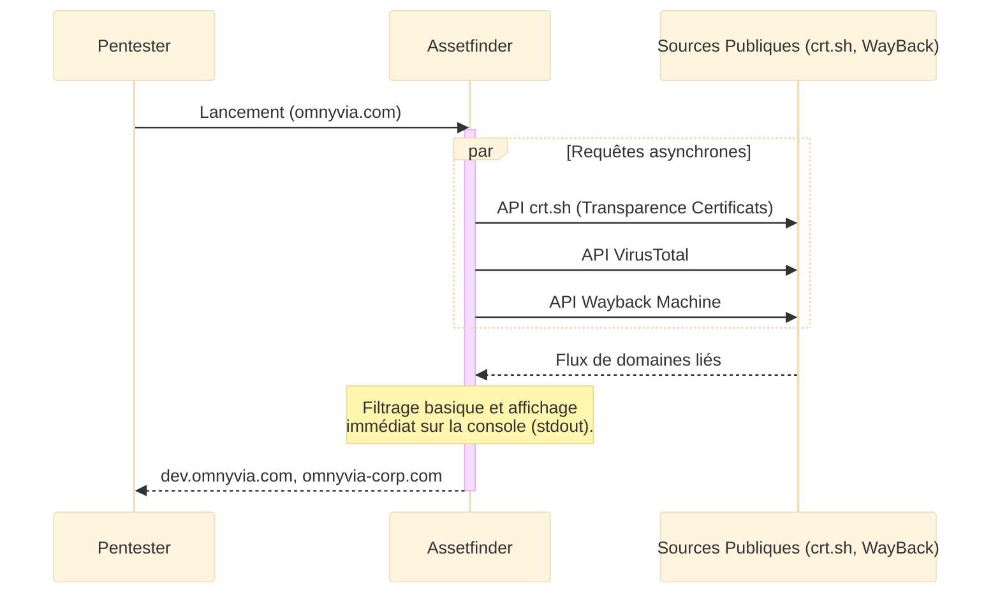
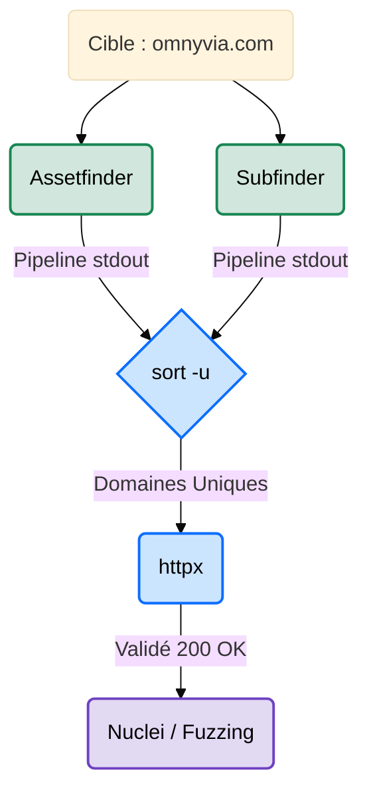

---
description: "assetfinder — L'outil ultra-léger et rapide pour découvrir des sous-domaines et des domaines liés à une cible, par le célèbre TomNomNom."
icon: lucide/book-open-check
tags: ["OSINT", "ASSETFINDER", "RECONNAISSANCE", "SUBDOMAINS", "RED TEAM", "TOMNOMNOM"]
---

# assetfinder — Le Chasseur de Têtes Éclair

<div
  class="omny-meta"
  data-level="🟢 Débutant"
  data-version="0.1+"
  data-time="~10 minutes">
</div>


## Introduction

!!! quote "Analogie pédagogique — Le Détective de Rue"
    Si vous cherchez l'historique complet d'une entreprise, vous lancez un audit global qui prendra des heures (**Amass**). Mais parfois, vous voulez juste savoir en 5 secondes "Qui sont les 10 employés principaux ?". **assetfinder** est ce petit détective de rue extrêmement rapide : il ne fait pas d'enquête approfondie, il consulte juste quelques registres publics immédiats (comme crt.sh ou VirusTotal) et vous jette une liste d'actifs bruts sur la table avant de disparaître.

Développé en Go par le célèbre chercheur **TomNomNom**, **assetfinder** est l'incarnation de la philosophie UNIX en cybersécurité : un outil minimaliste qui ne fait qu'une seule chose, très rapidement, et dont la sortie textuelle peut être transmise à un autre outil. Son but unique est de trouver des domaines et sous-domaines potentiellement liés à une cible.

<br>

---

## Fonctionnement & Architecture

L'outil interroge de manière asynchrone et sans aucune clé API une sélection de sources passives reconnues pour leur très haute disponibilité.



<br>

---

## Cas d'usage & Complémentarité

Étant donné sa vitesse et l'absence totale de configuration requise, assetfinder est systématiquement utilisé au tout début d'un pipeline de Bug Bounty, souvent en parallèle d'autres outils :



*   **Complémentarité Subfinder** ➔ Il est souvent utilisé *en plus* de subfinder et fusionné avec `sort -u` (suppression des doublons) pour capturer quelques sous-domaines uniques basés sur l'historique d'Internet (Wayback Machine).
*   **Validation avec Httpx** ➔ Sa sortie texte brute est conçue spécifiquement pour être "pipée" (`|`) directement dans **httpx**.

<br>

---

## Les Options Principales

Fidèle à sa conception minimaliste, assetfinder ne possède qu'une seule option notable :

| Option | Fonction | Description approfondie |
| :--- | :--- | :--- |
| `[domaine]` | **Cible** | Le nom de domaine principal de la recherche (s'utilise sans paramètre nominal). |
| `--subs-only` | **Sous-domaines uniquement** | Force l'outil à ne renvoyer que les sous-domaines stricts (ex: `dev.cible.com`), en excluant les domaines liés ou partenaires (ex: `cible-corp.com`). |

<br>

---

## Installation & Configuration

!!! quote "La Magie du Go"
    Assetfinder ne nécessite **aucun fichier de configuration** et aucune clé API. Il fonctionne immédiatement après son installation, ce qui en fait l'outil préféré pour les scripts Bash jetables.

### Installation

L'outil étant écrit par TomNomNom en langage Go, l'installation via la commande `go install` est la méthode standard et universelle.

```bash title="Installation de Assetfinder"
# Si le langage Go est installé sur votre machine :
go install github.com/tomnomnom/assetfinder@latest

# Sur Kali Linux (disponible dans les dépôts) :
sudo apt update && sudo apt install assetfinder
```

<br>

---

## Le Workflow Idéal (Le Standard Bash)

Assetfinder n'a pas vocation à être utilisé seul. Son flux de travail idéal s'inscrit toujours dans un script d'automatisation (Bash) :

1. **Reconnaissance Initiale** : On lance `assetfinder` sur le domaine cible.
2. **Sanitisation** : On utilise la commande bash `sort -u` pour enlever les résultats en double.
3. **Qualification** : On envoie la liste nettoyée vers un résolveur DNS (`dnsx`) ou un probe HTTP (`httpx`).

<br>

---

## Usage Opérationnel

### 1. La Recherche Simple (Exploration Large)

La commande de base pour récupérer un maximum d'informations, incluant des domaines potentiellement hors-périmètre.

```bash title="Commande Assetfinder - Recherche globale"
# assetfinder : L'outil
# omnyvia.com : La cible
assetfinder omnyvia.com
```
_Cette commande affiche immédiatement la liste des actifs. Attention, certains domaines retournés peuvent appartenir à des tiers ayant le même nom ou des partenariats._

### 2. Le Filtrage Strict (Respect du Scope)

Pour s'assurer de rester dans le périmètre autorisé lors d'un test d'intrusion.

```bash title="Commande Assetfinder - Sous-domaines stricts"
# --subs-only : Restreint les résultats aux enfants directs du domaine cible.
assetfinder --subs-only omnyvia.com
```
_Indispensable pour éviter de lancer par erreur des attaques ultérieures sur des infrastructures appartenant à d'autres entreprises._

### 3. Le Pipeline Express (One-Liner de TomNomNom)

La vraie façon d'utiliser les outils Unix-like en Bug Bounty.

```bash title="Le Pipeline de Reconnaissance Éclair"
# 1. assetfinder : Trouve les domaines (--subs-only).
# 2. sort -u     : Supprime les doublons (Unique).
# 3. httpx       : Vérifie si les sites sont actifs et affiche leur titre.
assetfinder --subs-only omnyvia.com | sort -u | httpx -title
```
_En moins de 10 secondes, vous passez d'un simple nom de domaine à une liste de serveurs web actifs qualifiés._

<br>

---

## Bonnes & Mauvaises Pratiques (Do's & Don'ts)

| Action | Recommandation | Explication opérationnelle |
|---|---|---|
| ✅ **À FAIRE** | **Utiliser `--subs-only`** | Si vous êtes mandaté pour tester `tesla.com`, assetfinder peut remonter `tesla-motors.com` (qui appartient peut-être à quelqu'un d'autre). Utilisez `--subs-only` pour éviter d'attaquer la mauvaise cible. |
| ✅ **À FAIRE** | **Le combiner avec subfinder** | Enregistrez la sortie d'assetfinder dans `a.txt`, celle de subfinder dans `b.txt`, puis faites `cat a.txt b.txt \| sort -u > final.txt` pour avoir le meilleur des deux mondes. |
| ❌ **À NE PAS FAIRE** | **S'attendre à l'exhaustivité** | L'outil interroge très peu de sources pour garantir sa vitesse. Il est parfait pour une frappe chirurgicale de 10 secondes, mais il ne remplace jamais Amass pour un audit de fond. |

<br>

---

## Avertissement Légal & Éthique

!!! danger "Cadre Pénal — Le Système de Traitement Automatisé de Données (STAD[^1])"
    L'exécution d'assetfinder est une opération purement **passive** (OSINT[^2]). Vous n'interagissez à aucun moment avec l'infrastructure de la cible, vous consultez uniquement des registres publics (comme la transparence des certificats `crt.sh`).
    
    Cependant, la chaîne d'outils que vous construisez avec ses résultats (le "Pipeline") peut vous mettre hors-la-loi. Si vous envoyez la sortie textuelle d'assetfinder directement dans un outil de scan actif de vulnérabilités (ex: `nuclei`) sans autorisation écrite préalable, vous violez l'**Article 323-1 du Code pénal** (Accès ou maintien frauduleux dans un STAD).
    
    - **Peine encourue** : 3 ans d'emprisonnement et 100 000 € d'amende. 
    - Restez vigilant sur le dernier maillon de votre pipeline Bash.

<br>

---

## Conclusion

!!! quote "Ce qu'il faut retenir"
    Assetfinder est l'outil parfait pour l'improvisation et la vitesse. Là où d'autres outils demandent des configurations YAML complexes et des dizaines de clés API, assetfinder se lance immédiatement et fait le travail. Dans le monde du pentest, cette rapidité permet de vérifier en 5 secondes si une cible présente une surface d'attaque intéressante avant d'investir des heures dans des scans plus lourds.

> Pour une énumération passive plus structurée, utilisant des dizaines d'API pour approfondir les recherches, passez à **[subfinder →](./subfinder.md)**.

<br>

[^1]: **Système de Traitement Automatisé de Données (STAD)** : Désigne tout serveur, application web ou réseau cible. Attaquer les serveurs découverts par assetfinder sans autorisation est un délit de compromission de STAD.

[^2]: **Open Source Intelligence (OSINT)** : Collecte d'informations à partir de sources publiquement accessibles sur Internet, sans contact direct avec la cible.


