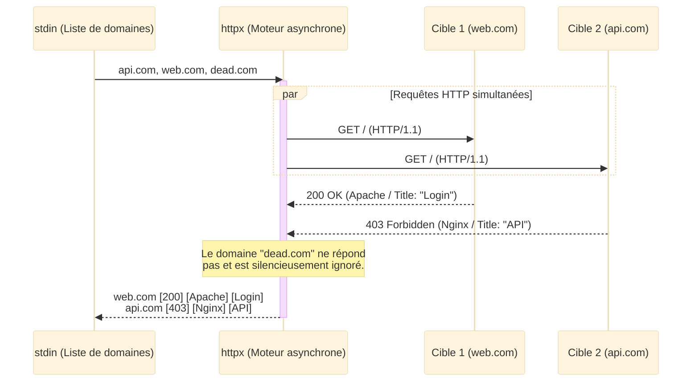
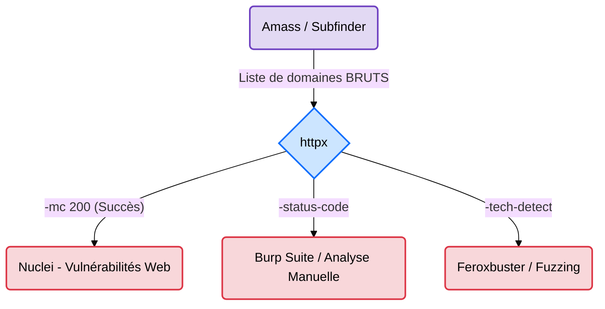

---
description: "httpx — L'outil de probing HTTP/HTTPS polyvalent pour valider les services actifs, récupérer les titres, codes de réponse et technologies."
icon: lucide/book-open-check
tags: ["OSINT", "HTTPX", "PROBING", "WEB", "RED TEAM", "PROJECTDISCOVERY"]
---

# httpx — Le Portier du Web

<div
  class="omny-meta"
  data-level="🟡 Intermédiaire"
  data-version="1.x"
  data-time="~20 minutes">
</div>


## Introduction

!!! quote "Analogie pédagogique — Le Toc-Toc Intelligent"
    Une fois que vous avez récolté une liste de 1000 adresses avec *subfinder*, vous ne savez pas lesquelles correspondent à des maisons habitées et lesquelles sont des terrains vagues. **httpx** va toquer à chaque porte à la vitesse de l'éclair. Il ne se contente pas de voir si quelqu'un répond ; il regarde par la fenêtre pour vous dire si c'est une boutique ou une banque, et il note la couleur de la porte (titre de la page, serveur web, code HTTP).

**httpx** est un toolkit de probing HTTP ultra-performant développé par **ProjectDiscovery**. Il permet de transformer une liste brute de domaines en une liste de services web qualifiés et exploitables en extrayant des métadonnées précieuses en une seule passe asynchrone.

<br>

---

## Fonctionnement & Architecture

httpx est conçu pour ingérer des flux de données standard (stdin) et cracher des flux validés (stdout), ce qui en fait le filtre réseau parfait.



<br>

---

## Cas d'usage & Complémentarité

httpx est la **charnière** absolue entre la reconnaissance passive et l'exploitation active dans l'écosystème ProjectDiscovery :



*   **En entrée** ➔ Il avale les résultats des outils d'énumération de sous-domaines (`subfinder`, `amass`).
*   **En sortie** ➔ Il fournit des URL parfaitement formées et validées (`https://...`) pour alimenter les fuzzers web et les scanners automatiques.

<br>

---

## Les Options Principales

L'outil offre de très nombreux flags pour extraire précisément les informations nécessaires à votre mission :

| Option | Fonction | Description approfondie |
| :--- | :--- | :--- |
| `-title` | **Extraction du Titre** | Récupère le texte contenu dans la balise `<title>` de la page HTML. Idéal pour repérer rapidement une page "Admin Login". |
| `-status-code` | **Code HTTP** | Affiche le code de retour (200, 403, 404, 500). Permet d'isoler les accès refusés ou les erreurs serveur. |
| `-tech-detect` | **Fingerprinting** | Identifie les technologies utilisées (PHP, React, WordPress) via les en-têtes et le contenu de la page. |
| `-mc` / `-fc` | **Filtres (Match/Filter)** | `-mc 200` ne garde que les succès. `-fc 404` retire les pages introuvables de l'affichage. |
| `-screenshot` | **Capture visuelle** | Utilise un moteur headless pour prendre une photo de chaque site actif. Pratique pour les rapports d'audit. |

<br>

---

## Installation & Configuration

!!! quote "Écosystème Go"
    Comme Subfinder et Nuclei, httpx est développé en Go. Son installation est triviale, mais il est recommandé d'utiliser les outils natifs de l'éditeur.

### 1. Installation

```bash title="Installation de httpx"
# Option A : Via pdtm (ProjectDiscovery Tool Manager) - Recommandé
pdtm -i httpx

# Option B : Via le langage Go directement
go install -v github.com/projectdiscovery/httpx/cmd/httpx@latest
```

### 2. Configuration optionnelle

httpx n'a pas besoin de fichier de configuration pour fonctionner. Vous pouvez néanmoins configurer des Webhooks (Slack/Discord) dans `~/.config/httpx/config.yaml` pour être notifié lorsqu'un service "tombe en marche" lors d'une surveillance continue.

<br>

---

## Le Workflow Idéal (Le Standard Bug Bounty)

Voici comment httpx s'intègre dans le quotidien d'un chasseur de primes :

1. **La Collecte** : L'outil `subfinder` récolte 5000 sous-domaines.
2. **Le Filtrage Rapide** : Passage dans `httpx -silent` pour s'assurer que ces sous-domaines hébergent un service HTTP/HTTPS sur les ports standards (80/443).
3. **Le Profilage (Tech-Detect)** : Un deuxième passage (ou une sauvegarde en JSON) permet de classer les cibles par technologie (ex: "Isoler tous les serveurs Tomcat pour y lancer des exploits Java").
4. **Le Scan** : Les URL validées sont envoyées dans `nuclei`.

<br>

---

## Usage Opérationnel

### 1. Validation de services basique

L'usage minimum syndical pour savoir "ce qui vit" sur un réseau.

```bash title="Commande httpx - Validation simple"
# cat subdomains.txt : Lit le fichier brut généré par Amass/Subfinder.
# | httpx            : Envoie la liste à l'outil pour tester les ports 80 et 443.
cat subdomains.txt | httpx
```
_Cette commande filtre le bruit DNS et ne renvoie que les URLs parfaitement formatées (ex: `https://api.omnyvia.com`) qui ont répondu à la requête HTTP._

### 2. Fingerprinting (Détection d'empreintes)

L'usage le plus pertinent pour comprendre la surface d'attaque applicative d'un simple coup d'œil.

```bash title="Commande httpx - Extraction de métadonnées"
# -title       : Affiche le titre de la page web.
# -status-code : Affiche le code de réponse (ex: [200], [301]).
# -tech-detect : Tente d'identifier le CMS ou le framework web.
cat subdomains.txt | httpx -title -status-code -tech-detect
```

### 3. Le Pipeline "Golden Recon"

La quintessence de l'automatisation ProjectDiscovery : de la découverte à l'audit en une seule ligne bash.

```bash title="Pipeline de Reconnaissance Automatisé"
# 1. subfinder : Trouve les sous-domaines (silencieusement avec -silent).
# 2. httpx     : Ne conserve que les sites qui renvoient un code 200 OK (-mc 200).
# 3. nuclei    : Lance automatiquement le scanner de vulnérabilités.
subfinder -d omnyvia.com -silent | httpx -silent -mc 200 | nuclei -t cves/
```

<br>

---

## Bonnes & Mauvaises Pratiques (Do's & Don'ts)

| Action | Recommandation | Explication opérationnelle |
|---|---|---|
| ✅ **À FAIRE** | **Utiliser `-silent` avec Nuclei** | Si vous pipez `httpx` vers `nuclei` sans `-silent`, httpx va envoyer sa bannière ASCII à Nuclei, ce qui générera une erreur. |
| ✅ **À FAIRE** | **Enregistrer la sortie en JSON (`-json`)** | Pour les très grosses cibles, enregistrez le résultat en JSON. Vous pourrez ensuite filtrer ce JSON avec `jq` pour ne trouver que les serveurs Nginx, par exemple. |
| ❌ **À NE PAS FAIRE** | **Lancer des scans lourds sur un fichier brut** | Ne lancez JAMAIS Nmap avec scripts NSE ou Burp Spider sur une liste Amass/Subfinder non filtrée par httpx. Vous allez perdre des heures à scanner des IP mortes. |
| ❌ **À NE PAS FAIRE** | **Oublier les autres ports** | Par défaut, httpx teste le 80 et le 443. Utilisez `-ports 8080,8443,3000` si vous cherchez des applications web de développement qui ne tournent pas sur les ports classiques. |

<br>

---

## Avertissement Légal & Éthique

!!! danger "Cadre Pénal — Le Système de Traitement Automatisé de Données (STAD[^1])"
    Contrairement aux outils d'OSINT passifs, **httpx est un outil de sondage ACTIF**. Il envoie de véritables requêtes réseau (`GET /`) aux serveurs de la cible. Votre adresse IP sera obligatoirement enregistrée dans les journaux (logs) des serveurs web (Apache, Nginx) et des pare-feux applicatifs (WAF).

    Si cette activité de "toquage" massif vise à saturer le serveur (Déni de Service volontaire ou non) ou si elle précède une exploitation (envoi vers Nuclei), elle tombe sous le coup de l'**Article 323-1 du Code pénal** :
    
    - **Accès frauduleux à un STAD** : 3 ans d'emprisonnement et 100 000 € d'amende.

    *Assurez-vous toujours que le domaine audité vous appartient ou que vous disposez d'un mandat explicite de Red Teaming autorisant le scan actif.*

<br>

---

## Conclusion

!!! quote "Ce qu'il faut retenir"
    httpx est le pont indispensable entre la phase de collecte (OSINT) et la phase d'exploitation (Pentest). Il purifie vos listes de cibles en écartant les serveurs morts ou les faux positifs DNS. Il est l'outil central qui valide le travail de Subfinder avant de donner le feu vert à Nuclei.

> Maintenant que vos cibles sont qualifiées et que vous connaissez leurs technologies (CMS, Serveurs), vous pouvez initier l'analyse de vulnérabilités applicatives ciblée avec **[Nuclei →](../web/nuclei.md)**.

<br>

[^1]: **Système de Traitement Automatisé de Données (STAD)** : Tout équipement informatique capable de traiter des données. Un serveur web interrogé par httpx est un STAD, et la loi punit quiconque tente d'y accéder sans droit.


