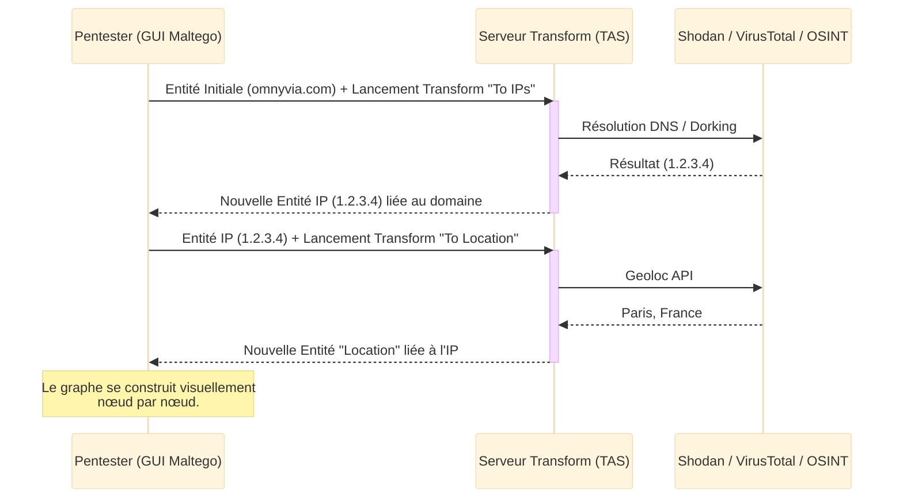
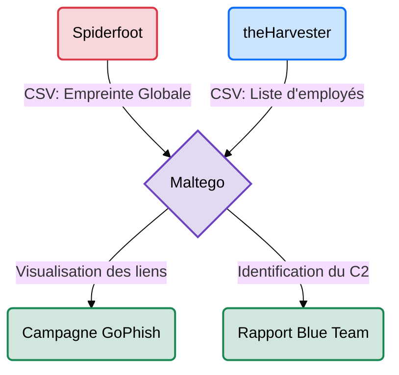

# Maltego — L'Explorateur de Relations

<div
  class="omny-meta"
  data-level="🟡 Intermédiaire → 🔴 Avancé"
  data-version="4.x"
  data-time="~1.5 heure">
</div>

<div style="text-align: center; margin: 0 auto;">
    
</div>

## Introduction

!!! quote "Analogie pédagogique — Le Tableau de la Police Criminelle"
    Imaginez le fameux tableau en liège d'un inspecteur de police, avec des photos de suspects, des adresses et des numéros de téléphone reliés par des fils rouges. **Maltego** est ce tableau en version numérique, instantanée et automatisée. Vous posez une photo (une **Entité**, comme un domaine ou une adresse email), et l'outil "tire" automatiquement tous les fils possibles en interrogeant des bases de données mondiales pour faire apparaître l'adresse IP, le compte LinkedIn du dirigeant et le serveur web associés.

**Maltego** est le logiciel de référence en matière de **Link Analysis** (analyse de liens). C'est une plateforme graphique (GUI) qui permet de collecter des informations OSINT et de cartographier visuellement les relations complexes entre des personnes, des noms de domaine, des réseaux, des infrastructures ou même des crypto-monnaies.

<br>

---

## Fonctionnement & Architecture

La force de Maltego ne réside pas dans sa propre base de données, mais dans sa capacité à interroger simultanément des dizaines de sources externes (via des "Hubs") pour enrichir le graphe, nœud par nœud.



<br>

---

## Cas d'usage & Complémentarité

Maltego est généralement utilisé à la fin de la collecte OSINT, pour consolider et analyser les données, ou lors d'investigations avancées (Forensic/DFIR) :



*   **Ingestion des résultats** ➔ Vous pouvez importer un fichier CSV généré par **theHarvester** ou **Amass** pour visualiser la topologie du réseau et identifier des anomalies d'architecture inaperçues.
*   **Préparation Phishing** ➔ Permet de cartographier visuellement la hiérarchie d'une entreprise (Directeur ➔ Managers ➔ Employés) pour préparer des campagnes d'ingénierie sociale (Spear Phishing).

<br>

---

## Les Concepts Clés (Options & Vocabulaire)

Contrairement aux outils CLI (ligne de commande), Maltego se pilote via des concepts graphiques précis :

| Concept | Fonction | Description approfondie |
| :--- | :--- | :--- |
| **Entité (Entity)** | Nœud du graphe | L'objet de base manipulé sur le tableau (Personne, Email, IP, Domaine, Tweet, Portefeuille Bitcoin). |
| **Transform** | Script d'action | Le code exécuté qui permet de passer d'une Entité A à une Entité B (ex: clic droit sur un Email ➔ *"To Social Media Profile"*). |
| **Machine** | Automatisation | Une suite de *Transforms* qui s'exécutent automatiquement en boucle pour créer un graphe complet en un clic (ex: la machine *"Company Stalker"*). |
| **Hub** | Magasin d'APIs | L'interface native permettant d'ajouter des modules tiers (Shodan, Pipl, AlienVault) pour augmenter les capacités de recherche. |

<br>

---

## Installation & Configuration

!!! quote "Gérer son environnement Java"
    Maltego est une lourde application Java de bureau. Il nécessite une bonne quantité de RAM et un compte utilisateur pour fonctionner, même dans sa version gratuite.

### 1. Installation

Maltego est généralement préinstallé sur Kali Linux. Si ce n'est pas le cas, ou si vous êtes sur Windows/macOS, téléchargez l'installeur officiel depuis le site web de Paterva.

```bash title="Lancement de Maltego"
# Sur Linux
maltego
```

### 2. Configuration (Licence et Hub)

1. À la première ouverture, vous devez choisir votre édition. Choisissez **Maltego CE (Community Edition)** pour la version gratuite.
2. Vous devrez créer un compte gratuit sur leur site et vous connecter dans l'application.
3. Une fois connecté, allez dans le **Transform Hub** (le magasin d'applications) et installez les modules gratuits (Shodan, VirusTotal, etc.). Certains nécessiteront que vous entriez votre propre clé API (ex: `Shodan API Key`) dans les paramètres du Transform.

<br>

---

## Le Workflow Idéal (Le Standard Investigation)

Voici le processus classique d'une enquête OSINT sous Maltego :

1. **La Graine (The Seed)** : Glissez-déposez une entité de départ sur le graphe vide (ex: un nom de domaine `omnyvia.com`).
2. **L'Expansion (Transforms)** : Faites un clic droit sur l'entité et exécutez un Transform de base (ex: `To DNS Name - NS`) pour trouver les serveurs de noms.
3. **L'Enrichissement (Hubs)** : Sélectionnez les nouvelles adresses IP apparues et exécutez un Transform tiers (`To Shodan Details`) pour voir si elles hébergent des ports ouverts.
4. **Le Nettoyage** : Supprimez manuellement les nœuds (entités) qui n'ont aucun rapport avec l'enquête pour garder un graphe lisible.

<br>

---

## Usage Opérationnel (Développement de Transform)

Bien que Maltego s'utilise à la souris, sa véritable puissance en Red Team réside dans la capacité à créer ses propres **Transforms** en Python pour interroger des bases de données internes ou des API d'outils maison (via la bibliothèque `maltego-trx`).

```python title="Script Python - Création d'un Transform Maltego Personnalisé"
from maltego_trx.transform import DiscoverableTransform
from maltego_trx.entities import Phrase, IPAddress

class MyCustomDNSResolver(DiscoverableTransform):
    """
    Transform personnalisé qui prend un domaine (Phrase) 
    et retourne des adresses IP spécifiques trouvées dans une BDD interne.
    """
    @classmethod
    def create_entities(cls, request, response):
        # 1. Récupération de l'entité source cliquée par l'utilisateur
        domain_name = request.Value
        
        # 2. Logique métier (ex: Requête SQL, API personnalisée, etc.)
        # result_ips = my_internal_api.resolve(domain_name)
        result_ips = ["192.168.1.10", "10.0.0.5"] # Données factices pour l'exemple
        
        # 3. Création des nouvelles entités (Noeuds) sur le graphe Maltego
        for ip in result_ips:
            # Ajoute une entité de type "IPAddress" avec la valeur trouvée
            entity = response.addEntity(IPAddress, ip)
            # Ajout d'une note (propriété) visible sur le graphe
            entity.addProperty("Note", "Source", "loose", "Base de données interne SOC")
```
_En déployant ce script sur un serveur de développement (TDS), vous pouvez cliquer sur n'importe quel domaine dans votre interface Maltego et voir apparaître vos données privées sur le graphe, fusionnant vos outils internes avec l'interface de Maltego._

<br>

---

## Bonnes & Mauvaises Pratiques (Do's & Don'ts)

| Action | Recommandation | Explication opérationnelle |
|---|---|---|
| ✅ **À FAIRE** | **Utiliser les Collections** | Si un domaine vous renvoie 500 adresses IP, Maltego devient illisible. Utilisez le bouton "Create Collection" pour les regrouper dans un seul nœud visuel. |
| ✅ **À FAIRE** | **Travailler par hypothèse** | Ne cliquez pas aveuglément sur "All Transforms". Posez-vous une question (ex: "Qui a enregistré ce domaine ?") et choisissez le Transform spécifique (`To Email address [WHOIS]`). |
| ❌ **À NE PAS FAIRE** | **Oublier les limites de la version CE** | Maltego Community Edition limite le retour d'un Transform à 12 entités. Sur de grosses cibles, il cachera la majorité des résultats ! |
| ❌ **À NE PAS FAIRE** | **Lancer des "Machines" complètes sur une grosse cible** | Lancer la machine "Company Stalker" sur `microsoft.com` fera crasher votre client Java en 2 minutes à cause des milliers de nœuds générés. |

<br>

---

## Avertissement Légal & Éthique

!!! danger "Cadre Pénal — Le STAD[^1] et le RGPD"
    L'utilisation de Maltego relève purement de l'OSINT[^2] et de la visualisation de données publiques. En soi, dessiner un graphe relationnel est **totalement légal**.
    
    Néanmoins, les risques légaux avec Maltego sont de deux ordres :
    1. **Vie Privée (RGPD)** : Constituer des bases de données massives sur des employés (nom, adresse, téléphone, liens familiaux) pour profiler des cibles viole les principes de la protection des données (CNIL) si c'est fait en dehors d'un mandat de Red Teaming explicite.
    2. **Atteinte au STAD (Art. 323-1 du Code pénal)** : Si vous installez ou développez des *Transforms* qui exécutent des requêtes agressives (ex: exploits, bruteforce direct) vers la cible lorsque vous cliquez sur l'interface, vous sortez du cadre passif. L'intrusion d'un STAD est passible de **3 ans d'emprisonnement et 100 000 € d'amende**.

<br>

---

## Conclusion

!!! quote "Ce qu'il faut retenir"
    Maltego est l'outil ultime pour "relier les points" et faire parler des données froides. Il ne sert pas techniquement à "attaquer", il sert à comprendre l'écosystème socio-technique de la cible. Pour un Red Teamer, c'est souvent cet outil qui permet de découvrir que le site web ultra-sécurisé du client est en fait administré par une filiale oubliée, dont le développeur utilise le même pseudonyme sur un forum de hacking.

> L'OSINT visuel est puissant, mais pour une collecte de données de masse silencieuse, non-stop et entièrement automatisée, découvrez des plateformes comme **[SpiderFoot →](./spiderfoot.md)**.

<br>

[^1]: **Système de Traitement Automatisé de Données (STAD)** : Tout ensemble organisé de moyens permettant de traiter des données. Interroger agressivement un STAD sans autorisation constitue un délit pénal.

[^2]: **Open Source Intelligence (OSINT)** : Collecte de renseignements à partir de sources d'information publiques et ouvertes.


