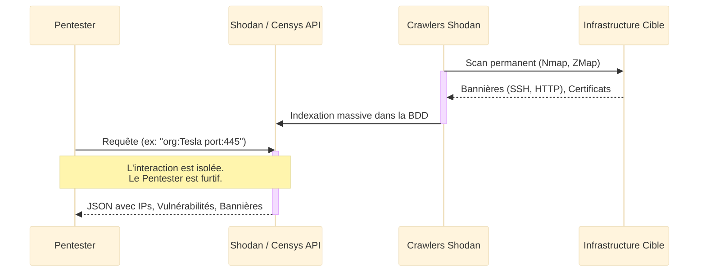
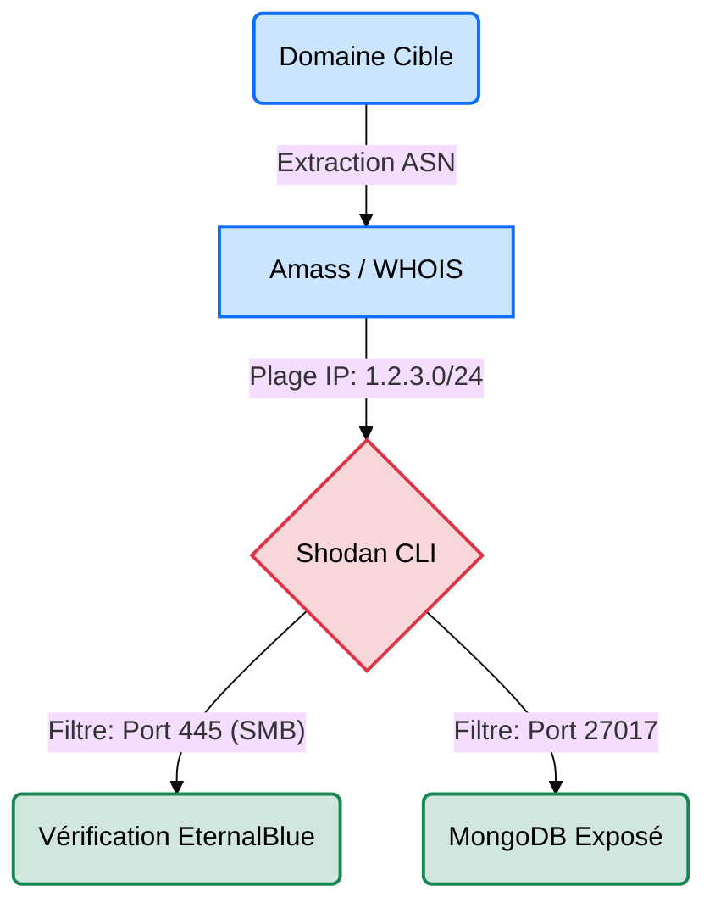

# Shodan & Censys — Les Scanners de l'Internet

<div
  class="omny-meta"
  data-level="🟡 Intermédiaire"
  data-version="2025"
  data-time="~30 minutes">
</div>

<div style="text-align: center; margin: 0 auto;">
    
</div>

## Introduction

!!! quote "Analogie pédagogique — Le Registre Foncier des Serrures"
    Google indexe l'intérieur des maisons (le contenu des pages web). **Shodan** et **Censys** agissent plutôt comme un employé municipal qui frappe à toutes les portes du monde entier, 24h/24. Il ne rentre pas, mais il note sur un grand registre public quel est le modèle de la serrure (version du service), quelle est l'entreprise de sécurité (certificat TLS), et si la porte était restée entrouverte (base de données non sécurisée). Vous pouvez alors consulter ce registre pour trouver toutes les "serrures vulnérables" d'une ville sans jamais avoir à arpenter les rues vous-même.

**Shodan** et **Censys** sont des moteurs de recherche de type **Reconnaissance Passive**. Ils effectuent des scans de l'intégralité de l'espace IP public mondial et stockent les réponses (bannières HTTP, certificats TLS, services SSH/FTP). Pour un attaquant ou un auditeur, ils permettent d'identifier les actifs vulnérables d'une cible sans envoyer le moindre paquet suspect vers elle.

<br>

---

## Fonctionnement & Architecture

Ces moteurs reposent sur des crawlers massifs qui parcourent continuellement l'IPv4.



<br>

---

## Cas d'usage & Complémentarité

L'utilisation de ces bases de données intervient au tout début de la phase de reconnaissance externe. Ils servent souvent à éviter de lancer des outils bruyants comme Nmap.



*   **Complémentarité Nmap** ➔ Au lieu de scanner agressivement toutes les IP de la cible pour trouver des ports ouverts (ce qui déclenche les alarmes du SOC), on demande à Shodan ce qu'il a déjà vu d'ouvert. On ne scannera activement avec **Nmap** que les IP intéressantes.
*   **Découverte de Shadow IT via Censys** ➔ Censys est redoutable pour retrouver des serveurs abandonnés appartenant à une entreprise en cherchant son nom dans les certificats SSL/TLS expirés.

<br>

---

## Les Options Principales (Shodan CLI)

La ligne de commande Shodan (`shodan`) est indispensable pour automatiser la recherche. Voici ses commandes clés :

| Commande | Fonction | Description approfondie |
| :--- | :--- | :--- |
| `init` | **Initialisation** | Configure l'outil avec votre clé API. Indispensable avant toute action. |
| `host` | **Analyse d'IP** | Affiche un résumé complet des ports, services et CVE connus pour une IP donnée. |
| `search` | **Recherche Dork** | Recherche des équipements répondant à un filtre spécifique (ex: webcam, base de données). |
| `download` | **Exportation** | Télécharge les résultats d'une recherche au format JSON pour un traitement hors-ligne (ex: jq). |
| `parse` | **Extraction** | Permet d'extraire des champs précis (ex: juste les IP) d'un fichier téléchargé précédemment. |

<br>

---

## Installation & Configuration

!!! quote "L'importance des Clés API"
    L'interface Web de Shodan/Censys est utile pour des recherches ponctuelles, mais en situation d'audit, il est indispensable de les utiliser en ligne de commande (CLI) pour intégrer les résultats à vos scripts. Cela nécessite l'achat ou l'obtention d'une clé API développeur.

### Installation de Shodan CLI

Shodan est distribué sous forme de module Python officiel.

```bash title="Installation de la CLI Shodan"
# Installation via le gestionnaire de paquets Python
pip3 install shodan

# Initialisation avec votre clé API personnelle
shodan init VOTRE_CLE_API_SECRETE
```

Une fois initialisé, la clé est sauvegardée localement (généralement dans `~/.shodan/api_key`).

<br>

---

## Le Workflow Idéal (Le Standard Red Team)

Voici comment les Red Teamers utilisent Shodan dans le monde réel :

1. **Obtention du Périmètre** : Récupérer tous les blocs IP (ASN) appartenant à la cible (via `amass intel` ou `whois`).
2. **Téléchargement Hors-Ligne** : Lancer un `shodan download` sur tous les ASN de la cible.
3. **Analyse Sécurisée** : Débrancher la connexion et utiliser `shodan parse` pour filtrer les résultats (ex: "Montre-moi toutes les IP de ce fichier qui ont un serveur RDP ouvert").
4. **Vérification Ciblée** : Ne lancer Nmap QUE sur les 5 adresses IP vulnérables identifiées, garantissant une discrétion maximale.

<br>

---

## Usage Opérationnel

### 1. Enquête sur une adresse IP spécifique

L'usage le plus courant pour un analyste SOC ou un Pentester qui découvre une IP inconnue et souhaite savoir ce qu'elle expose.

```bash title="Commande Shodan CLI - Analyse Host"
# host : Commande pour analyser une IP spécifique.
# 8.8.8.8 : L'adresse IP de la cible.
shodan host 8.8.8.8
```
_Cette commande retourne la localisation géographique, les ports ouverts, les technologies hébergées et les vulnérabilités (CVE) potentiellement présentes sur cette machine._

### 2. Téléchargement massif (Recherche par Dorks)

Pour les recherches à grande échelle. Les "Dorks" sont les filtres de recherche.

```bash title="Commande Shodan CLI - Download"
# download   : Enregistre le résultat dans un fichier local compressé (.json.gz).
# my_results : Le nom du fichier de destination.
# "org:..."  : Le 'Dork'. Cherche l'organisation Tesla avec le port 443 ouvert.
shodan download my_results "org:Tesla port:443"
```
_Cette méthode consomme des crédits API mais permet de stocker les preuves hors-ligne, garantissant une analyse furtive sans avoir à relancer des requêtes web._

### 3. Exploitation avec Censys (Certificats)

Là où Shodan brille par la recherche de bannières (ports), **Censys** brille par la recherche de certificats. L'interface web de Censys ou son API CLI utilise une syntaxe différente.

```text title="Requête Web Censys - Recherche par certificat"
# parsed.names : Cible tous les certificats TLS dont le nom (SAN/CN) correspond à la cible.
parsed.names: omnyvia.com
```
_C'est la méthode de référence absolue pour découvrir des sous-domaines cachés (`dev.api.omnyvia.com`) qui ne sont pas référencés dans les enregistrements DNS publics mais qui possèdent pourtant un certificat valide généré par la cible._

<br>

---

## Bonnes & Mauvaises Pratiques (Do's & Don'ts)

| Action | Recommandation | Explication opérationnelle |
|---|---|---|
| ✅ **À FAIRE** | **Utiliser `shodan parse`** | Utilisez `shodan download` une seule fois, puis filtrez localement avec `parse` pour ne pas vider votre quota de crédits API Shodan. |
| ✅ **À FAIRE** | **Corréler avec Censys** | Si Shodan ne trouve rien sur une IP, vérifiez toujours Censys. Ils scannent Internet différemment et à des fréquences différentes. |
| ❌ **À NE PAS FAIRE** | **Tomber dans le piège du Honeypot** | De nombreuses organisations déploient des serveurs leurres (Honeypots) indexés par Shodan. Si vous voyez un serveur avec TOUTES les CVE ouvertes, fuyez, c'est un piège de la Blue Team. |
| ❌ **À NE PAS FAIRE** | **Faire confiance aveuglément à la donnée** | Les données de Shodan peuvent dater de plusieurs semaines. Un port ouvert il y a un mois peut être fermé aujourd'hui. Validez toujours par un scan léger avant de lancer un exploit. |

<br>

---

## Avertissement Légal & Éthique

!!! danger "Cadre Pénal — Le Système de Traitement Automatisé de Données (STAD[^1])"
    Consulter Shodan ou Censys est une activité **100% passive et légale (OSINT[^2])**. Vous interrogez une base de données tierce. Votre adresse IP n'apparaît nulle part chez la cible.
    
    Cependant, **utiliser les résultats** fournis par Shodan (comme un port RDP ouvert sans mot de passe, ou une base de données MongoDB exposée sans authentification) pour vous y connecter tombe immédiatement sous le coup de l'**Article 323-1 du Code pénal** (Accès ou maintien frauduleux dans un STAD).

    - **Peine encourue** : 3 ans d'emprisonnement et 100 000 € d'amende. 
    - Le simple fait de tester les identifiants par défaut (`admin/admin`) sur une interface découverte via Shodan caractérise l'infraction pénale.

