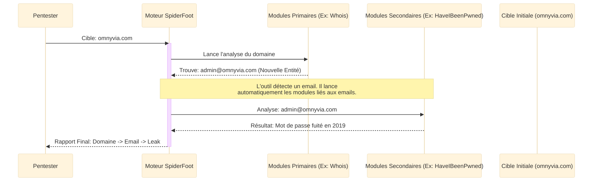
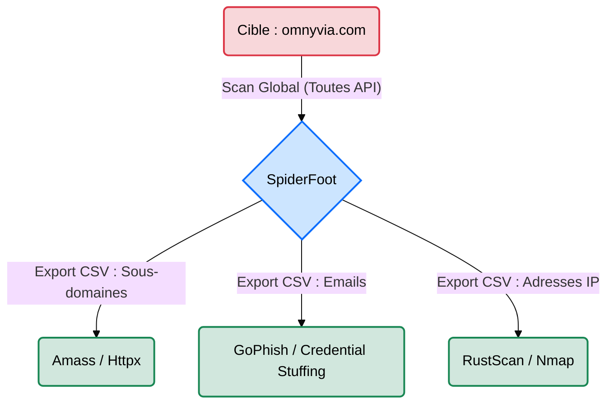

# SpiderFoot — L'Araignée du Renseignement

<div
  class="omny-meta"
  data-level="🟢 Débutant & 🟡 Intermédiaire"
  data-version="4.x"
  data-time="~1 heure">
</div>

<div style="text-align: center; margin: 0 auto;">
    
</div>

## Introduction

!!! quote "Analogie pédagogique — L'Araignée Géante"
    Faire de l'OSINT manuellement, c'est comme chercher un visage dans une foule avec une longue-vue. **SpiderFoot** est une araignée géante qui tisse une toile sur l'ensemble de la ville. Vous lui donnez une simple goutte de sang (un nom de domaine, une IP, un email), et l'araignée active instantanément plus de 200 capteurs (modules). Si le nom de domaine apparaît dans un registre en Asie, dans un leak de mot de passe en Russie ou sur un compte Twitter abandonné, l'araignée le sent vibrer sur sa toile et vous ramène l'information.

**SpiderFoot** est une plateforme d'automatisation OSINT massive écrite en Python. Contrairement à des outils très spécialisés (comme Subfinder pour les sous-domaines), SpiderFoot a une vocation **généraliste**. Il moissonne tout : adresses IP, noms de domaine, adresses e-mail, numéros de téléphone, noms d'utilisateurs, adresses Bitcoin, et vulnérabilités connues, le tout centralisé dans une interface web ou exportable via la ligne de commande.

<br>

---

## Fonctionnement & Architecture

SpiderFoot repose sur une architecture modulaire. La "cible" d'origine déclenche des modules primaires, dont les résultats déclenchent des modules secondaires, créant un effet boule de neige.



<br>

---

## Cas d'usage & Complémentarité

SpiderFoot génère une quantité de données écrasante ("Information Overload"). Son résultat doit être méthodiquement exporté et traité par d'autres outils :



*   **Complémentarité Amass / Subfinder** ➔ SpiderFoot n'est pas aussi exhaustif qu'Amass sur le DNS. Cependant, il trouve des choses qu'Amass ignore (des vieux comptes AWS S3, des clés API Github). On fusionne généralement les résultats des trois outils.
*   **Rapport d'Exposition (Blue Team)** ➔ C'est un excellent outil pour faire un rapport "Vue de l'attaquant" à un DSI : "Voici tout ce qui traîne sur Internet concernant votre entreprise sans même avoir touché vos serveurs".

<br>

---

## Les Modules et Modes (CLI)

Bien que très connu pour son interface Web, SpiderFoot s'utilise aussi en ligne de commande (CLI) avec les options suivantes :

| Option | Fonction | Description approfondie |
| :--- | :--- | :--- |
| `-s` | **Cible (Seed)** | La cible de départ (IP, Domaine, Email, ou sous-réseau). |
| `-m` | **Modules** | Limite le scan à certains modules (ex: `-m sfp_dns,sfp_whois`). Indispensable pour accélérer l'outil. |
| `-q` | **Quiet** | Réduit l'affichage dans le terminal, pratique pour ne pas être spammé de logs. |
| `-x` | **STIX/JSON Export** | Exporte les résultats pour les intégrer dans un outil de gestion d'incidents (MISP) ou d'analyse. |
| `-u` | **Interface Web** | Lance SpiderFoot sous forme d'application web sur un port local (ex: `-u 127.0.0.1:5001`). |

<br>

---

## Installation & Configuration

!!! quote "Les Clés API, l'essence du moteur"
    Comme pour theHarvester, l'installation de base de SpiderFoot n'interrogera que des sources libres (souvent lentes et limitées). Pour libérer la puissance de l'outil, vous devez obtenir des dizaines de clés API gratuites (Shodan, Hunter, AlienVault, SecurityTrails) et les configurer dans l'interface.

### 1. Installation

```bash title="Installation de SpiderFoot"
# Installation via Github
git clone https://github.com/smicallef/spiderfoot.git
cd spiderfoot
pip3 install -r requirements.txt
```

### 2. Configuration (Interface Web)

Lancez l'interface web locale pour configurer vos clés confortablement.

```bash title="Démarrage de l'Interface"
# Lance le serveur web sur le port 5001
python3 sf.py -l 127.0.0.1:5001
```

1. Ouvrez `http://127.0.0.1:5001` dans votre navigateur.
2. Allez dans l'onglet **Settings**.
3. Renseignez toutes les clés API que vous possédez. Ces réglages seront sauvegardés de manière persistante pour toutes vos futures enquêtes (même en CLI).

<br>

---

## Le Workflow Idéal (Le Standard OSINT)

Voici le pipeline classique d'une utilisation "Red Team" de SpiderFoot :

1. **Setup** : On s'assure que le serveur SpiderFoot est configuré avec un maximum de clés API (Settings).
2. **Scan Ciblé (Interface Web)** : On crée un "New Scan" en ciblant `omnyvia.com`. On décoche le bouton "All Modules" pour ne sélectionner que le profil "Passive" (pour l'OpSec) et "Investigate".
3. **Analyse de la Toile** : On laisse tourner (cela peut prendre des heures). On explore les résultats visuellement dans l'onglet "Browse".
4. **Extraction** : On sélectionne les onglets intéressants (ex: "Email Address" ou "Internet Name") et on les exporte en CSV pour la suite du test d'intrusion.

<br>

---

## Usage Opérationnel

### 1. Scan Passif via l'Interface Web (Recommandé)

C'est la méthode la plus simple pour gérer l'avalanche de données.

1. Lancez le serveur local : `python3 sf.py -l 127.0.0.1:5001`.
2. Cliquez sur **New Scan**.
3. Entrez la cible (ex: `tesla.com`).
4. **Très important :** Dans l'onglet *By Module*, choisissez avec soin ce que vous cherchez (ex: décochez les scans de ports si vous voulez rester invisible).

### 2. Scan CLI Ciblé (En Ligne de Commande)

Pour intégrer SpiderFoot à vos scripts d'automatisation.

```bash title="Commande SpiderFoot - Scan Spécifique"
# sf.py : Le script principal.
# -m    : Spécifie uniquement deux modules (Recherche de sous-domaines et vérification des fuites).
# -s    : La cible.
python3 sf.py -m sfp_whois,sfp_haveibeenpwned -s "admin@omnyvia.com" -q
```
_Cette approche CLI empêche l'outil de s'égarer pendant 4 heures sur des modules inutiles et donne un résultat ciblé._

### 3. Scan Total sans Interface (Export)

Lancement d'un scan complet en tâche de fond.

```bash title="Commande SpiderFoot - Export JSON"
# Lance tous les modules disponibles et exporte au format JSON
python3 sf.py -s omnyvia.com -x json -q > spiderfoot_report.json
```

<br>

---

## Bonnes & Mauvaises Pratiques (Do's & Don'ts)

| Action | Recommandation | Explication opérationnelle |
|---|---|---|
| ✅ **À FAIRE** | **Filtrer par module (CLI)** | SpiderFoot possède plus de 200 modules. Si vous lancez tout sur une grosse cible, le scan prendra des jours et vous serez inondé de faux positifs. |
| ✅ **À FAIRE** | **Renseigner les clés API dans l'UI** | Prenez une heure pour créer des comptes gratuits sur les services OSINT listés dans les *Settings* de l'outil. C'est le jour et la nuit. |
| ❌ **À NE PAS FAIRE** | **Cocher "Active Modules" sans mandat** | Certains modules de SpiderFoot font des requêtes HTTP agressives, des transferts de zone DNS ou du scan de port réseau. Cela déclenche le SOC. |
| ❌ **À NE PAS FAIRE** | **Exposer l'interface sur `0.0.0.0`** | Si vous lancez l'interface web sur `0.0.0.0:5001` depuis un VPS distant non protégé, n'importe qui sur Internet pourra voir vos enquêtes en cours et lire vos clés API ! |

<br>

---

## Avertissement Légal & Éthique

!!! danger "Cadre Pénal — Le Système de Traitement Automatisé de Données (STAD[^1])"
    SpiderFoot intègre nativement une stricte distinction entre les modules **Passifs** (qui interrogent des API tierces) et les modules **Actifs** (qui interagissent directement avec la cible).

    - **L'utilisation des modules passifs est légale** (OSINT[^2]), car il s'agit de la consultation de données publiques.
    - **L'utilisation des modules actifs** (fuzzing HTTP, scan de ports, requêtes DNS agressives) sans l'autorisation du propriétaire de la cible tombe sous le coup de l'**Article 323-1 du Code pénal** français.

    *Peine encourue pour accès frauduleux à un STAD : 3 ans d'emprisonnement et 100 000 € d'amende.*
    *Avant de cliquer sur "Run Scan", vérifiez toujours que les modules "Actifs" sont bien désactivés si vous n'avez pas de mandat de Red Team.*

