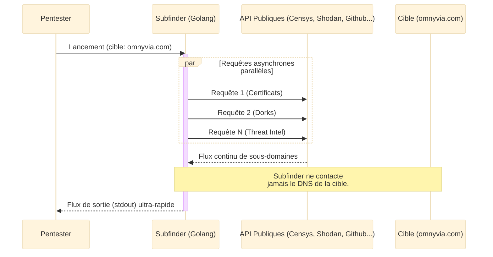
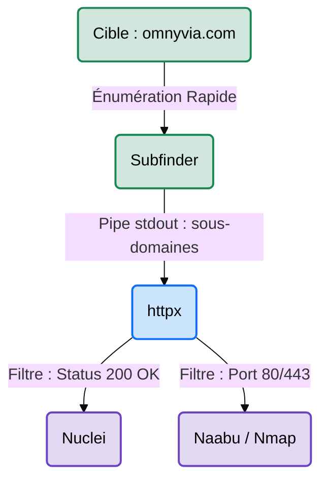

# subfinder — Le Sprinteur de l'OSINT

<div
  class="omny-meta"
  data-level="🟢 Débutant"
  data-version="2.x"
  data-time="~15 minutes">
</div>

<div style="text-align: center; margin: 0 auto;">
    
</div>


## Introduction

!!! quote "Analogie pédagogique — L'Annuaire Universel Instantané"
    Imaginez que vous cherchiez la liste de toutes les succursales d'une grande banque mondiale. Vous pourriez demander à la mairie, regarder les registres du commerce, ou fouiller les annuaires téléphoniques de 50 pays, ce qui prendrait des mois (Amass). **subfinder** est un robot sprinter qui pose la question simultanément à toutes ces bases de données rapides (Google, Shodan, VirusTotal, etc.) et compile la liste complète des succursales (sous-domaines) en une fraction de seconde, sans jamais mettre les pieds dans la banque.

Développé par **ProjectDiscovery**, **subfinder** est un outil de découverte de sous-domaines conçu spécifiquement pour la vitesse et la modularité. Contrairement à des outils massifs comme Amass, il se concentre presque exclusivement sur la **reconnaissance passive** et est optimisé pour s'insérer parfaitement dans des chaînes d'automatisation (Pipelines CI/CD UNIX ou scripts Red Team).

<br>

---

## Fonctionnement & Architecture

La vitesse de subfinder repose sur son moteur asynchrone (écrit en Go), qui lance toutes les requêtes API en parallèle.



<br>

---

## Cas d'usage & Complémentarité

Subfinder est conçu selon la philosophie UNIX ("Faire une seule chose, mais la faire bien"). Son but est de fournir une liste brute de domaines, prête à être passée (via des "pipes" `|`) à d'autres outils :



*   **Validation HTTP** ➔ Le flux de sortie est généralement injecté directement dans **httpx** pour vérifier si les sous-domaines hébergent un service web réellement accessible.
*   **Scan de Vulnérabilités** ➔ Utilisé comme première étape du pipeline de chasse de bug le plus connu au monde : `subfinder | httpx | nuclei`.

<br>

---

## Les Options Principales

La maîtrise de subfinder passe par ses options de performance et de filtrage :

| Option | Fonction | Description approfondie |
| :--- | :--- | :--- |
| `-d` | **Domaine (Domain)** | Définit le domaine principal à cibler (ex: `tesla.com`). |
| `-silent` | **Mode Silencieux** | N'affiche que les sous-domaines trouvés (masque la bannière et les logs). Indispensable pour enchaîner les commandes (Piping). |
| `-all` | **Toutes les sources** | Utilise absolument toutes les sources configurées, même celles qui sont réputées très lentes. |
| `-t` | **Threads** | Augmente le nombre de processus parallèles (par défaut 10). Accélère l'outil mais augmente le risque de blocage API. |
| `-o` | **Sortie (Output)** | Exporte les résultats dans un fichier texte pour archivage. |

<br>

---

## Installation & Configuration

!!! quote "ProjectDiscovery et Go"
    Les outils ProjectDiscovery sont tous codés en Go (Golang) pour une performance maximale. Il est fortement recommandé d'utiliser l'utilitaire `pdtm` de l'éditeur ou de les installer via Go.

### 1. Installation

```bash title="Installation de Subfinder"
# Option A : Via Go (Nécessite d'avoir Golang installé)
go install -v github.com/projectdiscovery/subfinder/v2/cmd/subfinder@latest

# Option B : Via APT (Sur Kali Linux)
sudo apt update && sudo apt install subfinder
```

### 2. Configuration des clés API

Subfinder fonctionnera très bien sans clés API (contrairement à Amass), mais pour des résultats optimaux, vous devez configurer `provider-config.yaml`.

```yaml title="~/.config/subfinder/provider-config.yaml"
# Éditez ce fichier pour ajouter vos clés.
shodan:
  - VOTRE_CLE_SHODAN
censys:
  - VOTRE_CLE_CENSYS:VOTRE_SECRET_CENSYS
virustotal:
  - VOTRE_CLE_VIRUSTOTAL
```

<br>

---

## Le Workflow Idéal (Le Standard Bug Bounty)

Subfinder est conçu pour la vitesse. Voici comment les Bug Hunters l'utilisent :

1. **Lancement Express** : Face à une nouvelle cible, on lance immédiatement `subfinder -d cible.com` sans aucune option pour avoir une idée de la taille de la cible en 3 secondes.
2. **Création du Pipeline** : On automatise ensuite le processus avec un script bash (Cron) qui lance `subfinder -silent | httpx` tous les matins pour détecter les nouveaux domaines déployés la veille.
3. **Scan Profond (Mensuel)** : Une fois par mois, on lance `subfinder -all` pour interroger même les API lentes et vérifier qu'on n'a rien raté.

<br>

---

## Usage Opérationnel

### 1. L'énumération de base

L'approche standard pour tester rapidement un domaine.

```bash title="Commande Subfinder - Scan Rapide"
# -d tesla.com : Cible le domaine tesla.com
# -v           : Affiche le détail des sources ayant fourni les résultats (Verbose)
subfinder -d tesla.com -v
```
_Cette commande fournit une vue immédiate de la surface d'attaque externe en quelques secondes, idéale pour un repérage rapide en début de mission._

### 2. Le mode "Piping" (La force de ProjectDiscovery)

C'est l'usage métier par excellence. On retire le bruit visuel pour enchaîner les actions.

```bash title="Commande Subfinder - Le Pipeline Recon"
# -silent : Supprime le logo et les infos de debug pour ne sortir que les URLs propres.
# | httpx : Envoie chaque domaine trouvé vers l'outil httpx pour validation web.
subfinder -d microsoft.com -silent | httpx -title -status-code
```
_Cette méthode permet d'obtenir immédiatement non seulement les sous-domaines, mais aussi de savoir lesquels sont allumés et ce qu'ils affichent, sans créer le moindre fichier temporaire._

### 3. Moisson Exhaustive (Scan Profond)

Pour un audit complet où le temps n'est pas un problème.

```bash title="Commande Subfinder - Scan All Sources"
# -all             : Active même les sources réputées lentes.
# -o resultats.txt : Enregistre le flux dans un fichier de preuves.
subfinder -d omnyvia.com -all -o resultats.txt
```

<br>

---

## Bonnes & Mauvaises Pratiques (Do's & Don'ts)

| Action | Recommandation | Explication opérationnelle |
|---|---|---|
| ✅ **À FAIRE** | **Utiliser `-silent` dans vos scripts** | Si vous ne mettez pas `-silent`, la bannière ASCII de Subfinder va polluer votre fichier texte ou l'outil suivant dans votre pipe (`|`). |
| ✅ **À FAIRE** | **Combiner avec `dnsx`** | Le tandem `subfinder | dnsx` est imbattable pour valider que les sous-domaines existent encore sur les serveurs DNS de la cible. |
| ❌ **À NE PAS FAIRE** | **Augmenter aveuglément les Threads (`-t 100`)** | Si vous bombardez les API gratuites (comme VirusTotal ou AlienVault) avec trop de requêtes simultanées, vous serez temporairement banni de ces services (Rate Limiting). |

<br>

---

## Avertissement Légal & Éthique

!!! danger "Cadre Pénal — Le Système de Traitement Automatisé de Données (STAD[^1])"
    L'utilisation de **subfinder** est fondamentalement de la reconnaissance passive (OSINT[^2]). Vous n'interrogez pas l'infrastructure de la cible, vous interrogez des moteurs de recherche et des bases de certificats. **Cette étape seule est 100% légale**.

    Néanmoins, si vous utilisez la liste générée par subfinder pour lancer des attaques (fuzzing, exploitation, port scanning) sur ces sous-domaines, vous tombez sous l'**Article 323-1 du Code pénal** (Accès frauduleux à un STAD).
    
    - **Peine encourue** : 3 ans d'emprisonnement et 100 000 € d'amende (pouvant aller jusqu'à 7 ans et 300 000 € si les serveurs appartiennent à l'État ou à une entité d'importance vitale).

