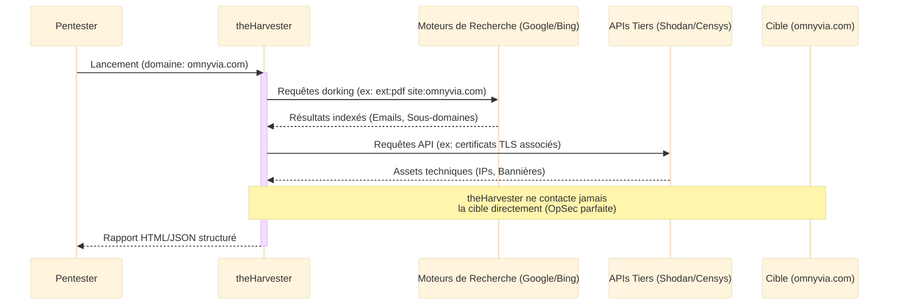
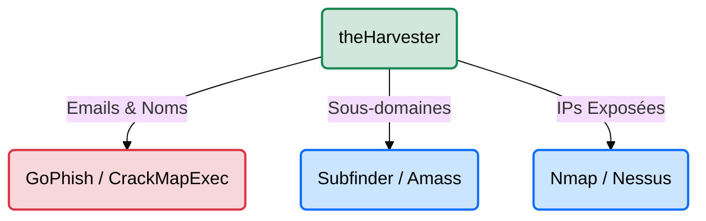

# theHarvester — Collecte OSINT Multi-Sources

<div
  class="omny-meta"
  data-level="🟢 Débutant & 🟡 Intermédiaire"
  data-version="4.x"
  data-time="~30-45 minutes">
</div>

<div style="text-align: center; margin: 0 auto;">
    
</div>

## Introduction

!!! quote "Analogie pédagogique — Le Détective Privé Centralisé"
    **theHarvester** agit exactement comme un enquêteur privé qui, au lieu d'aller fouiller directement dans les poubelles de la cible (ce qui déclencherait des alarmes), s'assoit à son bureau et téléphone simultanément aux archives publiques, aux registres du commerce et aux moteurs de recherche. Il pose la même question à tous ses contacts : *"Que savez-vous sur l'entreprise X ?"*. Il compile ensuite les réponses pour dresser un portrait complet (employés, serveurs, adresses) sans que la cible ne se doute de quoi que ce soit.

**theHarvester** est un framework de reconnaissance passive extrêmement robuste écrit en Python. Son objectif principal est d'agréger des données dispersées sur le web (Open Source Intelligence) en interrogeant des dizaines d'API et de moteurs de recherche (Google, Bing, LinkedIn, Shodan, VirusTotal, etc.) pour cartographier la surface d'attaque externe d'une organisation.

<br>

---

## Fonctionnement & Architecture

La puissance de theHarvester réside dans son architecture de collecte. Plutôt que de scanner la cible (approche active), il moissonne les informations déjà collectées par des tiers.



<br>

---

## Cas d'usage & Complémentarité

theHarvester n'est que la première brique d'une chaîne d'attaque. Voici comment les données qu'il récolte sont immédiatement redirigées vers d'autres outils spécialisés :



*   **Pivots Techniques** ➔ Les domaines bruts trouvés nécessitent souvent d'être approfondis. theHarvester donne une bonne idée initiale, mais Amass ou Subfinder seront nécessaires pour une énumération DNS exhaustive.
*   **Pivots Humains** ➔ La liste des noms d'employés trouvée sur LinkedIn ou dans les PDF sert immédiatement à créer un dictionnaire (`prenom.nom@cible.com`) pour du *Password Spraying* sur les portails VPN de l'entreprise.

<br>

---

## Les Options Principales

La maîtrise de l'outil passe par la compréhension de ses arguments de ligne de commande :

| Option | Fonction | Description approfondie |
| :--- | :--- | :--- |
| `-d` | **Domaine (Domain)** | Définit la cible principale de la recherche (ex: `tesla.com`). |
| `-b` | **Source (Source)** | Indique où chercher (`google`, `linkedin`, `shodan`...). Utilisez `all` pour interroger toutes les sources disponibles. |
| `-l` | **Limite (Limit)** | Limite le nombre de résultats retournés. Pratique pour éviter les blocages API (Captcha) par les moteurs de recherche (ex: `500`). |
| `-f` | **Fichier (File)** | Exporte les résultats bruts dans un format exploitable (HTML et XML) pour le reporting. |
| `-p` | **Ports (Proxies)** | Effectue un scan de port minimal sur les hosts trouvés. (⚠️ *Rend l'outil "Actif", casse l'OpSec*). |

<br>

---

## Installation & Configuration

!!! quote "Gérer les dépendances Python"
    theHarvester est un script Python qui nécessite beaucoup de modules. L'installation via Docker est souvent le moyen le plus propre de l'utiliser sans "salir" votre système hôte. De plus, sans fichier de configuration pour les clés API, theHarvester sera aveugle sur la majorité des sources professionnelles.

### 1. Installation

```bash title="Installation de theHarvester"
# Option A : Docker (Recommandé, évite les soucis de dépendances Python)
docker pull m_m_r/theharvester

# Option B : Git & Python (Méthode classique)
git clone https://github.com/laramies/theHarvester.git
cd theHarvester
pip3 install -r requirements/base.txt
```

### 2. Configuration des API Keys

De nombreuses sources (Shodan, Hunter.io, Github) nécessitent des clés API pour fonctionner. Sans elles, theHarvester se contentera de gratter (scraper) Google et Bing, ce qui limitera drastiquement vos résultats.

```yaml title="/etc/theHarvester/api-keys.yaml"
# Éditez ce fichier pour maximiser les résultats
apikeys:
  shodan: "VOTRE_CLE_SHODAN_ICI"
  hunter: "VOTRE_CLE_HUNTER_ICI"
  github: "VOTRE_CLE_GITHUB_ICI"
  virustotal: "VOTRE_CLE_VIRUSTOTAL_ICI"
```

<br>

---

## Le Workflow Idéal (Le Standard Red Team)

Voici le processus métier optimal lorsqu'on lance theHarvester :

1. **Test Initial (Rapide)** : Lancement sur les moteurs de recherche gratuits (Google/Bing) pour vérifier que l'outil est bien installé et que le domaine répond.
2. **Moisson Profonde (All Sources)** : Lancement avec l'option `-b all` en utilisant le fichier YAML configuré avec toutes les clés API. Génération d'un fichier HTML de preuves.
3. **Extraction & Tri** : Séparation des "Humains" (Emails pour le Phishing) et des "Machines" (Sous-domaines pour Nmap).
4. **Enrichissement** : Les données techniques partent vers *Amass/Httpx*, les données humaines partent vers *GoPhish*.

<br>

---

## Usage Opérationnel

### 1. Collecte standard (Moteurs de recherche)

L'usage le plus courant pour identifier rapidement les emails exposés.

```bash title="Commande theHarvester - Collecte Standard"
# -d omnyvia.com : Spécifie le domaine cible de l'audit.
# -l 500         : Limite l'analyse aux 500 premiers résultats pour éviter les Captchas.
# -b google      : Restreint la collecte uniquement au moteur de recherche Google.
theHarvester -d omnyvia.com -l 500 -b google
```
_Cette commande effectue une reconnaissance ciblée, rapide et totalement passive, parfaite pour un premier repérage des fuites d'informations simples._

### 2. Le Scan Multi-Sources avec Exportation

C'est la commande de production d'un pentester : interroger l'intégralité du web et conserver les preuves.

```bash title="Commande theHarvester - Moisson Globale et Export"
# -b all                : Interroge TOUTES les sources (Bing, Yahoo, ThreatMiner, APIs configurées, etc.).
# -f Rapport_Cible.html : Génère un rapport structuré pour le livrable client.
theHarvester -d microsoft.com -l 500 -b all -f Rapport_Cible.html
```
_L'utilisation de `-b all` croise d'énormes volumes de données, permettant de découvrir des actifs oubliés (Shadow IT) que l'entreprise cible ne gère potentiellement plus._

### 3. Focus sur les Cibles Humaines (Social Engineering)

Extraction spécifique pour la création de dictionnaires d'utilisateurs.

```bash title="Commande theHarvester - Extraction LinkedIn"
# -b linkedin : Cible exclusivement le réseau social professionnel.
theHarvester -d tesla.com -b linkedin
```
_Fournit une liste de prénoms, noms et intitulés de postes, indispensable pour créer des dictionnaires d'utilisateurs (`prenom.nom@tesla.com`) lors de tests d'intrusion Active Directory._

<br>

---

## Bonnes & Mauvaises Pratiques (Do's & Don'ts)

| Action | Recommandation | Explication opérationnelle |
|---|---|---|
| ✅ **À FAIRE** | **Configurer les clés API** | Sans clés pour *Hunter.io* ou *Intelx*, vous passerez à côté de 80% des fuites d'emails de l'entreprise. |
| ✅ **À FAIRE** | **Sauvegarder en HTML/XML (`-f`)** | Les rapports theHarvester sont clairs et font d'excellents livrables pour vos clients. Conservez-les. |
| ❌ **À NE PAS FAIRE** | **Utiliser `-p` (Port Scan) en mode Passif** | Si vous êtes censé faire de l'OSINT invisible (OpSec), utiliser `-p` contactera directement la cible et déclenchera les alarmes du SOC. |
| ❌ **À NE PAS FAIRE** | **Lancer des milliers de requêtes Google** | Si vous ne mettez pas de limite (`-l`), Google bannira temporairement votre adresse IP (Captcha). Utilisez des proxys si nécessaire. |

<br>

---

## Avertissement Légal & Éthique

!!! danger "Cadre Pénal — Le Système de Traitement Automatisé de Données (STAD[^1])"
    Même si **theHarvester** effectue principalement de la collecte passive (OSINT[^2]) à partir de sources publiques (ce qui est légal en soi), l'utilisation des données récoltées pour **compromettre, scanner ou attaquer** la cible tombe immédiatement sous le coup de la loi française.

    L'**Article 323-1 du Code pénal** réprime l'accès ou le maintien frauduleux dans un **STAD** :

    - **Peine de base** : 3 ans d'emprisonnement et 100 000 € d'amende.
    - **Circonstances aggravantes** (altération ou suppression de données) : 5 ans d'emprisonnement et 150 000 € d'amende.
    - **Cible étatique** (STAD mis en œuvre par l'État) : 7 ans d'emprisonnement et 300 000 € d'amende.

    De plus, scrapper des données personnelles (ex: emails d'employés) à des fins commerciales sans consentement constitue une violation du **RGPD**, passible de sanctions par la CNIL.

<br>

---

## Conclusion

!!! quote "Ce qu'il faut retenir"
    theHarvester est un outil indispensable de l'arsenal Red Team car il pose les fondations de l'attaque. L'adage *"On ne peut pirater que ce que l'on connaît"* prend tout son sens ici : en 5 minutes, theHarvester dévoile l'empreinte numérique d'une cible, révélant ses sous-domaines oubliés et ses adresses de messagerie, transformant le web public en votre principal informateur.

> Une fois la moisson initiale terminée, il est crucial d'affiner l'énumération de l'infrastructure technique avec des outils spécialisés comme **[Amass →](./amass.md)**.

<br>

[^1]: **Système de Traitement Automatisé de Données (STAD)** : Désigne tout ensemble organisé de moyens (matériels et logiciels) permettant de collecter, enregistrer, stocker, modifier, manipuler, envoyer, visualiser ou détruire des données. Dans le contexte pénal, cela inclut les serveurs d'entreprises, les bases de données clients, les boîtes mail professionnelles, etc.

[^2]: **Open Source Intelligence (OSINT)** : Méthode de collecte d'informations provenant uniquement de sources publiquement accessibles (internet, réseaux sociaux, bases de données ouvertes, publications, etc.). Contrairement au piratage actif, l'OSINT est purement passif et légal, car il ne nécessite aucune intrusion technique chez la cible.


