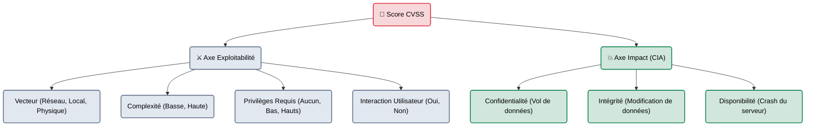

# CVSS — Le Score de la Menace

    

## Introduction

!!! quote "Analogie pédagogique — L'Échelle de Richter"
    Si un sismologue vous appelle pour vous dire "Il y a eu un tremblement de terre", votre première question sera : "Un petit tremblement qui fait vibrer les tasses à café, ou un grand tremblement qui détruit la ville ?".
    En cybersécurité, on utilise le score **CVSS**. Quand on découvre une faille, on ne dit pas "C'est une faille grave". On dit "C'est une faille CVSS 9.8". C'est un langage universel que le monde entier (Hackers, Défenseurs, Assureurs) comprend instantanément.

Le **Common Vulnerability Scoring System (CVSS)** est un cadre gratuit et ouvert maintenu par le FIRST (Forum of Incident Response and Security Teams).
Il permet de noter une vulnérabilité sur une échelle de **0.0 à 10.0**. 

Cette note ne se décide pas "au feeling". Elle est mathématiquement calculée en répondant à un questionnaire précis concernant les caractéristiques techniques de la faille.

 

---

## Le Calcul du Score de Base (Base Metrics)

Le score CVSS classique (Base Score) est calculé sur deux grands axes :
1. **Exploitability** (Est-ce facile de pirater la faille ?)
2. **Impact** (Que se passe-t-il si la faille est piratée ?)

### Le Code Chaîne (Vector String)
Lorsqu'un pentester donne un score CVSS, il doit toujours fournir la "formule" qui a généré ce score. C'est ce qu'on appelle la *Vector String*.
Exemple pour la fameuse faille Log4Shell (CVSS 10.0) :
`CVSS:3.1/AV:N/AC:L/PR:N/UI:N/S:C/C:H/I:H/A:H`
*(Traduction : Attack Vector: Network, Attack Complexity: Low, Privileges Required: None, User Interaction: None... Impact: High partout).*

 

---

## Les Catégories de Sévérité

Le score chiffré est traduit en un mot (Criticité) pour simplifier la communication avec le management (qui va allouer le budget de réparation en fonction de ce mot).

| Score CVSS | Criticité (Severity) | Délai de correction standard (SLA) | Exemple d'Attaque |
| :---: | :---: | :--- | :--- |
| **0.0** | **INFO** | N/A | Découverte d'un numéro de version logiciel non vulnérable. |
| **0.1 - 3.9** | **LOW (Basse)** | ~90 jours | Un message d'erreur affiche le chemin interne d'un dossier. |
| **4.0 - 6.9** | **MEDIUM (Moyenne)** | ~30 jours | Cross-Site Scripting (XSS) nécessitant qu'un utilisateur clique sur un lien. |
| **7.0 - 8.9** | **HIGH (Haute)** | ~7 jours | Vol de la base de données client complète (Injection SQL). |
| **9.0 - 10.0** | **CRITICAL (Critique)** | **Moins de 24 Heures** | Prise de contrôle total du serveur à distance, sans aucun mot de passe (RCE). |

 

---

## Bonnes & Mauvaises Pratiques (Do's & Don'ts)

| Action | Recommandation | Explication technique |
|---|---|---|
| ✅ **À FAIRE** | **Utiliser le Calculateur Officiel** | Ne calculez jamais un CVSS de tête. Utilisez la page web de la calculatrice officielle (NVD / FIRST) pour cliquer sur les options (Low, High, None) et obtenir le score exact et le Vector String. Intégrez toujours ce Vector String dans votre rapport. |
| ❌ **À NE PAS FAIRE** | **Gonfler artificiellement les scores** | Le pire défaut d'un pentester junior est de vouloir prouver sa valeur en notant toutes ses découvertes "High" ou "Critical". Si vous notez une petite faille XSS à 9.5 (Critique), l'équipe réseau va être réveillée à 3h du matin pour la corriger, et le RSSI perdra instantanément confiance en votre professionnalisme. Soyez objectif. |

 

---

## Conclusion

!!! quote "Ce qu'il faut retenir"
    Le CVSS n'est pas parfait, mais c'est le seul langage commun dont dispose l'industrie. Lors d'un test d'intrusion, votre crédibilité en tant qu'expert dépend fortement de votre capacité à attribuer le bon score à vos vulnérabilités. Ne cherchez pas à sur-vendre le danger. Laissez la formule mathématique du CVSS parler pour vous.

> Vous savez maintenant comment structurer un rapport, documenter une faille (PoC) et la noter (CVSS). Mais rédiger un rapport Word de 80 pages à la main est fastidieux, surtout quand on travaille en équipe à plusieurs pentesters. Il est temps de découvrir les environnements de collaboration dédiés à l'écriture de rapports de sécurité : **[Dradis Framework →](./dradis.md)**.
