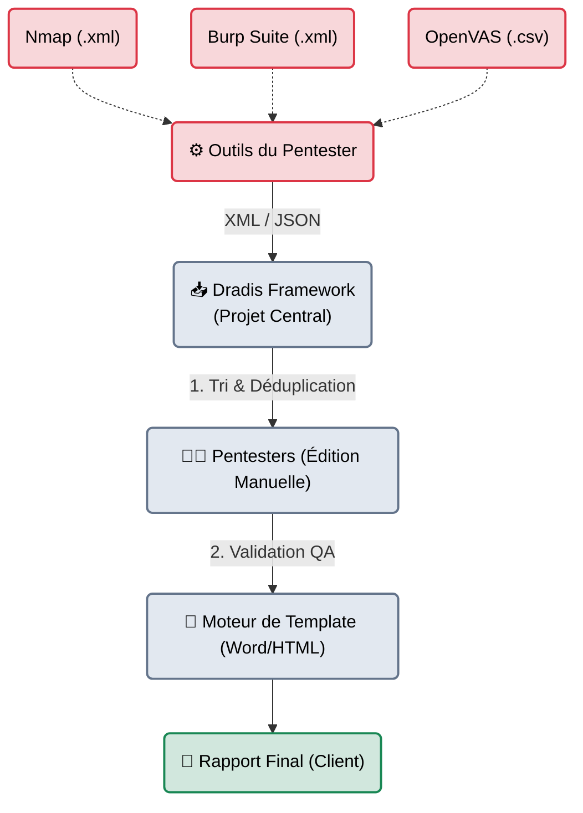

# Dradis Framework — Le Compilateur d'Équipe

    

## Introduction

!!! quote "Analogie pédagogique — Le Secrétariat Central"
    Imaginez une équipe de 3 testeurs d'intrusion. L'un scanne avec Nmap, le deuxième audite le site Web avec Burp Suite, le troisième passe Nessus sur l'infrastructure.
    À la fin de la semaine, il faut regrouper tout ça. Si chacun copie-colle ses résultats dans un document Word partagé, le fichier va exploser, la mise en page sera détruite, et des failles en double apparaîtront.
    **Dradis** est un secrétariat central. Chaque attaquant envoie ses données (XML, CSV) à Dradis, qui trie, dé-duplique, uniformise, et clique sur un bouton pour générer un document final parfait.

Dradis Framework (disponible en version Community Edition gratuite, et Pro payante) est un classique historique de l'industrie. C'est un serveur web (généralement hébergé en interne sur un serveur de l'équipe de Red Team) qui permet aux pentesters de travailler ensemble sur la même mission. Son point fort absolu est sa capacité à ingérer les formats de fichiers bruts générés par les 40 plus grands outils de hacking mondiaux.

 

---

## Architecture & Mécanismes Internes

### Le Pipeline d'Ingestion et de Génération
L'idée centrale de Dradis est de séparer totalement l'Acquisition (Scanner), de la Rédaction (Vulnérabilité), et de la Mise en Page (Livrable).

 

---

## Intégration dans la Kill Chain

| Phase Précédente | Dradis Framework | Phase Suivante |
| :--- | :--- | :--- |
| **Exploitation & Preuves**   (*Toutes les phases précédentes*)   Les attaques sont terminées, les logs bruts (Nmap, Burp) sont sauvegardés. | ➔ **Ingestion & Rédaction** ➔   On upload tous les XML dans Dradis, qui crée automatiquement les "Nodes" (IP) et les failles associées. | **Génération du Livrable**   (*Word / PDF*)   Exportation du rapport final en un clic, formaté selon la charte graphique de votre entreprise. |

 

---

## Fonctionnalités Principales (Workflow)

### 1. Ingestion de Plugins (Les Parsers)
Dans un projet Dradis, vous naviguez vers l'onglet "Upload output from tool". Vous donnez votre fichier `nmap_scan.xml`. Dradis va automatiquement créer une arborescence (Un nœud par IP trouvée, et un sous-nœud par port ouvert). Cela crée le plan de votre réseau ciblé sans taper une ligne de texte.

### 2. Le Issue Tracker (Bibliothèque de Vulnérabilités)
Pourquoi réécrire la description de la faille "Absence d'en-tête HSTS" pour la 100ème fois ? Dradis embarque une base de données de failles. Quand vous ajoutez une vulnérabilité à une IP, vous piochez dans votre bibliothèque interne. Le texte, la recommandation et le score CVSS sont auto-complétés.

### 3. Les Modèles (Report Templates)
Dradis utilise des documents Word (`.docx`) avec des macros (Variables) spéciales.
Vous rédigez votre Word avec votre logo, vos couleurs, et là où vous voulez voir la liste des failles, vous insérez un code comme `[Issue.Title]`. Dradis lira ce document, injectera les données de la base, et recrachera un document propre.

 

---

## Bonnes & Mauvaises Pratiques (Do's & Don'ts)

| Action | Recommandation | Explication technique |
|---|---|---|
| ✅ **À FAIRE** | **Utiliser le langage Markdown** | Dans Dradis, toutes les notes et descriptions s'écrivent en Markdown (le même langage que cette documentation !). Cela permet d'inclure facilement des blocs de code pour vos requêtes HTTP ou des tableaux pour afficher les mots de passe compromis, qui seront parfaitement transcrits vers Word. |
| ❌ **À NE PAS FAIRE** | **Laisser la base de données par défaut** | La version gratuite de Dradis (CE) arrive avec très peu de vulnérabilités pré-écrites. Le premier travail d'une équipe de pentest est de passer plusieurs jours à rédiger sa propre bibliothèque de failles (Les fameux *Issues*), afin de capitaliser sur l'expérience et ne plus jamais perdre de temps lors des prochaines missions. |

 

---

## Conclusion

!!! quote "Ce qu'il faut retenir"
    Dradis est le patriarche des outils de gestion de tests d'intrusion. Bien que son interface (Ruby on Rails) puisse paraître vieillissante par rapport aux standards actuels, sa robustesse, sa capacité à ingérer tous les formats du marché et son intégration MS Word en ont fait un standard dans de nombreux cabinets d'audit.

> Néanmoins, la lenteur et la complexité de configuration des templates Word de Dradis ont frustré beaucoup de professionnels. C'est pourquoi une nouvelle génération d'outils de reporting, plus fluides, plus beaux et basés sur des technologies modernes, a récemment vu le jour. Le leader incontesté de cette nouvelle vague est **[SysReptor →](./sysrepor.md)**.

 

---

## Conclusion

!!! quote "Ce qu'il faut retenir"
    La maîtrise théorique et pratique de ces concepts est indispensable pour consolider votre posture de cybersécurité. L'évolution constante des menaces exige une veille technique régulière et une remise en question permanente des acquis.

> [Retour à l'index →](./index.md)
