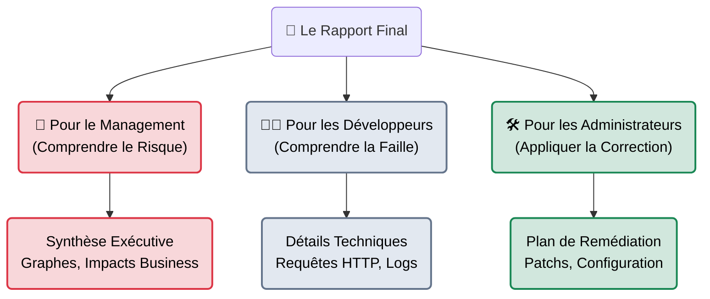

# Reporting & Livrables — La Valeur du Pentest

## Introduction

!!! quote "Analogie pédagogique — Le Diagnostic Médical"
    Un pentester qui trouve une faille critique mais rédige un mauvais rapport, c'est comme un chirurgien brillant qui opère un patient mais refuse d'écrire l'ordonnance post-opératoire.
    Le client ne paie pas pour que vous piratiez son entreprise. Le client paie pour **savoir comment vous avez fait** et **comment l'en empêcher à l'avenir**. Le livrable (Le Rapport) est l'unique produit fini de votre prestation.

La phase de Reporting (Rédaction du rapport) est de loin l'étape la plus redoutée par les auditeurs techniques (qui préfèrent souvent chercher des failles plutôt que d'écrire des documents Word). Pourtant, c'est la seule étape qui compte aux yeux du commanditaire (le Directeur Général ou le RSSI).

Un test d'intrusion exceptionnel techniquement sera considéré comme "médiocre" si le rapport est incompréhensible ou bâclé.

 

---

## Les 3 Objectifs du Rapport de Pentest

Le rapport final doit répondre simultanément à trois besoins contradictoires :

### 1. Comprendre le Risque (Aspect Business)
Le Directeur Général ne sait pas ce qu'est un *Buffer Overflow*. En revanche, il comprend "Possibilité de voler la base de données client à distance". Le rapport doit traduire la technique en risque métier.

### 2. Comprendre la Faille (Aspect Technique)
L'équipe informatique du client doit pouvoir reproduire l'attaque. Le rapport doit contenir toutes les étapes, les payloads utilisés et les captures d'écran prouvant l'exploitation.

### 3. Corriger la Faille (Aspect Remédiation)
Il ne suffit pas de dire "Votre serveur est vulnérable". Le rapport doit expliquer *comment* corriger la faille de manière réaliste (Mettre à jour la librairie, modifier une règle de pare-feu, ou échapper les caractères spéciaux dans le code source).

 

---

## Le Cycle de Vie d'une Vulnérabilité

Lors de la rédaction, chaque vulnérabilité découverte suit un cycle de traitement rigoureux :

1. **Identification** : Découverte lors de la phase de Scan ou d'Exploitation.
2. **Exploitation & Preuve (PoC)** : On documente la preuve que la faille est réelle (**[Gestion des Preuves →](./preuves.md)**).
3. **Évaluation (Scoring)** : On attribue une note de criticité objective basée sur un standard international (Souvent le **[Score CVSS →](./cvss.md)**).
4. **Rédaction** : On intègre la faille dans la **[Structure du Rapport →](./rapport-structure.md)**.
5. **Relecture (QA)** : Relecture par un pair (Quality Assurance) pour vérifier l'orthographe et la justesse technique.

 

---

## Bonnes & Mauvaises Pratiques (Do's & Don'ts)

| Action | Recommandation | Explication technique |
|---|---|---|
| ✅ **À FAIRE** | **Prendre des notes en continu** | N'attendez pas le dernier jour du pentest pour rédiger. Prenez des captures d'écran et notez vos commandes au fur et à mesure que vous progressez. Des outils de prise de notes collaboratifs sont vitaux. |
| ❌ **À NE PAS FAIRE** | **Copier-coller le rapport Nessus** | Rendre l'export PDF brut généré par un scanner de vulnérabilités (Nessus, OpenVAS) est une faute professionnelle grave. Les scanners génèrent des "Faux Positifs" et n'ont aucune idée du contexte métier de l'entreprise. Votre valeur ajoutée est l'analyse humaine. |

 

---

## Conclusion

!!! quote "Ce qu'il faut retenir"
    Un bon rapport de sécurité est un document hybride : c'est à la fois un audit technique de très haut niveau et un document de communication d'entreprise. Il doit être compréhensible par un membre du comité de direction (qui lira la synthèse de 2 pages) et par un développeur Senior (qui lira les 50 pages d'annexes techniques).

> Pour réussir ce grand écart rédactionnel, l'industrie a standardisé la présentation des livrables. Découvrons l'anatomie exacte d'un rapport professionnel : **[La Structure d'un Rapport →](./rapport-structure.md)**.