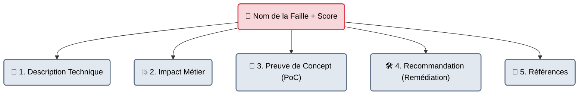

# Preuves & Reproductibilité — Le Constat d'Huissier

    

## Introduction

!!! quote "Analogie pédagogique — L'Enquêteur et le Juge"
    Si vous allez voir un juge en disant : "Cette personne a volé une voiture", le juge vous rira au nez. Si vous y allez avec la vidéo de surveillance, les empreintes digitales sur la portière et le relevé GPS, le juge vous croira.
    En cybersécurité, le "Juge", c'est le Développeur (ou l'Administrateur Système). Si vous lui dites juste "Le site est vulnérable aux XSS", il fermera votre ticket. Vous devez fournir le **PoC (Proof of Concept)**, c'est-à-dire le constat d'huissier irréfutable.

La "Partie 3" d'un rapport de pentest est constituée d'une suite de "Fiches de Vulnérabilités". Chaque faille découverte possède sa propre fiche.
L'objectif unique de cette fiche est la **Reproductibilité**. Un développeur qui lit votre fiche doit pouvoir relancer exactement la même attaque sur son propre ordinateur, constater la faille de ses propres yeux, la corriger, et relancer l'attaque pour prouver que sa correction fonctionne.

 

---

## L'Anatomie d'une Fiche de Vulnérabilité

Une fiche de faille professionnelle est toujours divisée en 5 sections invariables.

### 1. Le Titre et l'Emplacement (Où ça se passe)
Soyez extrêmement précis.
- ❌ Mauvais : `Faille SQL Injection`
- ✅ Bon : `[Critique] Injection SQL (Time-Based) sur le paramètre 'id_user' de la page /profil.php`

### 2. La Description & L'Impact (Pourquoi c'est grave)
- **Description** : Expliquer brièvement le mécanisme de la faille. (Ex: "Le paramètre n'est pas échappé avant d'être envoyé à la base de données PostgreSQL.")
- **Impact** : Traduire cela en risque. (Ex: "Un attaquant peut extraire l'intégralité des mots de passe de la base de données, ou effacer les données de production.")

### 3. La Preuve de Concept / PoC (Comment reproduire)
C'est le cœur de la fiche. C'est le tutoriel pas-à-pas.
1. Allez sur l'URL `https://site.com/profil.php?id=1`
2. Modifiez l'URL pour injecter la payload : `https://site.com/profil.php?id=1' OR 1=1--`
3. Constatez que vous êtes connecté en tant qu'Administrateur.
*(Insérez toujours une capture d'écran nette de l'étape 3, en floutant les données personnelles des vrais clients si nécessaire).*

### 4. La Recommandation (Comment réparer)
Il ne suffit pas de critiquer, il faut aider. Si vous connaissez le langage utilisé (ex: PHP), donnez la fonction exacte à utiliser.
- ❌ Mauvais : "Sécurisez vos requêtes SQL."
- ✅ Bon : "Utilisez des requêtes préparées (Prepared Statements) avec l'objet PDO en PHP : `$stmt = $pdo->prepare('SELECT * FROM users WHERE id = :id');`"

 

---

## Bonnes & Mauvaises Pratiques (Do's & Don'ts)

| Action | Recommandation | Explication technique |
|---|---|---|
| ✅ **À FAIRE** | **Fournir la requête HTTP brute** | Lors d'une attaque Web, une capture d'écran du navigateur ne suffit pas toujours. Insérez l'export texte de la requête Burp Suite (Headers HTTP compris) et la réponse du serveur (HTTP 200 OK avec le code malveillant en surbrillance). |
| ❌ **À NE PAS FAIRE** | **Prendre en photo des outils de hacking noirs/verts** | Le management du client n'a pas besoin de voir 15 captures d'écran illisibles de Nmap, Metasploit ou SQLMap avec du texte vert sur fond noir. Capturez le *résultat* visible de l'attaque (ex: une capture d'écran de l'ordinateur de la secrétaire auquel vous avez accédé), pas la matrice de code qui y a mené. Gardez les logs console pour les annexes. |

 

---

## Conclusion

!!! quote "Ce qu'il faut retenir"
    La reproductibilité est la marque de fabrique d'un auditeur d'élite. Si un développeur vous appelle deux semaines après la fin du test pour vous dire "Je n'arrive pas à reproduire votre attaque, ça ne marche pas", c'est que votre fiche de preuve (PoC) était mal rédigée. Un bon PoC ne laisse aucune place à l'interprétation.

> La rédaction d'une fiche implique obligatoirement de donner une note (une gravité) à la vulnérabilité découverte. Cette notation ne doit jamais se faire "au doigt mouillé" ou à l'instinct. C'est le rôle du standard mondial de notation : **[Le Score CVSS →](./cvss.md)**.
