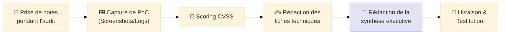

---
description: "Structure d'un Rapport de Pentest — Comment rédiger un livrable professionnel, percutant et exploitable pour vos clients."
icon: lucide/book-open-check
tags: ["REPORTING", "PENTEST", "LIVRABLE", "DOCUMENTATION", "AUDIT"]
---

# Structure d'un Rapport de Pentest

## Introduction

!!! quote "Analogie pédagogique — Le Rapport d'Expertise Immobilière"
    Imaginez que vous achetez un château. Vous payez un expert pour vérifier s'il est solide. L'expert ne se contente pas de vous dire "C'est bon, ça tient". Il vous remet un dossier avec une photo des fissures dans la cave, un plan des poutres à changer, et surtout, un résumé en une page pour vous dire si vous pouvez y habiter sans danger. Le **Rapport de Pentest** est cette expertise : il transforme des données techniques complexes en une liste de décisions claires pour le propriétaire.

### 4. Conclusion & Plan de Remédiation
- Tableau récapitulatif des actions à mener par ordre de priorité.

---

## Conseils de Rédaction : "Show, Don't Just Tell"

!!! tip "La règle d'or des preuves"
    Une capture d'écran d'un shell root vaut mille explications. Vos preuves doivent être **irréfutables**. Si le client ne peut pas reproduire la faille avec vos explications, votre rapport n'est pas terminé.

!!! danger "Le jargon inutile"
    Adaptez votre langage. Dans la synthèse executive, ne parlez pas de "heap overflow" ou de "blind time-based SQLi". Parlez de "risque de vol de la base de données clients" ou de "prise de contrôle totale du serveur".

---

## Workflow de Production du Rapport

---

## Conclusion

!!! quote "Ce qu'il faut retenir"
    Un rapport de qualité est un rapport **actionnable**. Le client ne vous paie pas pour trouver des failles, il vous paie pour l'aider à les réparer. La clarté de vos recommandations est aussi importante que la complexité de vos exploits.

> Pour assurer l'objectivité de votre rapport, maîtrisez le système de notation universel : **[CVSS — Scoring des vulnérabilités →](./cvss.md)**.

