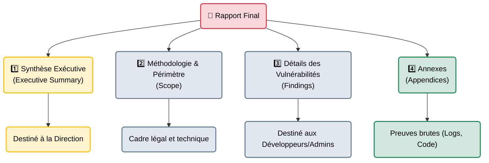

# Structure d'un Rapport — L'Anatomie

    

## Introduction

!!! quote "Analogie pédagogique — Le Journal Télévisé"
    Si vous regardez le journal de 20H, le présentateur ne commence pas par les détails techniques de l'accord économique. Il commence par le résumé ("Gros Titres"). Si le sujet vous intéresse, vous restez pour l'analyse approfondie.
    Un **Rapport de Pentest** fonctionne exactement pareil. Les 3 premières pages sont pour le Directeur (Les Gros Titres : *Qu'avons-nous risqué ?*). Les 50 pages suivantes sont pour les Ingénieurs (*Comment le réparer ?*).

Il n'existe pas de "modèle universel" imposé par la loi, mais l'industrie de la cybersécurité (CREST, OSCP, ANSSI) a convergé vers une structure standardisée en plusieurs grandes parties. C'est cette structure qui garantit que le document sera lu et compris par ses différentes audiences cibles.

 

---

## Architecture du Document (Les 4 Piliers)

La règle d'or du reporting est de séparer rigoureusement la stratégie (Business) de la technique (IT).

### Partie 1 : La Synthèse Exécutive (Le cœur du rapport)
C'est la partie la plus importante. Si le PDG n'a que 5 minutes pour lire le rapport dans l'avion, il ne lira que cette section.
- **Aucun jargon technique** (Ne parlez pas de "Cross-Site Scripting", parlez de "Risque de vol de sessions clients").
- **Graphes visuels** : Un diagramme camembert affichant le nombre de failles (Critiques, Hautes, Moyennes, Basses).
- **Résumé du récit d'intrusion** : "Nous sommes parvenus à devenir Administrateur du domaine en 3 heures."
- **Recommandations Stratégiques** : Que doit faire la Direction ? (ex: "Débloquer du budget pour refaire l'Active Directory").

### Partie 2 : Le Périmètre et la Méthodologie
Définit le cadre de l'audit pour protéger juridiquement le pentester.
- Qu'est-ce qui a été audité ? (Adresses IP, URLs exactes).
- Qu'est-ce qui était interdit ? (Dénis de service bloqués).
- Quelle méthodologie a été suivie ? (OWASP Top 10, PTES).

### Partie 3 : Le Catalogue des Vulnérabilités (Findings)
C'est la partie technique la plus volumineuse. Chaque vulnérabilité possède sa propre fiche d'identité (voir la leçon sur les **[Preuves →](./preuves.md)** pour le détail).
Elles sont classées par ordre décroissant de criticité (Des failles **CRITIQUES** aux failles **BASSES**).
Chaque fiche contient le nom, le score CVSS, la description, les étapes pour la reproduire (PoC), et surtout : la recommandation de correction.

### Partie 4 : Les Annexes
Les données brutes qui pollueraient la lecture du rapport.
- Code source des scripts d'exploitation (Exploits sur mesure).
- Logs complets de Nmap ou de bases de données extraites.
- Lexique des termes techniques.

 

---

## Bonnes & Mauvaises Pratiques (Do's & Don'ts)

| Action | Recommandation | Explication technique |
|---|---|---|
| ✅ **À FAIRE** | **La Relecture Croisée (Quality Assurance)** | Ne rendez jamais un rapport que vous venez d'écrire sans le faire relire par un autre pentester. La "cécité d'attention" vous fera rater d'énormes fautes d'orthographe ou des absurdités techniques. Un rapport avec des fautes d'orthographe détruit instantanément la crédibilité de tout le travail technique. |
| ❌ **À NE PAS FAIRE** | **Utiliser un ton arrogant ou méprisant** | N'écrivez jamais "Le développeur a fait une erreur stupide" ou "Le pare-feu est totalement inutile". Le but est d'aider le client, pas de l'humilier. Utilisez toujours la forme passive et professionnelle : "Une absence de filtrage a été constatée au niveau des entrées utilisateur." |

 

---

## Conclusion

!!! quote "Ce qu'il faut retenir"
    Un rapport de sécurité professionnel est un entonnoir : il commence par une vue très large orientée "Stratégie d'Entreprise", puis se resserre vers des considérations hautement "Techniques et Chirurgicales". Savoir adapter son niveau de langage en fonction de la section du rapport est ce qui différencie un bon pirate informatique d'un excellent consultant en cybersécurité.

> Savoir structurer le rapport est essentiel, mais le cœur du travail reste la rédaction de la fameuse "Partie 3" (Les détails des vulnérabilités). Comment rédiger une fiche de faille parfaite pour qu'un développeur puisse la reproduire et la corriger sans vous appeler à l'aide ? C'est l'art des **[Preuves & Reproductibilité →](./preuves.md)**.

 

---

## Conclusion

!!! quote "Ce qu'il faut retenir"
    La maîtrise théorique et pratique de ces concepts est indispensable pour consolider votre posture de cybersécurité. L'évolution constante des menaces exige une veille technique régulière et une remise en question permanente des acquis.

> [Retour à l'index →](./index.md)
