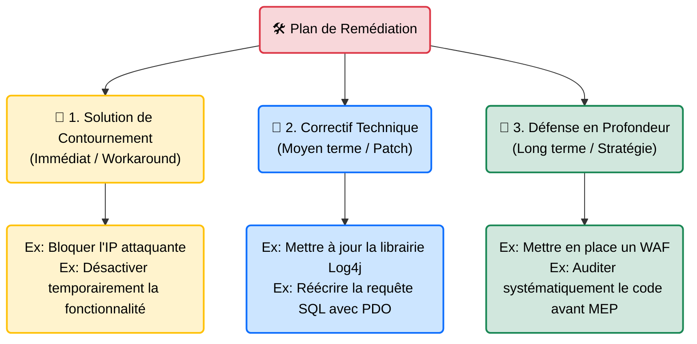

# Recommandations & Correctifs — Le Plan de Guérison

    

## Introduction

!!! quote "Analogie pédagogique — Le Diagnostic sans Ordonnance"
    Si votre médecin vous dit "Vous avez une grave infection", et qu'il quitte la pièce sans vous prescrire d'antibiotiques, c'est un mauvais médecin.
    De la même manière, si vous terminez votre fiche de vulnérabilité en disant "Il y a une injection SQL Critique", sans expliquer précisément au développeur comment réparer son code, vous n'avez fait que la moitié de votre travail d'auditeur.

La valeur d'un rapport de cybersécurité ne réside pas dans le nombre de failles trouvées, mais dans **l'applicabilité des solutions proposées**. Un bon pentester est un constructeur (Builder) autant qu'un destructeur (Breaker). La section "Recommandations" est celle qui sera la plus lue par les ingénieurs (DevOps, SysAdmins, Développeurs) dans les semaines qui suivront votre départ.

 

---

## Les 3 Niveaux de Remédiation

Une recommandation professionnelle ne doit jamais se limiter à une seule phrase abstraite ("Sécurisez le serveur"). Elle doit proposer des solutions à court, moyen et long terme.

### 1. La Solution de Contournement (Workaround)
Lorsque la faille est **Critique** et qu'elle est activement exploitée (ou très facile à exploiter), le client ne peut pas attendre 3 semaines que ses développeurs réécrivent l'application. Vous devez proposer une solution "Pansement" applicable dans l'heure :
*Exemple : "En attendant la mise à jour, configurez le pare-feu Web (WAF) pour bloquer toutes les requêtes HTTP contenant le mot-clé `jndi:`".*

### 2. Le Correctif Technique Définitif (Le Patch)
C'est la vraie solution au problème. Elle cible la racine (Root Cause).
- **Failles applicatives** : Fournir des exemples de code sécurisé (ex: montrer comment échapper les balises HTML en React pour bloquer un XSS).
- **Failles d'infrastructure** : Fournir la configuration recommandée (ex: donner la liste exacte des Cipher Suites TLS cryptographiquement sûrs à copier-coller dans le fichier `nginx.conf`).

### 3. La Défense en Profondeur (Defense in Depth)
Expliquer comment s'assurer que ce type de faille ne se reproduise *plus jamais* à l'avenir.
*Exemple : "Intégrer l'outil SonarQube dans la chaîne CI/CD (GitLab) pour que la compilation échoue automatiquement si une injection SQL est détectée par l'analyseur de code statique."*

 

---

## Bonnes & Mauvaises Pratiques (Do's & Don'ts)

| Action | Recommandation | Explication technique |
|---|---|---|
| ✅ **À FAIRE** | **Adapter la solution au contexte du client** | Si le client héberge un vieux serveur industriel sous Windows XP qui pilote une usine (ICS/SCADA), ne recommandez pas "Mettez à jour vers Windows 11". C'est techniquement impossible pour le client. Recommandez l'isolation réseau absolue (Air-Gap) du serveur. |
| ❌ **À NE PAS FAIRE** | **Donner des liens morts ou vagues** | Ne dites pas "Lisez la documentation Microsoft". Fournissez le lien direct vers le correctif exact (KBs) ou vers la page spécifique de l'OWASP Cheat Sheet Series qui traite du problème. L'administrateur système ne doit pas avoir à chercher sur Google pour comprendre votre correctif. |

 

---

## Conclusion

!!! quote "Ce qu'il faut retenir"
    Un pentester détruit des systèmes en quelques heures, mais un administrateur système met parfois des mois à les reconstruire de manière sécurisée. La phase de remédiation est la main tendue entre le monde de l'offensive (Red Team) et le monde de la défense (Blue Team). Rédiger des recommandations claires, respectueuses et réalisables est ce qui garantira votre rappel pour l'audit de l'année suivante.
