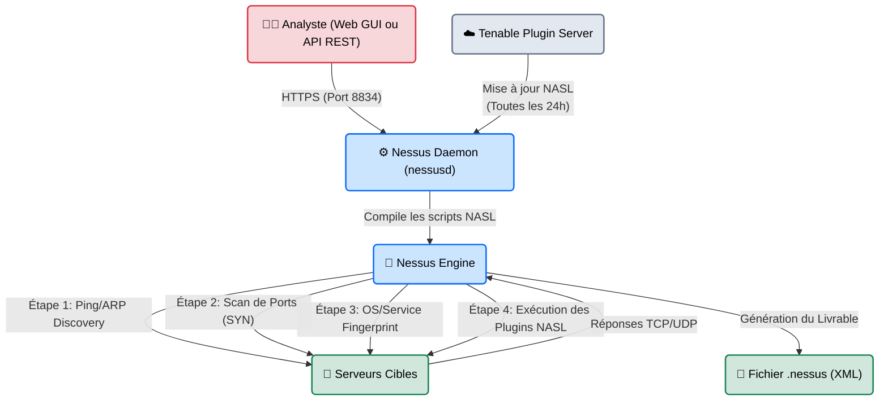
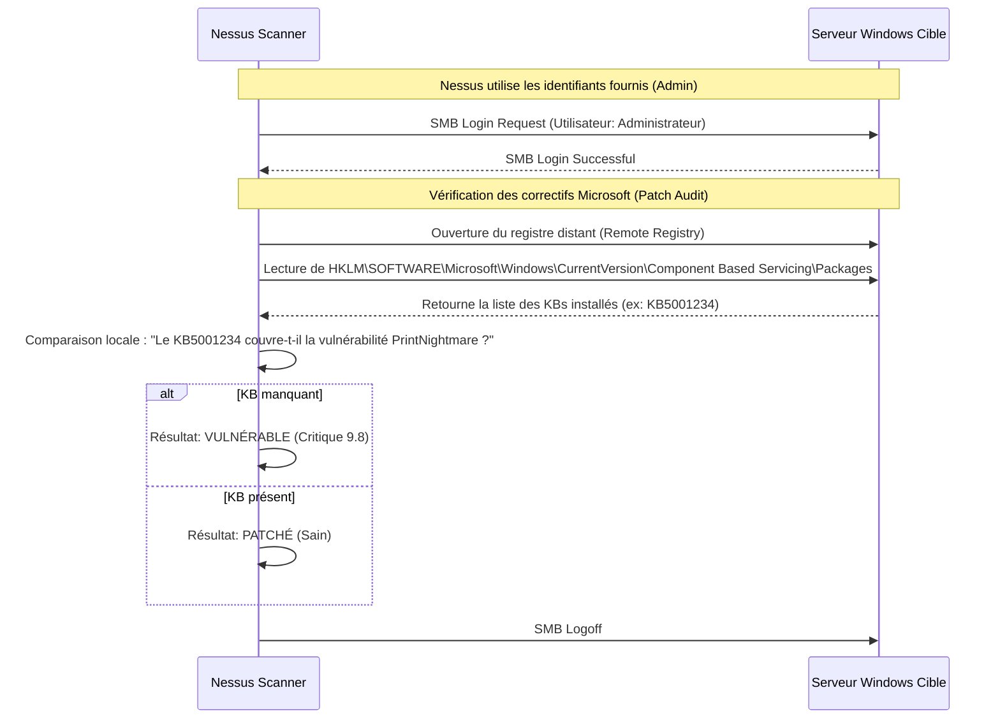

# Nessus — L'Auditeur Assermenté

<div
  class="omny-meta"
  data-level="🟢 Débutant"
  data-version="10.8+"
  data-time="~40 minutes">
</div>

<div style="text-align: center; margin: 0 auto;">
    
</div>

## Introduction

!!! quote "Analogie pédagogique — L'Auditeur Légal Assermenté"
    Si OpenVAS est le contrôleur technique gratuit du coin (très performant, mais dont la paperasse est parfois complexe et brouillonne), **Nessus** est le grand cabinet d'audit juridique.
    Il coûte cher, ses processus sont extrêmement polis et fluides, et son rapport final est irréprochable. Surtout, quand vous présentez un document signé "Nessus" à une compagnie d'assurance, à la CNIL ou à un organisme de certification (PCI-DSS), personne ne remet en question la validité du contrôle. C'est l'étalon-or industriel de la conformité.

Développé par **Tenable**, Nessus est historiquement le premier scanner de vulnérabilités automatisé. Il permet d'analyser des réseaux complets à la recherche de failles de sécurité, de mots de passe par défaut et d'erreurs de configuration. Sa force principale réside dans le taux extrêmement faible de "Faux Positifs" de ses plugins de détection, rendant ses rapports directement exploitables par les décideurs (CISO/DSI) sans nécessiter des semaines de tri manuel.

<br>

---

## Architecture & Mécanismes Internes

### 1. Architecture Logicielle (Tenable)
Nessus fonctionne sur une architecture client/serveur avec un moteur local mis à jour dynamiquement par le Cloud de Tenable.



### 2. La Magie du "Credentialed Scan" (Sequence Diagram)
Le vrai pouvoir de Nessus réside dans le **Scan Authentifié**. Au lieu de deviner les failles de l'extérieur, l'auditeur fournit à Nessus le compte Administrateur Windows. Nessus se connecte alors silencieusement (SMB/WMI) et lit la base de registre.



<br>

---

## Intégration dans la Kill Chain

| Phase Précédente | Nessus | Phase Suivante |
| :--- | :--- | :--- |
| **Découverte Réseau** <br> (*Nmap / Cartographie client*) <br> Définition du "Scope" (Périmètre autorisé). | ➔ **Évaluation de Conformité** ➔ <br> Traduction technique en score de risque (CVSS). | **Reporting & Remédiation** <br> (*Génération des livrables*) <br> Application des correctifs (Patch Management). |

<br>

---

## Installation & Configuration (CLI)

Contrairement aux outils Linux classiques, Nessus s'installe via un paquet propriétaire (Debian/RPM) et requiert une activation.

```bash title="Installation et Activation CLI"
# 1. Installation du paquet téléchargé
sudo dpkg -i Nessus-10.8.0-debian10_amd64.deb

# 2. Démarrage du démon
sudo systemctl start nessusd

# 3. Activation en ligne de commande (nécessite la clé reçue par mail)
sudo /opt/nessus/bin/nessuscli fetch --register AAAA-BBBB-CCCC-DDDD

# 4. Mise à jour immédiate des plugins (Étape primordiale avant tout scan)
sudo /opt/nessus/bin/nessuscli update --all
```

<br>

---

## Workflow Opérationnel & Lignes de Commande (API REST)

Dans des environnements d'entreprise (DevSecOps), Nessus n'est pas utilisé à la souris. Il est automatisé via son **API REST**. Voici comment un script Python ou Bash interagit avec Nessus.

### 1. Obtention du Token d'Authentification
On envoie ses identifiants à l'API pour récupérer un Token de session.
```bash title="Authentification API"
curl -k -X POST https://127.0.0.1:8834/session \
  -H "Content-Type: application/json" \
  -d '{"username":"admin","password":"MonPasswordSecret"}'
```
*Output attendu :*
```json
{"token":"8c85c2b0e6e7f8e9...9b7e"}
```

### 2. Lancement d'un Scan Automatisé
On utilise le Token pour déclencher un scan pré-configuré (ex: le scan ID `42`).
```bash title="Déclenchement via API"
curl -k -X POST https://127.0.0.1:8834/scans/42/launch \
  -H "X-Cookie: token=8c85c2b0e6e7f8e9...9b7e"
```
*Output attendu :*
```json
{"scan_uuid": "3a3b4c5d-1234-5678-abcd-ef0123456789"}
```

### 3. Parsing du Résultat (Fichier `.nessus`)
Le format propriétaire de Nessus (un gros fichier XML) est lisible par machine. Les Pentesters utilisent souvent des scripts pour extraire "juste ce qui est critique".
```bash title="Extraction des vulnérabilités Critiques depuis l'export XML"
# Utilisation de xmllint ou d'un parseur Python
grep -i 'severity="4"' rapport_client.nessus | wc -l
# Résultat : 12 (Il y a 12 failles critiques trouvées)
```

<br>

---

## Contournement & Furtivité (Evasion)

Nessus n'est **absolument pas furtif**. C'est un outil d'audit, pas d'infiltration silencieuse.

1. **La Détection SOC** : Un Blue Teamer verra instantanément Nessus car il effectue des connexions massives vers tous les ports ouverts en moins d'une seconde, souvent avec un User-Agent HTTP explicite (`Nessus/X.X`).
2. **Techniques de Tuning** : Pour éviter de faire tomber le réseau du client (DoS de la bande passante), on utilise les "Scan Policies" :
   - Réduction du paramètre `Max concurrent checks per host` (de 5 à 1).
   - Augmentation du `Network timeout`.
   - Option `Stop scanning host if it becomes unresponsive` (Arrête de frapper si le serveur commence à planter).

<br>

---

## Bonnes & Mauvaises Pratiques (Do's & Don'ts)

| Action | Recommandation | Explication technique |
|---|---|---|
| ✅ **À FAIRE** | **Utiliser le Credentialed Scan (Identifiants)** | Un scan sans identifiants sur Windows détecte la faille `MS08-067` et c'est tout. Un scan *avec* identifiants permet à Nessus d'ouvrir la base de registre et de détecter 99% des failles applicatives locales (Vieux Java installé, Chrome non patché). C'est le jour et la nuit en matière de qualité d'audit. |
| ❌ **À NE PAS FAIRE** | **Envoyer un "Rapport Nessus Brut" à la direction** | Le rapport brut d'un serveur peut faire 200 pages. Il liste que le port TCP/80 est ouvert (Info), que le certificat SSL expire dans 2 ans (Low), etc. Le métier d'un consultant en Cybersécurité n'est pas d'appuyer sur "Scan" et d'imprimer. C'est de trier, vérifier (False Positive checking) et résumer les 3 vraies urgences dans un livrable humain. |

<br>

---

## Avertissement Légal & SCADA

!!! danger "Audits en Milieu Industriel (OT)"
    Scanner un serveur Web avec Nessus est bruyant mais rarement fatal. Scanner une usine (ICS/SCADA), un hôpital ou une chaîne d'assemblage est **extrêmement dangereux**.
    
    1. Les Automates Programmables Industriels (API / PLC) ont des puces réseau très limitées. Le simple "Ping Sweep" de découverte de Nessus peut saturer la mémoire d'un vieux Siemens S7, provoquant son arrêt d'urgence. (L'usine s'arrête, coût = millions d'euros).
    2. Utilisez exclusivement les "Scan Policies" estampillées **OT/SCADA Safe** fournies par Tenable (qui désactivent les checks agressifs et le scan de ports SYN) et auditez toujours *avec le doigt sur le bouton d'arrêt d'urgence*, entouré de l'équipe de production.

<br>

---

## Conclusion

!!! quote "Ce qu'il faut retenir"
    Dans l'industrie professionnelle, Nessus est incontournable. Que ce soit pour valider la conformité d'une norme de sécurité bancaire, pour rassurer des actionnaires après une attaque, ou pour aider une équipe Blue Team à gérer son parc de 10 000 machines, le rapport Nessus est le juge de paix. Apprendre à utiliser son API REST pour l'intégrer dans des chaînes d'intégration continue (CI/CD) est l'une des compétences les plus recherchées du marché.

> L'infrastructure de bas niveau (les ports, les systèmes d'exploitation) a été scannée. Mais aujourd'hui, les pare-feux bloquent quasiment tout, sauf un seul port : le trafic Web (443 - HTTPS). Pour entrer dans l'entreprise, il va falloir intercepter et altérer la logique même de leurs applications web. Préparez-vous à entrer dans la Matrice (Étape 6) avec les Maîtres de l'Interception : **[Burp Suite & OWASP ZAP →](../web/index.md)**.

<br>

---

## Conclusion

!!! quote "Ce qu'il faut retenir"
    La maîtrise théorique et pratique de ces concepts est indispensable pour consolider votre posture de cybersécurité. L'évolution constante des menaces exige une veille technique régulière et une remise en question permanente des acquis.

> [Retour à l'index →](./index.md)
