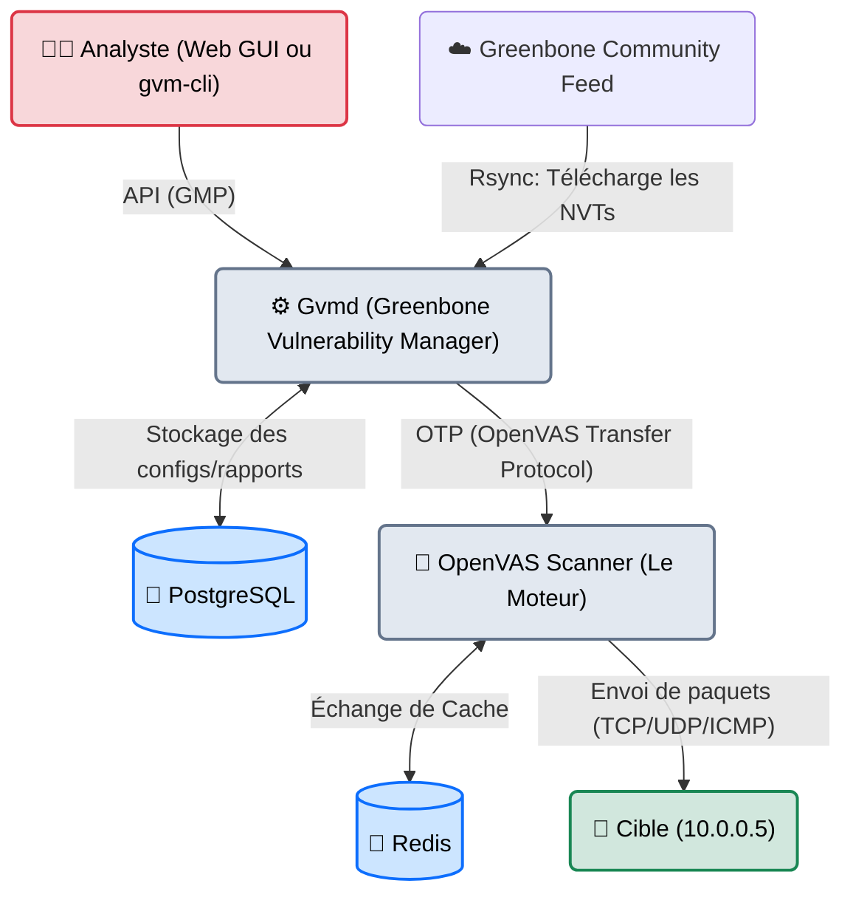
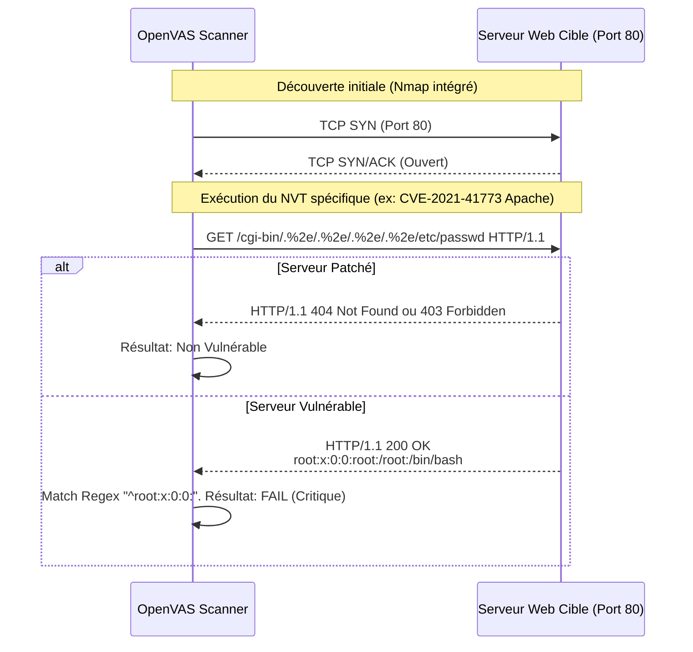

# OpenVAS — Le Contrôleur Technique

<div
  class="omny-meta"
  data-level="🟡 Intermédiaire"
  data-version="GVM 22.4+"
  data-time="~45 minutes">
</div>

<div style="text-align: center; margin: 0 auto;">
    
</div>

## Introduction

!!! quote "Analogie pédagogique — Le Contrôleur Technique Automobile"
    Un audit manuel de Red Team, c'est un mécanicien de course qui écoute le moteur, démonte des pièces et invente un moyen inédit pour améliorer ou saboter la machine.
    **OpenVAS**, à l'inverse, c'est le **Contrôleur Technique de l'État**. Il ne fait rien de créatif. Il arrive avec une immense checklist (plus de 100 000 points de contrôle), il branche sa machine, et il vérifie mécaniquement si votre serveur possède les "défauts d'usine" connus. *"Avez-vous fait la mise à jour des freins de 2018 (CVE-2018-XXXX) ? Non ? Faille Critique."*

Initialement un fork du célèbre *Nessus* (lorsque ce dernier est devenu propriétaire), **OpenVAS** (désormais englobé sous le nom d'architecture *Greenbone Vulnerability Management* ou GVM) est le scanner de vulnérabilités open-source le plus abouti au monde. Contrairement à un simple scanner de ports comme Nmap, OpenVAS **interagit** avec les services découverts en envoyant des paquets spécifiquement conçus pour déclencher ou vérifier la présence de failles publiques (CVE).

<br>

---

## Architecture & Mécanismes Internes

### 1. Architecture Logicielle (GVM)
OpenVAS n'est pas un binaire standalone. C'est une stack logicielle complexe gérée via des démons Linux et une base de données.



### 2. Le Mécanisme d'un NVT (Sequence Diagram)
Comment OpenVAS sait-il qu'un serveur est vulnérable ? Il exécute un **NVT** (Network Vulnerability Test), écrit en langage NASL. Voici la séquence technique exacte d'un NVT vérifiant une faille Web.



<br>

---

## Intégration dans la Kill Chain

| Phase Précédente | OpenVAS | Phase Suivante |
| :--- | :--- | :--- |
| **OSINT / Cartographie** <br> (*Amass, Nmap*) <br> Fournit les IP cibles ou les sous-réseaux actifs. | ➔ **Identification Automatisée** ➔ <br> Teste 100 000+ failles sur les IP fournies. | **Exploitation** <br> (*Metasploit, SearchSploit*) <br> Utilisation du rapport pour lancer le bon exploit. |

<br>

---

## Installation & Configuration Avancée

L'installation native sur Kali Linux est souvent instable à cause des dépendances PostgreSQL. **Docker** est la méthode standard de l'industrie.

### 1. Déploiement via Docker Compose
```bash
# Téléchargement de la stack officielle Greenbone
curl -f -L https://greenbone.github.io/docs/latest/_downloads/docker-compose.yml -o docker-compose.yml

# Démarrage des 5 conteneurs (GSA, Gvmd, PostgreSQL, Redis, Scanner)
sudo docker-compose -f docker-compose.yml -p greenbone-community-edition up -d
```

### 2. Synchronisation des Feeds (Critique)
Sans la base de données des failles à jour, le scanner est aveugle. Cette commande (à lancer dans le conteneur `gvmd`) télécharge les NVTs, la base SCAP (CPE) et le CERT.
```bash
# Cette opération prend plusieurs minutes la première fois via rsync
docker-compose -f docker-compose.yml -p greenbone-community-edition exec gvmd gvm-sync-all
```

<br>

---

## Workflow Opérationnel & Lignes de Commande (gvm-cli)

Les Pentesters n'utilisent pas toujours l'interface Web (très lourde). Ils utilisent l'API via `gvm-cli` (GVM Tools) pour intégrer OpenVAS dans leurs scripts Bash ou Python.

### 1. Authentification et Vérification
```bash title="Test de connexion à l'API locale"
gvm-cli tls --hostname 127.0.0.1 --gmp-username admin --gmp-password admin "<get_version/>"
```
*Output attendu :*
```xml
<get_version_response status="200" status_text="OK"><version>22.4</version></get_version_response>
```

### 2. Création d'une Cible (Target) en CLI
On demande à l'API de créer une cible pour le sous-réseau `10.0.0.0/24`.
```bash title="Création de la Target"
gvm-cli tls --gmp-username admin --gmp-password admin \
  "<create_target><name>Subnet_Client</name><hosts>10.0.0.0/24</hosts></create_target>"
```
*Output attendu :*
```xml
<create_target_response id="b4f7b2c0-XXXX-XXXX-XXXX-XXXXXXXXXXXX" status="201" status_text="OK"/>
```
*(On sauvegarde cet `id` pour l'étape suivante).*

### 3. Le Scan Authentifié (Credentialed Scan)
**C'est la différence entre un pro et un amateur.** Un scan Black-Box (extérieur) détecte un serveur Apache 2.4 et *déduit* qu'il est vulnérable. Un **Scan Authentifié** se connecte en SSH au serveur cible, tape `dpkg -l` ou `rpm -qa`, lit la version exacte du package patché par l'administrateur système, et élimine les **Faux Positifs**.

*Pour le configurer en CLI, il faut créer l'objet Credential, l'attacher à la Target, puis lancer la Task. (Généralement, on fait cette manipulation spécifique via l'Interface Web pour éviter les erreurs d'ID).*

### 4. Lancement de la Tâche et Export
```bash title="Exécution de la Task"
gvm-cli tls --gmp-username admin --gmp-password admin "<start_task task_id='[TASK_ID]'/>"
```
Une fois fini, on télécharge le rapport en format PDF :
```bash title="Export du livrable"
gvm-cli tls --gmp-username admin --gmp-password admin \
  "<get_reports report_id='[REPORT_ID]' format_id='[PDF_FORMAT_ID]'/>" > rapport_final.pdf
```

<br>

---

## Contournement & Furtivité (Evasion)

OpenVAS **n'est pas** un outil furtif. Par conception, il est fait pour faire énormément de bruit.

1. **Le Mur de l'IPS / WAF** : Si vous scannez une cible protégée par un WAF (Cloudflare, F5) ou un IPS (Snort), votre IP sera bannie (DROP) après les 10 premières requêtes. Le rapport d'OpenVAS ressortira **"0 Vulnérabilités"**, ce qui est un **Faux Négatif**.
2. **Technique d'atténuation** :
   - Ajoutez votre IP (celle d'OpenVAS) dans la **Whitelist** du pare-feu du client (C'est le prérequis standard d'un audit de vulnérabilités, l'auditeur ne doit pas être bloqué).
   - Dans OpenVAS, réduisez les variables `max_hosts` et `max_checks` (Concurrent checks) à `1` pour étaler le scan sur plusieurs jours et tenter de passer sous les radars (Très peu efficace sur les IPS modernes).

<br>

---

## Bonnes & Mauvaises Pratiques (Do's & Don'ts)

| Action | Recommandation | Explication technique |
|---|---|---|
| ✅ **À FAIRE** | **Analyser les logs de la cible** | Si vous êtes Blue Team, regardez les logs Apache (`/var/log/apache2/access.log`) pendant un scan OpenVAS. Vous verrez le `User-Agent: Mozilla/5.0 [en] (OpenVAS)`. C'est comme ça qu'un SOC identifie immédiatement le trafic d'un scanner automatisé. |
| ❌ **À NE PAS FAIRE** | **Faire confiance au CVSS 10.0 aveuglément** | OpenVAS a tendance à surévaluer certaines découvertes. Il va flaguer une "Interface d'administration Tomcat ouverte" en `Critique (9.8)` même si cette interface est derrière un VPN interne sécurisé par 2FA. **L'outil ne connaît pas le contexte métier.** |

<br>

---

## Avertissement Légal & SCADA

!!! danger "Déni de Service (DoS) et Environnements Critiques"
    Bien qu'OpenVAS soit "Safe checks only" par défaut, l'intensité réseau qu'il génère (des milliers de paquets anormaux par minute) est fatale pour le vieux matériel.
    
    1. L'envoi de trames malformées pour détecter une CVE peut causer le **crash d'équipements industriels (Automates SCADA/ICS)**, entraînant l'arrêt physique de chaînes de production. Ne scannez **jamais** un environnement OT avec OpenVAS.
    2. Juridiquement, un crash causé par négligence lors d'un scan automatisé engage la responsabilité pénale du testeur (Entrave au fonctionnement d'un STAD - Article 323-2 du Code pénal).

<br>

---

## Conclusion

!!! quote "Ce qu'il faut retenir"
    OpenVAS est une arme d'artillerie lourde. On ne l'utilise pas pour la furtivité, on l'utilise pour le rendement. Il permet de passer au crible des dizaines de milliers de points de contrôle techniques sur un immense parc de machines en quelques heures, là où une équipe humaine mettrait des années. Il est le point de départ de toute politique de "Gestion des Vulnérabilités" d'une entreprise moderne.

> Si l'Open Source est un excellent point de départ, les cabinets d'audit exigeant zéro faux positif et des rapports acceptés par les compagnies d'assurance se tournent vers l'étalon-or propriétaire de l'industrie : **[Nessus →](./nessus.md)**.

<br>

---

## Conclusion

!!! quote "Ce qu'il faut retenir"
    La maîtrise théorique et pratique de ces concepts est indispensable pour consolider votre posture de cybersécurité. L'évolution constante des menaces exige une veille technique régulière et une remise en question permanente des acquis.

> [Retour à l'index →](./index.md)
