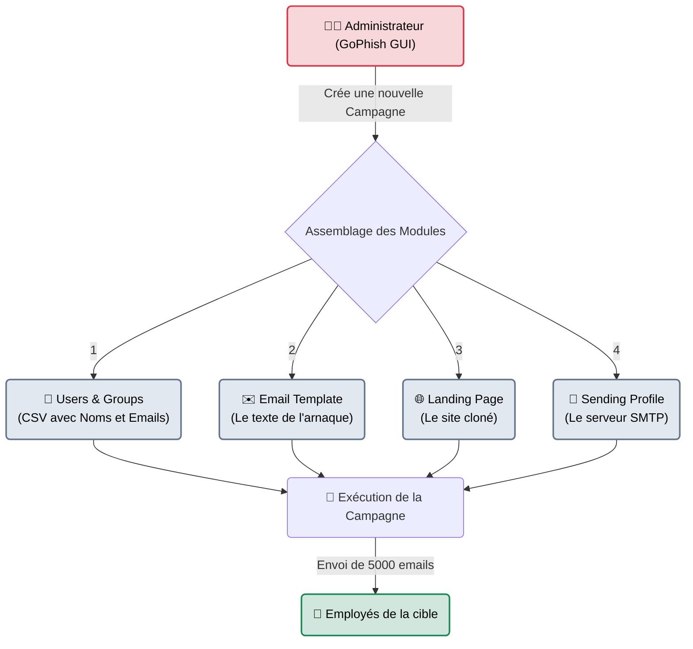
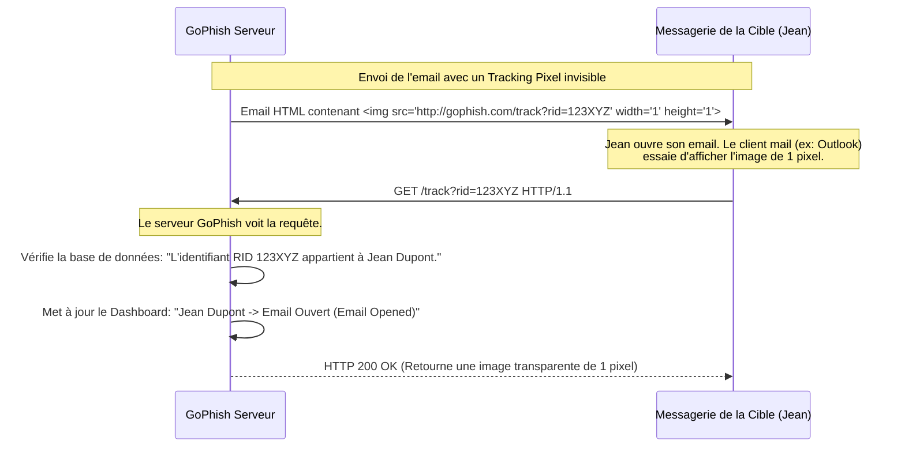

---
description: "GoPhish — La plateforme open-source de simulation de Phishing. L'outil idéal pour gérer des campagnes massives, analyser les statistiques de clics et évaluer la sensibilisation des employés."
icon: lucide/book-open-check
tags: ["BLUE TEAM", "RED TEAM", "SOCIAL ENGINEERING", "GOPHISH", "PHISHING", "CAMPAIGN"]
---

# GoPhish — L'Agence de Marketing Malveillant

<div
  class="omny-meta"
  data-level="🟢 Débutant"
  data-version="0.12.0+"
  data-time="~35 minutes">
</div>


## Introduction

!!! quote "Analogie pédagogique — Le Logiciel de Mailing Marketing"
    Si **SET (Social-Engineer Toolkit)** est un tireur d'élite qui prépare un piège sur-mesure pour piéger le PDG d'une entreprise (Spear-Phishing), **GoPhish** est l'équivalent de *MailChimp* ou d'une agence de marketing publicitaire pour les hackers.
    Son but n'est pas de faire un seul tir, mais d'envoyer 5000 mails simultanément à tous les employés, et surtout, de fournir des tableaux de bord et des graphiques statistiques parfaits : *"Combien ont ouvert l'email ? Combien ont cliqué ? Combien ont rempli le formulaire avec leur mot de passe ?"*

Écrit en Go (ce qui en fait un simple binaire ultra-portable), `gophish` est l'outil privilégié par la Blue Team et les auditeurs pour mener des campagnes de sensibilisation (Security Awareness Training). Il embarque tout le nécessaire dans un seul exécutable : un serveur web d'administration, un serveur de réception (pour héberger les faux sites), et un moteur d'envoi d'emails SMTP.

<br>

---

## Architecture & Mécanismes Internes

### 1. Architecture Logicielle (Campagne Modulaire)
Le succès d'une attaque GoPhish repose sur l'assemblage de 4 composants essentiels dans son interface Web.



### 2. Le Mécanisme de Suivi "Web Bug" (Sequence Diagram)
Comment GoPhish sait-il *exactement* que c'est Jean Dupont de la comptabilité qui a ouvert le mail, sans même qu'il ne clique sur un lien ? Grâce au tracking pixel (Web Bug).



<br>

---

## Intégration dans la Kill Chain

| Phase Précédente | GoPhish | Phase Suivante |
| :--- | :--- | :--- |
| **OSINT / theHarvester** <br> (*Reconnaissance*) <br> On a extrait un fichier CSV de 500 adresses email d'employés. | ➔ **Livraison Massive (Delivery)** ➔ <br> Gestion de l'envoi de masse, contournement des filtres antispam et collecte de statistiques. | **Reporting d'Audit / Sensibilisation** <br> (*Génération des livrables*) <br> Création de graphiques montrant que le département RH est le plus vulnérable de l'entreprise. |

<br>

---

## Installation & Workflow Opérationnel

Contrairement aux autres outils Kali Linux, GoPhish a été retiré de nombreux dépôts officiels. Il faut souvent télécharger le binaire GitHub.

### 1. Démarrage de la Plateforme
```bash title="Lancement du binaire"
# Téléchargement de l'archive depuis Github Releases, puis extraction
chmod +x gophish
sudo ./gophish
```
*GoPhish démarre 2 serveurs :*
- *Le port **3333** (HTTPS) : L'interface d'administration pour vous (login: admin).*
- *Le port **80** (HTTP) : Le faux serveur web qui hébergera la "Landing Page" pour les victimes.*

*(Note : Au premier lancement, GoPhish génère un mot de passe Admin aléatoire affiché dans le terminal).*

### 2. Création du "Sending Profile" (L'enjeu technique)
L'étape la plus dure du Phishing n'est pas de créer un mail, c'est d'éviter la boîte SPAM. Dans l'onglet "Sending Profiles", vous devez configurer un vrai serveur SMTP (ex: Mailgun, SendGrid, ou un serveur Postfix configuré par vos soins).
```text
SMTP From: RH Entreprise <rh@omnyvia-support.com>
Host: smtp.mailgun.org:587
Username: postmaster@omnyvia-support.com
Password: [MotDePasse]
```
*(Idéalement, vous devez configurer les enregistrements SPF, DKIM et DMARC sur votre nom de domaine `omnyvia-support.com` pour passer les filtres de Microsoft/Google).*

### 3. Utilisation des variables de Template
Dans la section "Email Template", vous pouvez personnaliser les emails pour que chaque cible se sente unique, augmentant dramatiquement le taux de clic.
```html title="Exemple de Template GoPhish"
Bonjour {{.FirstName}},

Une mise à jour urgente de sécurité concernant le département {{.Position}} requiert votre attention.
Veuillez vous connecter immédiatement sur : 
<a href="{{.URL}}">Portail de Sécurité</a>
```
*Le tag `{{.URL}}` est crucial : GoPhish le remplacera dynamiquement par votre fausse Landing Page, en y ajoutant l'identifiant unique `?rid=XXX` pour tracker la victime.*

<br>

---

## Contournement & Furtivité (Evasion SPAM)

Le véritable ennemi de GoPhish n'est pas l'employé, c'est **Proofpoint**, **Mimecast** ou **Microsoft Defender** (les filtres Anti-Spam d'entreprise).

1. **Whitelisting (Exercice Blue Team)** :
   Si vous faites un test de sensibilisation officiel (autorisé), demandez simplement aux administrateurs de l'entreprise cible de mettre l'adresse IP de votre serveur GoPhish en liste blanche (Whitelist). L'email arrivera directement dans la boîte de réception.
   
2. **Leurre de réputation (Exercice Red Team furtif)** :
   N'envoyez pas 5000 emails d'un coup avec un nom de domaine acheté la veille. Le domaine n'a aucune réputation et sera détruit par les filtres. 
   - Achetez le domaine 1 mois à l'avance.
   - Faites-le vieillir (envoyez des mails normaux entre différentes adresses).
   - Envoyez la campagne GoPhish par petits paquets (ex: 50 emails par heure) au lieu d'un seul tir ("Drip Campaign").

<br>

---

## Bonnes & Mauvaises Pratiques (Do's & Don'ts)

| Action | Recommandation | Explication technique |
|---|---|---|
| ✅ **À FAIRE** | **Utiliser le "Capture Passwords" avec éthique** | Dans la *Landing Page*, GoPhish propose de capturer les données soumises. Activez cette option pour prouver que la faille est réelle, mais **ne stockez jamais les mots de passe en clair** dans vos rapports. Cochez l'option "Capture Passwords" mais supprimez-les une fois l'audit terminé pour éviter toute fuite de données (RGPD). |
| ❌ **À NE PAS FAIRE** | **Oublier de modifier le Header `X-Mailer`** | Par défaut, GoPhish ajoute un en-tête caché dans tous ses emails : `X-Mailer: gophish`. Tout bon filtre anti-spam de la planète bloque ce mot-clé. Vous devez configurer un custom header dans le *Sending Profile* (ex: `X-Mailer: Microsoft Outlook 16.0`) pour l'écraser. |

<br>

---

## Avertissement Légal & Risques Sociaux

!!! danger "Psychologie et Harcèlement"
    L'ingénierie sociale automatisée soulève d'immenses questions éthiques.
    
    1. **Le "Fear Mongering" (Phishing basé sur la peur)** : Envoyer un faux email disant "Votre licenciement a été acté, cliquez ici pour voir les documents" ou "Test COVID Positif" est strictement déconseillé. Cela génère un stress intense chez l'employé, casse la confiance avec la DSI, et peut conduire à des plaintes syndicales.
    2. Utilisez des scénarios d'audit professionnels (Bonus RH, Mise à jour IT, Faux document SharePoint partagé). Le but est d'éduquer, pas de terroriser.

<br>

---

## Conclusion

!!! quote "Ce qu'il faut retenir"
    GoPhish est le summum de l'automatisation du facteur humain. Il transforme l'attaque artisanale (SET) en une statistique industrielle. Aujourd'hui, aucune campagne d'hygiène informatique (Compliance) n'est complète sans un tableau de bord GoPhish démontrant l'évolution du taux de clics des employés d'une année sur l'autre.

> L'exploitation du réseau, des sites web, et même des cerveaux humains est maintenant maîtrisée. L'attaquant possède des données. L'étape suivante, souvent ignorée des débutants mais vitale pour l'attaquant professionnel, est de s'assurer de ne jamais perdre cet accès, même si la victime éteint son PC. Préparez-vous à casser des mots de passe hors-ligne et à naviguer dans les ténèbres avec l'Étape 8 : **[Password Attacks →](../password/index.md)**.


