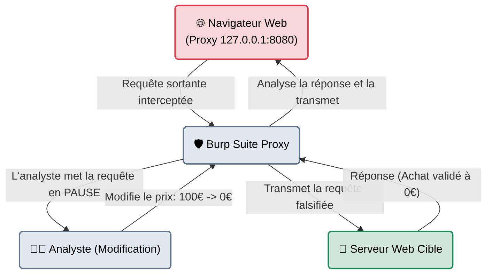
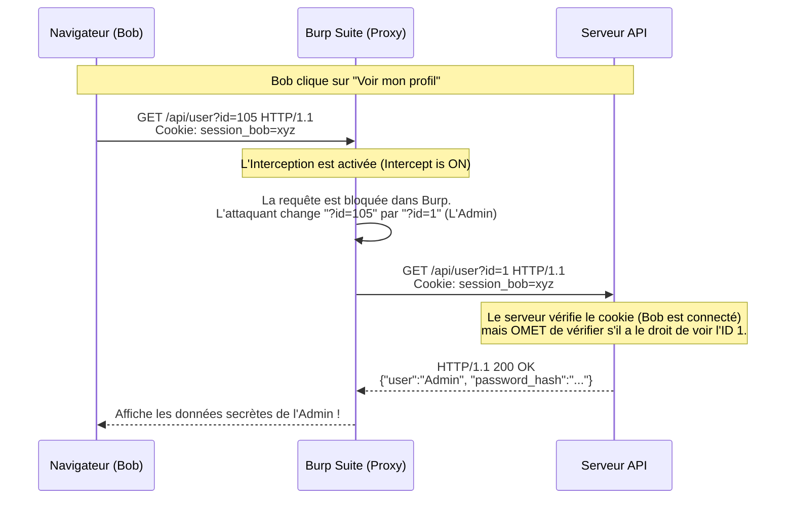

# Burp Suite — Le Douanier du Web

<div
  class="omny-meta"
  data-level="🔴 Avancé"
  data-version="Community & Pro"
  data-time="~60 minutes">
</div>

<div style="text-align: center; margin: 0 auto;">
    
</div>

## Introduction

!!! quote "Analogie pédagogique — Le Douanier Malveillant"
    Imaginez que votre navigateur web soit un citoyen écrivant une lettre (Requête) à sa banque (Serveur Web) pour demander un retrait. En temps normal, la lettre part dans une enveloppe scellée (HTTPS) directement à la banque.
    **Burp Suite**, c'est un agent de douane corrompu que vous placez volontairement entre vous et la banque. Il ouvre la lettre scellée, vous permet de raturer le montant ("retirer 10€" devient "retirer 10 000€"), referme l'enveloppe et la transmet à la banque. La banque pense que la lettre vient directement de vous.

Développé par **PortSwigger**, Burp Suite est la plateforme standard de l'industrie pour les tests de sécurité des applications web. Son module principal est un **Proxy d'interception**, mais il contient tout un écosystème d'outils (Repeater, Intruder, Sequencer) pour manipuler les requêtes HTTP/HTTPS de manière chirurgicale. Si un pentester web devait être abandonné sur une île déserte avec un seul outil, ce serait Burp Suite.

<br>

---

## 🏗️ Architecture & Mécanismes Internes

### 1. Architecture Logicielle (L'Interception MITM)
Burp Suite fonctionne sur le principe d'une attaque de l'Homme du Milieu (Man-in-the-Middle) locale. Pour intercepter le trafic HTTPS chiffré, Burp force le navigateur à accepter son propre certificat racine (CA). Sans cela, le navigateur rejetterait la connexion, voyant que le certificat présenté n'appartient pas réellement au site web cible.



### 2. Séquence d'Interception d'une Faille (IDOR)
Voici la modélisation au niveau paquet d'une attaque d'usurpation d'identité de type **IDOR (Insecure Direct Object Reference)**.



<br>

---

## 🛠️ Les Outils Internes (Le Vocabulaire)

Burp est divisé en plusieurs modules (Onglets) ayant chacun un rôle offensif précis.

| Module | Fonction | Cas d'usage métier |
| :--- | :--- | :--- |
| **Proxy** | Interception en direct | L'onglet principal. Mettre les requêtes en pause ("Drop" ou "Forward") pour voir le trafic caché (requêtes AJAX, télémétrie) que le navigateur n'affiche pas à l'écran. |
| **Repeater** | Le Laboratoire Manuel | Vous envoyez une requête capturée dans le Repeater. Vous pouvez rejouer cette même requête 100 fois en changeant une virgule à chaque fois, sans avoir à recliquer sur le navigateur (Idéal pour l'Injection SQL). |
| **Intruder** | Le Fuzzer Semi-Automatique | Vous marquez une zone (ex: un paramètre `id=§1§`) et Burp va envoyer 1000 requêtes en remplaçant `1` par `2`, `3`... Idéal pour le Brute-Force (Login) ou la découverte (Fuzzing). |
| **Decoder** | Le couteau suisse | Si vous voyez `%20` ou un bloc Base64 dans une requête, vous l'envoyez au Decoder pour le traduire en clair instantanément, le modifier, et le ré-encoder. |
| **Comparer** | Le jeu des 7 erreurs | Envoie deux réponses HTTP apparemment identiques pour que Burp mette en surbrillance rouge les 3 octets qui diffèrent (Très utile pour les Blind SQLi basées sur le contenu). |

<br>

---

## ⚙️ Installation & Configuration Indispensable

Burp Suite est une application Java pré-installée sur Kali Linux, mais son paramétrage réseau (le certificat SSL) est la principale cause d'échec pour les débutants.

### 1. Le Routage par le Proxy (curl / wfuzz)
Vous n'êtes pas obligé d'utiliser un navigateur. Vous pouvez faire passer n'importe quel outil CLI par Burp pour voir ce qu'il envoie vraiment !
```bash title="Faire passer une commande curl à travers Burp"
# Le proxy Burp tourne par défaut sur 127.0.0.1:8080
curl -x http://127.0.0.1:8080 http://testphp.vulnweb.com/login.php
```

### 2. L'installation du Certificat d'Autorité (CA)
Sans cette étape, tous les sites HTTPS afficheront une erreur fatale `SEC_ERROR_UNKNOWN_ISSUER` dans votre navigateur, car ce dernier détecte la tentative d'interception.
1. Lancez Burp.
2. Allez sur `http://burp` dans votre navigateur proxyfié (Burp interceptera cette URL locale).
3. Cliquez en haut à droite sur **CA Certificate** pour télécharger le fichier.
4. Importez-le dans les paramètres de sécurité de Firefox (Privacy & Security > Certificates > View Certificates > Import) et cochez **"Trust this CA to identify websites"**.

*Note : La version moderne de Burp inclut un "Embedded Browser" (basé sur Chromium) pré-configuré, rendant cette étape facultative si vous utilisez le navigateur intégré.*

<br>

---

## 🚀 Workflow Opérationnel (L'Art de l'Intruder)

Bien que Burp soit graphique, son utilisation requiert une syntaxe rigoureuse dans l'**Intruder** pour l'automatisation des attaques.

Admettons que nous interceptons une requête de connexion :
```http
POST /login.php HTTP/1.1
Host: target.com
Content-Type: application/x-www-form-urlencoded

username=admin&password=password123
```

Nous envoyons cette requête à l'Intruder (`Ctrl+I`). Nous devons placer des marqueurs de position (`§`) sur les variables à attaquer.

### Cas 1 : L'attaque Sniper (1 Dictionnaire, 1 Position)
Nous connaissons l'utilisateur (`admin`), nous voulons tester 1000 mots de passe. Nous surlignons `password123` et cliquons sur "Add §".
```http
username=admin&password=§password123§
```
*Configuration : Type = Sniper. Payloads = Fichier `rockyou.txt`.*

### Cas 2 : L'attaque Cluster Bomb (2 Dictionnaires, 2 Positions)
Nous ne connaissons ni le nom, ni le mot de passe.
```http
username=§admin§&password=§password123§
```
*Configuration : Type = Cluster Bomb.*
- *Payload Set 1 (username) : fichier `users.txt` (10 mots)*
- *Payload Set 2 (password) : fichier `passwords.txt` (10 mots)*
*Résultat : Burp testera toutes les combinaisons possibles (10 x 10 = 100 requêtes envoyées au serveur).*

<br>

---

## 🥷 Contournement & Furtivité (WAF Evasion)

Burp Suite est au cœur de l'évasion des **WAF (Web Application Firewalls)**. Puisque vous avez un contrôle total sur l'en-tête HTTP au niveau de l'octet avant qu'il ne parte, vous pouvez manipuler les règles du pare-feu.

### 1. Spoofing d'IP source (Bypass de restriction réseau)
Dans l'outil Repeater, ajoutez manuellement des en-têtes HTTP pour faire croire au pare-feu que vous venez de l'intérieur de l'entreprise (Localhost).
```http title="Ajout manuel dans Burp Repeater"
GET /admin-dashboard HTTP/1.1
Host: target.com
X-Forwarded-For: 127.0.0.1
X-Real-IP: 192.168.1.10
```
*Si le développeur s'est fié à l'en-tête `X-Forwarded-For` au lieu de l'IP TCP réelle (très fréquent), le WAF vous laissera passer.*

### 2. HTTP Request Smuggling (HRS)
Une technique très avancée où l'attaquant manipule simultanément les en-têtes `Content-Length` et `Transfer-Encoding` pour désynchroniser le Reverse Proxy (qui analyse la requête de sécurité) et le serveur Web backend. Burp possède une extension dédiée (HTTP Request Smuggler) pour détecter ce comportement.

<br>

---

## 🚨 Approche Purple Team : Détecter Burp (Blue Team)

!!! warning "Vue Défensive (Blue Team / SOC)"
    Contrairement à un malware, Burp Suite en lui-même n'a pas de "signature" réseau. Les requêtes HTTP qu'il génère sont parfaitement standard. Ce n'est pas l'outil qui est détecté, c'est **l'anomalie du comportement** qu'il génère.

### 1. La Vitesse de l'Intruder (Rate Limiting)
Un Intruder réglé sans limites va envoyer 100 requêtes HTTP par seconde sur la même URL (`/login.php`). Aucun humain ne clique 100 fois par seconde sur "Se connecter". Un WAF (comme Cloudflare ou AWS WAF) bloquera l'IP (HTTP 429 Too Many Requests).
**Remède Red Team** : Régler le *Resource Pool* de l'Intruder pour n'envoyer qu'une requête toutes les 3 secondes.

### 2. Règle Sigma : Détection d'Injection (SQLi)
Les requêtes modifiées manuellement dans le Repeater contiennent souvent des caractères illégitimes (Apostrophes, mots-clés SQL). Voici comment un SOC détecte une requête falsifiée dans les logs web.

```yaml title="Règle Sigma - Détection d'Injection SQL dans l'URL"
title: Tentative basique de SQLi
logsource:
    category: webserver
detection:
    selection:
        # Cherche ces chaînes de caractères dans l'URL ou les logs proxy
        cs-uri-query|contains:
            - '%27'          # L'apostrophe URL encodée
            - ' UNION '      # Union SQL classique
            - '1=1'          # Tautologie classique (Vrai)
    condition: selection
description: |
    Détecte les tentatives manuelles (souvent depuis Burp Repeater) d'injecter 
    des requêtes SQL dans les paramètres GET de l'application.
```

<br>

---

## 🧪 Laboratoire Pratique (Playground)

**Objectif :** Maîtriser le filtre visuel pour ne pas polluer l'enquête.

1. **Le Scope (Règle d'or de Burp)**
   Allez dans `Target > Scope`. Ajoutez votre domaine cible (ex: `http://dvwa.local`).
2. **Le Filtre HTTP History**
   Allez dans `Proxy > HTTP History`. Cliquez sur la barre de filtre en haut et cochez **"Show only in-scope items"**.
3. **Pourquoi ?**
   Si vous ne faites pas cela, Burp va intercepter vos requêtes Slack, Windows Update, la télémétrie de Firefox et vos onglets Gmail en arrière-plan. Vous aurez 4000 requêtes illisibles. Avec le Scope, vous ne verrez QUE le trafic lié à votre cible.

<br>

---

## Conclusion & Légalité

!!! danger "Modification de la Base de Données en Prod (Loi Godfrain)"
    Burp vous permet de modifier les requêtes **à la volée**. Contrairement au scan de ports qui est "read-only", ici vous injectez de la donnée.
    
    1. Si vous interceptez une requête d'achat, modifiez le prix à `0.00€` et l'envoyez au serveur de la SNCF, vous commettez une altération frauduleuse de système (Délit pénal).
    2. Utiliser l'Intruder sans Rate-Limiting sur un formulaire de login va générer 500 requêtes par seconde, provoquant un DoS sur la base de données SQL. L'audit doit toujours se faire avec l'accord de l'hébergeur.

!!! quote "Ce qu'il faut retenir"
    Si vous ne deviez maîtriser qu'un seul outil pour toute votre carrière en cybersécurité offensive, c'est **Burp Suite**. Presque 80% des failles applicatives (Injections SQL, XSS, CSRF, IDOR) sont impossibles à détecter avec un simple navigateur, car les navigateurs nous empêchent de modifier les champs cachés ou les cookies. Burp vous donne le pouvoir de "voir la matrice" et de modifier le code de la réalité avant même qu'il n'atteigne le serveur.

> Bien que Burp Community soit gratuit, sa version pro est très chère et limite la vitesse de l'Intruder. Si vous cherchez un outil totalement gratuit, open-source, et complètement automatisable via CI/CD, l'alternative de l'OWASP est **[OWASP ZAP →](./zap.md)**.

<br>

---

## Conclusion

!!! quote "Ce qu'il faut retenir"
    L'audit des applications web nécessite une combinaison d'outils automatisés pour l'énumération et d'analyse manuelle pour la logique métier. Ne vous fiez jamais uniquement aux résultats d'un scanner automatisé.

> [Retourner à l'index des outils →](../../index.md)
