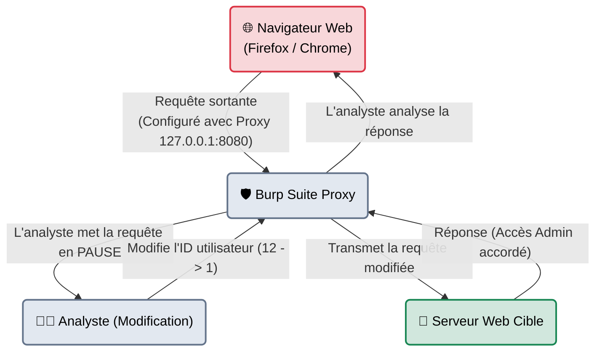
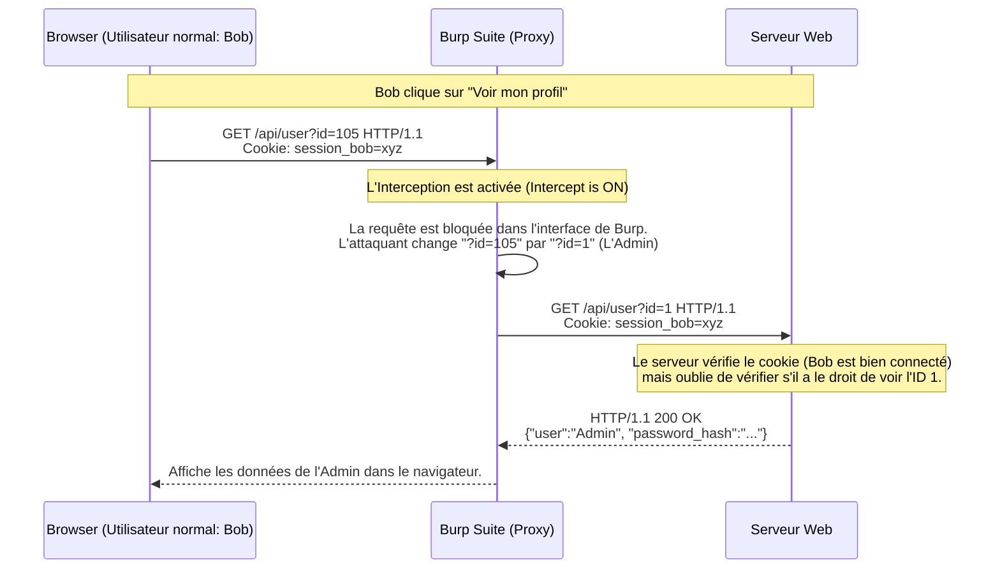

# Burp Suite — Le Douanier du Web

<div
  class="omny-meta"
  data-level="🔴 Avancé"
  data-version="Community & Pro"
  data-time="~60 minutes">
</div>

<div style="text-align: center; margin: 0 auto;">
    
</div>

## Introduction

!!! quote "Analogie pédagogique — Le Douanier Malveillant"
    Imaginez que votre navigateur web soit un citoyen écrivant une lettre (Requête) à sa banque (Serveur Web) pour demander un retrait. En temps normal, la lettre part dans une enveloppe scellée (HTTPS) directement à la banque.
    **Burp Suite**, c'est un agent de douane corrompu que vous placez volontairement entre vous et la banque. Il ouvre la lettre scellée, vous permet de raturer le montant ("retirer 10€" devient "retirer 10 000€"), referme l'enveloppe et la transmet à la banque. La banque pense que la lettre vient directement de vous.

Développé par **PortSwigger**, Burp Suite est la plateforme standard de l'industrie pour les tests de sécurité des applications web. Son module principal est un **Proxy d'interception**, mais il contient tout un écosystème d'outils (Repeater, Intruder, Sequencer) pour manipuler les requêtes HTTP/HTTPS de manière chirurgicale.

<br>

---

## Architecture & Mécanismes Internes

### 1. Architecture Logicielle (L'Interception MITM)
Burp Suite fonctionne sur le principe d'une attaque de l'Homme du Milieu (Man-in-the-Middle) locale. Pour intercepter le trafic HTTPS chiffré, Burp force le navigateur à accepter son propre certificat racine (CA).



### 2. Séquence d'Interception d'une Faille (IDOR)
Voici la modélisation au niveau paquet d'une attaque d'usurpation d'identité (Insecure Direct Object Reference) à l'aide de Burp.



<br>

---

## Les Outils Internes (Le Vocabulaire)

Burp est divisé en plusieurs modules (Onglets) ayant chacun un rôle offensif précis.

| Module | Fonction | Cas d'usage métier |
| :--- | :--- | :--- |
| **Proxy** | Interception en direct | Pour naviguer sur le site et mettre les requêtes en pause ("Drop" ou "Forward") afin de voir le trafic caché (requêtes AJAX). |
| **Repeater** | Le Laboratoire Manuel | Vous prenez une requête capturée dans le Proxy et l'envoyez dans le Repeater. Vous pouvez rejouer cette même requête 100 fois en changeant une virgule à chaque fois, sans avoir à recliquer sur le navigateur. |
| **Intruder** | Le Fuzzer Semi-Automatique | Vous marquez une zone (ex: un paramètre `id=§1§`) et Burp va envoyer 1000 requêtes en remplaçant `1` par `2`, `3`, `4`... Idéal pour le Brute-Force ou la découverte de dossiers. |
| **Decoder** | Le couteau suisse | Si vous voyez `%20` ou un bloc Base64 dans une requête, vous l'envoyez au Decoder pour le traduire en clair instantanément. |

<br>

---

## Installation & Configuration

Burp Suite est une application Java pré-installée sur Kali Linux, mais son paramétrage réseau (le certificat SSL) est la principale cause d'échec pour les débutants.

### 1. Lancement et Arguments JVM
Pour de gros projets, Burp (Java) consomme énormément de RAM. Il faut augmenter la limite lors du lancement.
```bash title="Lancement avec allocation de mémoire (4 Go)"
java -jar -Xmx4G /usr/bin/burpsuite
```

### 2. Le Routage par le Proxy (curl)
Vous n'êtes pas obligé d'utiliser un navigateur. Vous pouvez faire passer n'importe quel outil CLI par Burp pour voir ce qu'il envoie vraiment !
```bash title="Faire passer une commande curl à travers Burp"
# Le proxy Burp tourne par défaut sur 127.0.0.1:8080
curl -x http://127.0.0.1:8080 http://testphp.vulnweb.com/login.php
```
*La requête va apparaître dans l'onglet Proxy de Burp, même si elle vient du terminal.*

### 3. Le Certificat d'Autorité (CA)
Sans cette étape, tous les sites HTTPS afficheront une erreur `SEC_ERROR_UNKNOWN_ISSUER` dans votre navigateur.
1. Lancez Burp.
2. Allez sur `http://burp` dans votre navigateur proxyfié.
3. Téléchargez le certificat CA (en haut à droite).
4. Importez-le dans les paramètres de sécurité de Firefox (Privacy & Security > Certificates > View Certificates > Import) et cochez "Trust this CA to identify websites".

<br>

---

## Workflow Opérationnel & Lignes de Commande (Intruder)

Bien que Burp soit graphique, son utilisation requiert une syntaxe très précise, particulièrement dans l'**Intruder** pour l'automatisation des attaques.

### Le Brute-Force avec Intruder (Sniper vs Battering Ram)

Admettons que nous interceptons une requête de connexion :
```http
POST /login.php HTTP/1.1
Host: target.com
Content-Type: application/x-www-form-urlencoded

username=admin&password=password123
```

Nous envoyons cette requête à l'Intruder (`Ctrl+I`). Nous devons placer des marqueurs de position (`§`) sur les variables à attaquer.

#### Cas 1 : L'attaque Sniper (1 Dictionnaire, 1 Position)
Nous connaissons l'utilisateur (`admin`), nous voulons tester 1000 mots de passe.
Nous surlignons `password123` et cliquons sur "Add §".
```http
username=admin&password=§password123§
```
*Configuration : Type = Sniper. Payloads = Fichier `rockyou.txt`.*

#### Cas 2 : L'attaque Cluster Bomb (2 Dictionnaires, 2 Positions)
Nous ne connaissons ni le nom, ni le mot de passe.
```http
username=§admin§&password=§password123§
```
*Configuration : Type = Cluster Bomb.*
- *Payload Set 1 (username) : fichier `users.txt` (10 mots)*
- *Payload Set 2 (password) : fichier `passwords.txt` (10 mots)*
*Résultat : Burp testera toutes les combinaisons possibles (10 x 10 = 100 requêtes).*

<br>

---

## Contournement & Furtivité (Evasion)

Burp Suite est au cœur de l'évasion des **WAF (Web Application Firewalls)**. Puisque vous avez un contrôle total sur l'en-tête HTTP avant qu'il ne parte, vous pouvez manipuler les règles.

1. **Spoofing d'IP source (Bypass de restriction IP)** :
   Dans l'outil Repeater, vous ajoutez manuellement des en-têtes HTTP pour faire croire au pare-feu que vous venez de l'intérieur de l'entreprise.
   ```http title="Ajout manuel dans Burp Repeater"
   GET /admin-dashboard HTTP/1.1
   Host: target.com
   X-Forwarded-For: 127.0.0.1
   X-Real-IP: 192.168.1.10
   ```
   *Si le développeur s'est fié à `X-Forwarded-For` au lieu de l'IP TCP réelle, le WAF vous laissera passer.*

2. **Changement du Verb HTTP (Bypass d'authentification)** :
   Si le pare-feu bloque l'accès à `GET /admin`, vous pouvez faire un clic droit dans Burp -> "Change request method" pour transformer la requête en `POST /admin` ou `HEAD /admin`. Parfois, les règles de sécurité sont mal écrites et ne bloquent que le `GET`.

<br>

---

## Bonnes & Mauvaises Pratiques (Do's & Don'ts)

| Action | Recommandation | Explication technique |
|---|---|---|
| ✅ **À FAIRE** | **Utiliser le Scope (Target > Scope)** | Dès que vous lancez Burp, ajoutez le domaine cible (ex: `*.omnyvia.com`) dans le *Scope*, et filtrez l'historique HTTP pour ne voir "Que les items dans le scope". Sinon, Burp va intercepter vos requêtes Slack, Windows Update et Gmail en arrière-plan, ce qui polluera totalement votre environnement de travail. |
| ❌ **À NE PAS FAIRE** | **Laisser l'Intercept ON en permanence** | L'erreur classique du débutant : "Mon internet ne marche plus !". L'onglet *Proxy > Intercept* retient chaque requête. Si vous ne cliquez pas sur "Forward", votre navigateur restera figé à l'infini en attendant le serveur. Coupez l'intercept (Intercept is OFF) quand vous voulez juste naviguer. |

<br>

---

## Avertissement Légal & Risques Applicatifs

!!! danger "Modification de la Base de Données en Prod"
    Burp vous permet de modifier les requêtes **à la volée**. Contrairement au scan de ports qui est "read-only", ici vous injectez de la donnée.
    
    1. Si vous interceptez une requête d'achat, modifiez le prix à `0.00€` et l'envoyez au serveur, vous commettez une fraude et une altération de système (Délit pénal).
    2. Utiliser l'Intruder sans Rate-Limiting (limitation de vitesse) sur un formulaire de login va générer 500 requêtes par seconde, provoquant un DoS sur la base de données SQL ou verrouillant les comptes de tous les utilisateurs légitimes (Account Lockout). L'audit doit toujours se faire avec des délais (Throttling).

<br>

---

## Conclusion

!!! quote "Ce qu'il faut retenir"
    Si vous ne deviez maîtriser qu'un seul outil pour toute votre carrière en cybersécurité offensive, c'est **Burp Suite**. Presque 80% des failles applicatives (Injections SQL, XSS, CSRF, IDOR) sont impossibles à détecter avec un simple navigateur, car les navigateurs nous empêchent de modifier les champs cachés ou les cookies. Burp vous donne le pouvoir de "voir la matrice" en temps réel.

> Bien que Burp Community soit gratuit, sa version pro est très chère et il limite la vitesse de son module Intruder. Si vous cherchez un outil totalement gratuit, open-source, et complètement automatisable via CI/CD, l'alternative numéro un est **[OWASP ZAP →](./zap.md)**.


