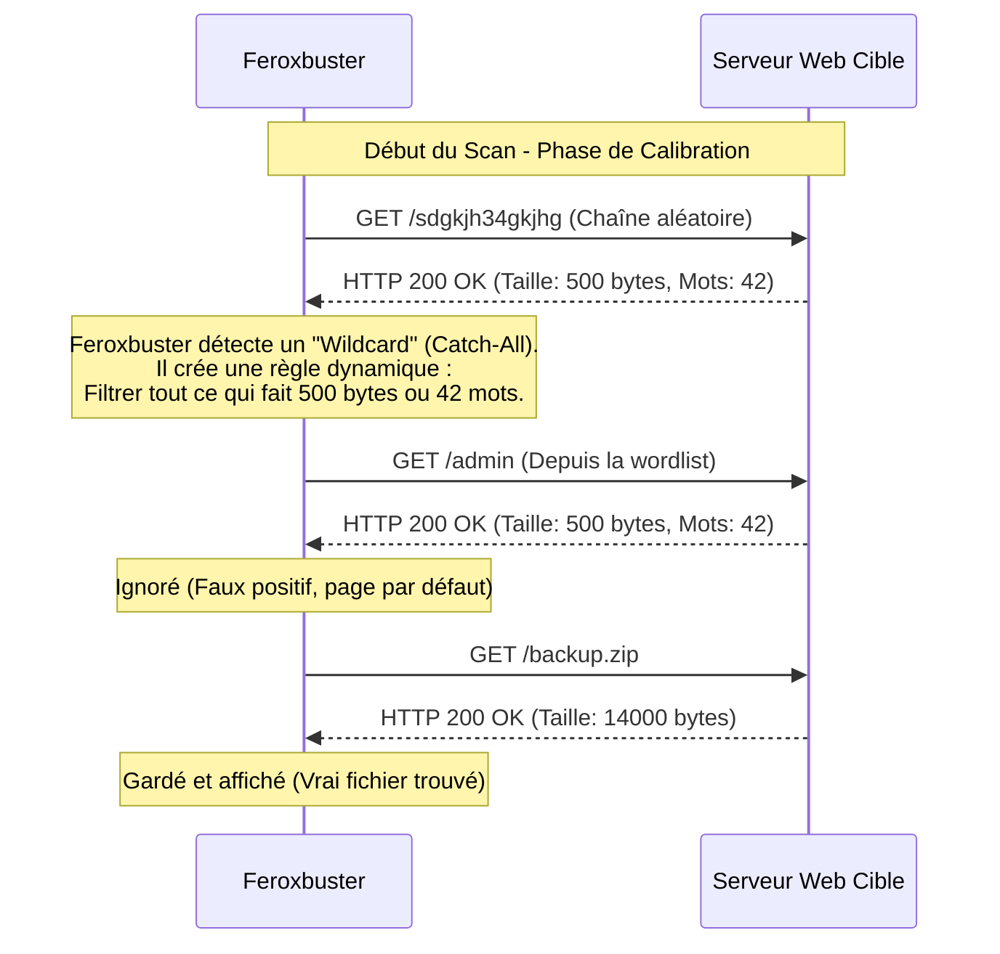

---
description: "Feroxbuster — Le fuzzer récursif écrit en Rust. L'outil idéal pour cartographier automatiquement l'intégralité d'une arborescence complexe sans intervention humaine."
icon: lucide/book-open-check
tags: ["RED TEAM", "WEB", "FUZZING", "FEROXBUSTER", "RUST", "RECURSION"]
---

# Feroxbuster — L'Essaim Autonome

<div
  class="omny-meta"
  data-level="🟢 Débutant"
  data-version="2.10.0+"
  data-time="~35 minutes">
</div>


## Introduction

!!! quote "Analogie pédagogique — L'Essaim de Drones Explorateurs"
    Si **Gobuster** est un soldat qui enfonce toutes les portes du rez-de-chaussée mais s'arrête là, **Feroxbuster** est un essaim de drones autonomes.
    Dès qu'un drone trouve une porte ouverte (un dossier valide comme `/api`), il se clone automatiquement et envoie ses clones explorer toutes les portes *à l'intérieur* de ce nouveau dossier. Ce processus d'exploration (la récursivité) continue de s'enfoncer jusqu'à ce que tout le bâtiment soit cartographié de la cave au grenier, sans que vous n'ayez besoin de taper une nouvelle commande.

Développé en **Rust** (ce qui garantit une gestion mémoire parfaite et une vitesse phénoménale), `feroxbuster` a été conçu spécifiquement pour la découverte web de type "Directory/File Brute-Forcing". Son point fort absolu est sa **récursivité native**. Là où avec d'autres outils il faut relancer manuellement un scan sur chaque dossier découvert, Feroxbuster fait le travail de manière totalement automatisée.

<br>

---

## Architecture & Mécanismes Internes

### 1. Le Moteur de Récursivité Asynchrone
Feroxbuster gère un système de file d'attente (Queue) dynamique. Chaque fois qu'il obtient une réponse "200 OK" ou "301 Redirect" qui correspond à un dossier, il ajoute cette nouvelle URL à sa file de travail.

```mermaid
flowchart TD
    %% Couleurs à fort contraste
    classDef attacker fill:#f8d7da,stroke:#dc3545,stroke-width:2px,color:#000
    classDef logic fill:#e2e8f0,stroke:#64748b,stroke-width:2px,color:#000
    classDef target fill:#d1e7dd,stroke:#198754,stroke-width:2px,color:#000

    A("👨‍💻 Attaquant (Lancement initial)") -->|"Scan: target.com/"| B{"Cible Web"}
    
    B -->|Code 404 (Ignoré)| C("❌ /does_not_exist")
    B -->|Code 200 (Dossier trouvé)| D("✅ /api")
    B -->|Code 200 (Dossier trouvé)| E("✅ /assets")
    
    D -->|"Ajoute à la Queue (Auto)"| F("🔄 Scan: target.com/api/")
    E -->|"Ajoute à la Queue (Auto)"| G("🔄 Scan: target.com/assets/")
    
    F -->|Code 200| H("✅ /api/v1")
    H -->|"Ajoute à la Queue (Auto)"| I("🔄 Scan: target.com/api/v1/")
    
    I -->|Code 200 (Fichier trouvé)| J("📄 /api/v1/users.json")

    class A attacker
    class D,E,F,G,H,I logic
    class B,C,J target
```

### 2. Flux de Filtration Intelligente (Sequence Diagram)
Feroxbuster embarque un filtre natif anti-wildcard très avancé pour éviter les boucles infinies de faux positifs.



<br>

---

## Intégration dans la Kill Chain

| Phase Précédente | Feroxbuster | Phase Suivante |
| :--- | :--- | :--- |
| **Reconnaissance Initiale** <br> (*Nmap / Wappalyzer*) <br> On sait que la cible fait tourner un serveur Apache. | ➔ **Cartographie Profonde (Spidering Forcé)** ➔ <br> Extraction récursive de toute l'arborescence du serveur. | **Analyse de Code / Exploit** <br> (*Burp Suite / SQLMap*) <br> Focus sur l'API `/v2/internal/users` découverte lors du scan. |

<br>

---

## Workflow Opérationnel & Lignes de Commande Avancées

L'ergonomie de la ligne de commande de Feroxbuster est l'une des meilleures du marché, avec une barre de progression interactive extrêmement propre.

### 1. Scan Récursif Standard
Le cas d'usage le plus courant : scanner un site et extraire des fichiers PHP, HTML et des archives (ZIP, BAK).
```bash title="Cartographie profonde"
feroxbuster -u http://10.10.10.42 \
            -w /usr/share/wordlists/SecLists/Discovery/Web-Content/raft-large-directories.txt \
            -x php,html,bak,zip \
            -t 50
```
*Le flag `-x` indique les extensions à accoler à chaque mot testé. La récursivité est activée par défaut.*

### 2. Filtrage Avancé & Limitation de Profondeur
La récursivité peut être un piège si le site génère des dossiers à l'infini (ex: les calendriers `/2023/10/12/...`). On peut limiter la profondeur d'exploration avec `--depth`.
```bash title="Scan sous contrôle"
feroxbuster -u https://target.com \
            -w list.txt \
            --depth 2 \
            --filter-status 403,500 \
            --filter-lines 10
```
*`--depth 2` signifie qu'il n'explorera que `/dossier1/dossier2/`, mais pas au-delà. `--filter-lines 10` ignorera toutes les pages ayant exactement 10 lignes de code source.*

### 3. Extraction de Liens (Extract Links)
Une fonctionnalité géniale inspirée de `hakrawler`. Feroxbuster peut analyser le code HTML des pages qu'il trouve pour extraire de nouveaux mots à tester.
```bash title="Le mode Araignée Mutante"
feroxbuster -u https://target.com --extract-links
```
*Il va lire le code source, voir une balise `<script src="/js/app_v2.js">`, et immédiatement ajouter `/js/app_v2.js` à sa liste d'exploration sans même que ce fichier ne soit dans votre dictionnaire !*

<br>

---

## Contournement & Furtivité (Evasion)

Comme tous les fuzzer modernes, il faut tricher avec les en-têtes pour passer sous les radars des WAF.

1. **Routage du trafic à travers Burp Suite (Replay Proxy)** :
   Une option vitale pour les Pentesters professionnels. Vous pouvez dire à Feroxbuster d'envoyer tout son trafic normal, mais **seulement** quand il trouve un code 200 OK, il renvoie cette requête via Burp Suite.
   ```bash title="Intégration parfaite avec Burp"
   feroxbuster -u http://target.com -w list.txt --replay-proxy http://127.0.0.1:8080
   ```
   *Gain de temps absolu : Votre historique Burp ne sera pas pollué par 100 000 requêtes 404. Burp ne verra que les succès, prêts à être analysés manuellement.*

2. **Fuzzing derrière une Authentification (Cookies)** :
   Beaucoup d'outils bloquent devant un portail de connexion. Avec le flag `-b`, vous passez le cookie de session volé ou légitime.
   ```bash title="Bypass d'Authentification"
   feroxbuster -u http://target.com/admin_panel -b "PHPSESSID=kjh34kj5h34kjh5"
   ```

<br>

---

## Bonnes & Mauvaises Pratiques (Do's & Don'ts)

| Action | Recommandation | Explication technique |
|---|---|---|
| ✅ **À FAIRE** | **Mélanger `--extract-links` et un petit dictionnaire** | Si vous utilisez un dictionnaire géant (1.2 millions de mots) avec la récursivité et l'extraction de liens, le scan prendra 4 jours. Privilégiez un petit dictionnaire qualitatif (ex: `common.txt`) et laissez l'extraction de liens faire le gros du travail de découverte contextuelle. |
| ❌ **À NE PAS FAIRE** | **Scanner des API REST en récursif** | Les API modernes (`/api/users/123/profile/settings`) ne sont pas de vrais dossiers physiques sur le serveur (ce sont des routes gérées par le code). La récursivité de Feroxbuster va souvent s'emmêler les pinceaux et tourner en boucle. Pour les API, privilégiez le fuzzing statique avec **ffuf**. |

<br>

---

## Avertissement Légal & Risques Applicatifs

!!! danger "L'Effet Boule de Neige"
    La récursivité est une arme à double tranchant redoutable.
    
    1. Si le site possède un module de calendrier dynamique (chaque mois a un lien vers le mois suivant), Feroxbuster va cliquer sur chaque lien, créant un nouveau job d'exploration, à l'infini (`/2024/01`, puis `/2024/02`, etc).
    2. Ce comportement de "boucle infinie" (Infinite Loop) va saturer la file d'attente de Feroxbuster, mais surtout **provoquer un Déni de Service (DoS)** sur le serveur de l'entreprise en épuisant sa base de données avec des requêtes calendaires inutiles. Restreignez toujours avec l'option `--depth`.

<br>

---

## Conclusion

!!! quote "Ce qu'il faut retenir"
    Écrit en Rust, ultra-rapide, doté d'une interface console magnifique et capable de s'interfacer intelligemment avec Burp Suite via `--replay-proxy`, Feroxbuster est souvent considéré comme l'état de l'art du brute-force de dossiers en 2026. Si vous devez cartographier un site immense dont vous ne connaissez rien, laissez la récursivité travailler pour vous.

> Ces nouveaux outils en Go et Rust sont impressionnants, mais il fut une époque où l'automatisation web passait par un outil bruyant, agressif et écrit en Perl. Découvrons le dinosaure légendaire des scanners web : **[Nikto →](./nikto.md)**.


