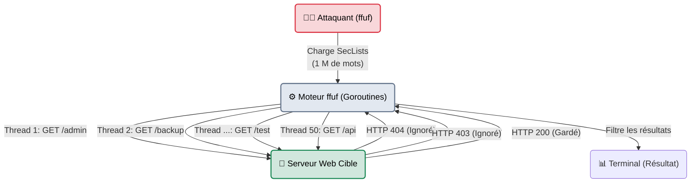
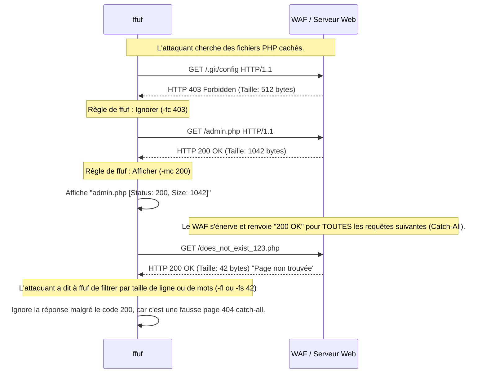

# ffuf — La Mitrailleuse Golang

<div
  class="omny-meta"
  data-level="🟡 Intermédiaire"
  data-version="2.1.0+"
  data-time="~45 minutes">
</div>

<div style="text-align: center; margin: 0 auto;">
    
</div>

## Introduction

!!! quote "Analogie pédagogique — Le Sonar Haute Fréquence"
    Un site web est comme un immense manoir plongé dans le noir. Les moteurs de recherche (Google) ne connaissent que les pièces dont les portes sont grandes ouvertes (Spidering). Mais comment trouver les pièces secrètes ?
    **ffuf** est un sonar à ultra-haute fréquence. Vous lui donnez un dictionnaire de 100 000 mots (le "Wordlist"), et il va crier ces mots dans le noir à la vitesse de l'éclair : *« Est-ce qu'il y a une pièce ADMIN ? » (Erreur 404), « Une pièce BACKUP ? » (Erreur 403), « Une pièce API ? » (Succès 200 !)*. Il analyse l'écho de la cible pour cartographier ce qui est invisible.

Développé en **Go**, `ffuf` a supplanté `dirb` et `wfuzz` grâce à sa vitesse stupéfiante et sa polyvalence extrême. Contrairement à `gobuster` (qui est spécialisé dans des tâches précises), `ffuf` est un fuzzer universel. Son concept est simple : vous placez le mot-clé `FUZZ` n'importe où dans votre commande (dans l'URL, dans les en-têtes HTTP, ou dans les requêtes POST), et il le remplacera par les mots de votre dictionnaire.

<br>

---

## Architecture & Mécanismes Internes

### 1. Architecture Logicielle (Asynchronisme Go)
La vitesse de ffuf provient des *goroutines* (threads très légers). Il peut maintenir des centaines de connexions HTTP simultanées sans surcharger la mémoire de la machine attaquante.



### 2. Mécanique de Filtrage (Sequence Diagram)
Si vous envoyez 10 000 requêtes, vous allez recevoir 10 000 réponses. Le génie de ffuf est sa capacité à filtrer dynamiquement le "bruit" (les faux positifs).



<br>

---

## Intégration dans la Kill Chain

| Phase Précédente | ffuf | Phase Suivante |
| :--- | :--- | :--- |
| **Reconnaissance Passive** <br> (*Subfinder / DNS*) <br> On a une cible valide mais on ne connaît pas sa structure interne. | ➔ **Fuzzing Actif (Découverte)** ➔ <br> Découverte d'un `/api/v2/users` non documenté. | **Interception / Exploitation** <br> (*Burp Suite / SQLMap*) <br> On utilise Burp pour manipuler l'API nouvellement découverte. |

<br>

---

## Workflow Opérationnel & Lignes de Commande Avancées

La maîtrise de `ffuf` repose sur la maîtrise de ses "Matchers" (`-mc`) et "Filters" (`-fc`, `-fs`, `-fl`).

### 1. Découverte de Répertoires Classique
On cherche des dossiers cachés sur le serveur.
```bash title="Directory Brute Forcing"
ffuf -w /usr/share/wordlists/dirb/common.txt \
     -u https://target.com/FUZZ \
     -mc 200,301 \
     -fc 404
```
*Ici, le mot clé `FUZZ` est remplacé par chaque mot du fichier `common.txt`. On lui dit de Matcher (`-mc`) les codes 200 (OK) et 301 (Redirect), et de Filtrer (`-fc`) les codes 404.*

### 2. Découverte de Sous-Domaines Virtuels (VHosts)
C'est la technique reine en Bug Bounty. Parfois, un serveur héberge `dev.target.com` mais ce sous-domaine n'existe pas dans les serveurs DNS publics. Il faut "forcer" le serveur web à nous le révéler en modifiant l'en-tête `Host`.
```bash title="VHost Fuzzing"
ffuf -w /usr/share/wordlists/SecLists/Discovery/DNS/subdomains-top1million-110000.txt \
     -u https://target.com \
     -H "Host: FUZZ.target.com" \
     -fs 4242
```
*Explication avancée : On envoie tout au serveur principal (`https://target.com`), mais on change l'en-tête `Host`. Le `-fs 4242` est crucial : si le serveur renvoie toujours une page par défaut de 4242 octets, on la filtre (`-fs` = Filter Size) pour ne garder que les VHosts qui renvoient une page différente.*

### 3. Fuzzing d'API (Données POST)
Admettons que nous voulons tester une API en envoyant des requêtes JSON pour trouver un identifiant utilisateur valide.
```bash title="POST Fuzzing avec JSON"
ffuf -w ids.txt \
     -u https://api.target.com/v1/user \
     -X POST \
     -H "Content-Type: application/json" \
     -d '{"user_id": "FUZZ"}' \
     -fr "error"
```
*Le `-fr "error"` (Filter Regex) dira à ffuf d'ignorer toutes les réponses HTTP contenant le mot "error" dans le corps de la page.*

<br>

---

## Contournement & Furtivité (Evasion)

Par défaut, ffuf va générer une tornade de requêtes (jusqu'à 10 000 par seconde selon votre connexion). C'est le meilleur moyen de se faire bannir par Cloudflare ou AWS WAF en 3 secondes.

1. **Ralentissement (Throttling)** :
   ```bash title="Limitation de vitesse"
   ffuf -w wordlist.txt -u http://target.com/FUZZ -p 0.5 -t 10
   ```
   *`-t 10` limite à 10 threads simultanés. `-p 0.5` force une pause (delay) de 0,5 seconde entre chaque requête. C'est l'approche "Low and Slow".*

2. **Rotation de User-Agent et Headers aléatoires** :
   Les WAF bloquent souvent le header par défaut `User-Agent: Fuzz Faster U Fool`.
   ```bash title="Usurpation d'identité"
   ffuf -w wordlist.txt -u http://target.com/FUZZ -H "User-Agent: Mozilla/5.0 (Windows NT 10.0; Win64; x64)"
   ```

<br>

---

## Bonnes & Mauvaises Pratiques (Do's & Don'ts)

| Action | Recommandation | Explication technique |
|---|---|---|
| ✅ **À FAIRE** | **Calibration automatique (`-ac`)** | Sur beaucoup de serveurs modernes, taper `http://site.com/dossier_qui_nexiste_pas` ne renvoie pas 404, mais un 200 OK avec une page personnalisée "Oups !". ffuf propose l'option `-ac` (Auto-Calibration). Il va envoyer 3 requêtes aléatoires au début, analyser la taille de la réponse "Oups", et filtrer automatiquement cette taille pour tout le reste du scan. Un gain de temps massif ! |
| ❌ **À NE PAS FAIRE** | **Utiliser le dictionnaire `rockyou.txt` pour du fuzzing web** | L'erreur ultime du débutant. `rockyou.txt` contient 14 millions de mots de passe (ex: `iloveyou123`). Ça ne sert à rien de demander au serveur web s'il existe une page `/iloveyou123.php`. Utilisez **SecLists** (`Discovery/Web-Content/raft-large-directories.txt`). On n'utilise pas le même dictionnaire pour casser un mot de passe et pour découvrir des dossiers web. |

<br>

---

## Avertissement Légal & Risques Applicatifs

!!! danger "Force de Frappe et Déni de Service (DoS)"
    Bien que ffuf ne modifie pas les données de la base (si on l'utilise en mode `GET`), sa vitesse d'exécution est son plus grand danger.
    
    1. Si vous lancez `ffuf -t 200` sur un petit serveur mutualisé (ex: un vieux blog WordPress), la charge du processeur de la cible montera à 100%, l'Apache crashera, et la base de données MySQL bloquera les connexions (Too many connections). C'est un Déni de Service avéré, lourdement sanctionné pénalement.
    2. Modérez toujours vos threads (`-t`) en fonction des capacités de l'infrastructure cible (déterminées lors de la phase de reconnaissance passive).

