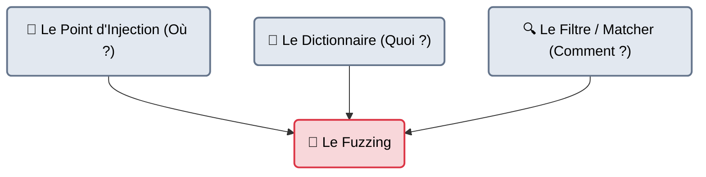
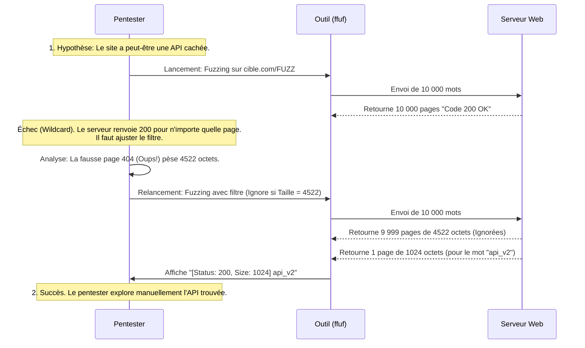

---
description: "Le Fuzzing Web — Cadre théorique et méthodologique. Comprendre la différence entre Fuzzing, Brute-Force, et comment choisir les bons dictionnaires pour découvrir des vulnérabilités complexes."
icon: lucide/book-open-check
tags: ["THEORY", "WEB", "FUZZING", "BRUTE FORCE", "METHODOLOGY"]
---

# Le Fuzzing Web — Théorie & Méthodologie

## Introduction

!!! quote "Analogie pédagogique — Le Trousseau de Clés et le Crash-Test"
    Il y a souvent une confusion entre le Brute-Force et le Fuzzing pur.
    - Le **Brute-Force**, c'est avoir un trousseau de 10 000 clés (les mots de passe ou les noms de dossiers) et les essayer une par une dans la serrure. Si ça tourne, vous entrez.
    - Le **Fuzzing pur**, c'est jeter des cailloux, de l'acide, de la colle et des explosifs dans la serrure pour voir comment elle réagit. L'objectif n'est pas d'entrer proprement, mais de provoquer un "comportement inattendu" (un crash, une erreur SQL, un buffer overflow) pour prouver que la serrure est mal conçue.

Dans le monde du Pentest Web, le terme "Fuzzing" (utilisé par des outils comme `ffuf` ou `wfuzz`) désigne en réalité un hybride : du **Brute-Force de Découverte**. On injecte des données semi-aléatoires ou issues de dictionnaires massifs (Wordlists) dans les paramètres d'une application web (URL, Headers, JSON) pour découvrir des ressources cachées ou forcer l'application à révéler des erreurs de débogage.

 

---

## Les Trois Piliers du Fuzzing Web

Une attaque de Fuzzing Web ne s'improvise pas. Elle repose sur trois composants indissociables. Si l'un des trois est mauvais, l'attaque échoue.

### 1. Le Point d'Injection
Où placez-vous le curseur d'attaque (le fameux mot-clé `FUZZ`) ?
- **Dans l'URL (Path Fuzzing)** : `http://cible.com/FUZZ` (Recherche de dossiers).
- **Dans le sous-domaine (VHost Fuzzing)** : `Host: FUZZ.cible.com` (Recherche de serveurs virtuels).
- **Dans la Query (Parameter Fuzzing)** : `http://cible.com/index.php?FUZZ=1` (Recherche de paramètres cachés, ex: `?debug=1`).
- **Dans les Valeurs (Data Fuzzing)** : `{"user_id": "FUZZ"}` (Recherche de vulnérabilités d'injection, ex: IDOR, SQLi).

### 2. Le Dictionnaire (Wordlist)
C'est le carburant de l'attaque. L'erreur la plus commune est d'utiliser un dictionnaire inadapté. Le dépôt GitHub de référence mondial est **SecLists** (créé par Daniel Miessler).

| Objectif | Fichier SecLists recommandé | Pourquoi ? |
| :--- | :--- | :--- |
| **Dossiers Web** | `Discovery/Web-Content/raft-large-directories.txt` | Contient les noms de dossiers les plus extraits d'Internet (robots.txt, admin, api). |
| **Paramètres GET/POST** | `Discovery/Web-Content/burp-parameter-names.txt` | Contient les variables communes (id, page, debug, token). |
| **Failles XSS/SQLi** | `Fuzzing/XSS/XSS-Polyglots.txt` | Ne contient pas de "mots", mais des symboles complexes (`'">><script>`) pour faire planter le serveur. |
| **Mots de passe** | `Passwords/Leaked-Databases/rockyou.txt` | **Uniquement pour les formulaires de login**. Ne jamais utiliser pour chercher des dossiers. |

### 3. Le Filtrage (Matcher / Filter)
Si vous envoyez 50 000 requêtes, vous recevrez 50 000 réponses. Si vous ne configurez pas correctement l'outil pour ignorer le "Bruit" (les faux positifs), vous allez devoir lire 50 000 lignes dans votre terminal.
*L'art du fuzzing réside dans l'élimination des faux positifs.*

 

---

## Le Processus Mentale de l'Analyste (Sequence Diagram)

Le fuzzing n'est pas un processus automatique. C'est une boucle itérative d'essai-erreur menée par le pentester.

 

---

## Les Protections Modernes (Ce qui bloque le Fuzzing)

Le Fuzzing est l'activité la plus bruyante du piratage. Aujourd'hui, les architectures Cloud (AWS, Azure) et les CDN (Cloudflare) ont des mécanismes de défense natifs contre cette pratique.

1. **Le Rate Limiting (Limitation de Taux)** : Le pare-feu bloque toute adresse IP qui fait plus de 50 requêtes par minute.
   *Contournement* : Diminuer la vitesse de l'outil (Throttling) ou faire de la rotation d'IP (Proxy Chains).
2. **Le Catch-All (Wildcard)** : Le serveur est configuré pour ne **jamais** renvoyer d'erreur 404 (Not Found). Si la page n'existe pas, il redirige (302) vers l'accueil.
   *Contournement* : Filtrer les résultats par "Taille de page" ou "Nombre de mots" (car la vraie page cachée aura une taille différente de la page d'accueil).
3. **Le WAF (Web Application Firewall)** : Le pare-feu analyse le contenu du paramètre. S'il voit un payload de Fuzzing XSS (ex: `<script>`), il bloque l'IP instantanément.

 

---

## Bonnes & Mauvaises Pratiques (Do's & Don'ts)

| Action | Recommandation | Explication technique |
|---|---|---|
| ✅ **À FAIRE** | **Adapter la Wordlist à la technologie** | Si l'outil Wappalyzer vous indique que la cible est un serveur "IIS" (Microsoft Windows), ne fuzzez pas avec un dictionnaire qui cherche des fichiers `.php` ou `.sh`. Utilisez un dictionnaire IIS cherchant des `.asp` ou `.aspx`. |
| ❌ **À NE PAS FAIRE** | **Fuzzer une URL avec un ID aléatoire** | Fuzzer `http://cible.com/profile.php?id=FUZZ` avec des chiffres de 1 à 1 000 000 est une très mauvaise idée. Vous allez récupérer 1 million de profils valides, ce qui va surcharger votre disque dur et saturer la base de données client. Cela s'appelle du "Scraping" et c'est souvent destructeur en pentest. Testez quelques ID, puis utilisez l'Intruder de Burp proprement. |

 

---

## Avertissement Légal & Éthique

!!! danger "Fuzzing aveugle = Risque de destruction"
    Fuzzer les paramètres d'une API ou d'un formulaire (Data Fuzzing) sans comprendre le comportement de l'application est la cause numéro 1 d'incidents critiques en Pentest.
    
    Si vous fuzzez un formulaire de contact sans savoir que chaque requête envoie un véritable email au service client, vous allez envoyer 100 000 emails en 2 minutes (Mail Bombing / DoS). 
    Si vous fuzzez le paramètre "action" d'une API, vous pourriez tomber aléatoirement sur `action=delete_all_users`. 
    **Ne fuzzez jamais les requêtes d'état (POST/PUT/DELETE) à l'aveugle en production.**

 

---

## Conclusion

!!! quote "Ce qu'il faut retenir"
    Le Fuzzing web n'est pas "un outil", c'est une méthode d'investigation scientifique par force brute intelligente. Les outils (`ffuf`, `gobuster`, `wfuzz`) changeront avec les années, mais la maîtrise du trio "Point d'injection + Dictionnaire + Filtrage" restera la compétence fondamentale pour cartographier et casser des applications web.

> Le web applicatif étant désormais maîtrisé, il est temps de s'attaquer à la vulnérabilité la plus ancienne, la moins patchable et la plus dangereuse de l'histoire de l'informatique : l'Être Humain. Bienvenue dans l'Étape 7 : **[Social Engineering & Phishing →](../se/index.md)**.

