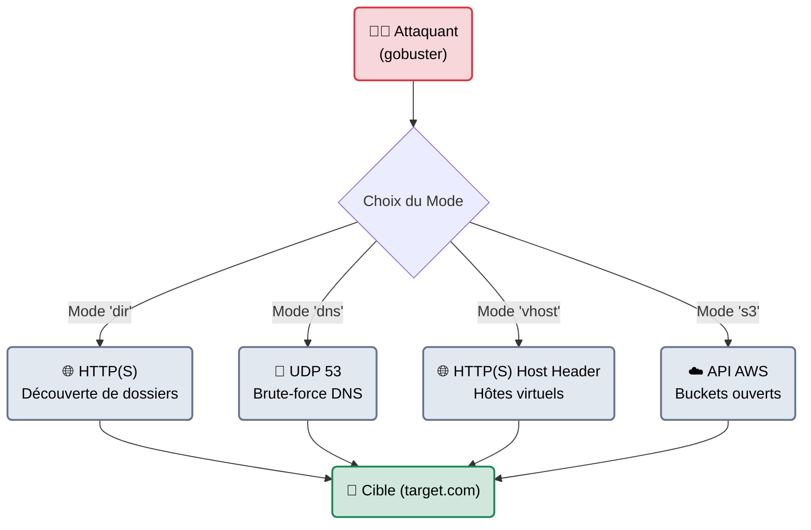
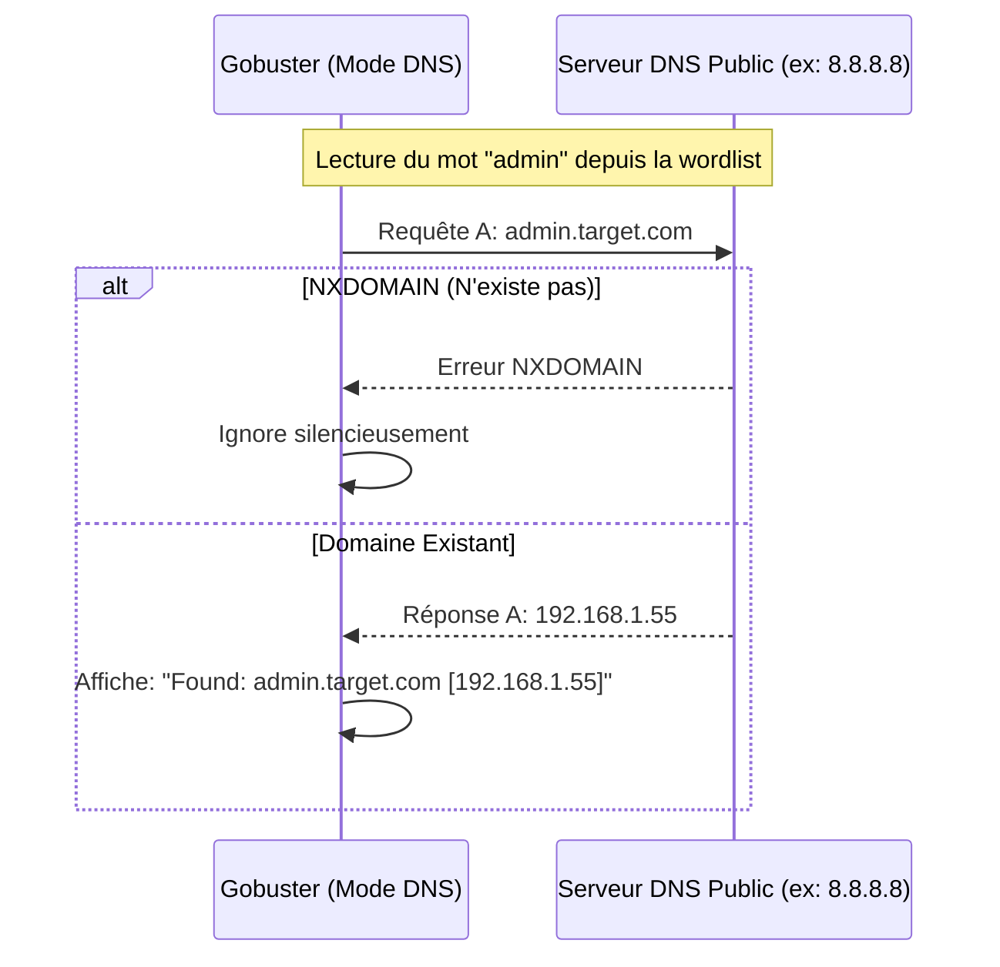

---
description: "Gobuster — Un outil de force brute en Go ultra-rapide, spécialisé dans la découverte de dossiers cachés, de sous-domaines DNS et de Virtual Hosts."
icon: lucide/book-open-check
tags: ["RED TEAM", "WEB", "DNS", "GOBUSTER", "BRUTE FORCE"]
---

# Gobuster — Le Bélier de Siège

<div
  class="omny-meta"
  data-level="🟢 Débutant"
  data-version="3.6+"
  data-time="~30 minutes">
</div>


## Introduction

!!! quote "Analogie pédagogique — Le Bélier de Siège"
    Si **ffuf** est un commando polyvalent capable de s'infiltrer n'importe où (en modifiant les en-têtes, le JSON, les cookies), **Gobuster** est un bélier de siège médiéval. Il n'a pas la finesse d'un scalpel, mais il est fait pour une tâche précise : frapper extrêmement fort et extrêmement vite sur la porte d'un serveur pour trouver ce qui se cache derrière (fichiers, dossiers, sous-domaines).

Développé en **Go**, `gobuster` est l'un des outils de brute-force les plus populaires de la communauté. Sa force réside dans sa spécialisation. Au lieu de devoir mémoriser une syntaxe complexe de filtrage (comme avec ffuf), Gobuster propose des **modes d'opération** (`dir`, `dns`, `vhost`, `s3`) qui pré-configurent le moteur pour une attaque spécifique.

<br>

---

## Architecture & Mécanismes Internes

### 1. Les Modes d'Opération (Architecture Modulaire)
Gobuster sépare sa logique selon le type de ressource qu'il attaque. Chaque mode charge des bibliothèques Go différentes (ex: Requêtes HTTP pour le mode `dir`, Résolution UDP/53 pour le mode `dns`).



### 2. Le Mécanisme de Découverte DNS (Sequence Diagram)
L'une des grandes forces de Gobuster est de ne pas se limiter au web. En mode `dns`, il n'interroge pas un serveur web, il bombarde un résolveur DNS pour trouver des sous-domaines (ex: `dev.target.com`).



<br>

---

## Intégration dans la Kill Chain

| Phase Précédente | Gobuster | Phase Suivante |
| :--- | :--- | :--- |
| **OSINT (Découverte Passive)** <br> (*theHarvester / Amass*) <br> On a identifié le domaine principal (target.com). | ➔ **Brute-Force (Découverte Active)** ➔ <br> On force l'infrastructure à révéler ses `dev.`, ses `admin.`, et ses dossiers cachés `/api`. | **Fuzzing Profond** <br> (*ffuf / Burp Suite*) <br> On attaque les paramètres à l'intérieur du dossier fraîchement découvert. |

<br>

---

## Workflow Opérationnel & Lignes de Commande Avancées

La simplicité de Gobuster en fait l'outil préféré des certifications (comme l'OSCP) pour un gain de temps maximal.

### 1. Mode DIR : Recherche de dossiers et extensions
On cherche des dossiers cachés, mais on demande en plus d'ajouter des extensions (`.php`, `.txt`) à chaque mot du dictionnaire.
```bash title="Brute Force Web Classique"
gobuster dir \
  -u http://10.10.10.42 \
  -w /usr/share/wordlists/dirb/common.txt \
  -x php,txt,bak \
  -t 50
```
*Si la wordlist contient le mot `login`, Gobuster testera : `/login`, `/login.php`, `/login.txt`, `/login.bak` avec 50 threads concurrents.*

### 2. Mode DNS : Énumération de sous-domaines
On cherche des sous-domaines en force brute pure. Contrairement au transfert de zone (`dnsenum`), ici on essaie de deviner.
```bash title="Subdomain Brute Forcing"
gobuster dns \
  -d omnyvia.com \
  -w /usr/share/wordlists/SecLists/Discovery/DNS/subdomains-top1million-110000.txt \
  -t 100 \
  -i
```
*Le flag `-i` (Show IP) demandera à Gobuster d'afficher non seulement que le sous-domaine existe, mais aussi son adresse IP résolue.*

### 3. Mode VHOST : Hôtes virtuels cachés
Parfois, plusieurs sites partagent la même adresse IP (Serveur mutualisé). Gobuster modifie l'en-tête `Host` pour trouver ceux qui ne sont pas référencés.
```bash title="VHost Fuzzing"
gobuster vhost \
  -u http://192.168.1.100 \
  -w /usr/share/wordlists/SecLists/Discovery/DNS/subdomains-top1million-110000.txt \
  --append-domain
```
*L'option `--append-domain` ajoute automatiquement le domaine cible après chaque mot (ex: `mot.192.168.1.100`)*.

<br>

---

## Contournement & Furtivité (Evasion)

Comme tous les outils écrits en Go pour la performance, la furtivité n'est pas le but premier de Gobuster. Cependant, quelques options permettent d'éviter les pièges basiques.

1. **Bypass du Filtrage User-Agent** :
   Les configurations Nginx ou Apache par défaut bloquent souvent les User-Agents des scanners connus.
   ```bash title="Changer l'empreinte de Gobuster"
   gobuster dir -u http://target.com -w list.txt -a "Mozilla/5.0 (Windows NT 10.0; Win64; x64) AppleWebKit/537.36"
   ```

2. **Éviter le Wildcard DNS (Catch-All)** :
   Certains administrateurs configurent leur DNS pour répondre "10.0.0.1" même quand le sous-domaine n'existe pas (Wildcard). Gobuster (en mode DNS) affichera alors 100 000 résultats (Faux positifs).
   ```bash title="Ignorer une IP spécifique"
   # Si l'IP générique de redirection est 10.0.0.1, on la blackliste
   gobuster dns -d target.com -w list.txt --wildcard
   ```

<br>

---

## Bonnes & Mauvaises Pratiques (Do's & Don'ts)

| Action | Recommandation | Explication technique |
|---|---|---|
| ✅ **À FAIRE** | **Enregistrer la sortie dans un fichier (`-o`)** | Toujours utiliser l'option `-o resultat.txt`. Un scan `dir` complet peut prendre 2 heures. Si votre terminal plante ou si vous faites un `Ctrl+C` accidentel, vous perdez tout. |
| ❌ **À NE PAS FAIRE** | **Utiliser Gobuster pour du Fuzzing complexe** | Gobuster ne sait pas fuzzer un payload JSON, un Cookie de session ou les paramètres d'une requête POST. Si vous devez tester la valeur d'une variable (ex: `?id=FUZZ`), Gobuster est inutile. Il faut passer sur **ffuf** ou **Burp Intruder**. |

<br>

---

## Avertissement Légal & Risques Applicatifs

!!! danger "Impact sur les serveurs de journalisation (SIEM)"
    Gobuster envoie des milliers de requêtes qui vont générer autant d'erreurs 404.
    
    1. **Coûts financiers pour la cible** : De nombreuses entreprises paient leur solution de centralisation de logs (comme Splunk ou Datadog) au Giga-octet (Go). Remplir leurs journaux web avec 500 000 erreurs 404 peut engendrer une sur-facturation massive pour le client.
    2. Modérez le scan ou prévenez l'équipe Blue Team qu'elle peut ignorer les logs provenant de votre adresse IP d'audit pour la journée afin de ne pas déclencher toutes leurs alertes inutilement.

<br>

---

## Conclusion

!!! quote "Ce qu'il faut retenir"
    Gobuster est l'exemple parfait de l'outil UNIX "Do one thing and do it well". Il est moins flexible que `ffuf`, mais sa syntaxe à base de commandes (`dir`, `dns`, `vhost`) le rend infiniment plus rapide à dégainer pour un pentester sous pression. Il est le point de départ systématique de la phase active sur n'importe quel test d'intrusion web.

> Et si nous voulions aller encore plus loin ? Gobuster découvre des dossiers, mais il faut le relancer à la main pour fouiller à l'intérieur de ces nouveaux dossiers. Pour automatiser cette exploration en profondeur comme un virus qui se répand, nous devons utiliser un outil de brute-force **récursif** : **[Feroxbuster →](./feroxbuster.md)**.


