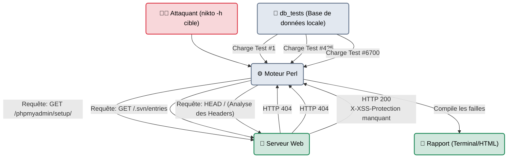
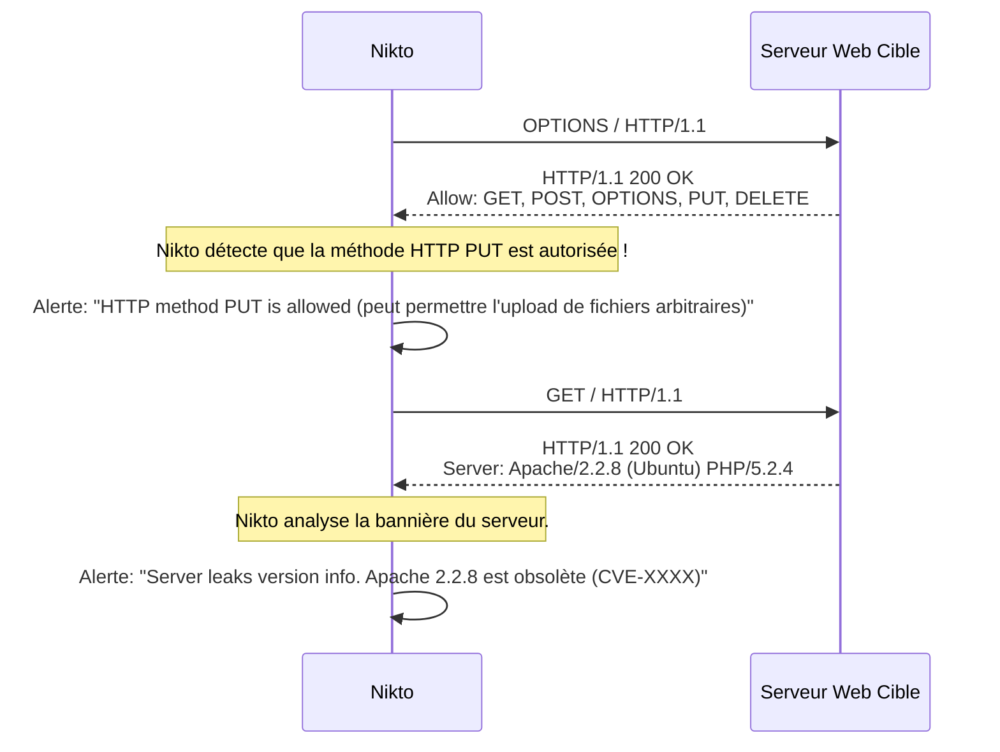

---
description: "Nikto — L'ancêtre des scanners de vulnérabilités web. Un outil écrit en Perl, très bruyant, mais incroyablement efficace pour trouver des erreurs de configuration basiques (fichiers par défaut, en-têtes manquants)."
icon: lucide/book-open-check
tags: ["BLUE TEAM", "RED TEAM", "WEB", "SCANNER", "NIKTO", "LEGACY"]
---

# Nikto — L'Éléphant dans le Magasin de Porcelaine

<div
  class="omny-meta"
  data-level="🟢 Débutant"
  data-version="2.5+"
  data-time="~20 minutes">
</div>


## Introduction

!!! quote "Analogie pédagogique — L'Ivrogne Bruyant"
    Si **ZAP** est un drone furtif et **Feroxbuster** un essaim autonome, **Nikto** est un homme ivre qui marche dans la rue en hurlant à chaque porte : *"EST-CE QUE LA CLÉ EST SOUS LE PAILLASSON ? EST-CE QU'IL Y A UN FICHIER TEST.PHP ICI ?"*.
    Il ne fait absolument aucun effort pour se cacher, il tape sur plus de 7000 fichiers vulnérables connus de manière complètement linéaire. Tout le quartier (les pare-feux, le SOC) l'entend arriver à des kilomètres. Mais bizarrement... parfois, il trouve une porte ouverte que tout le monde avait oubliée.

Créé en 2001 et écrit en **Perl**, `nikto` est un dinosaure de la cybersécurité. Contrairement aux scanners modernes basés sur des templates dynamiques, Nikto fonctionne comme une liste de courses géante. Il vérifie la présence de vieux scripts CGI vulnérables, de fichiers d'installation par défaut (ex: `/setup.php` de vieux CMS), et vérifie si le serveur web (Apache/IIS) est configuré avec les bons en-têtes de sécurité (Headers).

<br>

---

## Architecture & Mécanismes Internes

### 1. Le Moteur Séquentiel Perl
Nikto ne charge pas de requêtes asynchrones complexes. Il se connecte au serveur et exécute séquentiellement des tests issus de sa base de données `db_tests`.



### 2. Séquence de Détection des Erreurs de Configuration
La vraie valeur ajoutée de Nikto aujourd'hui n'est plus de trouver des shellcodes, mais de valider la "bonne hygiène" d'un serveur (Blue Team).



<br>

---

## Intégration dans la Kill Chain

| Phase Précédente | Nikto | Phase Suivante |
| :--- | :--- | :--- |
| **Identification des Ports** <br> (*Nmap*) <br> Nmap a trouvé les ports 80 et 443 ouverts. | ➔ **Quick Win Scanning (Scan de Surface)** ➔ <br> Validation instantanée des erreurs de configuration stupides (low-hanging fruits). | **Exploitation / Fuzzing Lourd** <br> (*Nuclei*) <br> Si Nikto ne trouve rien d'évident, on passe aux scanners de la nouvelle génération. |

<br>

---

## Workflow Opérationnel & Lignes de Commande Avancées

La syntaxe de Nikto est rudimentaire. Le lancement ne requiert quasiment aucune configuration.

### 1. Le Scan Standard Complet
La commande de base que tout pentester lance en arrière-plan en début de mission.
```bash title="Scan basique"
nikto -h http://10.10.10.42 -C all
```
*Le flag `-C all` (CGI Directories) dit à Nikto de tester les fichiers vulnérables dans `TOUS` les dossiers communs (`/cgi-bin/`, `/scripts/`, etc) et pas seulement à la racine du site.*

### 2. Le Scan Authentifié et Export HTML
Si la cible nécessite un nom d'utilisateur et un mot de passe Basic Auth (`.htpasswd`), Nikto peut s'y connecter et générer un rapport visuel pour le client.
```bash title="Authentification et Export"
nikto -h https://admin.target.com \
      -id "admin:SuperPassword" \
      -Format htm -o rapport_nikto.html
```

### 3. Tuning : Limiter le temps d'exécution
Un scan Nikto peut être très long car il envoie des milliers de requêtes. On peut limiter la durée maximale du scan avec `-maxtime`.
```bash title="Scan rapide limité à 5 minutes"
nikto -h http://target.com -maxtime 5m
```

<br>

---

## Contournement & Furtivité (Evasion)

Comme expliqué dans l'analogie, **Nikto n'est pas furtif**. Le `User-Agent` par défaut est `Mozilla/5.00 (Nikto/2.1.6)`... n'importe quel pare-feu bloquera cela.
Cependant, Nikto possède des techniques d'encodage (Evasion techniques) intégrées pour tenter de tromper un IDS (Intrusion Detection System) trop basique.

```bash title="Techniques d'évasion (Libwhisker)"
nikto -h http://target.com -evasion 13
```
*Ici, on active les techniques d'évasion 1 et 3 :*
- *`1` : Random URI encoding (Encode aléatoirement certains caractères en %XX).*
- *`3` : Premature URL ending (Ajoute `/./` ou `/%2e/` pour tromper les regex du pare-feu).*

<br>

---

## Bonnes & Mauvaises Pratiques (Do's & Don'ts)

| Action | Recommandation | Explication technique |
|---|---|---|
| ✅ **À FAIRE** | **Le lancer en premier et l'oublier** | C'est la meilleure façon d'utiliser Nikto. Lancez-le dans un onglet du terminal pendant que vous utilisez votre cerveau et **Burp Suite** sur un autre onglet. S'il trouve un vieux fichier `phpinfo.php` oublié, c'est du temps gagné. S'il ne trouve rien, vous n'avez rien perdu. |
| ❌ **À NE PAS FAIRE** | **Inclure toutes les alertes Nikto dans un rapport professionnel** | Ne copiez-collez jamais les alertes `"X-Frame-Options is not present"` de Nikto dans la section "Failles critiques" de votre rapport de pentest. Ces manques d'en-têtes HTTP sont des "Notes d'information" (Low/Info). Inonder le client avec ça décrédibilisera votre travail. |

<br>

---

## Avertissement Légal & Bruit Réseau

!!! danger "Le déclencheur d'alertes numéro 1"
    Utiliser Nikto sur un serveur de production surveillé par un SOC moderne équivaut à déclencher l'alarme incendie du bâtiment.
    
    1. L'outil va tester des milliers de vulnérabilités vieilles de 20 ans (Faille Shellshock de 2014, scripts Perl de 1999).
    2. Cela va inonder les tableaux de bord des analystes Blue Team avec des alertes de priorité haute (High), masquant potentiellement d'autres attaques réelles en cours (Technique de Diversion).
    3. Si vous ne voulez pas être banni par l'IP du client à la première seconde de l'audit, utilisez Nikto uniquement avec l'accord de la Blue Team ou sur des environnements non surveillés.

<br>

---

## Conclusion

!!! quote "Ce qu'il faut retenir"
    Nikto est vieillissant, lent (car écrit en Perl et synchrone) et bruyant. Pourtant, il reste installé par défaut sur Kali Linux car il excelle dans la détection des vulnérabilités de configuration (Headers, méthodes HTTP PUT/DELETE activées). Il incarne la philosophie du "Quick Win" de la cybersécurité du début des années 2000.

> Le monde a évolué. Aujourd'hui, les serveurs web ne sont plus de vieux Apaches avec des scripts CGI, ce sont des applications React interagissant avec des API complexes. Pour scanner ces technologies modernes à la vitesse de la lumière avec des modèles mis à jour toutes les heures, il faut abandonner le dinosaure Perl et passer à l'arme absolue codée en Go : **[Nuclei →](./nuclei.md)**.


