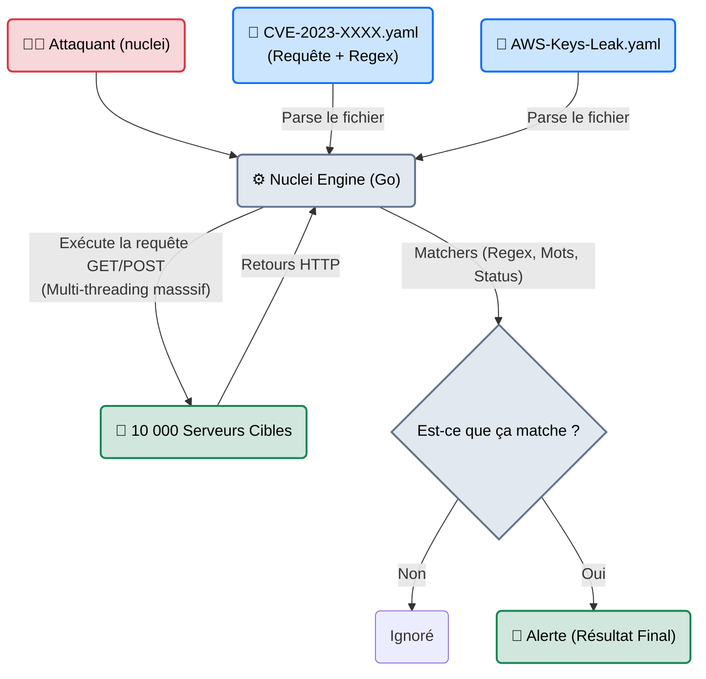
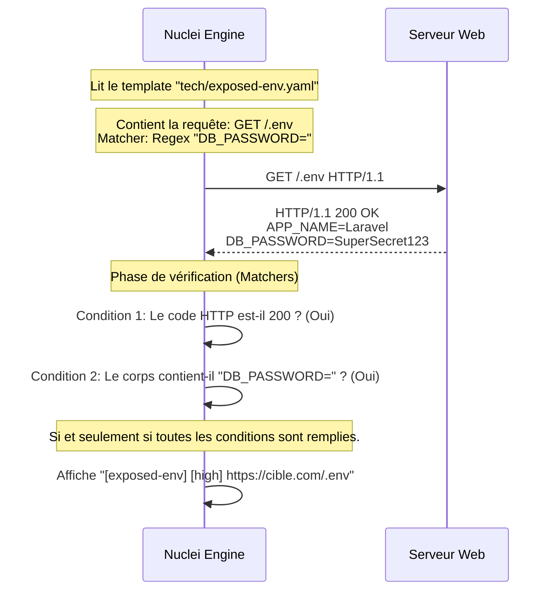

# Nuclei — Le Chasseur de Primes

<div
  class="omny-meta"
  data-level="🔴 Avancé"
  data-version="3.0.0+"
  data-time="~45 minutes">
</div>

<div style="text-align: center; margin: 0 auto;">
    
</div>

## Introduction

!!! quote "Analogie pédagogique — Le Chasseur de Primes et les Avis de Recherche"
    Si **Nessus** est un cabinet d'audit qui vérifie méticuleusement toute l'entreprise pendant 3 semaines, **Nuclei** est un chasseur de primes qui débarque au saloon avec une liasse de 500 avis de recherche ("Wanted Posters").
    Il regarde les visages de tout le monde dans la pièce. Si quelqu'un correspond *exactement* à la photo du braqueur de banque (la vulnérabilité), il tire. Sinon, il repart instantanément. Il ne cherche pas à comprendre le fonctionnement du saloon, il fait de la correspondance de motifs (Pattern Matching) pure, dure, et à la vitesse de l'éclair.

Développé par **ProjectDiscovery** et écrit en Go, `nuclei` a révolutionné le monde du pentest web et du Bug Bounty. Contrairement aux scanners classiques dont le code de détection est compilé et secret (Nessus), Nuclei repose sur des **Templates YAML** écrits et partagés par la communauté. Dès qu'une nouvelle faille zero-day sort sur Twitter (ex: Log4J), un chercheur crée un fichier YAML de 15 lignes, et 5 minutes plus tard, tout le monde peut scanner la planète entière pour trouver cette faille.

<br>

---

## Architecture & Mécanismes Internes

### 1. Le Moteur de Templates YAML
Nuclei sépare complètement le moteur (Engine) de la logique de détection (Templates).



### 2. Le Mécanisme de Détection (Sequence Diagram)
Voici comment Nuclei lit un fichier YAML pour détecter une exposition de fichier de configuration système (ex: `/.env`).



<br>

---

## Intégration dans la Kill Chain

| Phase Précédente | Nuclei | Phase Suivante |
| :--- | :--- | :--- |
| **Résolution Massive** <br> (*httpx / subfinder*) <br> Une liste de 50 000 URLs `https://...` valides récupérées via pipeline Bash. | ➔ **Template Scanning** ➔ <br> Piping direct (`cat urls.txt \| nuclei`) pour trouver la seule URL vulnérable à la CVE de la veille. | **Exploitation Manuelle** <br> (*Navigateur / Burp*) <br> Confirmation visuelle de la vulnérabilité remontée par Nuclei et rédaction du rapport. |

<br>

---

## Workflow Opérationnel & Lignes de Commande Avancées

Nuclei brille par sa capacité à filtrer les tags (Tags) de ses templates. Vous ne scannez pas "tout", vous scannez "intelligemment".

### 1. Le Scan Ciblé (Filtrage par Tags et Sévérité)
Si la cible utilise WordPress, il ne sert à rien de lancer les templates visant Jira ou Tomcat.
```bash title="Scan spécialisé et critique"
nuclei -u https://target.com \
       -tags wordpress,cve \
       -severity critical,high \
       -o rapport_nuclei.txt
```
*Le moteur chargera uniquement les fichiers YAML contenant le mot-clé `wordpress`, appartenant à la famille des `CVE`, et classés comme de sévérité Haute ou Critique.*

### 2. Le Pipeline Bug Bounty (Piping)
C'est le standard de la communauté. On chaînne l'outil de découverte de sous-domaines, puis le vérificateur de ports web, puis Nuclei.
```bash title="L'enchaînement magique de ProjectDiscovery"
subfinder -d omnyvia.com -silent | httpx -silent | nuclei -t cves/ -silent
```
*Ici, les outils communiquent via le flux standard (stdout). Dès que `httpx` confirme qu'un sous-domaine répond sur le port 443, il l'envoie à `nuclei` qui lance instantanément ses templates CVE dessus.*

### 3. Création de votre propre Template
C'est là que Nuclei écrase la concurrence. Vous avez trouvé un comportement spécifique sur un logiciel métier de votre client ? Créez un template en 2 minutes.
```yaml title="custom-audit.yaml"
id: detection-config-backup
info:
  name: Fichier de backup exposé
  author: VotreNom
  severity: medium
requests:
  - method: GET
    path:
      - "{{BaseURL}}/config.bak"
    matchers:
      - type: word
        words:
          - "db_password"
      - type: status
        status:
          - 200
```
*Lancement : `nuclei -u https://cible.com -t custom-audit.yaml`*

<br>

---

## Contournement & Furtivité (Evasion)

Parce qu'il est la star du Bug Bounty, Nuclei est la cible numéro 1 des WAF (Web Application Firewalls). Cloudflare possède des règles spécifiques bloquant l'en-tête natif de Nuclei.

1. **Suppression de l'Empreinte (Header Masking)** :
   ```bash title="Usurpation d'un navigateur légitime"
   nuclei -l urls.txt -t cves/ -H "User-Agent: Mozilla/5.0 (Windows NT 10.0; Win64; x64)" -H "Referer: https://google.com"
   ```

2. **Rate Limiting (Éviter le ban IP)** :
   Nuclei va très, très vite. Par défaut, il envoie 150 requêtes par seconde (`-rate-limit 150`). Pour une cible fragile ou protégée, il faut réduire massivement cette valeur.
   ```bash title="Low and Slow"
   nuclei -u https://target.com -rl 10 -c 2
   ```
   *Limite à 10 requêtes/seconde et 2 connexions concurrentes.*

<br>

---

## Bonnes & Mauvaises Pratiques (Do's & Don'ts)

| Action | Recommandation | Explication technique |
|---|---|---|
| ✅ **À FAIRE** | **Mettre à jour les templates tous les matins** | Nuclei sans mise à jour n'a aucune utilité. Exécutez systématiquement `nuclei -ut` (Update Templates) avant de commencer votre journée de travail. Le flux GitHub communautaire (nuclei-templates) évolue toutes les heures. |
| ❌ **À NE PAS FAIRE** | **Lancer `nuclei -u cible` (Sans filtrage de template)** | Si vous ne spécifiez pas de dossiers (ex: `-t cves/`), Nuclei lancera l'intégralité de sa base (plus de 7000 templates). Cela va tester des panels de routeurs Cisco, des failles de serveurs IoT Chinois, et des failles d'API Kubernetes sur un simple blog WordPress. Vous perdez du temps et vous générez un bruit réseau monstrueux. |

<br>

---

## Avertissement Légal & Interaction avec la Cible

!!! danger "Templates OOB (Out-of-Band) et Modifications"
    Contrairement à un scanner passif, Nuclei possède des templates très agressifs (catégorie `dast` ou certains `cves`).
    
    1. Certains templates exploitent des failles aveugles (Blind RCE / Blind SSRF) en forçant le serveur cible à se connecter à un serveur contrôlé par ProjectDiscovery (OAST - interact.sh) pour prouver que la faille a fonctionné. Envoyer des données hors du réseau du client via ces payloads OOB est souvent une violation stricte du contrat de confidentialité de l'audit (NDA).
    2. N'utilisez pas de templates aléatoires sans en comprendre le code YAML. Si un template contient un payload qui supprime une table SQL pour tester une CVE, vous serez responsable des dégâts en production.

<br>

---

## Conclusion

!!! quote "Ce qu'il faut retenir"
    Nuclei représente le summum du paradigme "Infrastructure as Code" appliqué à la cybersécurité. Sa conception modulaire basée sur le YAML permet à la communauté mondiale de réagir à une faille zero-day et de produire une arme de détection massive en quelques minutes. C'est le scanner de la génération Cloud/DevSecOps.

> Si Nuclei excelle dans la détection des failles standardisées (CVE), il est inefficace pour exploiter une faille logique très spécifique nécessitant des dizaines d'étapes algorithmiques. Pour automatiser l'exploitation d'une injection SQL (et extraire la base de données entière), il faut faire appel au maître incontesté de la discipline : **[SQLMap →](./sqlmap.md)**.


