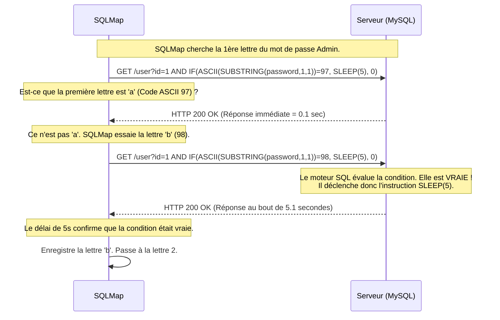

# SQLMap — Le Perceur de Coffre-Fort

<div
  class="omny-meta"
  data-level="🟡 Intermédiaire"
  data-version="1.8+"
  data-time="~50 minutes">
</div>

<div style="text-align: center; margin: 0 auto;">
    
</div>

## Introduction

!!! quote "Analogie pédagogique — Le Perceur de Coffre-Fort à l'Aveugle"
    Imaginez un cambrioleur (le Pentester) face à un coffre-fort (la Base de Données) dont il n'a pas le code. Parfois, le coffre-fort est cassé et crache son contenu quand on tape dessus (Error-Based SQLi).
    Mais le plus souvent, le coffre est silencieux (Blind SQLi). **SQLMap** est l'outil du cambrioleur expert : il pose un stéthoscope sur le coffre, tape une lettre, et écoute. Si le coffre met 5 secondes à répondre, c'est que la lettre était bonne. Si le coffre répond tout de suite, la lettre était fausse. Lettre par lettre, milliseconde par milliseconde, il va extraire le contenu entier du coffre sans jamais l'avoir vraiment ouvert.

Développé en **Python**, `sqlmap` est l'un des outils d'exploitation les plus puissants jamais créés. Lorsqu'un pentester suspecte qu'un paramètre web (ex: `?id=1`) est vulnérable à une injection SQL (SQLi), il le donne à SQLMap. L'outil va tester automatiquement tous les types d'injections possibles (Boolean-based, Time-based, Union-based, Error-based) contre des dizaines de moteurs de bases de données (MySQL, PostgreSQL, Oracle, MSSQL), et si la faille est confirmée, il extraira l'intégralité des données.

<br>

---

## Architecture & Mécanismes Internes

### 1. Le Moteur d'Exploitation (Workflow)
SQLMap ne lance pas de requêtes au hasard. Il suit un arbre de décision heuristique strict pour identifier le moteur de base de données, puis la méthode d'extraction la plus optimisée.

```mermaid
flowchart TD
    %% Couleurs à fort contraste
    classDef attacker fill:#f8d7da,stroke:#dc3545,stroke-width:2px,color:#000
    classDef logic fill:#e2e8f0,stroke:#64748b,stroke-width:2px,color:#000
    classDef target fill:#d1e7dd,stroke:#198754,stroke-width:2px,color:#000

    A("👨‍💻 Attaquant (sqlmap)") -->|"Phase 1: Heuristique"| B("⚙️ Teste le comportement du paramètre")
    
    B -->|"Injection de caractères spéciaux (', \", \)"| C("🏢 Serveur Web")
    
    C -->|"Retourne une erreur SQL"| D("🔥 Mode: Error-Based")
    C -->|"Le contenu de la page change"| E("🔥 Mode: Boolean-Based")
    C -->|"Le temps de réponse augmente (sleep)"| F("🔥 Mode: Time-Based")
    
    D --> G("Phase 2: Extraction de la structure")
    E --> G
    F --> G
    
    G -->|"Requiert les noms des BDD"| C
    
    C -->|"Extrait lettre par lettre"| H("📊 Dump Local (CSV/SQLite)")

    class A attacker
    class B,D,E,F,G logic
    class C target
```

### 2. Mécanique du Time-Based Blind SQLi (Sequence Diagram)
Voici comment SQLMap réussit à extraire le mot de passe de l'administrateur de manière "aveugle", simplement en mesurant le temps que met le serveur à répondre.



<br>

---

## Intégration dans la Kill Chain

| Phase Précédente | SQLMap | Phase Suivante |
| :--- | :--- | :--- |
| **Interception / Proxy** <br> (*Burp Suite*) <br> L'analyste capture une requête HTTP complexe (avec cookies de session) et l'enregistre dans `req.txt`. | ➔ **Exploitation (Exfiltration)** ➔ <br> SQLMap avale le fichier `req.txt` et extrait la table `users`. | **Post-Exploitation / Pivoting** <br> (*Hashcat / Netcat*) <br> Craquage des mots de passe récupérés ou obtention d'un Reverse Shell (`--os-shell`). |

<br>

---

## Workflow Opérationnel & Lignes de Commande Avancées

Les débutants utilisent le paramètre `-u` (URL), mais les professionnels utilisent systématiquement `-r` (Requête interceptée) pour être sûrs de transmettre tous les bons Cookies, Headers, et Tokens CSRF.

### 1. Sauvegarde depuis Burp Suite
Dans **Burp Suite**, faites un Clic-Droit sur la requête vulnérable -> `Save item` (nommez-le `req.txt`).

### 2. Étape 1 : Lister les bases de données (DBS)
On donne le fichier à SQLMap et on lui demande de trouver le point d'injection et de lister les bases de données.
```bash title="Découverte Initiale"
sqlmap -r req.txt --dbs --batch
```
*Le flag `--batch` est la magie de SQLMap : il répondra "Oui / Choix par défaut" à toutes les questions que l'outil pose pendant l'audit, vous permettant d'aller prendre un café.*

### 3. Étape 2 : Lister les tables d'une base
SQLMap a trouvé une base nommée `wordpress_db`. On veut voir ce qu'il y a dedans.
```bash title="Énumération des tables"
sqlmap -r req.txt -D wordpress_db --tables --batch
```

### 4. Étape 3 : Extraire les données (Dump)
On a trouvé la table `wp_users`. On veut récupérer son contenu.
```bash title="Exfiltration finale"
sqlmap -r req.txt -D wordpress_db -T wp_users --dump --batch
```
*SQLMap affichera le tableau dans le terminal et le sauvegardera en local dans le dossier `~/.local/share/sqlmap/output/`.*

### 5. Obtenir un Shell système (Graal absolu)
Si l'utilisateur de la base de données a les droits `DBA` (Database Admin) et que la fonction `INTO OUTFILE` est activée, SQLMap peut écrire un fichier malveillant sur le serveur et vous donner un terminal de commandes (Shell).
```bash title="Prise de contrôle du serveur"
sqlmap -r req.txt --os-shell
```

<br>

---

## Contournement & Furtivité (Evasion)

Par défaut, un WAF (Cloudflare, ModSecurity) va bloquer l'attaque instantanément en voyant des requêtes contenant `AND 1=1` ou `UNION SELECT`. SQLMap embarque un répertoire de **Tamper Scripts** (Scripts de falsification) pour contourner ces protections.

1. **Obfuscation des Requêtes (Tampering)** :
   Au lieu d'envoyer `SELECT id FROM users`, on utilise un script qui obfusque l'espace avec des commentaires : `SELECT/**/id/**/FROM/**/users`. Le WAF ne comprend pas la chaîne, mais le moteur MySQL va l'interpréter correctement.
   ```bash title="Contournement de WAF classique"
   sqlmap -r req.txt --dbs --tamper=space2comment,randomcase
   ```

2. **Changement d'identité (Random Agent)** :
   Par défaut, le User-Agent de l'outil est littéralement `sqlmap/1.8.4...`. C'est suicidaire sur un vrai audit.
   ```bash title="Usurpation de navigateur"
   sqlmap -r req.txt --dbs --random-agent
   ```

<br>

---

## Bonnes & Mauvaises Pratiques (Do's & Don'ts)

| Action | Recommandation | Explication technique |
|---|---|---|
| ✅ **À FAIRE** | **Définir un paramètre précis avec `-p` ou `*`** | Si votre requête a 10 variables (ex: `&id=1&page=2&sort=asc&...`), SQLMap va tester des milliers de payloads sur *chaque* variable. Vous allez perdre des heures. Si vous savez que `id` est vulnérable, forcez l'outil : `sqlmap -r req.txt -p id`. |
| ❌ **À NE PAS FAIRE** | **Lancer un `--dump-all`** | C'est l'erreur fatale. La commande `--dump-all` va aspirer l'intégralité du SGBD. Si la base client fait 40 Go, et que la faille est de type "Time-Based Blind" (1 lettre par seconde), SQLMap mettra **12 ans** à finir son dump, tout en saturant le CPU de la cible. Dumpez uniquement la table critique. |

<br>

---

## Avertissement Légal & Risques Applicatifs

!!! danger "Altération et Instabilité des Bases de Données"
    L'injection SQL est l'une des failles les plus critiques (OWASP Top 1), mais l'utilisation d'outils automatisés comme SQLMap comporte des risques majeurs pour la production :
    
    1. **Surcharge CPU** : Une attaque "Error-Based" ou "Time-Based" massive nécessite que le serveur évalue des centaines de requêtes complexes (`SLEEP()`, `BENCHMARK()`) par seconde. Cela peut provoquer le crash du SGBD et faire tomber l'application entière (Déni de Service).
    2. SQLMap propose des options pour modifier la base (`--sql-shell` -> `DROP TABLE`). Toute altération (mise à jour, suppression) des données en production est non seulement un risque métier immense, mais souvent une violation des règles d'engagement de l'audit. **Lisez toujours ce que SQLMap vous demande avant d'appuyer sur Entrée.**

<br>

---

## Conclusion

!!! quote "Ce qu'il faut retenir"
    SQLMap est magique. Il a transformé la discipline extrêmement complexe de l'exploitation SQL aveugle en un processus presque entièrement automatisé. Sa capacité à détecter les WAF, à utiliser des scripts d'obfuscation (`tamper`) et à craquer automatiquement les mots de passe de base de données en fait l'outil le plus craint par les administrateurs systèmes. L'avoir dans son arsenal est obligatoire, mais savoir restreindre son appétit (avec `--batch` et `-p`) est ce qui fait un bon pentester.

> L'ensemble du socle "Pentest Web & API" est désormais en place. Depuis l'interception chirurgicale avec Burp, en passant par le bruit massif de ffuf et les tirs de précision de Nuclei et SQLMap, la surface d'attaque applicative est totalement couverte.


