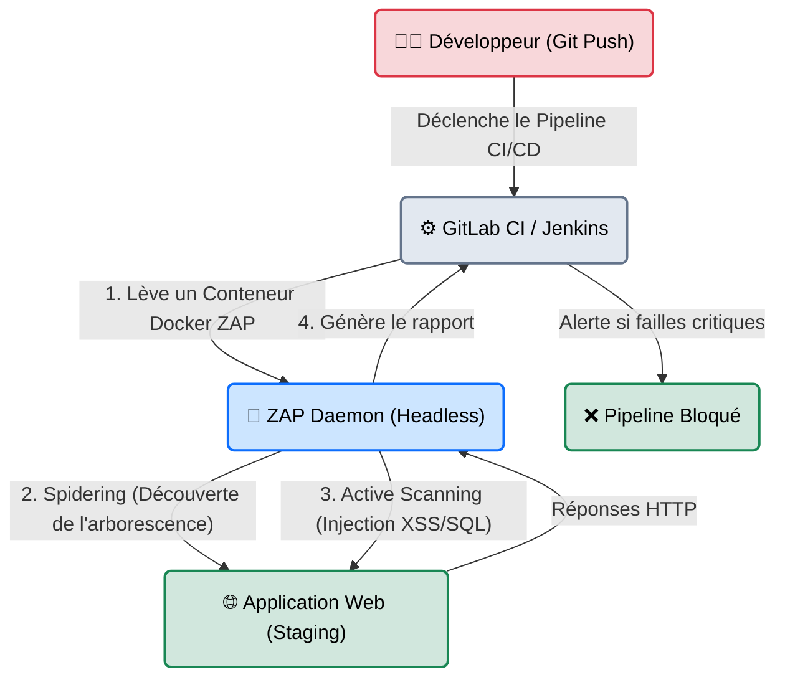

# OWASP ZAP — Le Couteau Suisse Libre

<div
  class="omny-meta"
  data-level="🔴 Avancé"
  data-version="2.15.0+"
  data-time="~50 minutes">
</div>

<div style="text-align: center; margin: 0 auto;">
    
</div>

## Introduction

!!! quote "Analogie pédagogique — Le Drone d'Inspection Automatisé"
    Si **Burp Suite** est le scalpel manuel préféré du chirurgien (le Pentester) opérant sur un patient spécifique, **OWASP ZAP** est un essaim de drones programmables.
    Il peut tout à fait être piloté manuellement (comme Burp), mais sa véritable force réside dans sa capacité à décoller tout seul, parcourir toutes les pièces d'un bâtiment (Spidering), scanner tous les défauts structurels (Active Scan), et revenir avec un rapport formaté, le tout intégré directement dans la ligne de montage de l'usine (DevSecOps).

Maintenu par la fondation **OWASP** (Open Worldwide Application Security Project), le *Zed Attack Proxy* (ZAP) est le scanner de vulnérabilités web open-source le plus utilisé au monde. C'est un Proxy MITM (Man-in-the-Middle) qui offre des capacités de Fuzzing (Fuzzer), d'interception et d'analyse passive/active totalement gratuites, sans les limitations de vitesse imposées par les versions gratuites de ses concurrents commerciaux.

<br>

---

## Architecture & Mécanismes Internes

### 1. Architecture Logicielle (ZAP en mode Daemon)
Dans une entreprise moderne, ZAP ne tourne pas avec une interface graphique sur l'ordinateur de l'auditeur. Il tourne de manière "Headless" (sans écran) sur un serveur d'Intégration Continue (Jenkins/GitLab CI), piloté par une API.



### 2. Le Mécanisme de Scan Actif (Sequence Diagram)
ZAP n'attaque pas à l'aveugle. Il analyse la structure du site et modifie de manière dynamique le comportement de l'application. Voici comment ZAP détecte une faille XSS (Cross-Site Scripting).

```mermaid
sequenceDiagram
    participant Z as ZAP (Active Scanner)
    participant S as Serveur Web Cible
    
    Note over Z,S: Phase 1: Spidering (Découverte)
    Z->>S: GET /contact.php HTTP/1.1
    S-->>Z: HTTP 200 OK (Contient un form avec <input name="message">)
    
    Note over Z,S: Phase 2: Injection du Payload (XSS)
    Z->>S: POST /contact.php<br>message=<script>alert('ZAP')</script>
    
    Note over S: Le serveur ne nettoie pas (sanitization) l'entrée utilisateur.
    
    S-->>Z: HTTP 200 OK<br>... Merci. Votre message <script>alert('ZAP')</script> a été envoyé. ...
    
    Note over Z: ZAP analyse la réponse (Passive Scan sur le retour de l'Active Scan)
    Z->>Z: Le payload est reflété EXACTEMENT dans le HTML, sans encodage.
    Z->>Z: Résultat: Faille XSS Reflected confirmée (Alerte Rouge).
```



<br>

---

## Intégration dans la Kill Chain

| Phase Précédente | OWASP ZAP | Phase Suivante |
| :--- | :--- | :--- |
| **Reconnaissance** <br> (*Subfinder / DNS*) <br> Obtention du domaine cible valide. | ➔ **Interception & Scan Automatisé** ➔ <br> Proxy des requêtes et fuzzing gratuit non bridé. | **Exploitation / Fuzzing Lourd** <br> (*ffuf / sqlmap*) <br> Focus sur un paramètre spécifique mis en évidence par ZAP. |

<br>

---

## Installation & Configuration (Mode Docker)

Bien qu'il existe une interface graphique Java très complète, la méthode d'utilisation la plus moderne pour les Pentesters et Blue Teamers est via les images Docker officielles, qui intègrent des scripts Python d'automatisation.

### Le ZAP Baseline Scan (Test Rapide)
Le script `zap-baseline.py` effectue un Spidering d'une minute puis une analyse *passive* (ne modifie pas les requêtes, écoute juste les erreurs de sécurité HTTP).
```bash title="Lancement avec Docker"
# Exécution du conteneur en pointant vers l'URL cible
docker run -v $(pwd):/zap/wrk/:rw -t owasp/zap2docker-stable zap-baseline.py \
    -t https://testphp.vulnweb.com \
    -g gen.conf \
    -r rapport_baseline.html
```

<br>

---

## Workflow Opérationnel & Lignes de Commande (API)

Les développeurs adorent ZAP car son API (accessible par défaut sur `http://localhost:8080/UI`) permet de piloter 100% des fonctions de l'interface graphique en lignes de commande.

### 1. Démarrage du Démon ZAP
```bash title="Lancer ZAP en arrière-plan sans GUI"
# -daemon : Pas d'interface graphique
# -config api.key=changeMe : Sécurise l'API
zaproxy -daemon -port 8080 -host 127.0.0.1 -config api.key=123456
```

### 2. Déclenchement du Spidering via l'API REST
On ordonne à ZAP d'explorer récursivement le site `http://target.com`.
```bash title="Appel API (cURL) pour lancer l'araignée (Spider)"
curl "http://127.0.0.1:8080/JSON/spider/action/scan/?apikey=123456&url=http://target.com"
```
*Output attendu :*
```json
{"scan": "1"}
```

### 3. Exécution de l'Active Scan (Attaque réelle)
Une fois que le Spider a cartographié les pages, on ordonne à ZAP de lancer ses exploits (injections SQL, XSS, Path Traversal) sur tous les paramètres trouvés.
```bash title="Appel API pour attaquer"
curl "http://127.0.0.1:8080/JSON/ascan/action/scan/?apikey=123456&url=http://target.com&recurse=true"
```
*On peut ensuite utiliser le module HUD (Heads Up Display) de ZAP sur son navigateur pour voir en temps réel l'avancée de l'attaque en surimpression sur le site cible.*

<br>

---

## Contournement & Furtivité (Evasion)

Comme Burp, ZAP est un proxy, il permet de modifier les requêtes à la volée grâce aux **Scripts (Zest ou JavaScript)** intégrés dans l'outil.

1. **Manipulation des Headers (Bypass de WAF)** :
   Dans l'interface GUI de ZAP, l'outil "Replacer" permet d'appliquer une règle globale. Par exemple : Remplacer systématiquement le `User-Agent` de votre navigateur par un `User-Agent` de Googlebot.
   - *Expression régulière :* `User-Agent: .*`
   - *Remplacement :* `User-Agent: Mozilla/5.0 (compatible; Googlebot/2.1; +http://www.google.com/bot.html)`
   *Beaucoup de Pare-feux (WAF) mal configurés laissent passer tout le trafic de Googlebot pour ne pas détruire leur référencement SEO.*

2. **Fuzzing Anti-Rate Limit** :
   Le Fuzzer de ZAP (l'équivalent de l'Intruder de Burp) est **totalement gratuit et sans limitation de vitesse**. Pour ne pas être banni par l'IPS local, on peut configurer un "Message Delay" (ex: 500 ms) entre chaque injection, permettant un brute-force lent et discret (Low and Slow).

<br>

---

## Bonnes & Mauvaises Pratiques (Do's & Don'ts)

| Action | Recommandation | Explication technique |
|---|---|---|
| ✅ **À FAIRE** | **Utiliser le HUD (Heads Up Display)** | ZAP propose une fonctionnalité unique : le HUD. Il injecte des boutons de contrôle directement DANS la page web que vous visitez. Vous pouvez auditer un site directement depuis Firefox sans jamais ouvrir la fenêtre de ZAP. C'est révolutionnaire pour l'UX d'un pentester web. |
| ❌ **À NE PAS FAIRE** | **Lancer un "Active Scan" sur un site de Production** | Comme OpenVAS, l'Active Scan n'est pas "Safe". Il va envoyer des guillemets `'`, des instructions `DROP TABLE` et des scripts dans les formulaires de Contact. Cela va pourrir la base de données de l'entreprise avec des milliers de messages indésirables, voire détruire des données (Corrompre la BDD). |

<br>

---

## Avertissement Légal & Risques DevSecOps

!!! danger "La responsabilité en Intégration Continue"
    Intégrer ZAP dans un pipeline CI/CD (GitHub Actions / GitLab CI) est une excellente pratique (Shift-Left Security), mais qui vient avec un risque juridique lourd si le pipeline est mal configuré.
    
    1. Si le pipeline CI/CD est configuré pour déployer directement en production, et que le conteneur ZAP teste l'URL de Production (au lieu de l'URL de *Staging* ou de *Dev*), ZAP attaquera les vrais clients et la vraie base de données.
    2. Les requêtes de ZAP contiennent par défaut des payloads de test. Altérer une base de données de production avec des fausses données issues d'un scanner automatisé est considéré comme une modification non autorisée de données (Délit pénal).

