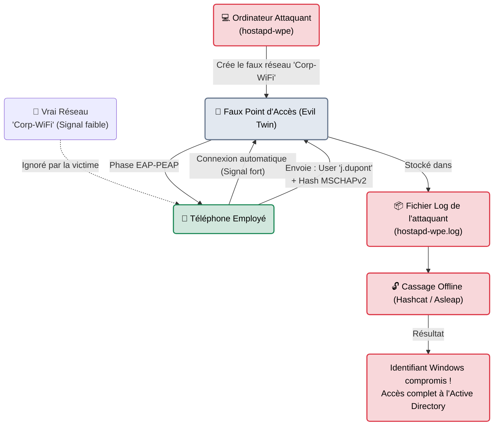

---
description: "hostapd-wpe — L'arme ultime pour cloner un réseau WPA2-Enterprise (802.1X) et voler les identifiants Windows (Active Directory) des employés par tromperie (Evil Twin)."
icon: lucide/book-open-check
tags: ["RED TEAM", "WIFI", "ENTERPRISE", "EVIL TWIN", "ACTIVE DIRECTORY"]
---

# hostapd-wpe — Le Faux Guichet (Evil Twin)

<div
  class="omny-meta"
  data-level="🔴 Expert"
  data-version="2.9+"
  data-time="~45 minutes">
</div>


## Introduction

!!! quote "Analogie pédagogique — Le Faux Distributeur de Billets"
    Dans les très grandes entreprises, on ne donne pas un seul mot de passe WiFi à tous les employés (trop de risques en cas de départ). On utilise le **WPA-Enterprise** : chaque employé utilise son identifiant Windows (Active Directory) pour se connecter au WiFi. Impossible à craquer de l'extérieur.
    Mais l'attaquant a une solution : l'usurpation d'identité. Il pose une borne WiFi pirate sur la table (un **Evil Twin**) et la nomme "WiFi_Entreprise", avec un signal beaucoup plus fort. Le téléphone de l'employé croit reconnaître le bon réseau et tente de s'y connecter en lui confiant l'identifiant et le mot de passe crypté de l'employé. L'attaquant enregistre ces données et remercie l'employé. C'est l'équivalent de poser un faux clavier par-dessus un vrai distributeur de billets pour voler le code PIN de la carte.

**hostapd-wpe** (Wireless Pwnage Edition) est une version modifiée (patchée pour le hacking) du célèbre logiciel Linux de création de point d'accès `hostapd`. Il permet de créer de faux réseaux WiFi d'entreprise (EAP-PEAP / EAP-TTLS) conçus spécifiquement pour tromper les terminaux clients et enregistrer leurs phases d'authentification cryptographiques (les fameux *Challenge/Response* NTLM).

<br>

---

## Fonctionnement & Architecture (L'Attaque 802.1X)

L'architecture repose sur la diffusion d'un faux certificat de sécurité. Pour que l'attaque réussisse, le terminal de la victime (Téléphone, PC Windows) doit accepter ce faux certificat (souvent en cliquant naïvement sur "Se connecter quand même").



<br>

---

## Cas d'usage & Complémentarité

Cette attaque est la porte d'entrée royale entre le monde Physique (Le parking de l'entreprise) et le monde Logique interne (L'Active Directory). 

1. **Le pont vers l'AD** : Contrairement aux réseaux WPA classiques (où obtenir la clé donne juste accès à Internet), l'attaque 802.1X donne à l'attaquant le couple `Utilisateur/Mot_de_passe` d'un compte de domaine (Windows).
2. **Asleap / Hashcat** : Le mot de passe volé n'est pas en clair. Il est chiffré en "MSCHAPv2". L'attaquant utilisera l'outil compagnon `asleap` ou `hashcat` pour retrouver le mot de passe réel grâce à un dictionnaire.

<br>

---

## Les Options Principales

Tout se configure dans un simple fichier texte de configuration (`hostapd-wpe.conf`).

| Directive (Fichier .conf) | Fonction | Description approfondie |
| :--- | :--- | :--- |
| `interface=wlan0` | **Carte Réseau** | L'antenne WiFi de l'attaquant qui va créer le réseau. (Doit supporter le mode AP - Access Point). |
| `ssid=WiFi_Corp` | **Nom du Réseau** | C'est le piège. Il doit correspondre EXACTEMENT au nom du réseau légitime de l'entreprise visée. |
| `hw_mode=g` <br> `channel=1` | **Fréquence** | On place souvent notre faux réseau sur un canal différent du vrai réseau pour éviter les interférences. |
| `eap_user_file=` | **Base d'utilisateurs** | Un fichier définissant comment le faux serveur doit répondre aux demandes EAP. |

<br>

---

## Installation & Configuration

```bash title="Installation et préparation"
sudo apt update
sudo apt install hostapd-wpe asleap
```

<br>

---

## Le Workflow Idéal (L'Embuscade WPA-Enterprise)

### 1. Préparation du Faux Certificat
Les réseaux d'entreprise utilisent des certificats SSL/TLS pour l'authentification (comme le HTTPS sur le web). `hostapd-wpe` possède un script pour en générer de faux, très ressemblants.
```bash title="Génération des certificats pirates"
cd /etc/hostapd-wpe/certs
# On lance le script de construction
sudo ./bootstrap
```

### 2. Configuration du Faux Réseau
On modifie le fichier de configuration pour l'adapter à la cible.
```bash title="Modification de /etc/hostapd-wpe/hostapd-wpe.conf"
interface=wlan0
# On remplace par le nom exact du réseau de l'entreprise (ex: "TOTAL_Corp")
ssid=TOTAL_Corp
channel=6
```

### 3. Lancement de l'Embuscade
```bash title="Activation du point d'accès pirate"
# On s'assure qu'aucun processus n'interfère
sudo airmon-ng check kill

# On lance le serveur
sudo hostapd-wpe /etc/hostapd-wpe/hostapd-wpe.conf
```
*Le terminal se fige et affiche les logs en direct. Si un employé marche à côté de vous avec son téléphone, son appareil tentera de s'y connecter. L'écran affichera la capture du format `Challenge` et `Response` (MSCHAPv2).*

### 4. Le Cassage (Récupération du mot de passe)
Une fois rentré à la maison, on prend les informations capturées et on attaque le hash.
```bash title="Craquage MSCHAPv2 avec asleap"
# On fournit le fichier dictionnaire, le challenge intercepté et la réponse.
asleap -W /usr/share/wordlists/rockyou.txt -C <Challenge_Héxa> -R <Response_Héxa>
```

<br>

---

## Bonnes & Mauvaises Pratiques (Do's & Don'ts)

| Action | Recommandation | Explication métier |
|---|---|---|
| ✅ **À FAIRE** | **Avoir une antenne puissante** | Pour que le téléphone de la victime choisisse votre faux réseau plutôt que le vrai routeur fixé au plafond, votre signal doit être plus fort. Utilisez une antenne USB à fort gain directionnel (type Yagi ou Panel). |
| ✅ **À FAIRE** | **Relayer l'authentification (EAP-Relay)** | Des outils plus avancés (comme *EAPHammer*) ne se contentent pas de voler le hash. Ils le transmettent instantanément au vrai réseau pour que l'attaquant entre directement. |
| ❌ **À NE PAS FAIRE** | **Rester caché au même endroit** | Lors d'une mission de Red Team physique, n'installez pas votre Rogue AP juste sous une caméra de vidéosurveillance. Le "Wardriving" se fait souvent depuis une voiture banalisée sur le parking. |

<br>

---

## Avertissement Légal & Éthique

!!! danger "Usurpation, Phishing Physique et Vol de Credentials"
    La création d'un "Rogue AP" (Faux point d'accès) est l'équivalent cybernétique de poser de faux panneaux de signalisation pour détourner les camions de la Poste.
    
    1. **Usurpation d'identité numérique** : Vous imitez sciemment une infrastructure appartenant à une entreprise (Son SSID, ses certificats).
    2. **Collecte de données personnelles** : En capturant l'identifiant prénom/nom d'un employé et son condensat (Hash) de mot de passe, vous vous rendez coupable de vol de données et de recel de données à caractère personnel (RGPD + Code pénal).
    3. **Ingénierie Sociale (Tromperie)** : L'employé clique "Oui" au certificat frauduleux parce qu'il croit être sur le réseau de son entreprise. Sans un mandat écrit explicite du comité de direction validant cette approche de *Social Engineering / Phishing*, l'acte est formellement illégal et puni de peines de prison.

<br>

---

## Conclusion

!!! quote "Ce qu'il faut retenir"
    `hostapd-wpe` est le pont qui relie l'audit Physique (Hardware/Radio) à l'audit Interne (Active Directory). Le WPA-Enterprise est la norme dans les banques, hôpitaux et grandes entreprises. Si l'attaquant arrive à cloner le réseau et à capturer les identifiants d'un simple commercial en buvant un café dans le hall d'accueil, il possède désormais les clés pour s'attaquer de l'intérieur au réseau interne de l'entreprise.

> Vous avez obtenu la clé WiFi ou les identifiants, et vous êtes maintenant connecté au réseau local (LAN) de l'entreprise. L'audit réseau interne commence. Plongez dans la matrice avec le standard du scan de ports : **[Nmap →](../network/nmap.md)**.


