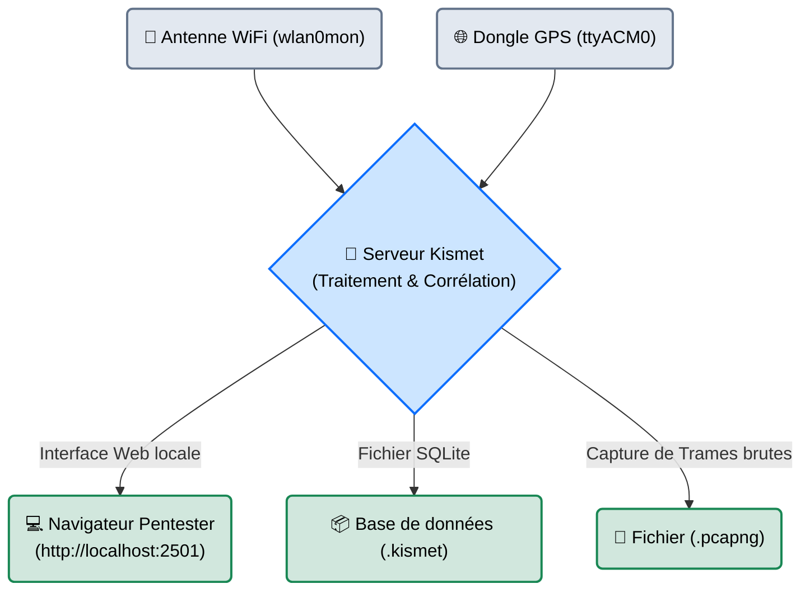

# Kismet — Le Radar Furtif

<div
  class="omny-meta"
  data-level="🟡 Intermédiaire"
  data-version="2022+"
  data-time="~20 minutes">
</div>

<div style="text-align: center; margin: 0 auto;">
    
</div>

## Introduction

!!! quote "Analogie pédagogique — Le Sous-Marin en Écoute Silencieuse"
    La plupart des scanners WiFi (comme Nmap sur un réseau) envoient des signaux et attendent une réponse. C'est un radar actif : on voit l'avion, mais l'avion sait qu'il est scanné. 
    **Kismet** est un sonar passif de sous-marin. L'antenne est déconnectée de son émetteur, elle ne fait qu'écouter les ondes qui flottent dans l'air. Résultat : Kismet peut détecter des téléphones, des drones, des réseaux masqués et des alarmes connectées sans envoyer un seul paquet. La cible n'a aucun moyen physique de savoir qu'elle est observée.

**Kismet** est un détecteur réseau (Sniffer), un système de détection d'intrusion (IDS) et un enregistreur de paquets (Pcap) pour le réseau sans fil 802.11 (WiFi), Bluetooth, et certains protocoles radio (SDR). Contrairement à `airodump-ng`, Kismet possède une interface Web moderne (depuis 2019) et est conçu pour ingérer d'énormes quantités de données provenant de multiples antennes simultanément.

<br>

---

## Fonctionnement & Architecture (Cartographie Multi-sources)

Kismet centralise l'écoute de plusieurs matériels (Antenne WiFi, Clé Bluetooth, Antenne Radio SDR) et associe les paquets reçus à des coordonnées GPS en temps réel.



<br>

---

## Cas d'usage & Complémentarité

Kismet excelle dans les missions de **Reconnaissance Physique (Wardriving)** et la détection d'appareils espions :

1. **Wardriving** : Le pentester roule autour du bâtiment de la cible avec Kismet et un GPS. Le fichier `.kismet` généré est ensuite uploadé sur `Wigle.net` pour afficher la carte thermique des réseaux de l'entreprise.
2. **Découverte de SSID cachés** : Un réseau WiFi d'entreprise configuré en "Réseau Masqué" (qui ne diffuse pas son nom) est inutile face à Kismet. Dès qu'un employé légitime s'y connectera, Kismet interceptera le nom du réseau dans l'air.
3. **Bluetooth & IoT** : Kismet ne lit pas que le WiFi. Associé à un dongle Bluetooth, il peut lister les montres connectées des employés, ce qui est très utile en Social Engineering.

<br>

---

## Les Options Principales

Kismet fonctionnant via une architecture Serveur/Client, la majorité des options se configurent dans son fichier `/etc/kismet/kismet.conf` ou directement via l'interface Web.

| Commande CLI | Fonction | Description approfondie |
| :--- | :--- | :--- |
| `-c [Interface]` | **Source de Capture** | Indique à Kismet quelle antenne écouter. Ex: `-c wlan0mon`. Peut être utilisé plusieurs fois (`-c wlan0mon -c wlan1mon`). |
| `-t [Titre]` | **Nom de Session** | Nomme le fichier de capture généré. Indispensable pour s'y retrouver après plusieurs jours d'audit. |
| `--no-ncurses` | **Mode Headless** | Désactive l'interface texte dans le terminal (utile sur un Raspberry Pi où l'on accède uniquement via l'interface Web). |

<br>

---

## Installation & Configuration

```bash title="Installation de Kismet"
# Installation standard sous Kali Linux / Debian
sudo apt update && sudo apt install kismet
```

!!! quote "Note Matérielle"
    Comme pour Aircrack-ng, Kismet nécessite que votre carte WiFi supporte le "Mode Monitor". De plus, pour utiliser les fonctions de géolocalisation (indispensables en Wardriving), un dongle GPS USB bon marché (ex: *GlobalSat BU-353-S4*) est fortement recommandé.

<br>

---

## Le Workflow Idéal (Le Wardriving)

Voici la procédure d'un audit de couverture sans fil physique :

### 1. Préparation des Interfaces
```bash title="Mode Monitor"
# On tue les processus interférents et on passe la carte en monitor
sudo airmon-ng check kill
sudo airmon-ng start wlan0
```

### 2. Lancement du Serveur Kismet
```bash title="Lancement avec GPS et Titre"
# -c : L'interface d'écoute
# -t : Le nom de la mission
sudo kismet -c wlan0mon -t Audit_Client_A
```

### 3. Consultation de l'Interface Web
Laissez le terminal tourner en arrière-plan. Ouvrez votre navigateur Web et rendez-vous sur :
👉 `http://127.0.0.1:2501`

L'interface graphique vous demandera de créer un mot de passe administrateur (pour éviter qu'un réseau public ne lise vos captures). Vous verrez apparaître en temps réel tous les points d'accès, les appareils des employés (Adresses MAC), et les alertes de sécurité (ex: *"Un appareil tente de déauthentifier le réseau"*).

### 4. Post-Traitement des Captures
Une fois la mission terminée (Ctrl+C sur le terminal), Kismet a généré plusieurs fichiers dans votre dossier. Le fichier le plus important est le fichier `Audit_Client_A-XX.pcapng` qui contient toutes les trames et pourra être ouvert dans **Wireshark** ou **Aircrack-ng** pour de l'analyse ou du cassage de clés à la maison.

<br>

---

## Bonnes & Mauvaises Pratiques (Do's & Don'ts)

| Action | Recommandation | Explication métier |
|---|---|---|
| ✅ **À FAIRE** | **Verrouiller les canaux (Hopping)** | Par défaut, Kismet scanne tous les canaux en boucle rapide (Channel Hopping). Si vous ciblez *uniquement* le bâtiment A (Canal 1, 6, 11), configurez la source Kismet pour ne tourner que sur ces canaux afin de ne rater aucun paquet. |
| ✅ **À FAIRE** | **Filtrer l'interface Web** | L'interface Web de Kismet est très lourde. Utilisez la barre de recherche Regex intégrée pour n'afficher que les réseaux contenant le nom de la cible (`*omnyvia*`) pour ne pas saturer votre navigateur. |
| ❌ **À NE PAS FAIRE** | **Oublier l'espace disque** | Kismet enregistre *tout* ce qui flotte dans l'air, y compris les vidéos Netflix regardées par le voisin en WiFi ouvert. Un fichier `.pcapng` peut peser 10 Go en quelques heures. Surveillez l'espace disque de votre machine. |

<br>

---

## Avertissement Légal & Éthique

!!! danger "Confidentialité et Secret des Correspondances"
    L'écoute passive est souvent considérée à tort comme "légale car invisible". C'est faux.

    1. **Les métadonnées (Légal / Toléré)** : Capter les noms de réseaux (SSID) et les adresses MAC diffusés publiquement dans les airs est assimilé à de la photographie d'espace public (OSINT matériel).
    2. **Les données (Strictement Illégal)** : Si Kismet capte des paquets de données provenant d'un WiFi public non chiffré (ex: Mots de passe en HTTP, pages Web visitées par autrui), leur enregistrement dans votre fichier `.pcapng` viole le **secret des correspondances** (Article 226-15 du Code pénal, 1 an de prison). 
    
    *En Red Team, configurez Kismet pour qu'il n'enregistre que les en-têtes (Headers) des paquets et non le contenu (Payload) si vous auditez des espaces publics non mandatés.*

<br>

---

## Conclusion

!!! quote "Ce qu'il faut retenir"
    Kismet est l'outil parfait de la phase de Reconnaissance d'une opération physique. Là où *aircrack-ng* est le marteau qui vient briser la porte, *Kismet* est la paire de jumelles haute technologie qui cartographie le terrain, compte les gardes et identifie les faiblesses avant même que l'attaque active ne commence.

> Une fois l'environnement cartographié, si l'objectif est de trouver rapidement *lequel* des 50 réseaux de l'entreprise est le moins sécurisé (WPS, WEP), passez à l'automatisation de l'attaque avec **[Wifite →](./wifite.md)**.

<br>


