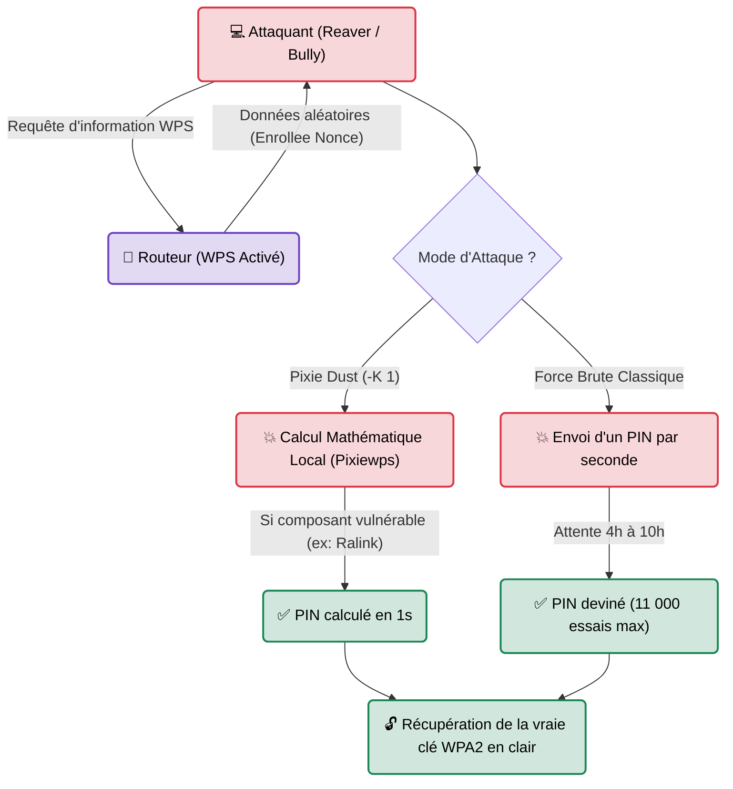

---
description: "Reaver & Bully — Outils historiques pour attaquer la vulnérabilité béante du protocole WPS (Wi-Fi Protected Setup) via force brute ou Pixie Dust."
icon: lucide/book-open-check
tags: ["RED TEAM", "WIFI", "WPS", "REAVER", "BULLY", "PIXIE DUST"]
---

# Reaver & Bully — Le Casseur de Backdoors WPS

<div
  class="omny-meta"
  data-level="🟢 Débutant"
  data-version="1.6+"
  data-time="~15 minutes">
</div>


## Introduction

!!! quote "Analogie pédagogique — La Porte Blindée et le Paillasson"
    Une entreprise peut acheter la porte la plus blindée du monde, avec la serrure la plus complexe (une clé WPA2 de 63 caractères aléatoires). S'il y a un code à 8 chiffres posé sous le paillasson pour "aider le facteur à entrer", la porte blindée ne sert à rien.
    Le **WPS (Wi-Fi Protected Setup)** est ce paillasson. Créé pour aider les imprimantes à se connecter facilement aux box Internet en tapant un simple code PIN de 8 chiffres, ce protocole contient un défaut de conception mathématique désastreux. **Reaver** et **Bully** sont les outils conçus pour deviner ou casser ce code PIN, permettant à l'attaquant d'obtenir la clé WPA2 (la clé de la porte blindée) en clair, en quelques secondes ou quelques heures.

Conçus dans les années 2010, **Reaver** et **Bully** exploitent la faille du protocole WPS. Au lieu de s'attaquer à la robustesse de la clé WPA2 globale (qui nécessiterait des supercalculateurs), ils s'attaquent au code PIN de configuration rapide du routeur. Une fois le code PIN deviné, le routeur a l'obligation de livrer la vraie clé WPA2 en texte clair.

<br>

---

## Fonctionnement & Architecture (La Faille Mathématique)

Un code PIN fait 8 chiffres (soit 100 millions de combinaisons). Normalement, c'est trop long à bruteforcer par le réseau. **Mais le WPS est très mal conçu** : il coupe le code PIN en deux moitiés (4 chiffres + 3 chiffres + 1 chiffre de contrôle).
Résultat : L'attaquant n'a pas à tester 100 000 000 de possibilités, mais seulement `10 000 + 1 000 = 11 000` possibilités !

Mieux encore, depuis 2014, l'attaque **Pixie Dust** a été découverte : certains routeurs génèrent leurs nombres aléatoires de manière si prévisible qu'il est possible de calculer le code PIN mathématiquement (Offline) en moins d'**une seconde**, sans faire de force brute.



<br>

---

## Cas d'usage & Complémentarité

Le WPS est la faille la plus dévastatrice des réseaux personnels et petites entreprises.

1. **Reaver vs Bully** : Ce sont exactement les mêmes outils (ils font la même attaque). *Reaver* est écrit en C (historique), *Bully* est écrit en C également mais gère différemment les sauts de canaux et les crashs de routeurs. Si l'un échoue, on teste l'autre.
2. **Wash** : L'outil compagnon de Reaver. Il scanne les ondes pour vous dire instantanément "quels routeurs autour de vous ont le WPS d'activé".

<br>

---

## Les Options Principales (Reaver)

| Option | Fonction | Description approfondie |
| :--- | :--- | :--- |
| `-i [mon0]` | **Interface** | La carte réseau en Mode Monitor. |
| `-b [MAC]` | **BSSID (Cible)** | L'adresse MAC du point d'accès cible (Routeur). |
| `-c [canal]` | **Canal Fixe** | Force Reaver à rester sur la fréquence du routeur. |
| `-K 1` | **Pixie Dust** | Lance l'attaque mathématique hors ligne ultra-rapide (Nécessite le package `pixiewps`). |
| `-d 2` | **Delay (Délai)** | Attend 2 secondes entre chaque tentative de code PIN. Indispensable pour ne pas faire crasher le vieux routeur ou déclencher son système anti-bruteforce (WPS Lock). |

<br>

---

## Installation & Configuration

```bash title="Installation standard (Kali Linux)"
# Installe Reaver, Bully et le module mathématique Pixiewps
sudo apt update
sudo apt install reaver bully pixiewps
```

<br>

---

## Le Workflow Idéal (Le Crash-Test WPS)

### 1. Préparation (Mode Monitor)
```bash title="Mise en place de l'antenne"
sudo airmon-ng check kill
sudo airmon-ng start wlan0
```

### 2. Détection des cibles WPS (Wash)
On ne lance Reaver que si l'on est sûr que la cible écoute le protocole WPS.
```bash title="Scanner les routeurs vulnérables"
sudo wash -i wlan0mon
```
*Le terminal liste les réseaux. Regardez la colonne `WPS Locked`. Si c'est marqué "No", le routeur est vulnérable.*

### 3. L'Attaque Rapide (Pixie Dust)
On tente toujours l'attaque mathématique en premier, car elle ne prend qu'une seconde.
```bash title="Reaver avec l'option -K"
sudo reaver -i wlan0mon -b 00:11:22:33:44:55 -c 6 -K 1 -vv
```
*Si Reaver affiche `[+] WPS PIN: '12345670'` et `[+] WPA PSK: 'MotDePasseSecret'`, vous avez gagné.*

### 4. L'Attaque Lente (Force Brute)
Si Pixie Dust échoue, le composant du routeur est robuste. On passe à la force brute matérielle.
```bash title="Reaver classique avec délai"
# -N : Ne pas bloquer sur des paquets corrompus
# -d 3 : Attendre 3 secondes entre chaque code pour éviter le "Lock"
sudo reaver -i wlan0mon -b 00:11:22:33:44:55 -c 6 -N -d 3 -vv
```
*Laissez le PC tourner pendant quelques heures (parfois toute une nuit).*

<br>

---

## Bonnes & Mauvaises Pratiques (Do's & Don'ts)

| Action | Recommandation | Explication métier |
|---|---|---|
| ✅ **À FAIRE** | **Respecter le temps de refroidissement** | Beaucoup de box modernes détectent les attaques Reaver et affichent `WPS Locked` après 5 essais infructueux. Si cela arrive, vous devez arrêter l'attaque et réessayer le lendemain. |
| ✅ **À FAIRE** | **Recommander la désactivation physique** | Dans votre rapport d'audit, la recommandation numéro 1 pour un client est de **désactiver définitivement le WPS** dans l'interface d'administration de sa Box. Le WPS n'est pas sécurisable. |
| ❌ **À NE PAS FAIRE** | **Lancer une force brute sans délai (`-d 0`)** | Un routeur grand public n'a pas la puissance processeur pour gérer 100 requêtes cryptographiques par seconde. Si vous faites ça, la Box Internet de votre client va crasher (Déni de Service) et rebooter. |

<br>

---

## Avertissement Légal & Éthique

!!! danger "Force Brute et Atteinte aux Systèmes"
    L'attaque WPS par force brute est le cas d'école de l'**Attaque par Déni de Service (DoS) accidentelle**.
    
    Même si votre but est uniquement de tester la solidité du mot de passe (dans le cadre d'un audit), noyer un routeur de requêtes (Reaver) peut faire planter l'équipement, interrompant la connexion internet de l'entreprise ou du particulier.
    
    1. L'attaque de codes PIN sur du matériel tiers est une intrusion frauduleuse (Art. 323-1 du Code Pénal).
    2. Si le routeur s'éteint ou devient inutilisable à cause de votre attaque, cela devient une **entrave au fonctionnement du système** (Art. 323-2).
    
    Vérifiez toujours si l'audit autorise des actions pouvant impacter la disponibilité de la production du client.

<br>

---

## Conclusion

!!! quote "Ce qu'il faut retenir"
    Aujourd'hui, l'immense majorité des équipements professionnels (Cisco, Aruba) n'ont plus le protocole WPS d'activé. Cependant, lors d'un audit d'une PME, d'une boutique physique ou du "télétravail" d'un dirigeant, le routeur fourni par l'opérateur local a souvent le WPS activé par défaut. Reaver et Bully restent donc des armes fatales (et paresseuses) pour contourner la politique de mot de passe forte dictée par la DSI, via la porte de derrière.

> Vous savez attaquer les clés pour tout le monde (WPA-PSK), mais comment auditer les réseaux d'Entreprise, où chaque employé possède un compte et un mot de passe différent pour le WiFi (WPA-Enterprise) ? Entrez dans le monde des attaques "Evil Twin" avec **[hostapd-wpe →](./hostapd-wpe.md)**.

<br>


