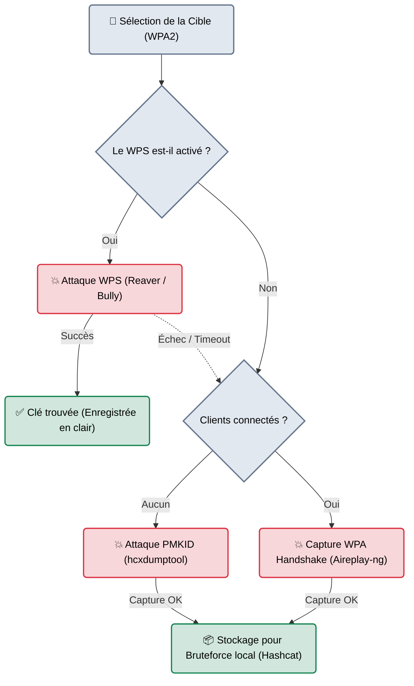

# Wifite — L'Automatisation du Pentest WiFi

<div
  class="omny-meta"
  data-level="🟢 Débutant"
  data-version="2.0+"
  data-time="~15 minutes">
</div>

<div style="text-align: center; margin: 0 auto;">
    
</div>

## Introduction

!!! quote "Analogie pédagogique — Le Robot Serrurier"
    Si *Aircrack-ng* est une boîte à outils de serrurier (avec des crochets, des stéthoscopes, des marteaux) qui demande de la patience et du savoir-faire manuel, **Wifite** est un robot serrurier automatisé. Vous le posez devant un couloir avec 20 portes fermées, vous appuyez sur un bouton, et il va tester systématiquement le cadenas WPS, puis la vulnérabilité PMKID, puis la capture de Handshake sur *chaque porte*, l'une après l'autre, tout en générant un rapport final.

Écrit en Python, **Wifite** n'invente aucune nouvelle attaque. C'est un *Wrapper* (un orchestrateur) qui automatise l'utilisation en arrière-plan d'outils complexes (`aircrack-ng`, `reaver`, `hcxtools`, `tshark`). Il a été conçu pour le "Pentest en courant" : lancer la machine, sélectionner les cibles, et laisser l'ordinateur faire le reste sans intervention humaine.

<br>

---

## Fonctionnement & Architecture (L'Orchestration)

Wifite est un script décisionnel. Pour chaque cible, il évalue le protocole de sécurité et lance la chaîne d'attaque la plus pertinente, de la plus facile à la plus difficile.



<br>

---

## Cas d'usage & Complémentarité

Wifite est extrêmement populaire dans deux scénarios précis :

1. **L'Audit Rapide (Triage)** : Lors du premier jour d'un audit physique, le Red Teamer lance Wifite sur "Tous les réseaux" pour récolter la "Low-Hanging Fruit" (Les failles faciles : réseaux WEP oubliés, routeurs avec WPS activé, PMKID capturables en 2 secondes).
2. **Le Périphérique Autonome (Raspberry Pi)** : Wifite est souvent installé sur un Raspberry Pi caché dans un sac à dos (avec batterie et antenne WiFi). Sans écran ni clavier, un script lance Wifite au démarrage, et l'attaquant marche dans le bâtiment cible pendant que la machine capture les clés de manière autonome.

<br>

---

## Les Options Principales

Bien qu'il soit conçu pour être utilisé sans arguments (en tapant juste `wifite`), ses filtres sont très puissants.

| Option | Fonction | Description approfondie |
| :--- | :--- | :--- |
| `--kill` | **Nettoyage Automatique** | Ferme automatiquement les processus interférents (comme `airmon-ng check kill` le ferait). Indispensable. |
| `-p [ch]` | **Filtrage Canal** | Ne scanne qu'un canal spécifique. Ex: `-p 6`. (Permet de cibler un bâtiment particulier). |
| `--wpa` / `--wep` | **Filtre de Sécurité** | Ne cible QUE les réseaux WPA, ou QUE les réseaux WEP. |
| `--nodeauth` | **Furtivité (Passif)** | Interdit à Wifite d'envoyer des paquets de désauthentification. Il se contentera d'écouter passivement et de capturer les PMKID. |

<br>

---

## Installation & Configuration

Wifite2 (la version moderne) nécessite beaucoup de dépendances système pour libérer tout son potentiel.

```bash title="Installation de Wifite et ses outils sous-jacents"
# Kali Linux / ParrotOS
sudo apt update
sudo apt install wifite aircrack-ng reaver hcxtools hcxdumptool tshark
```
*Note : Si vous lancez `wifite` et qu'un outil manque, Wifite affichera un tableau clair avec les recommandations d'installation au démarrage.*

<br>

---

## Le Workflow Idéal (L'Attaque Automatisée)

L'avantage de Wifite est que son exécution tient en très peu d'étapes.

### 1. Lancement du Scan Global
```bash title="Démarrer l'orchestrateur"
# Le script passe lui-même la carte en mode monitor
sudo wifite --kill
```
Le terminal affiche un tableau dynamique de tous les réseaux détectés, classés par puissance de signal (Power). Les réseaux ayant des clients ou le WPS activé sont surlignés en vert.

### 2. Sélection de la Cible
Appuyez sur `Ctrl+C`. Wifite arrête de scanner et vous demande d'entrer le numéro de la cible.
```text
[+] select target(s) (1-15) separated by commas, or 'all':
> 2, 4
```
*Ici, l'attaquant cible les réseaux n°2 et n°4.*

### 3. Exécution Autonome
Asseyez-vous et regardez. Wifite va essayer l'attaque PMKID (10 secondes), si elle échoue il lance la capture WPA (il envoie des paquets `Deauth` et attend). S'il réussit, il vous informe et passe au réseau n°4.

### 4. Récupération des Captures
Toutes les captures réussies (Fichiers `.cap` ou `.hc22000`) sont automatiquement sauvegardées de manière propre et organisée dans le dossier `./hs/` (Handshakes) de votre répertoire courant.
Il suffira ensuite d'utiliser **Hashcat** sur votre ordinateur surpuissant à la maison pour casser les hachages récoltés.

<br>

---

## Bonnes & Mauvaises Pratiques (Do's & Don'ts)

| Action | Recommandation | Explication métier |
|---|---|---|
| ✅ **À FAIRE** | **Installer `hcxtools`** | L'attaque WPA PMKID (qui ne nécessite aucun client connecté) a changé la donne en 2018. Wifite l'intègre parfaitement, mais il a besoin des paquets système `hcxtools` et `hcxdumptool` installés pour le faire. |
| ✅ **À FAIRE** | **Cibler spécifiquement l'entreprise** | Utilisez `--mac` ou le tri manuel pour ne pas attaquer accidentellement la boulangerie d'à côté. |
| ❌ **À NE PAS FAIRE** | **Utiliser Wifite pour le Cracking** | Wifite tente de craquer le mot de passe immédiatement avec un dictionnaire par défaut (`wordlist.txt`). Annulez cette étape. Votre CPU de PC portable n'est pas fait pour ça. Gardez les fichiers `.cap` et craquez-les sur un GPU. |

<br>

---

## Avertissement Légal & Éthique

!!! danger "L'Automatisation Aveugle et les Dommages Collatéraux"
    L'inconvénient des outils "One-Click" (ou options comme `wifite --all`) est la perte de contrôle sur le périmètre (Scope).
    
    Si vous lancez Wifite sur "tous les réseaux à portée", vous attaquez physiquement (via l'envoi de paquets de désauthentification) les infrastructures des résidents et des commerces avoisinant votre cible légitime.
    - Il s'agit d'une atteinte au fonctionnement de Systèmes de Traitement Automatisé de Données (STAD) tiers.
    - Votre audit légal devient instantanément une attaque cybercriminelle passible de l'**Article 323-2 du Code pénal**.

    *Sélectionnez toujours rigoureusement vos cibles avec les numéros, et ne laissez jamais l'outil tourner en "aveugle" sans surveillance humaine.*

